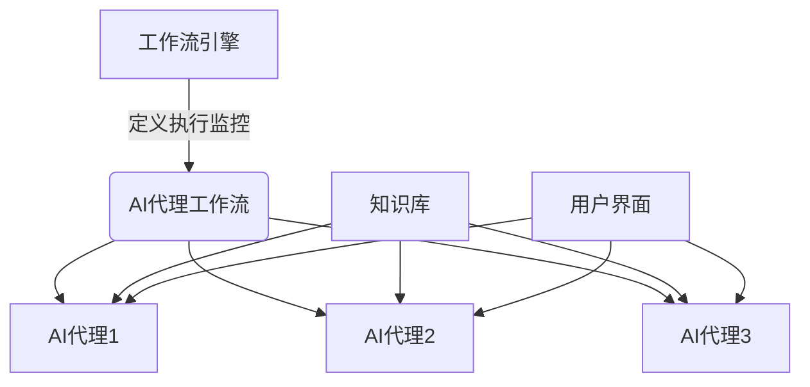

# AI人工智能代理工作流 AI Agent Workflow：在法律服务中的应用

## 1.背景介绍

随着人工智能(AI)技术的快速发展,AI代理工作流程已经开始在各个行业中发挥着越来越重要的作用。法律服务业作为一个传统的知识密集型行业,正面临着来自AI的巨大冲击和变革。AI代理工作流程可以帮助律师事务所提高工作效率、降低运营成本、提供更好的客户服务体验。

### 1.1 法律服务行业的痛点

法律服务行业一直存在以下一些痛点和挑战:

- 大量的重复性工作,如文书审阅、合同起草等,效率低下
- 知识获取和管理成本高,缺乏高效的知识库系统
- 客户服务响应时间长,无法实现7*24小时全天候服务
- 人工智能技术的发展为解决这些痛点提供了新的机遇

### 1.2 AI代理工作流在法律领域的应用前景

AI代理工作流具有以下优势,可以很好地解决法律服务行业的痛点:

- 自动化处理大量重复性工作,提高工作效率
- 建立高效的知识库系统,降低知识获取和管理成本  
- 提供7*24小时全天候的智能客户服务
- 辅助律师进行案情分析、证据挖掘等,提高工作质量

因此,AI代理工作流在法律服务领域具有广阔的应用前景。

## 2.核心概念与联系

在探讨AI代理工作流在法律服务中的应用之前,我们先来了解几个核心概念。

### 2.1 AI代理(AI Agent)

AI代理是一种能够感知环境,并根据感知结果采取行动以实现既定目标的软件实体。在法律服务场景中,AI代理可以是一个智能客服系统、案情分析助手等。

### 2.2 工作流(Workflow)

工作流指的是为了完成某项任务所需的一系列有序活动。在法律服务中,一个典型的工作流可能包括:接收委托、资料收集、证据分析、撰写法律文书等步骤。

### 2.3 AI代理工作流(AI Agent Workflow)

AI代理工作流是指由一个或多个AI代理按照预定义的流程来执行的工作流程。AI代理根据工作流的不同阶段,完成特定的任务,最终实现整个工作流的目标。

在法律服务场景中,AI代理工作流可以将传统的人工工作流程自动化,提高效率和质量。例如,AI代理可以自动进行文书审阅、案情分析、证据挖掘等工作,大大减轻了律师的工作负担。

### 2.4 AI代理工作流架构

一个典型的AI代理工作流架构包括以下几个核心组件:

- **工作流引擎**: 负责定义、执行和监控工作流
- **AI代理**: 执行具体的任务,如自然语言处理、文本挖掘等
- **知识库**: 存储法律知识、案例precedent等相关数据
- **用户界面**: 供用户(律师、当事人等)与系统交互

这些组件通过合理的架构设计,协同工作,高效完成复杂的法律服务工作流程。



上图展示了一个AI代理工作流的基本架构,工作流引擎负责协调各个AI代理按照预定义的流程执行任务,AI代理与知识库和用户界面交互,完成具体的工作。

## 3.核心算法原理具体操作步骤  

AI代理工作流在法律服务中的应用,核心是各种AI算法在不同环节的具体实现。我们分别介绍几个关键环节的算法原理和操作步骤。

### 3.1 自然语言处理(NLP)

自然语言处理是AI代理工作流的基础,几乎所有环节都需要用到NLP技术。

#### 3.1.1 算法原理

NLP的主要任务包括:

1. **分词与词性标注**
2. **命名实体识别**
3. **句法分析**
4. **语义理解**

其中,语义理解是NLP的核心和难点,需要将自然语言的词汇、句法结构等低级信息转化为计算机可以理解的语义表示。常用的语义理解方法有:

- 基于规则的方法
- 统计机器学习方法(如隐马尔可夫模型HMM)
- 深度学习方法(如BERT等Transformer模型)

#### 3.1.2 操作步骤

以法律文书审阅为例,NLP的操作步骤如下:

1. **分词与词性标注**: 将法律文书分割为词语序列,并标注每个词语的词性(名词、动词等)
2. **命名实体识别**: 识别出文中的人名、地名、机构名、法律术语等实体
3. **句法分析**: 构建句子的语法树,确定词语之间的修饰关系
4. **语义理解**: 将句子转化为计算机可以理解的语义表示,如命题逻辑公式、语义框架等
5. **结构化信息提取**: 基于语义理解的结果,从文书中抽取出关键信息,如案件基本信息、事实描述、法律依据等

示例代码(基于BERT的命名实体识别):

```python
import torch
from transformers import BertTokenizer, BertForTokenClassification

# 加载预训练BERT模型和Tokenizer
tokenizer = BertTokenizer.from_pretrained('bert-base-cased')
model = BertForTokenClassification.from_pretrained('bert-base-cased', num_labels=9)

# 输入文本
text = "......" 

# 对输入文本进行Tokenizing,注意添加特殊token [CLS]和[SEP]
tokens = ['[CLS]'] + tokenizer.tokenize(text) + ['[SEP]']
input_ids = tokenizer.convert_tokens_to_ids(tokens)

# 获取BERT模型输出
outputs = model(torch.tensor([input_ids]))
predictions = torch.argmax(outputs[0], dim=2)

# 打印结果
print([(token, prediction) for token, prediction in zip(tokens, predictions[0].tolist())])
```

上述代码使用BERT对输入文本进行命名实体识别,可以识别出人名、地名、组织机构名等实体。

### 3.2 证据关联分析

在法律案件审理中,证据关联分析是一个关键环节。通过分析各种证据之间的关联关系,可以帮助律师更好地理解案情,为诉讼策略提供支持。

#### 3.2.1 算法原理  

证据关联分析的核心是通过文本挖掘技术,从大量非结构化文本数据(如证人证词、书证电子邮件等)中发现隐藏的证据线索和关联模式。主要使用的算法有:

- **主题模型(Topic Model)**: 发现文本集中的潜在主题结构,如LDA(Latent Dirichlet Allocation)算法
- **关联规则挖掘**: 从数据中发现有意义的关联模式,如Apriori、FP-Growth算法
- **社交网络分析**: 将实体(人物、组织等)视为网络节点,分析节点之间的关系
- **深度学习方法**: 如图神经网络(GNN)等,能够直接对图结构数据进行建模

#### 3.2.2 操作步骤

1. **数据预处理**: 对非结构化文本进行分词、词性标注、命名实体识别等预处理
2. **构建实体关系图**: 将识别出的实体(人物、组织、地点等)作为节点,文本中的关系作为边,构建出实体关系图
3. **关联模式挖掘**: 在实体关系图上使用关联规则挖掘、图神经网络等算法,发现隐藏的证据关联模式
4. **模式可视化**: 将挖掘出的关联模式以图表等形式直观展示,方便律师分析

示例代码(使用Neo4j图数据库存储实体关系图):

```python
from neo4j import GraphDatabase

# 连接Neo4j数据库
driver = GraphDatabase.driver("bolt://localhost:7687", auth=("neo4j", "password"))

# 创建节点和关系
with driver.session() as session:
    # 创建人物节点
    session.run("MERGE (p1:Person {name: '张三'}) "
                "MERGE (p2:Person {name: '李四'})")
    
    # 创建组织节点
    session.run("MERGE (c:Company {name: 'ABC公司'})")

    # 创建雇佣关系
    session.run("MATCH (p1:Person), (c:Company) "
                "WHERE p1.name = '张三' AND c.name = 'ABC公司' "
                "MERGE (p1)-[:EMPLOYED_BY]->(c)")

# 查询语句
query = '''
MATCH (p1:Person)-[:EMPLOYED_BY]->(c:Company)<-[:EMPLOYED_BY]-(p2:Person) 
WHERE p1.name = '张三'
RETURN p1.name, p2.name, c.name
'''

# 执行查询并打印结果
with driver.session() as session:
    result = session.run(query)
    for record in result:
        print(record)
```

上述代码使用Neo4j图数据库存储人物、公司等实体及其关系,并执行一个查询语句,找出与"张三"在同一家公司工作的人。这种图数据库方法可以高效地表示和查询复杂的实体关系网络。

### 3.3 案情预测

对于律师事务所而言,能够准确预测案件的审理结果和赔付金额,对于制定诉讼策略和更好地为当事人服务至关重要。AI技术可以在此环节发挥重要作用。

#### 3.3.1 算法原理

案情预测的核心是构建一个机器学习模型,将案件信息(如案由、事实描述等)作为输入,输出对应的审理结果和赔付金额的预测值。常用的算法有:

- **逻辑回归(Logistic Regression)**: 用于二分类问题,如预测案件胜败
- **支持向量机(SVM)**: 同样用于分类问题,在高维空间构造最优分类超平面
- **决策树(Decision Tree)**: 将特征空间划分为若干区域,并在每个区域给出预测值
- **深度神经网络**: 如卷积神经网络(CNN)、循环神经网络(RNN)等,能够自动从数据中提取高阶特征

#### 3.3.2 操作步骤

1. **数据采集和预处理**: 收集大量历史案例数据,对文本信息进行分词、词性标注等预处理
2. **特征工程**: 从案件信息中提取出对预测结果有影响的特征,如涉案金额、证据数量等,并对特征进行编码
3. **模型训练**: 使用机器学习算法,在训练数据上训练案情预测模型
4. **模型评估**: 在测试数据上评估模型的预测性能,如准确率、F1分数等
5. **模型调优**: 根据评估结果,通过调整超参数、增加训练数据等方式提升模型性能
6. **模型部署**: 将训练好的模型部署到AI代理工作流中,用于实际案情预测任务

示例代码(使用scikit-learn训练逻辑回归模型):

```python
from sklearn.linear_model import LogisticRegression
from sklearn.feature_extraction.text import TfidfVectorizer
from sklearn.pipeline import Pipeline

# 加载案件数据
X_train = [...] # 训练集案件文本
y_train = [...] # 训练集标签(胜负)

X_test = [...] # 测试集案件文本 
y_test = [...] # 测试集标签

# 构建Pipeline
clf = Pipeline([
    ('vect', TfidfVectorizer()),
    ('clf', LogisticRegression())
])

# 训练模型
clf.fit(X_train, y_train)

# 评估模型
score = clf.score(X_test, y_test)
print(f"Accuracy: {score}")

# 进行预测
new_case = "..." # 新案件文本
prediction = clf.predict([new_case])
print(f"Predicted outcome: {prediction[0]}")
```

上述代码使用了scikit-learn中的逻辑回归模型,并通过TF-IDF向量化将案件文本转换为特征向量。我们可以在训练集上训练模型,并在测试集上评估性能。最终,模型可以对新输入的案件文本进行胜败预测。

## 4.数学模型和公式详细讲解举例说明

在AI