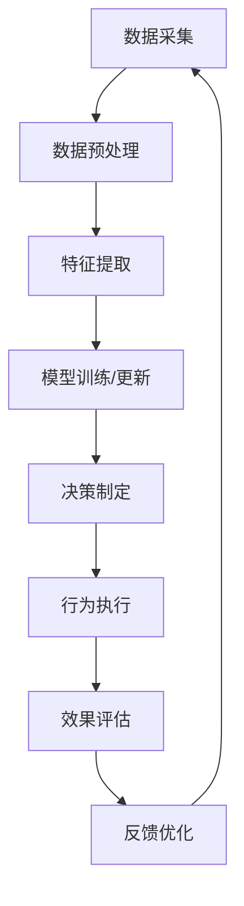

# AI人工智能代理工作流AI Agent WorkFlow：AI代理工作流在智能农业领域的应用

## 1.背景介绍

### 1.1 智能农业的兴起

随着人口不断增长和气候变化的影响,确保粮食安全和可持续农业生产成为了全球性挑战。传统的农业生产方式已经难以满足日益增长的需求,因此智能农业应运而生。智能农业是将先进的信息技术、物联网、大数据分析、人工智能等技术与农业生产相结合,以提高农业生产效率、降低成本、优化资源利用和减少环境影响。

### 1.2 AI代理在智能农业中的作用

在智能农业中,AI代理扮演着至关重要的角色。AI代理是一种基于人工智能技术的自主软件实体,能够感知环境、处理数据、做出决策并执行相应的行为。它们可以模拟人类专家的决策过程,并根据实时数据做出最佳决策。

AI代理工作流(AI Agent Workflow)是指AI代理在完成特定任务时所遵循的一系列步骤和过程。它涉及数据采集、预处理、特征提取、模型训练、决策制定和行为执行等多个环节。通过合理设计AI代理工作流,可以提高AI代理的性能、效率和可靠性,从而更好地服务于智能农业。

### 1.3 AI代理工作流在智能农业中的应用价值

AI代理工作流在智能农业中具有广泛的应用前景,可以为农业生产带来诸多益处:

1. 实时监控和预测:AI代理可以实时监控农作物生长状况、土壤湿度、气象条件等,并基于历史数据和模型预测未来趋势,为农户提供决策支持。

2. 精准管理:通过分析多源异构数据,AI代理能够制定出精准的种植策略、施肥方案、病虫害防治措施等,实现精准农业管理。

3. 自动化操作:AI代理可以控制智能设备执行农场自动化操作,如自动浇水、施肥、采摘等,提高效率、节省人力。

4. 优化资源利用:AI代理能够优化农资利用,减少浪费,降低生产成本,实现可持续发展。

5. 风险管控:AI代理可以预测和预警各种风险,如病虫害爆发、极端天气等,帮助农户及时采取应对措施,降低损失。

综上所述,AI代理工作流在智能农业中扮演着关键角色,是实现农业现代化、提高生产效率和可持续发展的重要手段。

## 2.核心概念与联系

### 2.1 AI代理

AI代理(AI Agent)是一种基于人工智能技术的自主软件实体,能够感知环境、处理数据、做出决策并执行相应的行为。它可以模拟人类专家的决策过程,根据实时数据做出最佳决策。

AI代理通常由以下几个核心组件组成:

- 感知器(Sensor):用于采集环境数据,如农作物生长状况、土壤湿度、气象条件等。
- 数据预处理模块:对采集的原始数据进行清洗、转换和标准化等预处理,为后续分析做准备。
- 知识库:存储领域知识、专家经验、历史数据等,为AI代理的决策提供支持。
- 推理引擎:基于知识库和数据,运行各种算法模型进行推理和决策。
- 规划器:根据推理结果制定行动计划,确定需要执行的操作。
- 执行器:控制执行器(如机器人、自动化设备等)执行规划好的操作。

### 2.2 AI代理工作流

AI代理工作流(AI Agent Workflow)描述了AI代理在完成特定任务时所遵循的一系列步骤和过程。它是一个循环过程,包括以下主要环节:

1. **数据采集**: 通过各种感知器采集农场环境数据,如农作物生长数据、土壤数据、气象数据等。

2. **数据预处理**: 对采集的原始数据进行清洗、转换、标准化等预处理,为后续分析做准备。

3. **特征提取**: 从预处理后的数据中提取出对决策有价值的特征,如农作物生长指标、土壤养分含量等。

4. **模型训练/更新**: 基于提取的特征和历史数据,使用机器学习算法训练或更新决策模型。

5. **决策制定**: 将当前环境数据输入训练好的模型,模型输出相应的决策,如种植策略、施肥方案等。

6. **行为执行**: 根据决策结果,控制执行器(如机器人、自动化设备等)执行相应的农场操作。

7. **效果评估**: 评估执行操作的效果,如农作物生长情况、产量等,为后续优化提供反馈。

8. **反馈优化**: 根据效果评估,对知识库、模型参数等进行优化,以提高决策的准确性和效率。

该工作流是一个闭环过程,通过不断地数据采集、模型训练和效果反馈,AI代理可以持续学习和优化,从而做出更加精准的决策。

### 2.3 智能农业中的AI代理工作流

在智能农业场景中,AI代理工作流可以广泛应用于各个环节,包括:

- **种植规划**: 基于历史数据和专家知识,AI代理可以制定出最佳的种植方案,包括作物种类、播种时间、密植度等。

- **精准种植**: 通过分析土壤数据、气象数据等,AI代理能够制定出精准的施肥策略、灌溉计划、病虫害防治措施等。

- **生长监控**: AI代理可以实时监控农作物的生长状况,并根据模型预测未来趋势,为农户提供决策支持。

- **收获管理**: AI代理能够预测最佳收获时间,并指导机器人或自动化设备执行精准采摘操作。

- **库存优化**: 通过分析历史销售数据和市场需求,AI代理可以优化农产品库存,减少浪费。

- **供应链管理**: AI代理能够规划最优的运输路线和时间,提高农产品的配送效率。

通过合理设计和应用AI代理工作流,可以显著提高农业生产的智能化水平,实现高效、可持续的现代农业。

## 3.核心算法原理具体操作步骤 

AI代理工作流中的核心环节包括数据预处理、特征提取、模型训练/更新和决策制定等,这些环节都涉及了各种机器学习和人工智能算法。下面将详细介绍其中的一些核心算法原理和具体操作步骤。

### 3.1 数据预处理算法

数据预处理是AI代理工作流中的重要环节,旨在从原始数据中清理出高质量的数据,为后续的特征提取和模型训练奠定基础。常用的数据预处理算法包括:

1. **缺失值处理**

   缺失值是指数据集中某些特征的值缺失或无效。常见的缺失值处理方法有:
   
   - 删除缺失值所在的整行或整列数据
   - 使用特征的均值/中位数/最高频率值等统计量填充缺失值
   - 使用机器学习模型预测缺失值(如K近邻、决策树等)

2. **异常值处理**

   异常值是指偏离数据集正常分布范围的极端值。常见的异常值处理方法有:

   - 基于统计学原理(如3σ原则)判断并移除异常值
   - 使用分位数等稳健统计量替换异常值
   - 使用聚类算法(如K-Means)将异常值与正常数据分开

3. **数据标准化**

   由于不同特征的数值范围存在差异,可能会影响模型的训练效果。因此需要对数据进行标准化处理,常用方法有:

   - 最小-最大标准化(Min-Max Normalization)
   - Z-Score标准化
   - 小数定标标准化(Decimal Scaling)

4. **编码技术**

   对于类别型特征,需要将其转换为数值型,以便模型处理。常用的编码技术有:

   - 一热编码(One-Hot Encoding)
   - 标签编码(Label Encoding)
   - 目标编码(Target Encoding)

以上算法可以根据具体数据特点和需求进行选择和组合使用,从而获得高质量的数据,为后续的特征提取和模型训练打下坚实基础。

### 3.2 特征提取算法

特征提取旨在从预处理后的数据中提取出对决策有价值的特征,是机器学习模型的重要前置步骤。常用的特征提取算法包括:

1. **统计特征**

   统计特征是基于数据的统计量提取的特征,如均值、中位数、标准差、偏度、峰度等。这些统计量能够反映数据的分布特征,对于决策有一定参考价值。

2. **时间序列特征**

   对于时间序列数据,可以提取一些描述其趋势和周期性的特征,如移动平均值、指数加权移动平均值、自相关系数、周期性分解等。这些特征对于预测未来趋势很有帮助。

3. **文本特征**

   如果数据集中包含文本数据(如农作物病害描述),可以使用自然语言处理技术提取文本特征,如TF-IDF、Word Embedding、主题模型等。

4. **图像特征**

   对于图像数据(如农作物生长图像),可以使用计算机视觉技术提取图像特征,如SIFT、HOG、CNN等。这些特征能够很好地描述图像的内容和特征。

5. **特征选择**

   由于提取的原始特征往往存在冗余和无关特征,因此需要使用特征选择算法(如Filter方法、Wrapper方法、Embedded方法等)来选择出对决策最有价值的特征子集。

特征提取的质量直接影响了模型的性能,因此需要根据具体的应用场景和数据特点,选择合适的特征提取算法和策略。

### 3.3 模型训练算法

模型训练是AI代理工作流中的核心环节,旨在基于提取的特征和历史数据,使用机器学习算法训练出高质量的决策模型。常用的模型训练算法包括:

1. **监督学习算法**

   - **回归算法**: 线性回归、逻辑回归、决策树、随机森林、梯度提升树等,用于预测连续值目标变量。
   - **分类算法**: 朴素贝叶斯、支持向量机、K近邻、神经网络等,用于预测离散类别目标变量。

2. **无监督学习算法**

   - **聚类算法**: K-Means、层次聚类、DBSCAN等,用于发现数据内在的聚类结构。
   - **降维算法**: 主成分分析(PCA)、t-SNE等,用于降低数据维度,提高模型效率。
   - **关联规则挖掘**: Apriori、FP-Growth等,用于发现数据中的频繁项集和关联规则。

3. **强化学习算法**

   强化学习算法(如Q-Learning、策略梯度等)通过与环境的交互,不断试错并获得反馈,从而学习出最优策略。在一些复杂的决策场景中(如自动驾驶农机),强化学习算法可以发挥重要作用。

4. **集成学习算法**

   集成学习算法(如Bagging、Boosting、Stacking等)通过构建并组合多个基学习器,能够提高模型的泛化能力和稳健性。

5. **深度学习算法**

   深度学习算法(如卷积神经网络、递归神经网络、生成对抗网络等)能够自动从原始数据中学习特征表示,在处理高维、非线性、复杂数据时表现出色。

在具体的模型训练过程中,需要根据数据特点和任务需求选择合适的算法,并对算法的超参数进行调优,以获得最佳的模型性能。此外,还需要注意防止过拟合、欠拟合等问题,确保模型的泛化能力。

### 