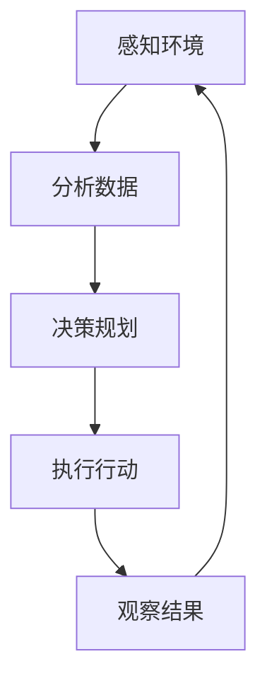

# AI人工智能代理工作流AI Agent WorkFlow：AI代理性能监控指标与分析技术

## 1.背景介绍

随着人工智能(AI)技术的快速发展,AI代理在各行各业中的应用越来越广泛。AI代理是一种自主软件实体,能够根据预定义的目标和规则,感知环境、学习并采取行动。在复杂的业务流程中,AI代理可以高效地执行各种任务,提高生产效率和决策质量。然而,由于AI代理的行为复杂性和自主性,监控和分析其性能至关重要,以确保系统的可靠性和有效性。

本文将探讨AI代理工作流程中的性能监控和分析技术,包括关键指标的定义、数据采集方法、分析模型以及可视化工具等。通过全面了解这些技术,我们可以更好地管理和优化AI代理系统,提高其性能和稳定性。

## 2.核心概念与联系

在讨论AI代理性能监控和分析技术之前,我们需要了解一些核心概念:

### 2.1 AI代理(AI Agent)

AI代理是一种具有自主性的软件实体,能够感知环境、处理信息、做出决策并采取行动。它可以根据预定义的目标和规则,在特定环境中执行任务。AI代理通常由感知器(Sensors)、执行器(Actuators)和决策引擎(Decision Engine)组成。

### 2.2 AI代理工作流(AI Agent Workflow)

AI代理工作流描述了AI代理在执行任务时的一系列操作步骤。它通常包括以下几个阶段:

1. 感知环境(Perceive Environment)
2. 分析数据(Analyze Data)
3. 决策规划(Plan and Decide)
4. 执行行动(Act)
5. 观察结果(Observe Results)

这些步骤形成了一个循环,AI代理不断地感知环境、分析数据、做出决策并采取行动,直到完成预定目标。

### 2.3 性能监控(Performance Monitoring)

性能监控是指持续收集和分析AI代理系统的运行数据,以评估其性能表现。通过监控关键指标,我们可以及时发现问题、优化系统并提高效率。

### 2.4 性能分析(Performance Analysis)

性能分析是指对收集到的监控数据进行深入分析,以发现潜在的性能瓶颈、异常模式和优化机会。通过建立分析模型和可视化工具,我们可以更好地理解系统行为,并做出数据驱动的决策。

## 3.核心算法原理具体操作步骤

AI代理性能监控和分析技术涉及多个关键步骤,包括指标定义、数据采集、分析建模和可视化等。下面将详细介绍每个步骤的原理和具体操作方法。

### 3.1 指标定义(Metric Definition)

首先,我们需要确定要监控和分析的关键性能指标(Key Performance Indicators,KPIs)。这些指标应该能够全面反映AI代理系统的运行状况,包括效率、准确性、资源利用率等方面。常见的性能指标包括:

- **响应时间(Response Time)**: 衡量AI代理从接收请求到产生响应所需的时间。
- **吞吐量(Throughput)**: 衡量AI代理在单位时间内能够处理的请求数量。
- **错误率(Error Rate)**: 衡量AI代理产生错误决策或行为的比例。
- **资源利用率(Resource Utilization)**: 衡量AI代理对CPU、内存等资源的使用情况。
- **模型精度(Model Accuracy)**: 衡量AI代理决策模型的预测准确度。

根据具体的应用场景和需求,我们可以定义更多的自定义指标。定义明确的指标有助于后续的数据采集和分析工作。

### 3.2 数据采集(Data Collection)

在AI代理运行过程中,我们需要持续采集与性能指标相关的数据。数据采集可以通过以下几种方式实现:

1. **日志记录(Logging)**: AI代理可以在执行过程中记录关键事件、决策和性能数据,并将这些信息写入日志文件。

2. **指标导出(Metric Exporting)**: AI代理可以通过预定义的接口(如Prometheus)导出性能指标数据,供外部系统收集和存储。

3. **代码插桩(Code Instrumentation)**: 在AI代理的代码中插入探针(Probe),用于收集特定的性能数据,如函数执行时间、内存使用情况等。

4. **系统监控(System Monitoring)**: 使用系统级监控工具(如Nagios、Zabbix)收集AI代理所在主机的资源利用率等数据。

无论采用何种方式,数据采集都应该尽可能全面、准确,并确保对AI代理的性能影响最小。

### 3.3 数据处理(Data Processing)

收集到的原始数据通常需要进行预处理,以便后续的分析和建模。常见的数据处理步骤包括:

1. **数据清洗(Data Cleaning)**: 去除异常值、填充缺失值等,以确保数据的完整性和一致性。

2. **数据转换(Data Transformation)**: 将数据转换为适合分析的格式,如规范化、编码等。

3. **数据聚合(Data Aggregation)**: 按时间、维度等对数据进行聚合,以便进行高级分析。

4. **数据存储(Data Storage)**: 将处理后的数据存储在时序数据库(如InfluxDB、Prometheus)或分析数据库(如Elasticsearch)中,以供后续查询和分析。

数据处理可以使用各种大数据处理框架(如Apache Spark、Apache Flink)或专门的数据管道工具(如Apache NiFi、Apache Kafka)来实现。

### 3.4 分析建模(Analytical Modeling)

基于处理后的数据,我们可以构建各种分析模型,以发现性能问题、识别异常模式并预测未来趋势。常见的分析模型包括:

1. **统计分析(Statistical Analysis)**: 使用描述性统计和推断统计方法分析性能指标的分布、趋势和相关性。

2. **异常检测(Anomaly Detection)**: 通过机器学习算法(如隔离森林、One-Class SVM)识别性能数据中的异常值和异常模式。

3. **时间序列分析(Time Series Analysis)**: 使用自回归模型(如ARIMA)、指数平滑模型等方法预测性能指标的未来趋势。

4. **关联规则挖掘(Association Rule Mining)**: 发现性能指标之间的相关性和因果关系,以帮助诊断性能问题的根源。

5. **聚类分析(Cluster Analysis)**: 根据性能数据的相似性,将AI代理实例划分为不同的聚类,以发现潜在的性能模式。

6. **回归分析(Regression Analysis)**: 建立性能指标与影响因素之间的回归模型,用于预测和优化。

不同的分析模型适用于不同的场景和目标,我们需要根据具体需求选择合适的模型。

### 3.5 可视化(Visualization)

将分析结果以直观的方式呈现对于理解AI代理的性能状况至关重要。常见的可视化技术包括:

1. **仪表板(Dashboard)**: 使用图表、表格等形式展示关键性能指标及其趋势,提供系统级的性能概览。

2. **异常视图(Anomaly View)**: 突出显示检测到的性能异常,并提供异常详情和上下文信息。

3. **流程视图(Workflow View)**: 以流程图或时间线的形式展示AI代理工作流中各个步骤的性能数据,帮助诊断瓶颈所在。

4. **热力图(Heatmap)**: 使用颜色编码可视化性能指标在不同维度(如时间、实例等)上的分布情况。

5. **关系图(Relationship Graph)**: 展示性能指标之间的相关性和因果关系,帮助分析性能问题的根源。

可视化工具通常提供交互式的探索和钻取功能,允许用户根据需要定制视图和查询数据。常见的可视化工具包括Grafana、Kibana、Tableau等。

## 4.数学模型和公式详细讲解举例说明

在AI代理性能监控和分析中,我们经常需要使用数学模型和公式来描述和预测系统行为。下面将详细介绍一些常用的数学模型和公式。

### 4.1 响应时间模型

响应时间是衡量AI代理性能的关键指标之一。我们可以使用队列理论来建模和分析响应时间。

假设AI代理系统可以看作是一个M/M/1队列模型,其中:

- 请求到达服从参数为$\lambda$的泊松分布
- 服务时间服从参数为$\mu$的指数分布
- 只有一个服务器(AI代理实例)

根据队列理论,该系统的平均响应时间$R$可以表示为:

$$R = \frac{1}{\mu - \lambda}$$

其中$\rho = \frac{\lambda}{\mu}$是系统的利用率。

当$\rho < 1$时,队列是稳定的,平均响应时间是有限的。但当$\rho \geq 1$时,队列将无限增长,响应时间将趋向无穷大。

通过监控请求到达率$\lambda$和服务率$\mu$,我们可以预测和优化AI代理的响应时间。例如,如果发现$\rho$接近1,我们可以考虑增加AI代理实例数量或优化算法以提高$\mu$。

### 4.2 吞吐量模型

吞吐量是另一个重要的性能指标,它反映了AI代理在单位时间内能够处理的请求数量。在M/M/1队列模型中,系统的最大吞吐量$T_{max}$可以表示为:

$$T_{max} = \mu \left(1 - \rho\right)$$

其中$\mu$是服务率,$\rho$是利用率。

当$\rho$接近1时,吞吐量将达到最大值。但是,如果$\rho$继续增加,吞吐量将开始下降,因为队列将无限增长,导致响应时间急剧上升。

通过监控实际吞吐量与最大吞吐量的差距,我们可以评估AI代理系统的性能余量,并在必要时进行扩容或优化。

### 4.3 异常检测模型

异常检测是性能分析中的一个关键任务。我们可以使用机器学习算法来自动检测性能数据中的异常值和异常模式。

#### 4.3.1 隔离森林算法(Isolation Forest)

隔离森林算法是一种常用的无监督异常检测算法。它基于将异常值"隔离"的思想,通过随机划分特征空间来构建一个决策树集合(森林)。异常值由于其特征值的极端分布,往往会在决策树的较高层次就被隔离出来。

对于给定的数据点$x$,我们可以计算它的异常分数$s(x)$:

$$s(x) = 2^{-\frac{E(h(x))}{c(n)}}$$

其中$h(x)$是$x$被隔离所需的路径长度,$E(h(x))$是$h(x)$的期望值,$c(n)$是一个用于归一化的常数,取决于数据集大小$n$。

异常分数$s(x)$的值越小,表示$x$越有可能是异常值。我们可以设置一个阈值来判断是否将$x$标记为异常。

隔离森林算法具有计算高效、无需数据标注等优点,适合用于AI代理性能数据的在线异常检测。

#### 4.3.2 One-Class SVM

One-Class SVM是另一种常用的无监督异常检测算法。它试图在特征空间中找到一个紧凑的超球体,将大部分数据点包含在内,而将异常值排除在外。

对于给定的数据集$X = \{x_1, x_2, \dots, x_n\}$,One-Class SVM的目标是求解以下优化问题:

$$\min_{R, c, \xi} \frac{1}{2}\|w\|^2 + \frac{1}{\nu n}\sum_{i=1}^{n}\xi_i - \rho$$
$$\text{s.t. } \|x_i - c\| \leq R^2 + \xi_i, \quad \xi_i \geq 0$$

其中$R$是超球体的半径,$c$是超球体的中心,$\xi_i$是松弛变量,用于处理软