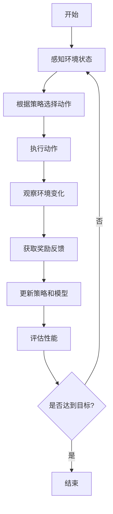

# AI人工智能代理工作流AI Agent WorkFlow：仿真环境中AI代理的实验与评估

## 1.背景介绍

### 1.1 人工智能代理简介

人工智能代理(AI Agent)是人工智能领域中的一个重要概念,指的是一个感知环境并根据环境状态采取行动的自主系统。AI代理通过感知器获取环境信息,并通过执行器对环境进行操作,以实现特定目标。

### 1.2 仿真环境的重要性

在开发和评估AI代理时,使用仿真环境具有重要意义。真实世界环境通常复杂且难以控制,而仿真环境可以提供一个可控且可重复的测试平台,有助于系统地评估AI代理的性能和行为。此外,仿真环境还可以模拟各种极端情况,帮助测试AI代理在不同条件下的鲁棒性。

### 1.3 AI代理工作流概述

AI代理工作流描述了AI代理在仿真环境中的典型生命周期,包括感知、决策、执行和评估等关键步骤。通过对这一工作流程的深入理解和优化,可以提高AI代理的性能和效率,为其在实际应用中的部署奠定基础。

## 2.核心概念与联系

### 2.1 环境(Environment)

环境是AI代理所处的外部世界,包括所有可能的状态和AI代理可以执行的动作。环境可以是完全可观测的(fully observable),也可以是部分可观测的(partially observable)。

### 2.2 状态(State)

状态是对环境的数学描述,通常用一个向量或其他数据结构来表示。状态包含了环境中所有相关的信息,如物体位置、速度等。

### 2.3 奖励函数(Reward Function)

奖励函数定义了AI代理的目标,即在给定的环境中,AI代理应该如何行动才能获得最大的累积奖励。奖励函数通常是一个映射,将状态或状态-动作对映射到一个实数值,表示在该状态或执行该动作的好坏程度。

### 2.4 策略(Policy)

策略定义了AI代理在给定状态下应该采取的行动。一个好的策略应该能够最大化AI代理在环境中获得的累积奖励。

### 2.5 价值函数(Value Function)

价值函数估计了在给定状态下,执行某一策略能够获得的预期累积奖励。价值函数是评估和优化策略的关键工具。

### 2.6 模型(Model)

模型描述了环境的转移概率,即在执行某个动作后,环境从一个状态转移到另一个状态的概率。拥有精确的环境模型对于规划和决策至关重要。

这些核心概念相互关联,共同构成了AI代理工作流的基础。环境提供了AI代理运行的场景,状态描述了环境的具体情况,奖励函数定义了AI代理的目标,策略指导AI代理如何行动,价值函数评估策略的质量,而模型则描述了环境的动态变化规律。

## 3.核心算法原理具体操作步骤

### 3.1 AI代理工作流概述

AI代理工作流描述了AI代理在仿真环境中的典型生命周期,包括以下关键步骤:

1. **感知环境状态**:通过感知器获取当前环境的状态信息。
2. **根据策略选择动作**:基于当前状态和策略,选择一个合适的动作。
3. **执行动作**:通过执行器执行选定的动作,对环境进行操作。
4. **观察环境变化**:观察动作执行后环境的变化。
5. **获取奖励反馈**:根据奖励函数,获取执行该动作后的奖励值。
6. **更新策略和模型**:基于观察到的环境变化和奖励反馈,更新策略和环境模型。
7. **评估性能**:评估当前策略在环境中的表现,如累积奖励、完成任务的效率等。
8. **判断是否达到目标**:检查是否达到预定目标,如果达到则结束,否则回到第一步继续循环。

这个循环过程反映了AI代理与环境的交互方式,并通过不断优化策略和模型,逐步提高AI代理的性能。

### 3.2 强化学习算法

强化学习是训练AI代理策略的一种重要方法,其核心思想是通过与环境的交互,不断尝试不同的行为,获取奖励反馈,并基于这些反馈调整策略,最终找到一个能够最大化累积奖励的最优策略。

以下是一些常见的强化学习算法及其具体操作步骤:

#### 3.2.1 Q-Learning算法

Q-Learning是一种基于价值函数的强化学习算法,它不需要事先了解环境的转移概率模型,可以通过与环境交互来学习最优策略。算法步骤如下:

1. 初始化Q表格,所有状态-动作对的Q值设置为0或一个较小的常数。
2. 对于每个时间步:
    a. 观察当前状态$s$。
    b. 根据当前Q值,选择一个动作$a$,通常采用$\epsilon$-贪婪策略。
    c. 执行动作$a$,观察到新的状态$s'$和奖励$r$。
    d. 更新Q值:$Q(s,a) \leftarrow Q(s,a) + \alpha[r + \gamma\max_{a'}Q(s',a') - Q(s,a)]$,其中$\alpha$是学习率,$\gamma$是折扣因子。
3. 重复步骤2,直到收敛或达到最大迭代次数。

通过不断更新Q值,Q-Learning算法可以逐步找到最优策略,即在每个状态下选择具有最大Q值的动作。

#### 3.2.2 Sarsa算法

Sarsa算法是另一种基于价值函数的强化学习算法,它直接学习状态-动作对的价值函数,而不是像Q-Learning那样学习Q值。算法步骤如下:

1. 初始化Q表格,所有状态-动作对的Q值设置为0或一个较小的常数。
2. 对于每个时间步:
    a. 观察当前状态$s$,根据当前策略选择动作$a$。
    b. 执行动作$a$,观察到新的状态$s'$,根据策略选择新的动作$a'$,并获取奖励$r$。
    c. 更新Q值:$Q(s,a) \leftarrow Q(s,a) + \alpha[r + \gamma Q(s',a') - Q(s,a)]$,其中$\alpha$是学习率,$\gamma$是折扣因子。
    d. 将$s \leftarrow s'$,$a \leftarrow a'$,进入下一个时间步。
3. 重复步骤2,直到收敛或达到最大迭代次数。

Sarsa算法直接学习策略,因此可以更好地处理非平稳环境,但收敛速度可能较慢。

#### 3.2.3 Deep Q-Network (DQN)算法

DQN算法是结合深度学习和Q-Learning的一种强化学习算法,它使用神经网络来近似Q值函数,可以处理高维状态空间。算法步骤如下:

1. 初始化一个深度神经网络,用于近似Q值函数。
2. 初始化经验回放池(Experience Replay Buffer)。
3. 对于每个时间步:
    a. 观察当前状态$s$。
    b. 使用神经网络预测各个动作的Q值,选择Q值最大的动作$a$。
    c. 执行动作$a$,观察到新的状态$s'$和奖励$r$。
    d. 将$(s,a,r,s')$存入经验回放池。
    e. 从经验回放池中随机采样一批数据,计算目标Q值$y = r + \gamma\max_{a'}Q(s',a')$。
    f. 优化神经网络,使得预测的Q值$Q(s,a)$逼近目标Q值$y$。
4. 重复步骤3,直到收敛或达到最大迭代次数。

DQN算法通过经验回放池和目标网络等技巧,提高了训练的稳定性和效率,可以有效解决高维状态空间的问题。

这些强化学习算法为AI代理提供了在仿真环境中学习最优策略的方法,是AI代理工作流中不可或缺的一部分。

## 4.数学模型和公式详细讲解举例说明

在AI代理工作流中,数学模型和公式扮演着重要的角色,为算法的设计和分析提供了理论基础。以下是一些常见的数学模型和公式,以及它们在AI代理工作流中的应用。

### 4.1 马尔可夫决策过程(Markov Decision Process, MDP)

马尔可夫决策过程是描述AI代理与环境交互的数学框架,它由以下几个要素组成:

- 状态集合$\mathcal{S}$
- 动作集合$\mathcal{A}$
- 转移概率$\mathcal{P}_{ss'}^a = \mathbb{P}(s'|s,a)$,表示在状态$s$执行动作$a$后,转移到状态$s'$的概率
- 奖励函数$\mathcal{R}_s^a$或$\mathcal{R}_{ss'}^a$,表示在状态$s$执行动作$a$获得的奖励,或从状态$s$转移到状态$s'$获得的奖励
- 折扣因子$\gamma \in [0,1)$,用于权衡即时奖励和长期奖励的重要性

在MDP框架下,AI代理的目标是找到一个策略$\pi:\mathcal{S} \rightarrow \mathcal{A}$,使得在该策略下的预期累积奖励最大化:

$$
\max_\pi \mathbb{E}_\pi\left[\sum_{t=0}^\infty \gamma^t r_t\right]
$$

其中$r_t$是在时间步$t$获得的奖励。

MDP为强化学习算法提供了理论基础,许多算法都是在MDP框架下设计和分析的。

### 4.2 贝尔曼方程(Bellman Equations)

贝尔曼方程描述了在MDP中,价值函数与奖励函数和转移概率之间的关系,是强化学习算法的核心。

对于任意策略$\pi$,其价值函数$V^\pi(s)$满足以下贝尔曼方程:

$$
V^\pi(s) = \mathbb{E}_\pi\left[r_t + \gamma V^\pi(s_{t+1}) | s_t = s\right] = \sum_{a}\pi(a|s)\sum_{s'}\mathcal{P}_{ss'}^a\left[\mathcal{R}_s^a + \gamma V^\pi(s')\right]
$$

类似地,对于任意策略$\pi$,其动作价值函数$Q^\pi(s,a)$满足:

$$
Q^\pi(s,a) = \mathbb{E}_\pi\left[r_t + \gamma V^\pi(s_{t+1}) | s_t = s, a_t = a\right] = \sum_{s'}\mathcal{P}_{ss'}^a\left[\mathcal{R}_{ss'}^a + \gamma \sum_{a'}\pi(a'|s')Q^\pi(s',a')\right]
$$

这些贝尔曼方程为价值函数提供了递推式,是许多强化学习算法的理论基础,如Q-Learning、Sarsa等。

### 4.3 策略迭代(Policy Iteration)

策略迭代是一种基于价值函数的强化学习算法,它通过交替执行以下两个步骤来找到最优策略:

1. **策略评估(Policy Evaluation)**:对于当前策略$\pi$,求解其价值函数$V^\pi$,可以通过求解贝尔曼方程的线性系统来实现。

2. **策略改进(Policy Improvement)**:基于价值函数$V^\pi$,构造一个新的策略$\pi'$,使得$\pi'$比$\pi$更好或至少不差,即$V^{\pi'}(s) \geq V^\pi(s)$,对所有$s \in \mathcal{S}$。

重复上述两个步骤,直到策略收敛到最优策略$\pi^*$。

策略迭代算法的收敛性可以由以下定理保证:

**定理(策略改进定理)**:对于任