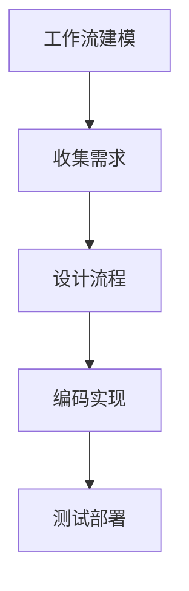
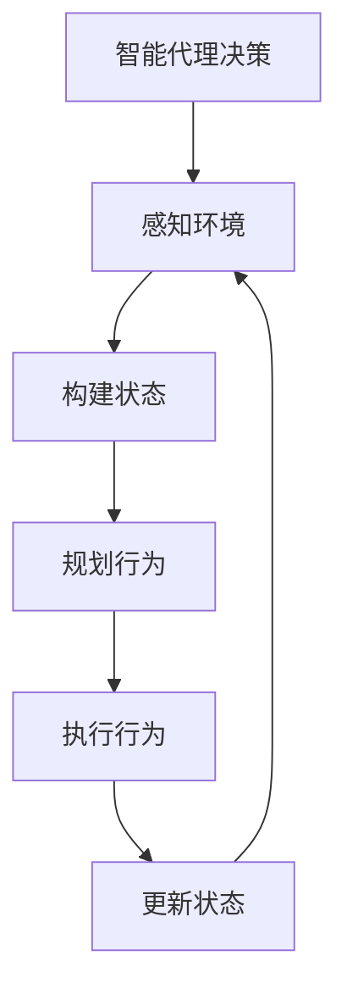
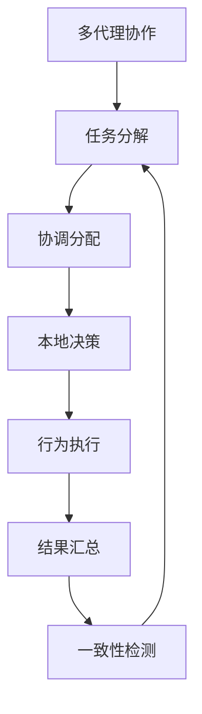
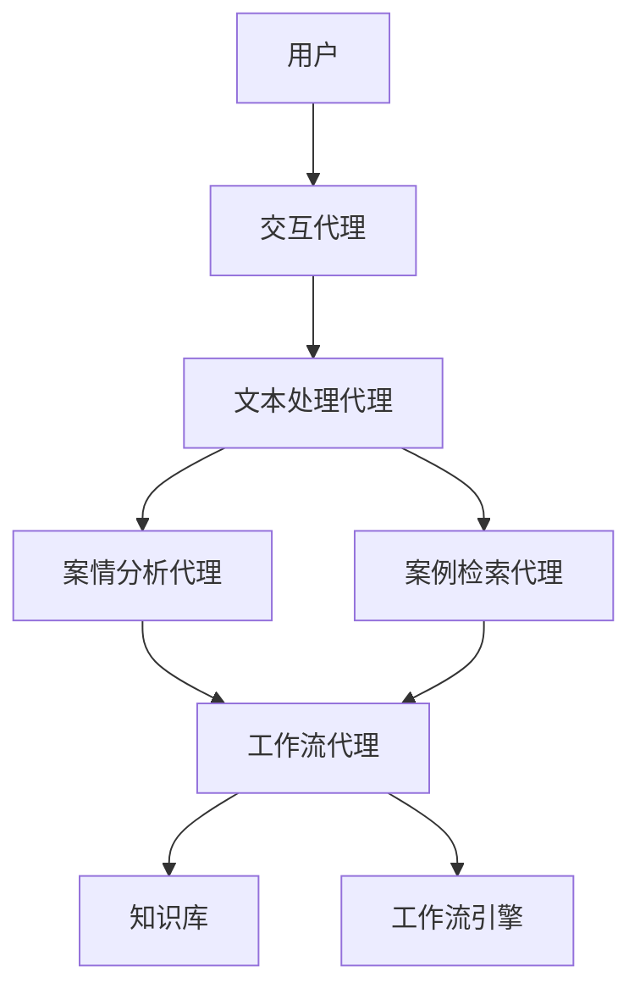

# AI人工智能代理工作流AI Agent WorkFlow：智能代理在法律服务系统中的应用

## 1.背景介绍

### 1.1 法律服务的重要性

法律服务是现代社会不可或缺的重要组成部分。它确保社会有序运行,保护公民的合法权益,维护公平正义。随着科技的飞速发展,法律服务领域亟需创新,以提高效率,降低成本,提供更优质的服务。

### 1.2 人工智能在法律领域的应用

人工智能(AI)技术在法律领域的应用日益广泛。AI可以处理大量法律文书,快速检索相关案例法律,辅助律师进行案情分析和判决预测。同时,AI还可以通过自然语言处理技术与当事人进行交互,提供初步法律咨询服务。

### 1.3 智能代理的概念

智能代理(Intelligent Agent)是一种基于人工智能技术的软件实体,能够感知环境,执行一定的任务,并与人或其他代理进行交互。智能代理可应用于各个领域,在法律服务系统中扮演着越来越重要的角色。

## 2.核心概念与联系  

### 2.1 工作流(Workflow)

工作流是指为了完成一个过程所需执行的一系列有序活动。在法律服务系统中,工作流可以体现为办理一个案件所需的各个环节和步骤,如案件受理、证据收集、法律分析、庭审、判决等。

### 2.2 智能代理(Intelligent Agent)

智能代理是指具备一定智能的软件实体,能够根据环境感知做出决策并执行相应行为。在法律服务系统中,智能代理可以扮演诸如法律顾问、案件分析师、文书处理员等角色,协助律师高效处理案件。

### 2.3 AI Agent Workflow

AI Agent Workflow是指由一个或多个智能代理按照预定义的工作流执行法律服务相关任务的过程。它将人工智能技术与工作流程管理相结合,充分发挥智能代理的优势,提高法律服务的效率和质量。

### 2.4 关键技术

实现AI Agent Workflow需要多种技术的支持,包括:

- 自然语言处理(NLP):用于代理与用户交互、理解法律文书等。
- 知识图谱:构建法律知识库,存储法律概念及其关系。
- 机器学习:训练模型分析案情、预测判决结果等。
- 规则引擎:执行编码的法律规则和流程逻辑。
- 多智能体系统:协调多个智能代理的协作。

## 3.核心算法原理具体操作步骤

实现AI Agent Workflow的核心算法包括工作流建模、智能代理决策和多代理协作三个方面。

### 3.1 工作流建模



1. **收集需求**:收集法律服务各环节的具体需求,了解工作流中涉及的角色、任务、数据等要素。
2. **设计流程**:根据需求,设计合理的工作流程结构,确定每个环节的执行顺序、条件分支、并行节点等。
3. **编码实现**:使用工作流引擎(如Camunda、Activiti等)将设计好的流程转化为可执行的模型。
4. **测试部署**:对工作流进行测试,修复问题,最终部署到生产环境中。

### 3.2 智能代理决策



1. **感知环境**:智能代理通过各种传感器获取工作流当前状态、用户输入等环境信息。
2. **构建状态**:将获取的信息转化为代理可识别的状态表示,作为决策的输入。
3. **规划行为**:根据状态和目标,通过搜索、规划等算法确定下一步的行为序列。
4. **执行行为**:执行规划出的行为序列中的下一个行为,可能会影响环境状态。
5. **更新状态**:根据行为的执行结果,更新代理的内部状态。

该过程循环执行,直至达成目标状态。常用的决策算法有BFS、A*、POMDP等。

### 3.3 多代理协作



1. **任务分解**:将工作流中的复杂任务分解为多个子任务。
2. **协调分配**:根据子任务的特点,将其分配给最合适的智能代理。
3. **本地决策**:各代理根据自身状态和目标,独立做出行为决策。
4. **行为执行**:代理执行已规划的行为序列。
5. **结果汇总**:收集各代理的执行结果,形成全局解。
6. **一致性检测**:检测全局解是否满足约束条件,否则重新分解任务。

该过程迭代执行,直至找到满足全局约束的解。可采用协作过滤、蚁群算法等方法。

## 4.数学模型和公式详细讲解举例说明   

在AI Agent Workflow中,数学模型和公式广泛应用于决策、优化、预测等环节。

### 4.1 马尔可夫决策过程(MDP)

马尔可夫决策过程常用于智能代理的决策规划。设 $\mathcal{S}$ 为环境状态集合, $\mathcal{A}$ 为代理可执行的行为集合, $P(s' \vert s, a)$ 为从状态 $s$ 执行行为 $a$ 后转移到状态 $s'$ 的概率, $R(s, a)$ 为在状态 $s$ 执行行为 $a$ 获得的即时奖励。MDP可形式化为:

$$\langle \mathcal{S}, \mathcal{A}, P, R \rangle$$

目标是找到一个策略 $\pi: \mathcal{S} \rightarrow \mathcal{A}$,使得期望累积奖励最大:

$$\max_\pi \mathbb{E}\left[\sum_{t=0}^\infty \gamma^t R(s_t, \pi(s_t))\right]$$

其中 $\gamma \in [0, 1)$ 为折现因子。可通过价值迭代、策略迭代等方法求解最优策略。

例如,在案件受理环节,智能代理需要决定是否受理一个案件。可将案件信息(如案由、证据、当事人情况等)作为状态 $s$,受理或拒绝作为行为 $a$,根据案件的复杂程度、社会影响等设置即时奖励 $R(s, a)$,通过求解MDP得到最优决策策略。

### 4.2 约束优化问题(COP)

在工作流执行过程中,往往需要在满足某些约束条件的前提下,优化某个目标函数。这可以形式化为约束优化问题:

$$
\begin{aligned}
&\underset{x}{\text{minimize}} & & f(x) \\
&\text{subject to} & & g_i(x) \leq 0, \quad i=1,\ldots,m \\
& & & h_j(x) = 0, \quad j=1,\ldots,p
\end{aligned}
$$

其中 $x$ 为决策变量, $f(x)$ 为目标函数, $g_i(x)$ 和 $h_j(x)$ 分别为不等式和等式约束函数。

例如,在案件分配环节,需要将案件合理分配给律师,使得每位律师的工作量均衡,同时满足律师的专业领域、案件紧急程度等约束条件。可将律师的工作量作为目标函数,专业领域匹配、案件紧急程度等作为约束条件,建立约束优化模型,求解最优分配方案。

### 4.3 贝叶斯网络

贝叶斯网络是一种基于概率论的图模型,广泛应用于因果推理、诊断分析等领域。它由节点(表示随机变量)和有向边(表示变量间条件独立性)组成,每个节点对应一个条件概率分布。

在法律服务系统中,可将法律概念、事实、证据等建模为贝叶斯网络节点,通过网络推理得出案件的分析结论。例如,对于一起伤害案,可将"故意"、"过失"、"伤害行为"、"伤害结果"等作为节点,根据相应的条件概率分布和证据,推断被告的主观故意或过失程度。

$$P(X_i \vert Pa(X_i)) = \prod_{i=1}^n P(x_i \vert pa(x_i))$$

上式为贝叶斯网络的链式法则,其中 $X_i$ 为第 $i$ 个节点, $Pa(X_i)$ 为 $X_i$ 的父节点集合。通过有效的推理算法,可以计算出任意查询的后验概率分布。

### 4.4 其他模型

AI Agent Workflow中还可应用其他数学模型,如:

- 隐马尔可夫模型(HMM):用于序列标注、语音识别等。
- 支持向量机(SVM):用于案件分类、文本分类等。
- 神经网络:多层感知机、卷积神经网络等,可用于各种预测和生成任务。
- 主题模型(LDA):用于法律文书的主题发现和摘要。
- ...

这些模型的具体应用需结合实际场景,选择合适的模型并调整超参数,以获得最佳效果。

## 5.项目实践:代码实例和详细解释说明

为了更好地理解AI Agent Workflow在法律服务系统中的应用,我们通过一个示例项目进行说明。

### 5.1 项目概述

该示例项目旨在构建一个智能法律顾问系统,为用户提供案件咨询、法律文书审阅等服务。系统包含以下主要功能:

1. 案件咨询:用户可以通过自然语言与系统交互,描述案件情况,系统给出初步法律分析意见。
2. 文书审阅:用户上传法律文书,系统对文书内容进行审阅,提出修改建议。
3. 案例检索:系统可以根据案件信息检索相似历史案例,为分析和判决提供参考。

该系统由多个智能代理协作完成,包括:

- 交互代理:负责与用户自然语言交互。
- 文本处理代理:对用户输入和法律文书进行自然语言处理。
- 案情分析代理:根据案件信息进行法律分析。
- 案例检索代理:检索相似历史案例。
- 工作流代理:协调各代理按工作流执行任务。

### 5.2 系统架构



1. 用户通过自然语言与交互代理进行交互,描述案件情况或上传法律文书。
2. 交互代理将用户输入发送给文本处理代理进行自然语言处理,提取关键信息。
3. 文本处理代理将处理结果分别发送给案情分析代理和案例检索代理。
4. 案情分析代理根据案件信息进行法律分析,生成初步意见。
5. 案例检索代理在知识库中检索相似案例,为分析提供参考。
6. 工作流代理根据工作流引擎的状态,协调各代理按照预定流程执行任务,并将最终结果反馈给用户。

### 5.3 关键代码示例

以下是一些关键代码示例,使用Python和相关库实现。

#### 5.3.1 工作流定义(BPMN)

```xml
<?xml version="1.0" encoding="UTF-8"?>
<bpmn:definitions xmlns:bpmn="http://www.omg.org/spec/BPMN/20100524/MODEL" id="Definitions_1">
  <bpmn:process id="Process_1" isExecutable="true">
    <bpmn:startEvent id="StartEvent_1" name="