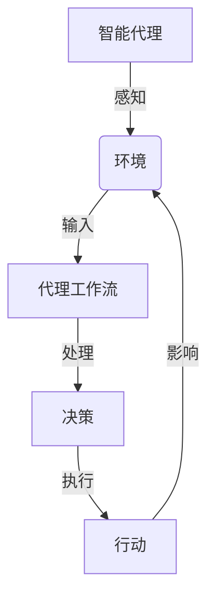
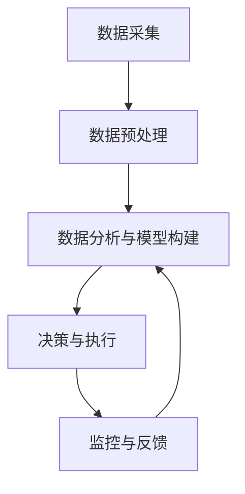

# AI人工智能代理工作流AI Agent WorkFlow：智能代理在金融系统中的应用

## 1.背景介绍

### 1.1 金融系统的重要性

金融系统是现代经济的核心支柱,它确保资金在不同经济实体之间的有效流动和分配。一个高效、可靠的金融系统对于促进经济增长、维护金融稳定和满足社会资金需求至关重要。然而,金融系统也面临着诸多挑战,例如复杂的监管要求、日益增长的交易量、网络安全风险等。

### 1.2 人工智能在金融领域的应用

近年来,人工智能(AI)技术在金融领域的应用日益广泛。AI代理可以执行各种智能任务,如风险评估、交易执行、客户服务、反欺诈监控等。通过利用大数据、机器学习和自然语言处理等技术,AI代理能够高效地处理大量数据,发现隐藏的模式和洞察,从而提高金融服务的质量和效率。

### 1.3 AI代理工作流的重要性

AI代理工作流(AI Agent Workflow)是指AI代理在执行特定任务时所遵循的一系列步骤和流程。合理设计AI代理工作流对于确保AI代理的高效运行、数据隐私保护和系统安全性至关重要。在金融系统中,AI代理工作流需要满足严格的监管要求,并能够适应不断变化的市场环境。

## 2.核心概念与联系

### 2.1 智能代理(Intelligent Agent)

智能代理是一种具有自主性、响应性、主动性和持续性的软件实体。它能够感知环境,根据设定的目标做出决策并采取行动。在金融系统中,智能代理可以执行各种任务,如交易执行、风险管理、客户服务等。

### 2.2 代理工作流(Agent Workflow)

代理工作流是指智能代理在执行特定任务时所遵循的一系列步骤和流程。它定义了代理如何接收输入、处理数据、做出决策以及与其他系统或人员交互。合理设计代理工作流对于确保代理的高效运行、数据隐私保护和系统安全性至关重要。



### 2.3 金融系统中的AI代理应用

在金融系统中,AI代理可以应用于多个领域,包括但不限于:

1. **交易执行**: AI代理可以根据市场数据和算法进行自动化交易,提高交易效率和收益。
2. **风险管理**: AI代理可以评估信贷风险、市场风险和操作风险,帮助金融机构做出明智的决策。
3. **反欺诈监控**: AI代理可以分析大量交易数据,识别可疑活动模式,有效防范金融欺诈行为。
4. **客户服务**: AI代理可以通过自然语言处理技术提供智能客户服务,提高客户满意度。
5. **合规监控**: AI代理可以监控金融交易,确保其符合监管要求和内部政策。

## 3.核心算法原理具体操作步骤

AI代理工作流通常包括以下几个核心步骤:

### 3.1 感知环境

AI代理需要从环境中获取相关数据,这些数据可能来自各种来源,如金融市场数据、交易记录、客户信息等。常用的数据采集方法包括Web抓取、API调用、数据库查询等。

### 3.2 数据预处理

获取的原始数据通常需要进行预处理,以确保数据的完整性、一致性和准确性。常见的预处理步骤包括数据清洗、特征提取、数据转换等。

### 3.3 数据分析与模型构建

根据具体任务的需求,AI代理可以使用不同的机器学习算法对数据进行分析和建模。常用的算法包括监督学习算法(如逻辑回归、决策树、神经网络等)和无监督学习算法(如聚类分析、关联规则挖掘等)。

### 3.4 决策与执行

基于构建的模型,AI代理可以做出相应的决策,如进行交易、发出风险警报、提供客户服务建议等。决策的执行可能涉及与其他系统或人员的交互,如下单系统、风控系统、客户服务系统等。

### 3.5 监控与反馈

AI代理的运行需要持续监控,以确保其正常运行和决策的准确性。同时,也需要收集反馈数据,用于模型的优化和迭代。



## 4.数学模型和公式详细讲解举例说明

在金融系统中,AI代理工作流常常需要使用各种数学模型和算法。以下是一些常见的模型和公式:

### 4.1 逻辑回归模型

逻辑回归模型是一种广泛应用于分类问题的监督学习算法。在金融领域,它可用于信贷风险评估、欺诈检测等任务。

逻辑回归模型的核心公式为:

$$P(Y=1|X) = \frac{1}{1 + e^{-(\beta_0 + \beta_1X_1 + \beta_2X_2 + ... + \beta_nX_n)}}$$

其中,Y是二元响应变量(如违约/未违约),X是自变量(如年龄、收入等),β是需要估计的模型参数。

### 4.2 时间序列分析

时间序列分析广泛应用于金融市场预测、风险管理等领域。常用的时间序列模型包括自回归移动平均模型(ARMA)、指数平滑模型等。

ARMA(p,q)模型的公式为:

$$X_t = c + \epsilon_t + \sum_{i=1}^p \phi_i X_{t-i} + \sum_{i=1}^q \theta_i \epsilon_{t-i}$$

其中,X_t是时间t的观测值,c是常数项,φ和θ分别是自回归和移动平均部分的参数,ε_t是白噪声误差项。

### 4.3 组合优化模型

在投资组合管理中,常需要解决资产配置的优化问题,以实现风险和收益的平衡。著名的马科维茨模型就是一种常用的组合优化模型。

马科维茨模型的目标函数为:

$$\min_w \frac{1}{2}w^T\Sigma w - R^Tw$$

$$\text{s.t.} \sum_{i=1}^N w_i = 1, w_i \geq 0$$

其中,w是资产权重向量,Σ是资产收益率的协方差矩阵,R是期望收益率向量。该模型旨在最小化投资组合的风险(方差),同时满足期望收益率的约束。

## 5.项目实践:代码实例和详细解释说明

为了更好地理解AI代理工作流在金融系统中的应用,我们以股票交易执行为例,展示一个基于Python的简单项目实践。

### 5.1 数据采集

我们使用Python的pandas_datareader库从Yahoo Finance获取历史股票数据。

```python
import pandas_datareader as pdr

# 获取苹果公司(AAPL)2020年1月1日至2021年1月1日的历史数据
start_date = '2020-01-01'
end_date = '2021-01-01'
aapl_data = pdr.get_data_yahoo('AAPL', start=start_date, end=end_date)
```

### 5.2 数据预处理

对获取的原始数据进行必要的预处理,如填充缺失值、计算技术指标等。

```python
# 填充缺失值
aapl_data = aapl_data.fillna(method='ffill')

# 计算简单移动平均线
aapl_data['SMA_20'] = aapl_data['Close'].rolling(window=20).mean()
aapl_data['SMA_50'] = aapl_data['Close'].rolling(window=50).mean()
```

### 5.3 交易策略构建

我们构建一个基于移动平均线的简单交易策略,当短期移动平均线上穿长期移动平均线时买入,反之卖出。

```python
# 初始化买入信号
aapl_data['Signal'] = 0.0

# 生成买入信号
aapl_data.loc[aapl_data['SMA_20'] > aapl_data['SMA_50'], 'Signal'] = 1.0

# 计算每日收益率
aapl_data['Returns'] = aapl_data['Close'].pct_change()

# 计算策略收益率
strategy_returns = aapl_data['Returns'] * aapl_data['Signal'].shift(1)
```

### 5.4 策略评估

我们评估交易策略的表现,包括累计收益率、年化收益率、最大回撤等指标。

```python
# 计算累计收益率
cumulative_returns = (1 + strategy_returns).cumprod()

# 计算年化收益率
annual_return = (cumulative_returns.iloc[-1] ** (252 / len(strategy_returns))) - 1

# 计算最大回撤
max_drawdown = (cumulative_returns / cumulative_returns.cummax() - 1).min()

print(f'累计收益率: {cumulative_returns.iloc[-1] * 100:.2f}%')
print(f'年化收益率: {annual_return * 100:.2f}%')
print(f'最大回撤: {max_drawdown * 100:.2f}%')
```

上述代码只是一个简单示例,实际的AI代理工作流会更加复杂,需要涉及更多的算法和技术,如深度学习、强化学习、自然语言处理等。但是,这个示例展示了AI代理工作流在金融系统中的基本流程和思路。

## 6.实际应用场景

AI代理工作流在金融系统中有广泛的应用场景,包括但不限于:

### 6.1 算法交易

算法交易是利用计算机程序自动执行交易策略的一种交易方式。AI代理可以根据市场数据和预定义的交易规则,实时进行买卖决策和下单操作,大大提高了交易效率和收益。

### 6.2 风险管理

AI代理可以应用于各种风险管理场景,如信用风险评估、市场风险监控、操作风险控制等。通过分析历史数据和实时信息,AI代理能够及时发现潜在风险,并提供风险缓解建议。

### 6.3 反欺诈监控

金融欺诈行为造成了巨大的经济损失。AI代理可以通过分析大量交易数据,识别异常模式和可疑活动,有效防范各种欺诈行为,如洗钱、内幕交易、网络诈骗等。

### 6.4 客户服务

AI代理可以提供智能化的客户服务,如自动问答、个性化理财建议、投资组合管理等。通过自然语言处理和机器学习技术,AI代理能够更好地理解客户需求,提供高质量的服务体验。

### 6.5 合规监控

金融机构需要遵守众多监管要求和内部政策。AI代理可以自动监控交易活动,检测潜在的违规行为,确保金融机构的合规性。

## 7.工具和资源推荐

在构建AI代理工作流时,可以利用各种工具和资源,以提高开发效率和模型性能。

### 7.1 编程语言和框架

- Python: 广泛应用于数据科学和机器学习领域,拥有丰富的第三方库。
- TensorFlow: Google开源的机器学习框架,支持深度学习和其他算法。
- PyTorch: Facebook开源的机器学习框架,具有动态计算图和良好的可扩展性。
- Scikit-learn: Python中流行的机器学习库,提供了各种经典算法的实现。

### 7.2 数据源

- Yahoo Finance: 提供免费的股票、外汇、加密货币等金融数据。
- Quandl: 集成了来自各个领域的高质量数据集。
- Kaggle: 提供大量公开数据集,适合机器学习实践。

### 7.3 云计算平台

- Amazon Web Services (AWS): 提供各种云计算服务,如EC2、S3、SageMaker等。
- Google Cloud Platform (GCP): 提供云计算、机器学习和数据分析服务。
- Microsoft Azure: 微软的云计算平台,提供各种AI和数据服务。

### 7.4 开源项目

- FinRL: 