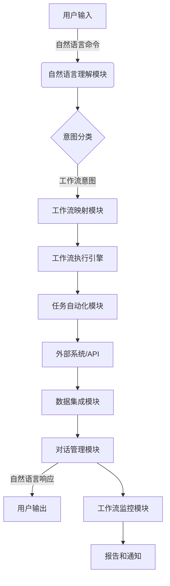

# AI人工智能代理工作流AI Agent WorkFlow：自然语言处理在工作流中的应用

## 1.背景介绍

### 1.1 工作流自动化的重要性

在当今快节奏的商业环境中，工作流自动化已经成为提高效率、降低成本和优化业务流程的关键因素。手动执行重复性任务不仅耗时耗力,而且容易出错。因此,越来越多的企业开始寻求自动化解决方案,以简化工作流程,提高生产力。

### 1.2 自然语言处理(NLP)的兴起

随着人工智能(AI)和机器学习技术的不断进步,自然语言处理(NLP)已经成为一个备受关注的领域。NLP旨在使计算机能够理解、解释和生成人类语言,从而实现人机之间自然、流畅的交互。

### 1.3 NLP在工作流中的应用潜力

将NLP技术与工作流自动化相结合,可以创建智能代理系统,使用户能够通过自然语言命令来启动、监控和控制各种任务和流程。这种AI代理工作流不仅提高了效率,而且增强了用户体验,为企业带来了全新的机遇。

## 2.核心概念与联系

### 2.1 工作流自动化

工作流自动化是指使用软件系统自动执行一系列任务或流程的过程。它通常包括以下关键概念:

- **流程定义**: 确定工作流中的任务序列及其依赖关系。
- **任务自动化**: 使用脚本或API自动执行手动任务。
- **数据集成**: 在不同系统和应用程序之间交换数据。
- **监控和报告**: 跟踪流程执行情况并生成报告。

### 2.2 自然语言处理(NLP)

自然语言处理是一门研究计算机理解和生成人类语言的学科。它涉及以下核心概念:

- **语言模型**: 根据上下文预测单词或句子的概率分布。
- **词法分析**: 将文本拆分为单词、数字和标点符号等token。
- **句法分析**: 确定单词在句子中的语法结构和关系。
- **语义分析**: 理解语句的实际含义和上下文。
- **对话管理**: 控制对话状态并生成合适的响应。

### 2.3 AI代理工作流

AI代理工作流将工作流自动化与NLP技术相结合,创建一种新型的智能系统。它的核心思想是:

- 使用NLP来理解用户的自然语言命令。
- 将命令映射到特定的工作流任务和操作。
- 自动执行相应的任务,并通过NLP与用户交互。
- 持续监控流程状态,并根据需要提供更新和响应。

该系统充当一个智能代理,使用户能够以自然的方式控制和管理复杂的工作流。

## 3.核心算法原理具体操作步骤

实现AI代理工作流涉及多个NLP组件和工作流自动化模块的紧密集成。以下是核心算法原理和具体操作步骤:



### 3.1 自然语言理解模块

1. **词法分析**: 将用户输入的自然语言命令拆分为单词、数字和标点符号等token。
2. **句法分析**: 确定token在句子中的语法结构和依赖关系。
3. **语义分析**: 利用上下文信息和知识库,理解命令的实际含义。

### 3.2 意图分类

根据语义分析的结果,将用户命令分类为特定的意图类别,例如:

- 启动工作流
- 暂停/恢复工作流
- 查询工作流状态
- 获取帮助信息

### 3.3 工作流映射模块

将识别出的意图映射到特定的工作流定义和任务操作,例如:

- 意图 "启动销售订单流程" 映射到 "SalesOrder" 工作流
- 意图 "暂停发货" 映射到 "SalesOrder" 工作流中的 "PauseShipping" 任务

### 3.4 工作流执行引擎

1. 根据映射结果,加载和执行相应的工作流定义。
2. 调用任务自动化模块执行具体的任务操作。
3. 管理工作流实例的生命周期和状态转换。

### 3.5 任务自动化模块

1. 通过脚本或API与外部系统和应用程序集成。
2. 自动执行手动任务,如发送电子邮件、更新数据库记录等。
3. 将任务执行结果反馈给工作流执行引擎。

### 3.6 数据集成模块

1. 从外部系统获取所需数据,如客户信息、订单详情等。
2. 将处理后的数据传递给其他模块,如对话管理模块。

### 3.7 对话管理模块

1. 根据工作流执行状态和收集的数据,生成自然语言响应。
2. 维护对话上下文,以确保响应的连贯性和一致性。
3. 将响应发送回用户,完成一个对话周期。

### 3.8 工作流监控模块

1. 持续跟踪工作流实例的执行状态。
2. 在发生异常或达到特定里程碑时,触发报告和通知。

## 4.数学模型和公式详细讲解举例说明

在AI代理工作流系统中,自然语言处理模块通常采用基于机器学习的方法,利用大量的语料数据训练语言模型和分类模型。以下是一些常用的数学模型和公式:

### 4.1 N-gram语言模型

N-gram语言模型是一种基于统计的语言模型,它根据前面的 N-1 个单词来预测下一个单词的概率。给定一个句子 $S = \{w_1, w_2, \ldots, w_n\}$,其概率可以表示为:

$$P(S) = \prod_{i=1}^{n} P(w_i | w_1, \ldots, w_{i-1})$$

由于计算上述概率的复杂度很高,通常采用马尔可夫假设,即只考虑有限个前导单词:

$$P(w_i | w_1, \ldots, w_{i-1}) \approx P(w_i | w_{i-N+1}, \ldots, w_{i-1})$$

其中 N 是 N-gram 的大小,通常取值为 2(双gramm)、3(三gram)或 4(四gram)。

例如,对于句子 "我想启动销售订单流程",其三gram模型为:

$$\begin{align*}
P(S) &\approx P(我|<\text{start}>)P(想|<\text{start}>,我)P(启动|我,想) \\
     &\quad\cdot P(销售|想,启动)P(订单|启动,销售)P(流程|销售,订单)P(|订单,流程)
\end{align*}$$

其中 $P(w_i|w_{i-2}, w_{i-1})$ 可以通过统计语料库中的 N-gram 计数来估计。

### 4.2 序列到序列模型(Seq2Seq)

序列到序列(Sequence-to-Sequence,Seq2Seq)模型是一种广泛应用于机器翻译、对话系统等任务的模型。它将输入序列 $X = \{x_1, x_2, \ldots, x_n\}$ 映射到输出序列 $Y = \{y_1, y_2, \ldots, y_m\}$,通常由编码器(Encoder)和解码器(Decoder)两部分组成。

编码器将输入序列编码为上下文向量 $c$:

$$h_t = f(h_{t-1}, x_t)$$
$$c = q(\{h_1, \ldots, h_n\})$$

其中 $f$ 是递归函数(如 LSTM 或 GRU),将输入序列编码为一系列隐藏状态 $\{h_1, \ldots, h_n\}$,$q$ 是编码函数,将隐藏状态序列编码为上下文向量 $c$。

解码器根据上下文向量 $c$ 和先前生成的输出序列,预测下一个输出符号的概率分布:

$$p(y_t|y_1, \ldots, y_{t-1}, c) = g(y_{t-1}, s_t, c)$$

其中 $g$ 是解码函数,通常也采用递归神经网络,如 LSTM 或 GRU。$s_t$ 是解码器的隐藏状态。

以对话系统为例,给定用户的输入序列 $X$,模型的目标是生成合适的响应序列 $Y$。在训练过程中,模型会最小化输入序列 $X$ 和目标响应序列 $Y$ 之间的损失函数,例如交叉熵损失:

$$\mathcal{L}(\theta) = -\frac{1}{m}\sum_{i=1}^{m}\log p_\theta(y_i|X, y_1, \ldots, y_{i-1})$$

其中 $\theta$ 是模型参数,通过梯度下降等优化算法进行学习。

### 4.3 注意力机制(Attention Mechanism)

注意力机制是序列模型中的一种重要技术,它允许模型在生成每个输出时,对输入序列的不同部分赋予不同的权重,从而关注更相关的信息。

具体而言,在每个解码步骤 $t$,注意力机制计算上下文向量 $c_t$ 作为编码器隐藏状态的加权和:

$$c_t = \sum_{j=1}^{n}\alpha_{tj}h_j$$

其中,注意力权重 $\alpha_{tj}$ 表示解码器在时间步 $t$ 对编码器隐藏状态 $h_j$ 的关注程度,通常由以下公式计算:

$$\alpha_{tj} = \frac{\exp(e_{tj})}{\sum_{k=1}^{n}\exp(e_{tk})}, \quad e_{tj} = a(s_{t-1}, h_j)$$

其中 $a$ 是一个对齐函数,它根据解码器的前一个隐藏状态 $s_{t-1}$ 和编码器的隐藏状态 $h_j$ 计算注意力能量 $e_{tj}$。常用的对齐函数包括点乘、双线性函数等。

注意力机制使模型能够选择性地关注输入序列的不同部分,从而提高了模型的性能和解释能力。

以上是AI代理工作流系统中常用的一些数学模型和公式。在实际应用中,还可以结合其他技术,如transformer、预训练语言模型等,以进一步提高系统的性能和鲁棒性。

## 5.项目实践:代码实例和详细解释说明

为了更好地理解AI代理工作流的实现,我们将提供一个基于Python的代码示例,并对关键部分进行详细解释。

### 5.1 项目结构

```
ai-agent-workflow/
├── data/
│   ├── intents.json
│   └── workflows.json
├── models/
│   ├── nlu.pkl
│   └── seq2seq.pkl
├── utils/
│   ├── nlp_utils.py
│   └── workflow_utils.py
├── agent.py
├── config.py
├── requirements.txt
└── README.md
```

- `data/`目录存储训练数据,包括意图定义(`intents.json`)和工作流定义(`workflows.json`)。
- `models/`目录存储训练好的NLU模型(`nlu.pkl`)和对话模型(`seq2seq.pkl`)。
- `utils/`目录包含NLP工具函数(`nlp_utils.py`)和工作流工具函数(`workflow_utils.py`)。
- `agent.py`是主要的代理程序,负责处理用户输入、执行工作流和生成响应。
- `config.py`包含系统配置参数。
- `requirements.txt`列出了所需的Python依赖库。

### 5.2 自然语言理解模块

我们使用基于机器学习的方法实现自然语言理解(NLU)模块,包括意图分类和实体提取。以下是`nlp_utils.py`中的关键代码:

```python
import pickle
from config import NLU_MODEL_PATH
from utils import tokenize, stem, bag_of_words

# 加载预训练的NLU模型
with open(NLU_MODEL_PATH, 'rb') as