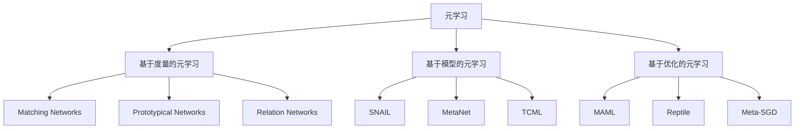

# AI人工智能核心算法原理与代码实例讲解：元学习

## 1. 背景介绍
### 1.1 人工智能的发展历程
#### 1.1.1 第一个AI冬天
#### 1.1.2 第二个AI冬天 
#### 1.1.3 深度学习的崛起
### 1.2 机器学习的局限性
#### 1.2.1 需要大量标注数据
#### 1.2.2 泛化能力差
#### 1.2.3 缺乏快速学习能力
### 1.3 元学习的提出
#### 1.3.1 学会如何学习
#### 1.3.2 通过少量样本快速学习
#### 1.3.3 提高模型泛化能力

## 2. 核心概念与联系
### 2.1 元学习的定义
#### 2.1.1 学习者与学习算法
#### 2.1.2 元知识与元模型
#### 2.1.3 快速适应新任务
### 2.2 元学习与迁移学习、终身学习的区别
#### 2.2.1 迁移学习
#### 2.2.2 终身学习
#### 2.2.3 元学习的独特之处
### 2.3 元学习的分类
#### 2.3.1 基于度量的元学习
#### 2.3.2 基于模型的元学习 
#### 2.3.3 基于优化的元学习

## 3. 核心算法原理具体操作步骤
### 3.1 MAML算法
#### 3.1.1 算法思想
#### 3.1.2 双层优化过程
#### 3.1.3 算法伪代码
### 3.2 Reptile算法
#### 3.2.1 算法原理
#### 3.2.2 与MAML的区别
#### 3.2.3 算法伪代码
### 3.3 ProtoNet算法
#### 3.3.1 原型网络思想
#### 3.3.2 支持集与查询集
#### 3.3.3 算法步骤

## 4. 数学模型和公式详细讲解举例说明
### 4.1 MAML的数学推导
#### 4.1.1 内循环与外循环
#### 4.1.2 梯度计算公式
#### 4.1.3 代码实现要点
### 4.2 ProtoNet的数学原理
#### 4.2.1 欧氏距离度量
#### 4.2.2 原型向量计算
#### 4.2.3 损失函数设计

## 5. 项目实践：代码实例和详细解释说明
### 5.1 基于MAML的Few-Shot图像分类
#### 5.1.1 Omniglot数据集介绍
#### 5.1.2 网络结构设计
#### 5.1.3 代码实现与运行结果
### 5.2 基于ProtoNet的Few-Shot语义分割
#### 5.2.1 PASCAL-5i数据集介绍
#### 5.2.2 骨干网络选择
#### 5.2.3 代码实现与可视化结果

## 6. 实际应用场景
### 6.1 医学影像分析
#### 6.1.1 小样本肿瘤检测
#### 6.1.2 器官组织分割
### 6.2 工业缺陷检测
#### 6.2.1 Few-Shot缺陷识别
#### 6.2.2 快速适应新的缺陷类型
### 6.3 机器人领域
#### 6.3.1 小样本物体抓取
#### 6.3.2 快速适应新环境
  
## 7. 工具和资源推荐
### 7.1 常用元学习库
#### 7.1.1 Torchmeta
#### 7.1.2 learn2learn
#### 7.1.3 higher
### 7.2 数据集资源
#### 7.2.1 Mini-Imagenet
#### 7.2.2 Omniglot
#### 7.2.3 PASCAL-5i
### 7.3 论文与教程
#### 7.3.1 MAML原始论文
#### 7.3.2 Reptile原始论文
#### 7.3.3 Prototypical Networks原始论文

## 8. 总结：未来发展趋势与挑战
### 8.1 元学习的研究热点
#### 8.1.1 无监督元学习
#### 8.1.2 多任务元学习
#### 8.1.3 元增强学习
### 8.2 元学习面临的挑战
#### 8.2.1 元训练的高计算开销
#### 8.2.2 任务分布差异大
#### 8.2.3 理论基础有待加强
### 8.3 元学习的发展前景
#### 8.3.1 自适应智能系统
#### 8.3.2 个性化推荐
#### 8.3.3 智能教育

## 9. 附录：常见问题与解答
### 9.1 元学习与AutoML的区别？
### 9.2 MAML算法容易陷入局部最优吗？ 
### 9.3 如何选择元学习算法和骨干网络？
### 9.4 元学习在NLP领域有哪些应用？
### 9.5 元学习是否有助于缓解数据隐私问题？

元学习作为机器学习领域的一个新兴分支,其核心思想是让机器具备"学会如何学习"的能力。通过元学习,模型可以在新任务上快速适应,大大提高了模型的泛化能力。本文深入探讨了元学习的核心概念、主流算法、数学原理以及代码实践。MAML作为一种简洁有效的元学习算法,通过双层优化实现了对初始化参数的快速适应。ProtoNet则利用了原型表示的思想,通过计算查询样本与各类原型之间的距离来进行分类。

元学习虽然取得了显著进展,但仍面临着计算开销大、任务差异大、理论基础薄弱等挑战。未来元学习将向无监督学习、多任务学习、元增强学习等方向拓展,有望在自适应系统、个性化服务、智能教育等领域大显身手。总之,元学习为人工智能的进一步发展开辟了一条充满想象力的道路。

作者：禅与计算机程序设计艺术 / Zen and the Art of Computer Programming