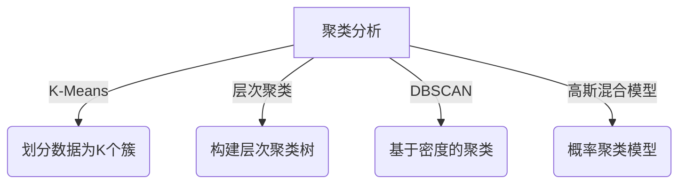
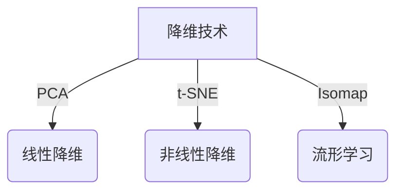
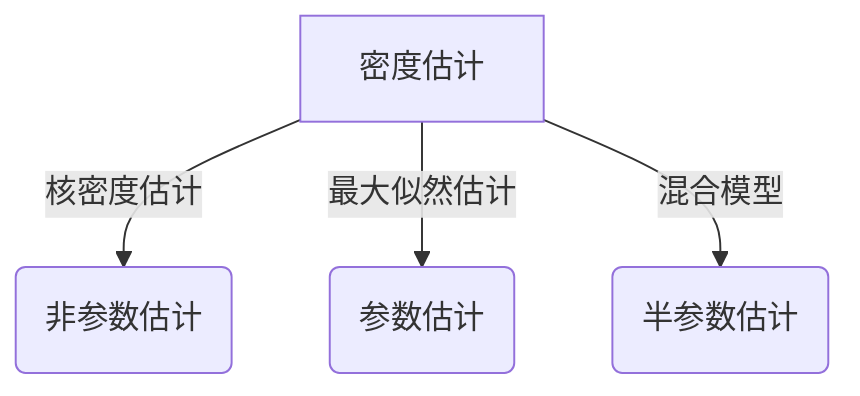
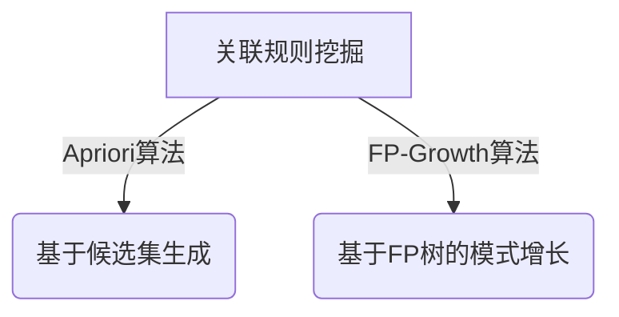

# AI人工智能核心算法原理与代码实例讲解：无监督学习

## 1.背景介绍

### 1.1 什么是无监督学习?

无监督学习是机器学习的一个重要分支,它旨在从未标记的数据中发现内在的模式和结构。与有监督学习不同,无监督学习没有预定义的目标变量,算法必须自主探索数据,识别其中的规律和关联。

无监督学习在许多领域都有广泛的应用,例如聚类分析、降维、异常检测和关联规则挖掘等。它可以帮助我们发现隐藏在海量数据中的有价值信息,揭示数据的本质特征和内在结构。

### 1.2 无监督学习的重要性

在当今大数据时代,数据的爆炸式增长使得人工标注和监督成为一项艰巨的任务。无监督学习提供了一种自动化的方式来探索和理解复杂的数据集,减轻了人工标注的负担。

此外,无监督学习还能够发现人类难以察觉的模式和关联,为数据驱动的决策提供新的见解和支持。它在许多领域都发挥着不可替代的作用,如图像分割、推荐系统、网络入侵检测等。

### 1.3 本文概述

本文将深入探讨无监督学习的核心算法原理,包括聚类分析、降维技术、密度估计和关联规则挖掘等。我们将详细介绍每种算法的理论基础、数学模型和具体实现步骤,并通过实际代码示例加深理解。同时,还将探讨无监督学习在不同应用场景中的实践,分享相关工具和资源,并展望未来的发展趋势和挑战。

## 2.核心概念与联系

无监督学习包含了多种核心算法和技术,它们之间存在着内在的联系和区别。本节将介绍无监督学习的主要概念,并阐述它们之间的关系。

### 2.1 聚类分析

聚类分析是无监督学习中最常见和最基础的任务之一。它旨在根据数据点之间的相似性,将它们划分为多个簇或组。常见的聚类算法包括K-Means、层次聚类、DBSCAN、高斯混合模型等。

### 2.2 降维技术

高维数据通常存在"维数灾难"问题,降维技术旨在将高维数据映射到低维空间,同时保留数据的主要特征和结构。常见的降维算法包括主成分分析(PCA)、t-分布随机邻域嵌入(t-SNE)、等向量嵌入(Isomap)等。

### 2.3 密度估计

密度估计旨在估计潜在的概率密度函数,从而捕捉数据的分布特征。常见的密度估计方法包括核密度估计、最大似然密度估计、混合模型等。密度估计在异常检测、聚类分析等领域有重要应用。

### 2.4 关联规则挖掘

关联规则挖掘旨在发现数据集中的有趣关联模式,常用于市场篮分析、网页挖掘等领域。著名的Apriori算法和FP-Growth算法是关联规则挖掘的经典算法。

上述概念之间存在着紧密的联系。例如,密度估计可以用于聚类分析;降维技术可以作为聚类和密度估计的预处理步骤;关联规则挖掘也可以看作是一种特殊的聚类问题。无监督学习算法通常需要综合运用多种技术,才能更好地解决实际问题。

## 3.核心算法原理具体操作步骤

本节将详细介绍无监督学习中几种核心算法的原理和具体操作步骤,包括K-Means聚类、主成分分析(PCA)、核密度估计和Apriori关联规则挖掘算法。

### 3.1 K-Means聚类

K-Means是一种经典的聚类算法,它将数据划分为K个簇,每个数据点属于离其最近的簇中心。算法的具体步骤如下:

1. 随机初始化K个簇中心
2. 对每个数据点,计算其与每个簇中心的距离,将其分配到最近的簇中
3. 更新每个簇的中心,使其成为该簇内所有数据点的均值
4. 重复步骤2和3,直到簇分配不再发生变化或达到最大迭代次数

K-Means算法的优点是简单高效,但也存在一些缺陷,如对初始中心点的敏感性、无法处理非凸形状的簇等。

### 3.2 主成分分析(PCA)

主成分分析(PCA)是一种常用的线性降维技术,它通过正交变换将原始数据投影到一个低维子空间,同时最大化投影后数据的方差。PCA的具体步骤如下:

1. 对原始数据进行中心化,将均值减去
2. 计算数据的协方差矩阵
3. 对协方差矩阵进行特征值分解,得到特征值和特征向量
4. 选取前K个最大的特征值对应的特征向量作为主成分
5. 将原始数据投影到由主成分构成的低维子空间中

PCA的优点是简单高效,能够捕捉数据的主要方向,但也存在一些局限性,如只能发现线性关系、对异常值敏感等。

### 3.3 核密度估计

核密度估计是一种非参数密度估计方法,它通过将核函数(如高斯核)放置在每个数据点上,然后对它们进行加权平均,从而估计出整个数据集的概率密度函数。具体步骤如下:

1. 选择合适的核函数K(x)和带宽参数h
2. 对每个数据点x_i,计算核函数的加权和:
   $$\hat{f}(x) = \frac{1}{nh}\sum_{i=1}^{n}K\left(\frac{x-x_i}{h}\right)$$
3. 对于新的数据点x,计算其密度估计值$\hat{f}(x)$

核密度估计的优点是无需假设数据分布的形式,能够捕捉复杂的多峰分布。但它也存在一些缺陷,如对带宽参数h敏感、计算复杂度较高等。

### 3.4 Apriori关联规则挖掘算法

Apriori算法是一种经典的关联规则挖掘算法,它通过迭代的方式发现频繁项集,并从中生成关联规则。算法的具体步骤如下:

1. 设置最小支持度阈值min_sup
2. 统计所有项集的支持度,找出所有频繁1-项集
3. 利用频繁k-项集生成候选(k+1)-项集
4. 计算候选(k+1)-项集的支持度,找出频繁(k+1)-项集
5. 重复步骤3和4,直到无法生成更大的频繁项集
6. 从频繁项集中生成关联规则,并计算其置信度

Apriori算法的优点是简单易懂,能够有效地发现频繁模式。但它也存在一些缺陷,如对稀疏数据集效率低下、需要多次扫描数据集等。

上述算法都是无监督学习中的经典算法,掌握它们的原理和实现步骤对于理解和应用无监督学习至关重要。

## 4.数学模型和公式详细讲解举例说明

无监督学习算法通常基于一些数学模型和公式,本节将详细讲解其中的几个核心公式,并给出具体的例子说明。

### 4.1 K-Means目标函数

K-Means算法的目标是最小化所有数据点到其所属簇中心的平方距离之和,即:

$$J = \sum_{i=1}^{n}\sum_{k=1}^{K}r_{ik}\left\|x_i-\mu_k\right\|^2$$

其中:
- $n$是数据点的个数
- $K$是簇的个数
- $r_{ik}$是指示变量,当数据点$x_i$属于簇$k$时取1,否则取0
- $\mu_k$是簇$k$的中心点

例如,假设有5个二维数据点$\{(1,1),(2,2),(3,3),(4,4),(5,5)\}$,我们将它们划分为2个簇,分别计算目标函数值:

- 簇1:$\{(1,1),(2,2)\}$,簇2:$\{(3,3),(4,4),(5,5)\}$
  $$J = \|(1,1)-(1.5,1.5)\|^2 + \|(2,2)-(1.5,1.5)\|^2 + \|(3,3)-(4,4)\|^2 + \|(4,4)-(4,4)\|^2 + \|(5,5)-(4,4)\|^2 = 1$$
- 簇1:$\{(1,1),(3,3)\}$,簇2:$\{(2,2),(4,4),(5,5)\}$
  $$J = \|(1,1)-(2,2)\|^2 + \|(3,3)-(2,2)\|^2 + \|(2,2)-(3.5,3.5)\|^2 + \|(4,4)-(3.5,3.5)\|^2 + \|(5,5)-(3.5,3.5)\|^2 = 5$$

可以看出,第一种划分方式的目标函数值更小,因此是更优的聚类结果。

### 4.2 主成分分析(PCA)

在PCA中,我们希望找到一组正交基向量$\{v_1,v_2,...,v_d\}$,使得原始数据在这组基向量上的投影方差最大。具体来说,我们需要最大化:

$$\sum_{i=1}^{d}\text{Var}(X^Tv_i)$$

其中$X$是原始数据矩阵,$v_i$是第$i$个基向量。

通过特征值分解,我们可以得到协方差矩阵$\Sigma$的特征值$\lambda_1 \geq \lambda_2 \geq ... \geq \lambda_d$和对应的特征向量$v_1,v_2,...,v_d$。则前$k$个主成分可以表示为:

$$Z_k = X^TV_k$$

其中$V_k$是由前$k$个特征向量构成的矩阵。

例如,假设我们有一个3维数据集,其协方差矩阵的特征值和特征向量分别为:

- $\lambda_1 = 2, v_1 = (0.6,0.6,0.5)$
- $\lambda_2 = 1, v_2 = (-0.5,0.5,0.7)$
- $\lambda_3 = 0.5, v_3 = (0.6,-0.6,0.5)$

则保留前2个主成分,我们可以将原始数据投影到由$v_1$和$v_2$构成的2维子空间中,同时保留了大部分的方差信息。

### 4.3 核密度估计

在核密度估计中,我们使用核函数$K(x)$来估计数据的概率密度函数$f(x)$,具体公式为:

$$\hat{f}(x) = \frac{1}{nh}\sum_{i=1}^{n}K\left(\frac{x-x_i}{h}\right)$$

其中:
- $n$是数据点的个数
- $h$是带宽参数,控制核函数的平滑程度
- $K(x)$是核函数,常用的有高斯核、Epanechnikov核等

例如,假设我们使用高斯核$K(x) = \frac{1}{\sqrt{2\pi}}e^{-\frac{x^2}{2}}$,对于一维数据集$\{1,2,3,4,5\}$,带宽$h=1$,