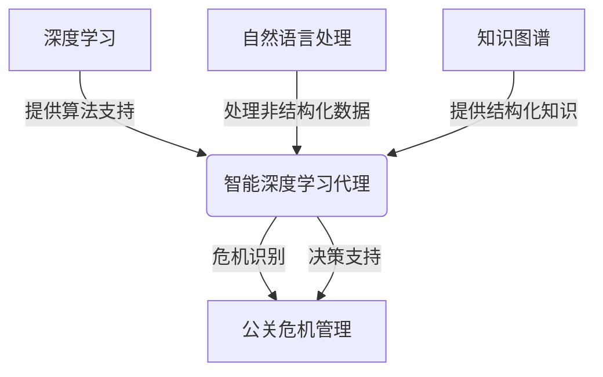

# AI人工智能深度学习算法：智能深度学习代理在公关危机管理中的应用

## 1.背景介绍

### 1.1 公关危机的重要性

在当今快节奏的商业环境中,公司和品牌面临着各种各样的风险和危机。一场突如其来的公关危机可能会给企业带来巨大的经济损失,严重损害品牌形象和声誉。有效管理公关危机对于保护企业利益至关重要。

### 1.2 传统公关危机管理的挑战

传统的公关危机管理方法主要依赖于人工分析和判断,这种方式存在一些固有缺陷:

- 反应速度慢
- 决策缺乏客观性
- 分析能力有限

### 1.3 人工智能在公关危机管理中的应用前景

随着人工智能技术的不断发展,智能深度学习代理为公关危机管理带来了新的解决方案。智能代理可以实时监控各种数据源,快速识别潜在危机,并提供智能化的危机应对建议。

## 2.核心概念与联系

### 2.1 深度学习

深度学习是机器学习的一个新兴热点领域,其灵感来源于人类大脑的结构和功能。深度学习算法通过构建多层神经网络,从原始数据中自动学习特征表示,并对复杂模式进行建模。

### 2.2 智能代理

智能代理是一种自主系统,能够感知环境,并根据预定目标做出理性决策。在公关危机管理中,智能代理可以扮演虚拟助手的角色,协助人工专家完成各种任务。

### 2.3 自然语言处理(NLP)

自然语言处理技术使计算机能够理解和生成人类语言。在公关危机管理中,NLP可用于分析社交媒体数据、新闻报道等非结构化文本,识别危机信号。

### 2.4 知识图谱

知识图谱是一种结构化的知识库,用于表示实体之间的关系。在公关危机管理中,知识图谱可用于建立企业、品牌、危机事件之间的关联,支持智能推理。

### 2.5 Mermaid流程图



## 3.核心算法原理具体操作步骤  

### 3.1 数据采集

智能代理需要从多个渠道收集相关数据,包括:

- 社交媒体数据(微博、贴吧等)
- 新闻媒体数据
- 搜索引擎数据
- 企业内部数据(投诉、销量等)

### 3.2 数据预处理

原始数据通常是非结构化的,需要进行预处理以提高后续处理的效率:

- 去除无用数据(广告、垃圾信息等)
- 分词、词性标注
- 构建语料库

### 3.3 特征提取

从预处理后的数据中提取有用的特征,作为后续模型的输入:

- 统计特征(词频、情感极性等)
- 主题模型(LDA等)提取的主题分布
- 知识图谱特征(实体、关系等)

### 3.4 危机识别模型

基于特征输入,训练深度神经网络对危机事件进行分类:

- 卷积神经网络(TextCNN)
- 循环神经网络(LSTM等)
- 注意力机制
- 迁移学习(BERT等)

### 3.5 危机分级

根据危机事件的影响程度,对其进行分级,以采取相应的应对措施:

- 影响范围(地区、人群等)
- 影响持续时间
- 对品牌声誉的损害程度

### 3.6 决策支持

智能代理根据危机级别、事件特征等,为公关专家提供智能化的应对建议:

- 发布声明
- 道歉补偿
- 舆论引导
- 危机公关策略

### 3.7 反馈优化

持续收集危机处理的效果反馈,并优化模型参数,使决策支持更加精准:

- 在线学习
- 强化学习
- 多任务学习

## 4.数学模型和公式详细讲解举例说明

### 4.1 TextCNN模型

TextCNN是一种用于文本分类的卷积神经网络模型,可用于危机识别任务。

#### 4.1.1 模型结构

TextCNN的输入是一个文本序列,经过词嵌入层转换为词向量矩阵。卷积层对矩阵进行卷积操作,提取不同尺度的局部特征。最大池化层对卷积特征进行下采样,获得更高层次的特征表示。全连接层对特征进行加权求和,得到文本的分类概率输出。

$$
X_{i:i+j} = x_{i} \oplus x_{i+1} \oplus ... \oplus x_{i+j-1}\\
c_i = f(w \cdot X_{i:i+j} + b)\\
\hat{y} = \text{softmax}(W^Tc + b)
$$

其中 $X$ 为词向量矩阵, $c_i$ 为卷积特征, $w$ 为卷积核权重, $\hat{y}$ 为分类概率输出。

#### 4.1.2 实例说明

假设输入文本为"品牌新产品出现严重质量问题,引发消费者强烈不满"。TextCNN可以从中自动学习到"质量问题"、"消费者不满"等危机相关的特征模式,并将其正确分类为危机事件。

### 4.2 注意力机制

注意力机制是一种赋予神经网络"注意力"能力的技术,可用于突出输入数据中的关键部分。

#### 4.2.1 注意力计算

令输入序列为 $\boldsymbol{x} = (x_1, x_2, ..., x_n)$, 隐层状态为 $\boldsymbol{h} = (h_1, h_2, ..., h_n)$。注意力权重 $\alpha_i$ 反映了 $h_i$ 对当前任务的重要程度:

$$
\alpha_i = \dfrac{\exp(e_i)}{\sum_{j=1}^n \exp(e_j)}\\
e_i = \text{score}(h_i, x)
$$

其中 $\text{score}$ 是一个评分函数,可以是加权求和、点乘等操作。加权求和输出为:

$$
c = \sum_{i=1}^n \alpha_i h_i
$$

#### 4.2.2 实例说明

假设输入文本为"品牌最新手机发布会上,现场突然停电,引发了网友热议"。注意力机制可以自动分配更高的权重给"停电"、"网友热议"等关键词,从而提高危机识别的准确性。

### 4.3 BERT模型

BERT是一种基于Transformer的预训练语言模型,可用于各种自然语言处理任务。

#### 4.3.1 模型原理 

BERT的核心思想是利用大规模无监督语料,对模型进行双向预训练,学习通用的语义表示能力。预训练任务包括遮蔽语言模型和下一句预测。在下游任务上,BERT通过微调的方式,将预训练知识迁移到目标任务。

$$
\begin{aligned}
\boldsymbol{z}_0 &=\boldsymbol{x} \\
\boldsymbol{z}_l &=\operatorname{Transformer}_{l}\left(\boldsymbol{z}_{l-1}\right), \quad l=1, \ldots, L \\
\boldsymbol{p} &=\operatorname{Dense}\left(\boldsymbol{z}_{L}\right)
\end{aligned}
$$

其中 $\boldsymbol{x}$ 为输入序列, $\boldsymbol{z}_l$ 为第 $l$ 层的隐层表示, $\boldsymbol{p}$ 为输出概率。

#### 4.3.2 实例说明

假设输入文本为"某品牌化妆品被曝含有有害物质,多名消费者出现不适症状"。BERT可以基于大规模语料学习到"有害物质"、"不适症状"等与危机相关的语义知识,从而正确识别该事件为危机。

## 5.项目实践:代码实例和详细解释说明

本节将提供一个基于PyTorch实现的TextCNN模型代码示例,用于危机识别任务。

### 5.1 数据准备

我们使用一个包含正负样本的公关危机数据集,其中每个样本是一段文本及其标签(0为非危机,1为危机)。

```python
import torch
from torchtext.legacy import data

# 构建文本字段
TEXT = data.Field(sequential=True, tokenize_fn=lambda x: x.split(), lower=True, batch_first=True)
LABEL = data.Field(sequential=False, use_vocab=False, is_target=True)

# 构建数据集
train_data, valid_data, test_data = data.TabularDataset.splits(
    path='data', train='train.csv', validation='valid.csv', test='test.csv', format='csv',
    fields={'text': ('text', TEXT), 'label': ('label', LABEL)}, skip_header=True
)

# 构建词表
TEXT.build_vocab(train_data, vectors="glove.6B.100d")

# 构建迭代器
BATCH_SIZE = 64
train_iter = data.BucketIterator(train_data, batch_size=BATCH_SIZE, shuffle=True)
valid_iter = data.BucketIterator(valid_data, batch_size=BATCH_SIZE, shuffle=False)
test_iter = data.BucketIterator(test_data, batch_size=BATCH_SIZE, shuffle=False)
```

### 5.2 TextCNN模型

```python
import torch.nn as nn
import torch.nn.functional as F

class TextCNN(nn.Module):
    def __init__(self, vocab_size, embed_dim, n_filters, filter_sizes, output_dim, 
                 dropout, pad_idx):
        
        super().__init__()
        self.embedding = nn.Embedding(vocab_size, embed_dim, padding_idx=pad_idx)
        
        self.convs = nn.ModuleList([
                      nn.Conv2d(in_channels=1, 
                                out_channels=n_filters,
                                kernel_size=(fs, embed_dim)) 
                      for fs in filter_sizes
                    ])
        
        self.fc = nn.Linear(len(filter_sizes) * n_filters, output_dim)
        self.dropout = nn.Dropout(dropout)
        
    def forward(self, text):

        #text = [batch size, sent len]
        embedded = self.embedding(text)
        
        #embedded = [batch size, sent len, emb dim]
        embedded = embedded.unsqueeze(1)
        
        #embedded = [batch size, 1, sent len, emb dim]
        conved = [F.relu(conv(embedded)).squeeze(3) for conv in self.convs]
            
        #conved_n = [batch size, n_filters, sent len - filter_sizes[n] + 1]
        pooled = [F.max_pool1d(conv, conv.shape[2]).squeeze(2) for conv in conved]
        
        #pooled_n = [batch size, n_filters]
        cat = self.dropout(torch.cat(pooled, dim=1))

        #cat = [batch size, n_filters * len(filter_sizes)]
            
        return self.fc(cat)
```

### 5.3 训练和评估

```python
import torch.optim as optim

# 超参数
OUTPUT_DIM = 1
DROPOUT = 0.5
N_FILTERS = 100
FILTER_SIZES = [2,3,4]
LR = 1e-3
EPOCHS = 10

# 模型实例化
model = TextCNN(len(TEXT.vocab), TEXT.vocab.vectors.shape[1], N_FILTERS, FILTER_SIZES, 
                OUTPUT_DIM, DROPOUT, TEXT.vocab.stoi[TEXT.pad_token])

# 损失函数和优化器
criterion = nn.BCEWithLogitsLoss()
optimizer = optim.Adam(model.parameters(), lr=LR)

# 训练
model = model.to(device)
criterion = criterion.to(device)

for epoch in range(EPOCHS):
    train_loss = 0
    train_acc = 0
    valid_loss = 0 
    valid_acc = 0
    
    # 训练
    model.train()
    for batch in train_iter:
        ...
        
    # 验证
    model.eval()
    for batch in valid_iter:
        ...
        
print(f'Epoch: {epoch+1:02}')
print(f'\tTrain Loss: {train_loss / len(train_iter):.3f} | Train Acc: {train_acc/len(train_iter)*100:.2f}%')
print(f'\t Val. Loss: {valid_loss / len(valid_iter):.3f} |  Val. Acc: {valid_acc/len(valid_iter)*100:.2f}%')
```

通过上述代码示例,我们实现了一个TextCNN模型,并在公关危机数据集上进行了训练和评估。在实际应用中,可以根据需求对