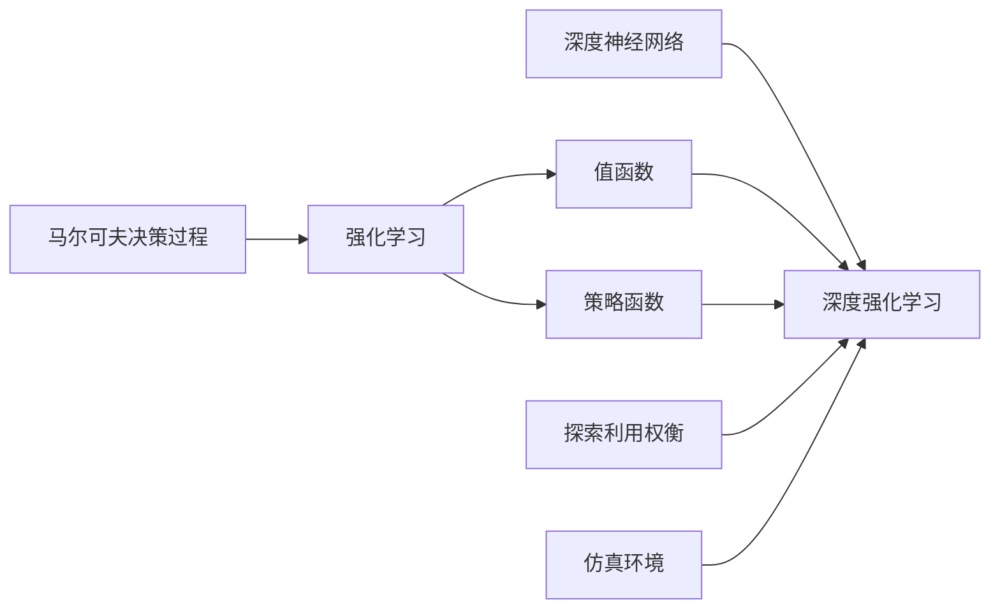

# AI人工智能深度学习算法：智能深度学习代理的仿真环境下的实验与评估

## 1.背景介绍
### 1.1 人工智能与深度学习的发展历程
人工智能(Artificial Intelligence, AI)自1956年达特茅斯会议提出以来，经历了从早期的符号主义到连接主义再到深度学习的发展历程。其中，深度学习(Deep Learning, DL)作为当前人工智能领域最为活跃和成功的分支，在计算机视觉、自然语言处理、语音识别等诸多领域取得了突破性进展，成为推动人工智能快速发展的主要驱动力。

### 1.2 深度强化学习在AI领域的地位
深度强化学习(Deep Reinforcement Learning, DRL)作为深度学习与强化学习(Reinforcement Learning, RL)的结合，为解决复杂的决策控制问题提供了新的思路和方法。DRL代理(Agent)通过与环境的交互，在试错中学习，并根据反馈的奖励信号不断优化策略，最终实现目标。这种端到端的学习范式使得DRL在自动驾驶、机器人控制、游戏AI等领域展现出巨大的应用前景。

### 1.3 仿真环境在DRL研究中的重要性
然而，DRL算法在实际应用中仍面临诸多挑战，如样本效率低、泛化能力差、探索困难等。为了更好地研究DRL算法的特性和局限性，学术界和工业界广泛采用各类仿真环境(Simulated Environments)进行实验。这些仿真环境不仅提供了可控、低成本、安全的训练平台，而且可以加速算法迭代和创新。因此，仿真环境已成为DRL研究不可或缺的重要工具。

### 1.4 本文的研究目标和贡献
本文旨在系统性地介绍和评估当前主流的DRL算法在典型仿真环境中的表现，分析其优缺点，并探讨未来的研究方向。我们选取了Deep Q-Network(DQN)、Proximal Policy Optimization(PPO)等代表性算法，在Atari、MuJoCo等标准测试环境中进行了大量实验。通过定量和定性分析，我们总结了不同算法的特点，为研究者和从业者选择和改进DRL算法提供参考。同时，我们还讨论了仿真环境的局限性以及如何缩小仿真现实差距(Sim-to-Real Gap)等问题。

## 2.核心概念与联系
### 2.1 马尔可夫决策过程
马尔可夫决策过程(Markov Decision Process, MDP)是描述智能体与环境交互的数学框架。MDP由状态空间$\mathcal{S}$、动作空间$\mathcal{A}$、状态转移概率$\mathcal{P}$、奖励函数$\mathcal{R}$和折扣因子$\gamma$组成。在每个时刻$t$，智能体根据当前状态$s_t \in \mathcal{S}$采取动作$a_t \in \mathcal{A}$，环境根据$\mathcal{P}$转移到下一个状态$s_{t+1}$并给出奖励$r_t$。智能体的目标是最大化累积奖励$\sum_{t=0}^{\infty} \gamma^t r_t$。

### 2.2 值函数与策略函数
值函数(Value Function)和策略函数(Policy Function)是强化学习的两个核心概念。值函数$V^\pi(s)$表示从状态$s$开始，遵循策略$\pi$能获得的期望累积奖励。而策略函数$\pi(a|s)$则定义了在状态$s$下选择动作$a$的概率。RL的目标就是找到最优策略$\pi^*$使得值函数最大化。

### 2.3 深度神经网络在DRL中的应用
传统RL在状态空间和动作空间较大时难以处理。深度神经网络(Deep Neural Networks, DNNs)具有强大的表示学习能力，可以从原始高维输入中提取有效特征。将DNN与RL结合，就形成了DRL。DQN使用DNN拟合值函数，而PPO等策略梯度算法则用DNN参数化策略函数。DNN使得DRL能够直接处理图像、文本等复杂输入，极大拓展了RL的应用范围。

### 2.4 探索与利用的权衡
探索与利用(Exploration vs. Exploitation)是RL面临的核心矛盾。探索是指尝试新的动作以发现潜在的高回报，而利用则是执行当前已知的最优动作以获取稳定收益。过度探索会降低学习效率，而过度利用则可能陷入局部最优。$\epsilon$-贪婪($\epsilon$-greedy)和上置信区间(Upper Confidence Bound, UCB)是常用的平衡探索利用的策略。

### 2.5 仿真环境的构成要素
仿真环境通常由以下几个部分构成：

1. 状态空间：描述智能体所处的环境状态，可以是离散的（如国际象棋棋盘）或连续的（如机器人关节角度）。 
2. 动作空间：定义了智能体可采取的动作集合，同样可分为离散和连续两种。
3. 环境动力学：刻画了在给定状态下执行某个动作后，环境如何转移到下一个状态。
4. 奖励函数：根据智能体的行为给出即时奖励值，引导智能体学习。
5. 观测空间：智能体无法直接获取环境的完整状态，只能通过观测（如相机图像）来感知外界。
6. 终止条件：判断一个Episode何时结束（如达到目标或步数限制）。

一个理想的仿真环境应尽可能模拟真实世界的物理规律和交互逻辑，为智能体提供逼真的训练场景，同时还要便于定制和加速仿真过程。OpenAI Gym、DeepMind Lab、Unity ML-Agents等就是广泛使用的仿真环境库。

### 2.6 核心概念之间的联系
下图展示了上述核心概念之间的逻辑联系。MDP为RL提供了理论基础，值函数和策略函数是RL的两大核心要素。DNN赋予RL强大的表示能力，形成了DRL范式。探索利用平衡是RL算法设计的关键考量。仿真环境则是RL特别是DRL的重要研究平台，为算法测试和优化提供了高效便捷的手段。这些概念共同构成了当代DRL研究的基本框架。

## 3.核心算法原理具体操作步骤
本节我们将重点介绍两种主流的DRL算法：DQN和PPO，分析其原理和实现步骤。

### 3.1 Deep Q-Network (DQN)
DQN是将Q学习与深度学习结合的经典算法，由DeepMind在2015年提出。它使用DNN来逼近最优Q函数，实现了端到端的从图像到动作的直接映射。

#### 3.1.1 Q学习基础
Q学习是一种值函数型的RL算法，其核心是Q函数（又称动作-值函数）：

$$Q^\pi(s,a) = \mathbb{E}^\pi \left[ \sum_{k=0}^{\infty} \gamma^k r_{t+k} | s_t=s, a_t=a \right]$$

$Q^\pi(s,a)$表示在状态$s$下选择动作$a$，并在之后都遵循策略$\pi$所能获得的期望累积奖励。最优Q函数$Q^*(s,a)$满足贝尔曼最优方程：

$$Q^*(s,a) = \mathbb{E} \left[ r_t + \gamma \max_{a'} Q^*(s_{t+1},a') | s_t=s, a_t=a \right]$$

Q学习的目标就是通过不断的探索环境来更新Q函数，最终收敛到$Q^*$。

#### 3.1.2 DQN算法流程
1. 初始化Q网络$Q(s,a;\theta)$和目标网络$\hat{Q}(s,a;\theta^-)$，其中$\theta$和$\theta^-$为网络权重；
2. 初始化经验回放池$\mathcal{D}$；
3. for episode = 1 to M do
   1. 初始化初始状态$s_0$；
   2. for t = 1 to T do
      1. 根据$\epsilon$-贪婪策略选择动作$a_t$：以$\epsilon$的概率随机选择动作，否则选择$a_t=\arg\max_a Q(s_t,a;\theta)$；
      2. 执行动作$a_t$，观察奖励$r_t$和下一状态$s_{t+1}$；
      3. 将转移样本$(s_t,a_t,r_t,s_{t+1})$存入$\mathcal{D}$；
      4. 从$\mathcal{D}$中随机采样一个批次的转移样本$(s,a,r,s')$；
      5. 计算Q学习目标$y=r+\gamma \max_{a'} \hat{Q}(s',a';\theta^-)$；
      6. 最小化损失函数$L(\theta)=\mathbb{E}_{(s,a,r,s')\sim\mathcal{D}} [(y-Q(s,a;\theta))^2]$，更新$\theta$；
      7. 每隔C步将$\theta^-$更新为$\theta$；
   3. end for
4. end for

其中，经验回放和目标网络是DQN的两大关键技术。前者通过缓存并随机采样历史转移数据来打破数据的相关性，而后者通过缓慢更新目标Q值来提高学习稳定性。

### 3.2 Proximal Policy Optimization (PPO)
PPO是一种基于信任域的策略梯度算法，由OpenAI在2017年提出。相比DQN等值函数方法，PPO直接优化策略函数，具有更好的收敛性和稳定性。

#### 3.2.1 策略梯度定理
策略梯度定理给出了期望累积奖励$J(\theta)$对策略网络参数$\theta$的梯度：

$$\nabla_\theta J(\theta) = \mathbb{E}_{\tau\sim\pi_\theta} \left[ \sum_{t=0}^T \nabla_\theta \log \pi_\theta(a_t|s_t) A^{\pi_\theta}(s_t,a_t) \right]$$

其中，$\tau$表示一条轨迹$(s_0,a_0,r_0,s_1,a_1,r_1,...)$，$A^{\pi_\theta}(s_t,a_t)$为优势函数，度量了在$s_t$采取$a_t$相比平均表现的优劣程度。

#### 3.2.2 PPO算法流程
1. 初始化策略网络$\pi_\theta(a|s)$和值函数网络$V_\phi(s)$；
2. for iteration = 1 to N do
   1. 与环境交互收集一批轨迹数据$\mathcal{D}=\{\tau_i\}$；
   2. 计算优势函数$\hat{A}_t=\sum_{t'=t}^{T-1} (\gamma\lambda)^{t'-t} \delta_{t'}$，其中$\delta_t=r_t+\gamma V_\phi(s_{t+1})-V_\phi(s_t)$；
   3. 计算重要性采样权重$\rho_t(\theta)=\frac{\pi_\theta(a_t|s_t)}{\pi_{\theta_{old}}(a_t|s_t)}$；
   4. 最大化PPO-Clip目标函数：
   
   $$J^{CLIP}(\theta) = \mathbb{E}_{(s_t,a_t)\sim\mathcal{D}} \left[ \min(\rho_t(\theta)\hat{A}_t, \text{clip}(\rho_t(\theta), 1-\epsilon, 1+\epsilon)\hat{A}_t ) \right]$$
   
   5. 最小化值函数损失$L^{VF}(\phi)=\mathbb{E}_{s_t\sim\mathcal{D}} \left[ (V_\phi(s_t)-V_t^{targ})^2 \right]$，其中$V_t^{targ}=\sum_{t'=t}^{T-1} \gamma^{t'-t}r_{t'}$；
3. end for

PPO引入了重要性采样和裁剪技巧，在保证单调性的同时控制策略更新幅度，有效提升了训练的样本效率和优化稳定性。此外，PPO还支持并行采样和GPU加速