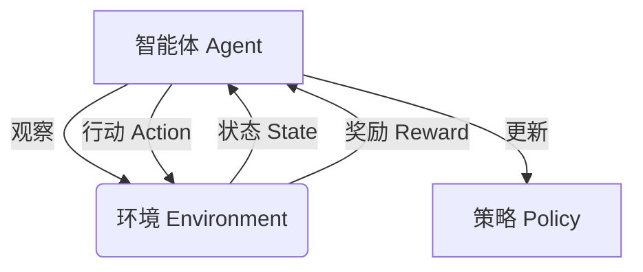

# AI人工智能深度学习算法：智能深度学习代理的使用强化学习优化决策

## 1.背景介绍

在当今科技飞速发展的时代,人工智能(AI)已经渗透到我们生活的方方面面。随着大数据和计算能力的不断提升,深度学习作为人工智能的核心技术之一,展现出了令人惊叹的能力。然而,传统的深度学习模型通常是在监督学习的范式下训练的,需要大量标注好的数据,并且缺乏灵活性和适应性。

为了解决这些挑战,强化学习(Reinforcement Learning)应运而生。强化学习是一种基于奖励或惩罚的学习方式,旨在训练一个智能体(Agent)通过与环境交互来学习如何采取最优行为策略,从而最大化其累积奖励。通过结合深度学习的强大表示能力,强化学习可以在复杂的环境中学习出高效的决策策略,从而实现智能化决策。

本文将探讨如何将强化学习与深度学习相结合,构建智能深度学习代理,并应用于各种决策优化问题中。我们将深入探讨其核心概念、算法原理、数学模型,并通过实际案例和代码示例,帮助读者全面理解和掌握这一前沿技术。

## 2.核心概念与联系

在深入探讨强化学习优化决策之前,我们需要先了解几个核心概念:

### 2.1 智能体(Agent)

智能体是指在特定环境中采取行动并获得奖励或惩罚的决策实体。它通过观察当前环境状态,选择一个行动,并根据该行动产生的结果更新其策略。

### 2.2 环境(Environment)

环境是指智能体所处的外部世界,它描述了当前的状态,并根据智能体的行动产生新的状态和相应的奖励或惩罚。环境可以是一个简单的游戏,也可以是一个复杂的实际问题,如机器人控制或资源调度。

### 2.3 状态(State)

状态是指环境在特定时刻的snapshot,它包含了足够的信息来描述当前情况,并为智能体提供决策依据。

### 2.4 行动(Action)

行动是指智能体在当前状态下可以采取的操作,它会导致环境状态的转移,并产生相应的奖励或惩罚。

### 2.5 奖励(Reward)

奖励是指智能体采取行动后获得的正向或负向反馈,它是强化学习算法的核心驱动力。目标是最大化累积奖励,从而学习到最优策略。

### 2.6 策略(Policy)

策略是指智能体在给定状态下选择行动的规则或函数映射。强化学习的目标就是通过与环境交互来学习一个最优策略,以最大化累积奖励。

这些概念相互关联,构成了强化学习的基本框架。智能体与环境进行交互,根据当前状态选择行动,环境则根据这个行动产生新的状态和相应的奖励,智能体再根据这个反馈来更新其策略,如此循环往复,直到学习到一个最优策略。

通过将深度学习技术引入到这个框架中,我们可以构建出更加强大和灵活的智能深度学习代理,来解决复杂的决策优化问题。

## 3.核心算法原理具体操作步骤 

强化学习算法的核心思想是通过与环境的交互,不断试错并根据获得的奖励来调整策略,最终达到最优化目标。其中,有几种经典的强化学习算法值得重点关注:

### 3.1 Q-Learning

Q-Learning是一种基于价值函数的无模型强化学习算法,它试图直接估计在给定状态采取某个行动后,可以获得的最大期望累积奖励(即Q值)。算法的具体步骤如下:

1. 初始化Q表格,所有状态-行动对的Q值设置为任意值(通常为0)
2. 对于每个episode:
    - 初始化当前状态s
    - 对于每个时间步:
        - 根据当前Q值,选择一个行动a (可使用ε-贪婪策略)
        - 执行行动a,观察奖励r和下一状态s'
        - 更新Q(s,a)值:
            $$Q(s,a) \leftarrow Q(s,a) + \alpha[r + \gamma\max_{a'}Q(s',a') - Q(s,a)]$$
            其中,α是学习率,γ是折现因子
        - 将s'设为当前状态s
    - 直到达到终止状态

通过不断更新Q值,算法最终会收敛到最优Q函数,从而可以推导出最优策略。

### 3.2 Sarsa

Sarsa算法与Q-Learning类似,但它直接估计在给定状态采取某个行动后,按照当前策略继续执行可获得的期望累积奖励。算法步骤如下:

1. 初始化Q表格和策略π
2. 对于每个episode:
    - 初始化当前状态s,选择行动a根据π(s)
    - 对于每个时间步:
        - 执行行动a,观察奖励r和下一状态s' 
        - 选择下一行动a'根据π(s')
        - 更新Q(s,a)值:
            $$Q(s,a) \leftarrow Q(s,a) + \alpha[r + \gamma Q(s',a') - Q(s,a)]$$
        - 将s'设为当前状态s, a'设为当前行动a
    - 直到达到终止状态

Sarsa算法在更新Q值时,使用了实际执行的下一状态-行动对,而不是最大Q值。这使得它更加贴近实际策略,但也可能导致收敛性能略差于Q-Learning。

### 3.3 Deep Q-Network (DQN)

传统的Q-Learning和Sarsa算法在处理大规模复杂问题时,由于需要维护一个巨大的Q表格,会遇到维数灾难的问题。Deep Q-Network (DQN)通过将深度神经网络引入到Q函数的估计中,成功解决了这一难题。

DQN算法的核心思想是使用一个深度卷积神经网络来拟合Q函数,其输入是当前状态,输出是所有可能行动的Q值。在训练过程中,我们根据贝尔曼方程更新Q网络的参数,使其Q值预测逐渐接近真实的Q值。算法步骤如下:

1. 初始化Q网络和目标Q网络,两个网络参数相同
2. 初始化经验回放池D
3. 对于每个episode:
    - 初始化当前状态s
    - 对于每个时间步:
        - 根据当前Q网络,选择一个行动a (可使用ε-贪婪策略)
        - 执行行动a,观察奖励r和下一状态s'
        - 将转换(s,a,r,s')存入经验回放池D
        - 从D中随机采样一个批次的转换(s,a,r,s')
        - 计算目标Q值:
            $$y = r + \gamma \max_{a'}Q'(s',a')$$
            其中Q'是目标Q网络
        - 优化Q网络参数,使Q(s,a)接近y
        - 每隔一定步骤,将Q网络参数复制到目标Q网络
    - 直到达到终止状态

DQN算法通过引入经验回放池和目标Q网络的技巧,大大提高了训练的稳定性和效率。它可以成功应用于复杂的视频游戏等领域,取得了非常优秀的表现。

### 3.4 Policy Gradient

除了基于价值函数的算法外,另一类强化学习算法是基于策略梯度(Policy Gradient)的算法。这类算法直接对策略π进行参数化,并通过梯度上升的方式来最大化期望累积奖励。

Policy Gradient算法的核心思想是:

$$\nabla_\theta J(\theta) = \mathbb{E}_\pi \left[\sum_{t=0}^\infty \gamma^t \nabla_\theta \log \pi_\theta(a_t|s_t)Q^{\pi_\theta}(s_t,a_t)\right]$$

其中,θ是策略π的参数,J(θ)是期望累积奖励,Q是在策略π下的行动价值函数。算法步骤如下:

1. 初始化策略π的参数θ
2. 对于每个episode:
    - 根据当前策略π与环境交互,生成一个episode的轨迹
    - 计算该episode的累积奖励R
    - 对于该episode中的每个时间步(s_t,a_t):
        - 计算∇θlogπθ(a_t|s_t)
        - 更新θ:
            $$\theta \leftarrow \theta + \alpha \gamma^t \nabla_\theta \log \pi_\theta(a_t|s_t)R$$

通过不断采样轨迹并根据累积奖励更新策略参数,Policy Gradient算法可以直接优化策略,而不需要估计价值函数。它在处理连续动作空间和非马尔可夫决策过程(POMDP)等复杂问题时表现出色。

### 3.5 Actor-Critic

Actor-Critic算法是一种同时结合了价值函数估计和策略梯度的方法。它将智能体分为两个部分:Actor决定采取何种行动,而Critic则评估这些行动的质量。

具体来说,Actor是一个策略函数π(a|s,θ),它根据当前状态s输出一个行动a的概率分布,并由参数θ参数化。Critic则是一个价值函数V(s,w),它试图估计在当前状态s下遵循策略π可获得的期望累积奖励,并由参数w参数化。

在训练过程中,Critic根据TD误差更新价值函数参数w,而Actor则根据Critic提供的价值估计,通过策略梯度的方式更新策略参数θ。算法步骤如下:

1. 初始化Actor策略π(a|s,θ)和Critic价值函数V(s,w)
2. 对于每个episode:
    - 根据当前策略π与环境交互,生成一个episode的轨迹
    - 对于该episode中的每个时间步(s_t,a_t,r_t,s_{t+1}):
        - 更新Critic价值函数参数w:
            $$w \leftarrow w + \alpha \left(r_t + \gamma V(s_{t+1},w) - V(s_t,w)\right)\nabla_w V(s_t,w)$$
        - 更新Actor策略参数θ:
            $$\theta \leftarrow \theta + \beta \nabla_\theta \log \pi_\theta(a_t|s_t)V(s_t,w)$$

Actor-Critic算法结合了价值函数估计和策略梯度的优点,通常可以取得比单一算法更好的性能和收敛速度。它在连续控制等领域有着广泛的应用。

以上介绍了几种核心的强化学习算法,每种算法都有其适用场景和特点。在实际应用中,我们还可以结合各种技巧和优化方法,如经验回放、目标网络、优先经验回放等,来进一步提高算法的性能和稳定性。

## 4.数学模型和公式详细讲解举例说明

在强化学习中,数学模型和公式扮演着至关重要的角色,它们为我们提供了理论基础和分析工具。下面我们将详细讲解几个核心的数学模型和公式。

### 4.1 马尔可夫决策过程 (Markov Decision Process, MDP)

马尔可夫决策过程是强化学习中最基本的数学框架。一个MDP可以用一个五元组(S,A,P,R,γ)来表示:

- S是一个有限的状态集合
- A是一个有限的行动集合
- P是状态转移概率,P(s'|s,a)表示在状态s执行行动a后,转移到状态s'的概率
- R是奖励函数,R(s,a)表示在状态s执行行动a后获得的即时奖励
- γ∈[0,1)是折现因子,用于权衡当前奖励和未来奖励的重要性

在MDP中,我们的目标是找到一个最优策略π*,使得在任意初始状态s0下,按照该策略执行可获得的期望累积奖励最大化:

$$\pi^* = \arg\max_\pi \mathbb{E}\left[\sum_{t=0}^\infty \gamma^t R(s_t,a_t