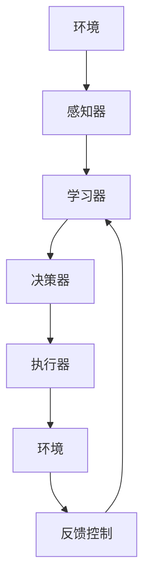
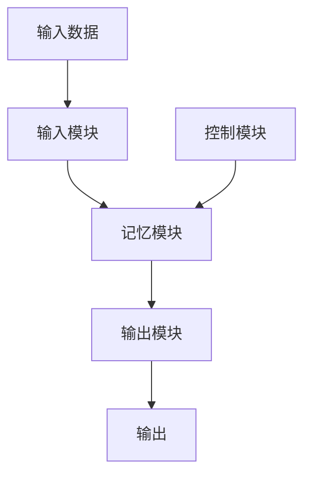

# AI人工智能深度学习算法：智能深度学习代理的工作流整合方法

## 1.背景介绍

### 1.1 人工智能发展历程

人工智能(Artificial Intelligence, AI)是当代科技发展的前沿领域,旨在创造出能够模拟人类智能的机器系统。自20世纪50年代AI概念被正式提出以来,经历了起起落落的发展历程。

- **第一次AI热潮(1956-1974年)**: 专家系统、逻辑推理等初步研究。
- **AI寒冬期(1974-1980年)**: 由于资金短缺和技术瓶颈,AI发展陷入低谷。 
- **第二次AI热潮(1980-1987年)**: 专家系统、知识库等应用推动AI发展。
- **第二次AI寒冬(1987-1993年)**: AI过于理想化,现实应用有限。
- **AI再次复苏(1993-至今)**: 机器学习、深度学习、大数据等新技术驱动AI蓬勃发展。

### 1.2 深度学习兴起

深度学习(Deep Learning)是机器学习的一种新技术,模拟人脑神经网络结构和信息传递规则,能从大量数据中自主学习特征模式,用于解决诸如计算机视觉、自然语言处理等复杂任务。

近年来,深度学习取得了突破性进展,在图像识别、语音识别、自然语言处理等领域表现优异,推动了AI技术的飞速发展。著名的深度学习模型有卷积神经网络(CNN)、循环神经网络(RNN)、生成对抗网络(GAN)等。

### 1.3 智能代理需求

随着AI技术不断发展,人们期望能创造出"通用人工智能"(Artificial General Intelligence, AGI),即能够像人类一样学习和思考的智能系统。AGI系统需要集成多种AI能力,如计算机视觉、自然语言理解、决策规划、知识推理等,并能自主完成复杂任务。

智能代理(Intelligent Agent)是实现AGI的一种方式,指能够感知环境、持续学习、制定计划并采取行动以达成目标的智能系统。构建高度智能化的代理需要整合多种深度学习算法,形成高效的工作流程,这是当前AI领域亟待解决的关键挑战。

## 2.核心概念与联系  

### 2.1 智能代理概念

智能代理是一种自主系统,能够感知外部环境、学习获取知识、制定行动计划并与环境进行交互,以完成特定目标。一个完整的智能代理系统通常包括以下几个核心组成部分:

- **感知器(Sensor)**: 获取环境信息的输入设备,如摄像头、麦克风等。
- **学习器(Learner)**: 对输入数据进行处理和模式识别,形成内部知识表征。
- **决策器(Decision Maker)**: 根据已学习的知识和目标,规划行动策略。  
- **执行器(Actuator)**: 执行决策器的指令,对外部环境产生影响或作用。
- **反馈控制(Feedback)**: 根据执行效果,对系统进行调整和优化。

智能代理需要具备持续学习的能力,不断从环境中获取信息,更新内部知识模型,优化决策流程,形成一个封闭的自我完善循环。

### 2.2 深度学习在智能代理中的作用

深度学习是赋予智能代理"学习"能力的关键技术,在代理系统的感知器和学习器部分发挥着核心作用:

- **计算机视觉**: 卷积神经网络(CNN)能从图像、视频数据中学习视觉特征。
- **自然语言处理**: 循环神经网络(RNN)、Transformer等能从文本数据中提取语义信息。
- **决策与控制**: 深度强化学习(Deep Reinforcement Learning)能从环境交互中学习最优决策策略。
- **知识推理**: 记忆增强神经网络(Memory Augmented Neural Network)能构建符号化知识库。

通过有机整合多种深度学习模型,智能代理可以获取多模态感知能力、形成知识表征、制定行为策略,最终实现高度智能化。

### 2.3 深度学习模型的异构整合挑战

不同深度学习模型在网络结构、训练算法、数据输入格式等方面存在差异,要将它们有机整合到统一的智能代理系统中,需要解决以下几个关键挑战:

1. **数据融合**: 如何将异构数据(图像、文本、语音等)高效融合,作为不同模型的输入?
2. **模型耦合**: 不同模型的输出如何相互关联和传递,形成统一的知识表征?
3. **控制策略**: 如何根据系统目标,协调各模型的工作流程,制定统一的决策和控制策略?
4. **系统优化**: 如何设计自适应的反馈控制机制,持续优化整个系统性能?

本文将重点探讨智能深度学习代理的工作流整合方法,介绍将异构深度学习模型融合到统一智能体系统中的技术路线和实现细节。

## 3.核心算法原理具体操作步骤

### 3.1 多模态数据融合

智能代理需要同时处理来自不同感知器的异构数据,如图像、文本、语音等。将这些多模态数据高效融合,是构建代理系统的首要环节。

常见的多模态数据融合方法有:

1. **特征级融合**:
    - 将不同模态数据输入对应的深度学习模型(如CNN、RNN等)提取特征向量
    - 将不同模态的特征向量拼接或加权求和,形成融合特征表示
    - 融合特征作为后续模型(如分类器、决策器等)的输入

2. **模态级融合**:
    - 不同模态数据输入对应的深度学习模型,分别生成每个模态的预测输出
    - 将不同模态的预测输出拼接或加权求和,形成融合预测输出
    - 融合输出作为整体系统的最终输出

3. **跨模态注意力机制**:
    - 使用自注意力机制捕获不同模态间的相关性
    - 根据注意力权重动态调节各模态特征在融合表示中的贡献
    - 融合表示作为后续模型的输入或直接作为系统输出

上述方法可根据具体任务场景和数据特点选择使用。跨模态注意力机制能充分利用模态间信息,融合效果较好,但计算代价较高。

### 3.2 模型耦合:知识蒸馏

不同深度学习模型的输出形式存在差异,需要将它们耦合成统一的知识表示形式,以支持后续的决策和控制流程。常用的模型耦合方法是知识蒸馏(Knowledge Distillation)。

知识蒸馏的基本思路是:

1. 训练一个复杂的"教师模型"(如深度神经网络)
2. 使用"教师模型"的输出(预测概率分布)作为"软目标",指导训练一个简单的"学生模型"
3. "学生模型"学习"教师模型"映射出的高层知识,形成"蒸馏知识"

具体操作步骤:

1. 对于每个训练样本,计算"教师模型"的输出概率分布$P_t$
2. 将$P_t$作为"软目标",最小化"学生模型"输出$P_s$与其的交叉熵损失:

$$
L_{KD}(x,P_t,P_s)=-\sum_{i=1}^{N}P_t(x)_i\log P_s(x)_i
$$

3. 同时最小化"学生模型"与"硬目标"(真实标签)的损失:

$$
L_{GT}(x,y,P_s)=-\log P_s(x)_y
$$

4. 两个损失的加权和作为"学生模型"的总损失:

$$
L_{total}=\alpha L_{KD}+(1-\alpha)L_{GT}
$$

通过知识蒸馏,可将复杂"教师模型"的知识迁移到简单"学生模型"中,形成统一的知识表示。"学生模型"的输出可作为后续决策和控制的依据。

### 3.3 基于强化学习的决策控制

智能代理需要根据已学习的知识,自主做出行为决策并与环境交互。强化学习(Reinforcement Learning)是一种有效的决策控制框架。

强化学习的基本原理为:

1. 智能代理作为"主体",与"环境"进行交互
2. 在每个时间步,主体根据当前"状态"做出"行动"
3. 环境根据行动转移到新状态,并给出对应的"奖励"
4. 主体的目标是通过不断尝试,学习一个从状态到行动的映射策略,最大化未来预期奖励

强化学习算法包括Q-Learning、Sarsa、策略梯度等,可用于训练智能代理的决策器模块。

深度强化学习(Deep Reinforcement Learning)将深度神经网络引入强化学习框架:

- 使用深度神经网络拟合状态到行动的映射策略
- 神经网络权重的更新过程等价于策略的优化过程
- 能够处理高维状态空间和连续行动空间

常见的深度强化学习算法有深度Q网络(DQN)、策略梯度等,可用于训练智能代理的决策控制系统。

### 3.4 基于记忆网络的知识推理

智能代理还需要具备构建符号化知识库、进行逻辑推理的能力。记忆增强神经网络(Memory Augmented Neural Network)是一种有效的知识推理模型。

记忆增强神经网络的基本架构包括:

- **输入模块**: 对输入数据(如文本)进行编码,形成记忆向量存入记忆库
- **记忆模块**: 类似计算机内存,用于存储和读写记忆向量
- **控制模块**: 根据当前任务,决定对记忆的读写操作
- **输出模块**: 根据记忆状态和控制信号,生成最终输出

记忆增强网络能够:

- 将输入知识编码为记忆向量,存储在"记忆模块"中
- 根据推理任务,从记忆中读取相关知识
- 通过注意力机制组合记忆,进行复杂的逻辑推理
- 生成最终的推理输出,如答案、决策等

将记忆增强网络与其他深度学习模型相结合,可赋予智能代理强大的知识推理能力。

## 4.数学模型和公式详细讲解举例说明

### 4.1 多模态融合:跨模态注意力机制

跨模态注意力机制能充分利用不同模态数据间的相关性,实现高效的多模态融合。其数学原理如下:

假设有$M$种模态数据$\{X_1, X_2, ..., X_M\}$,其对应的特征表示为$\{V_1, V_2, ..., V_M\}$。我们的目标是生成一个融合特征表示$V_{fuse}$。

1. 首先计算每个模态特征与其他模态特征的相关性得分:

$$
e_{ij} = f(V_i, V_j)
$$

其中$f$为相关性计算函数,如点积、双线性函数等。

2. 对相关性得分做softmax归一化,得到每个模态对其他模态的注意力权重:

$$
\alpha_{ij} = \frac{\exp(e_{ij})}{\sum_{k=1}^M \exp(e_{ik})}
$$

3. 将每个模态特征根据注意力权重进行加权求和,得到融合特征表示:

$$
V_{fuse} = \sum_{i=1}^M \alpha_i V_i, \quad \text{where} \quad \alpha_i = \sum_{j=1}^M \frac{\alpha_{ij}}{M}
$$

上式中,$\alpha_i$表示其他所有模态对第$i$个模态的平均注意力权重。

通过跨模态注意力机制,不同模态间的相关信息可以被充分利用,从而获得更加