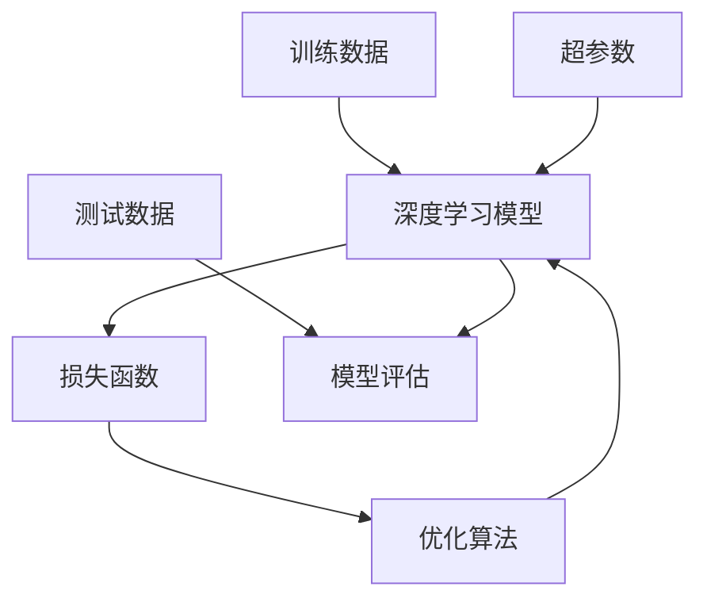
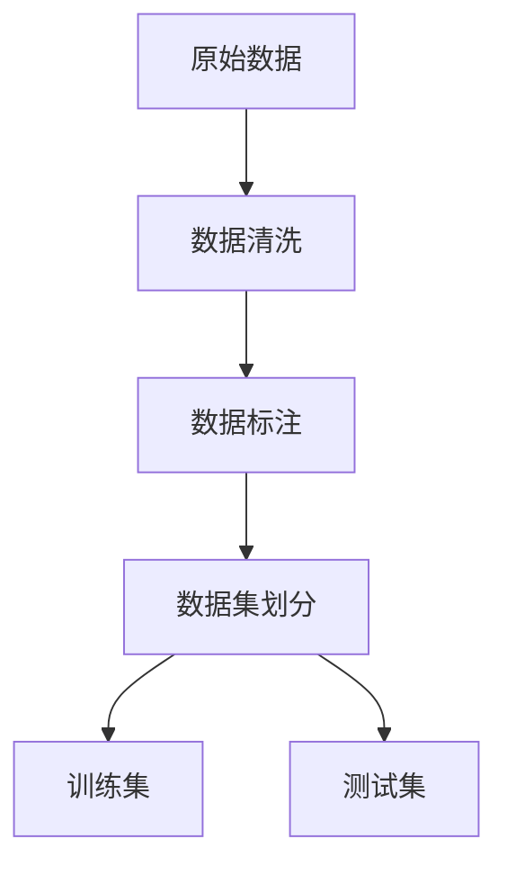
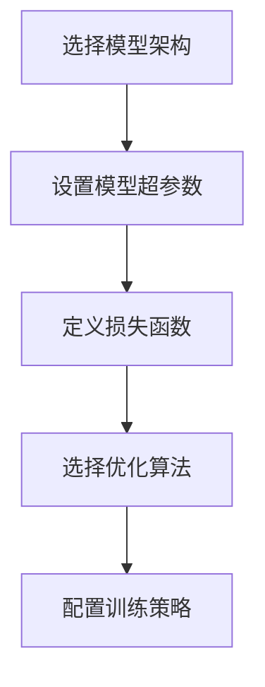
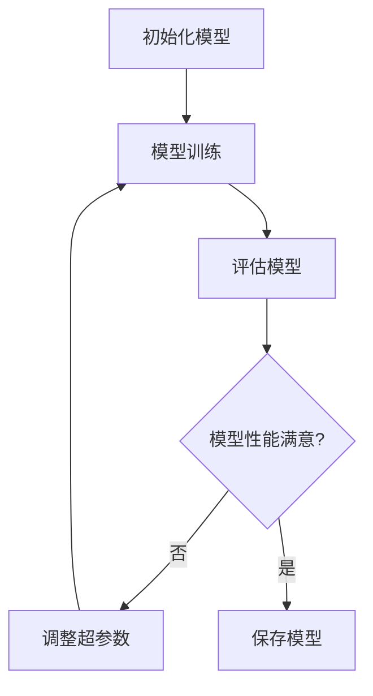
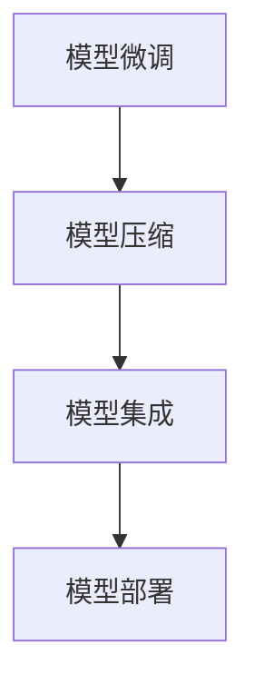

# AI人工智能深度学习算法：设计深度学习任务处理流程

## 1. 背景介绍

### 1.1 人工智能与深度学习的兴起

人工智能(Artificial Intelligence, AI)是当代科技发展的热点领域之一,近年来受到了前所未有的关注和投入。在人工智能的多个分支中,深度学习(Deep Learning)作为一种基于人工神经网络的机器学习算法,展现出了强大的数据处理和模式识别能力,在计算机视觉、自然语言处理、语音识别等领域取得了突破性进展。

### 1.2 深度学习在实际应用中的作用

深度学习已广泛应用于各行各业,为人类生产生活带来了诸多便利。比如在医疗健康领域,深度学习可用于辅助诊断疾病、分析医学影像;在金融领域,可应用于风险评估、欺诈检测等;在交通运输领域,无人驾驶汽车的核心技术就是基于深度学习的计算机视觉和决策系统。

### 1.3 深度学习任务处理的重要性

随着深度学习技术的不断发展和应用场景的日益丰富,设计高效、可靠的深度学习任务处理流程变得至关重要。合理的任务处理流程不仅能够提高模型的训练效率和性能表现,还有助于控制计算资源的消耗,降低开发和部署成本。本文将重点探讨如何设计一个高质量的深度学习任务处理流程。

## 2. 核心概念与联系

在深入讨论深度学习任务处理流程之前,有必要先介绍一些核心概念及其相互关系。

### 2.1 深度学习模型

深度学习模型是一种基于人工神经网络的机器学习模型,它通过对大量数据进行训练,从而学习到数据中隐藏的特征和模式。常见的深度学习模型包括卷积神经网络(Convolutional Neural Network, CNN)、递归神经网络(Recurrent Neural Network, RNN)、长短期记忆网络(Long Short-Term Memory, LSTM)等。

### 2.2 训练数据和测试数据

训练数据是用于训练深度学习模型的数据集,它包含了大量标注好的样本数据。测试数据则是用于评估模型性能的数据集,通常与训练数据是相互独立的。将数据合理划分为训练集和测试集,对于获得泛化性能良好的模型至关重要。

### 2.3 损失函数和优化算法

损失函数(Loss Function)用于衡量模型的预测输出与实际标签之间的差异,是训练过程中需要最小化的目标函数。常用的损失函数有均方误差(Mean Squared Error, MSE)、交叉熵损失(Cross-Entropy Loss)等。

优化算法(Optimization Algorithm)则是用于调整模型参数,使损失函数最小化的算法。常见的优化算法包括随机梯度下降(Stochastic Gradient Descent, SGD)、Adam优化器等。

### 2.4 超参数

超参数(Hyperparameter)是在模型训练之前需要预先设置的参数,如学习率、批大小、epochs数等。合理设置超参数对于模型的训练效果有着重要影响。

### 2.5 核心概念关系

上述核心概念之间存在着紧密的联系,如下图所示:

简而言之,深度学习模型通过对训练数据进行学习,在优化算法的作用下不断调整参数以最小化损失函数。同时,超参数的设置也会影响模型的训练效果。最终,通过在测试数据上评估模型性能,来判断模型的泛化能力。

## 3. 核心算法原理具体操作步骤

设计深度学习任务处理流程的核心在于合理安排各个环节,以确保模型训练的高效性和最终模型的良好性能。下面将详细介绍该流程的具体步骤。

### 3.1 数据准备

1. **获取原始数据**。根据具体的应用场景,从各种渠道收集原始数据,可能的数据形式包括图像、文本、语音等。
2. **数据清洗**。对原始数据进行清洗和预处理,剔除噪声和异常数据,将数据转换为统一的格式。
3. **数据标注**。由人工或自动化工具对数据进行标注,为每个数据样本赋予正确的标签或标记。
4. **数据集划分**。将标注好的数据集按照一定比例划分为训练集和测试集,通常训练集占80%左右。

### 3.2 模型设计和配置

1. **选择模型架构**。根据任务类型和数据特征,选择合适的深度学习模型架构,如CNN、RNN等。
2. **设置模型超参数**。设置模型的超参数,如学习率、批大小、epochs数等,这些参数将影响模型的训练效果。
3. **定义损失函数**。根据任务类型选择合适的损失函数,如分类任务常用交叉熵损失,回归任务常用均方误差损失。
4. **选择优化算法**。选择优化算法来最小化损失函数,如SGD、Adam等。
5. **配置训练策略**。设置模型训练的相关策略,如早停法(Early Stopping)、学习率衰减等,以防止过拟合。

### 3.3 模型训练

1. **初始化模型**。根据之前设计的模型架构和超参数配置,初始化深度学习模型。
2. **模型训练**。使用训练集对模型进行训练,通过优化算法不断调整模型参数,使损失函数最小化。
3. **评估模型**。在训练过程中,定期使用测试集评估模型的性能指标,如准确率、F1分数等。
4. **判断模型性能**。根据评估结果判断模型的性能是否满意,如果不满意则需要调整超参数或模型架构,重新训练模型。
5. **保存模型**。当模型性能达到预期时,将训练好的模型参数保存下来,以备后续使用。

### 3.4 模型优化

即使模型在测试集上表现良好,在实际应用场景中也可能会遇到一些问题和挑战。因此,通常需要对模型进行进一步优化,以提高其性能和鲁棒性。

1. **模型微调**。对预训练模型进行微调(Fine-tuning),使其更加适应特定的任务和数据。
2. **模型压缩**。采用模型压缩技术(如量化、剪枝等)来减小模型的大小,降低计算和存储开销。
3. **模型集成**。将多个模型集成在一起,以提高预测的准确性和鲁棒性。
4. **模型部署**。将优化后的模型部署到实际的生产环境中,为用户提供服务。

## 4. 数学模型和公式详细讲解举例说明

深度学习算法中涉及了大量的数学模型和公式,理解这些公式对于掌握算法原理至关重要。下面将以前馈神经网络(Feedforward Neural Network)为例,详细讲解其中的数学模型和公式。

### 4.1 神经网络基本结构

一个典型的前馈神经网络由输入层、隐藏层和输出层组成,每一层由多个神经元(节点)构成。相邻层的神经元通过带权重的连接相互连接,权重的值决定了信号在网络中的传播强度。

设第 $l$ 层有 $n^{(l)}$ 个神经元,第 $l+1$ 层有 $n^{(l+1)}$ 个神经元,则第 $l$ 层到第 $l+1$ 层的权重矩阵 $W^{(l)}$ 的维度为 $n^{(l+1)} \times n^{(l)}$。

### 4.2 前向传播

在前向传播过程中,输入数据 $x$ 通过层与层之间的线性变换和非线性激活函数,最终得到输出 $\hat{y}$。具体计算过程如下:

$$z^{(l+1)} = W^{(l)}a^{(l)} + b^{(l)}$$
$$a^{(l+1)} = g(z^{(l+1)})$$

其中:
- $z^{(l+1)}$ 是第 $l+1$ 层的线性变换结果
- $W^{(l)}$ 是第 $l$ 层到第 $l+1$ 层的权重矩阵
- $b^{(l)}$ 是第 $l+1$ 层的偏置向量
- $a^{(l)}$ 是第 $l$ 层的激活值
- $g(\cdot)$ 是激活函数,如 ReLU、Sigmoid 等

上述过程在网络的每一层重复进行,直到得到最终的输出 $\hat{y} = a^{(L)}$,其中 $L$ 是网络的总层数。

### 4.3 损失函数

为了训练神经网络,需要定义一个损失函数(Loss Function)来衡量模型输出与真实标签之间的差异。常用的损失函数有均方误差损失(Mean Squared Error, MSE)和交叉熵损失(Cross-Entropy Loss)等。

对于回归任务,均方误差损失可以表示为:

$$J(W, b) = \frac{1}{m}\sum_{i=1}^{m}(\hat{y}^{(i)} - y^{(i)})^2$$

其中 $m$ 是训练样本的数量, $\hat{y}^{(i)}$ 是模型对第 $i$ 个样本的预测输出, $y^{(i)}$ 是第 $i$ 个样本的真实标签。

对于分类任务,交叉熵损失可以表示为:

$$J(W, b) = -\frac{1}{m}\sum_{i=1}^{m}\sum_{j=1}^{C}y_j^{(i)}\log(\hat{y}_j^{(i)})$$

其中 $C$ 是类别数, $y_j^{(i)}$ 是第 $i$ 个样本属于第 $j$ 类的真实标签(0或1), $\hat{y}_j^{(i)}$ 是模型预测第 $i$ 个样本属于第 $j$ 类的概率。

### 4.4 反向传播与优化

为了最小化损失函数,需要对网络的权重参数进行优化。这通过反向传播(Backpropagation)算法实现,其基本思想是计算损失函数相对于每个权重的梯度,然后沿着梯度的反方向更新权重,从而使损失函数最小化。

具体地,对于第 $l$ 层的权重矩阵 $W^{(l)}$,其梯度可以通过链式法则计算得到:

$$\frac{\partial J}{\partial W^{(l)}} = \frac{\partial J}{\partial z^{(l+1)}}\frac{\partial z^{(l+1)}}{\partial W^{(l)}}$$

其中 $\frac{\partial J}{\partial z^{(l+1)}}$ 可以通过反向传播计算得到,而 $\frac{\partial z^{(l+1)}}{\partial W^{(l)}} = a^{(l)}$。

得到梯度后,可以使用优化算法(如梯度下降法)来更新权重:

$$W^{(l)} \leftarrow W^{(l)} - \alpha\frac{\partial J}{\partial W^{(l)}}$$

其中 $\alpha$ 是学习率,控制着每次更新的步长。

通过不断地前向传播计算损失,反向传播计算梯度,并更新权重参数,神经网络就可以逐步减小损失函数的值,从而拟合训练数据。