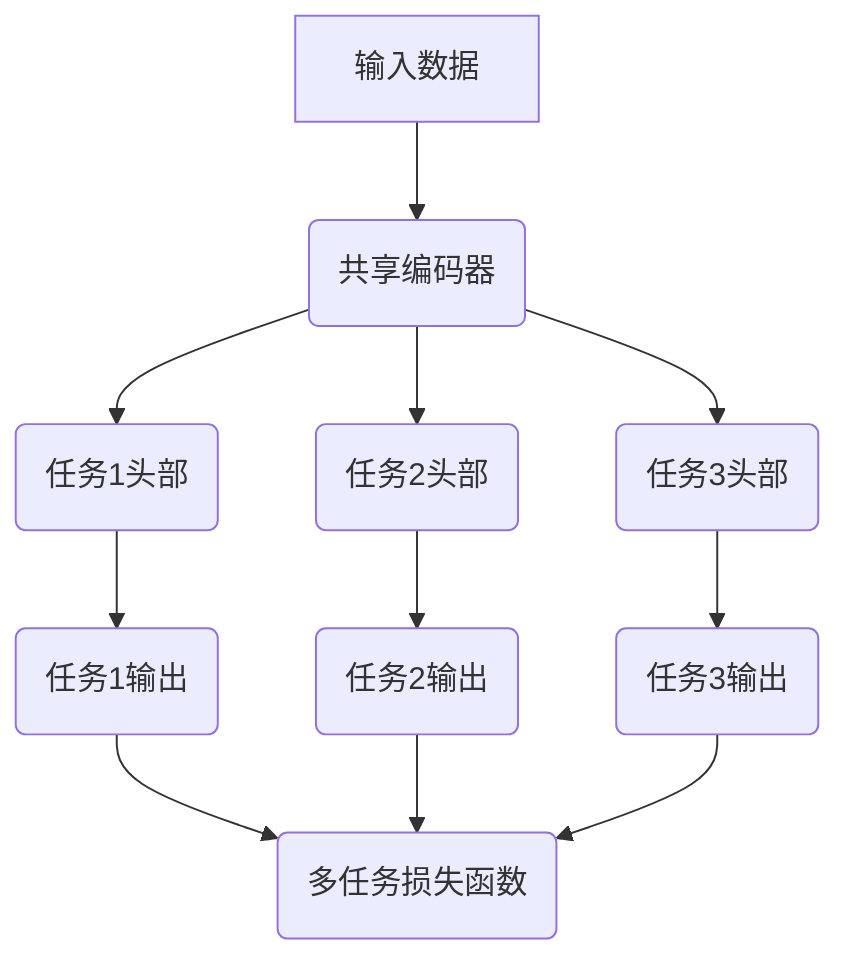

# AI大模型中的多任务学习：一石多鸟

## 1. 背景介绍

### 1.1 人工智能的发展历程

人工智能(Artificial Intelligence, AI)是当代科技领域最具革命性和颠覆性的技术之一。自20世纪50年代问世以来,AI不断发展壮大,已经渗透到我们生活的方方面面。从最初的专家系统、机器学习,到近年来的深度学习和大模型,AI的能力不断提升,应用场景也越来越广泛。

### 1.2 大模型的兴起

近年来,随着算力、数据和算法的不断突破,大规模的人工智能模型(Large AI Models)开始兴起,代表性模型包括GPT-3、BERT、DALL-E等。这些大模型通过在海量数据上进行预训练,掌握了丰富的知识和语义理解能力,可以用于多种不同的任务,展现出了强大的通用能力。

### 1.3 多任务学习的重要性

然而,训练单一大模型仍然是一个高成本的过程,需要消耗大量的计算资源。为了提高资源利用效率,多任务学习(Multi-Task Learning, MTL)应运而生。多任务学习旨在同时优化多个相关任务,使得模型在完成一个任务的同时,也能提升在其他相关任务上的性能,达到"一石多鸟"的效果。

## 2. 核心概念与联系

### 2.1 多任务学习的定义

多任务学习是一种机器学习范式,旨在同时学习多个相关任务的共享表示,从而提高模型在所有任务上的整体性能。与传统的单任务学习不同,多任务学习利用了不同任务之间的相关性,通过共享部分参数或表示,实现了知识迁移,提高了数据利用效率和泛化能力。

### 2.2 多任务学习与迁移学习

多任务学习与迁移学习(Transfer Learning)有着密切的联系。迁移学习旨在利用在源域学习到的知识,来帮助目标域的学习。而多任务学习可以看作是一种特殊的迁移学习,其中源域和目标域是多个相关任务,通过共享表示实现了知识迁移。

### 2.3 多任务学习与元学习

多任务学习也与元学习(Meta-Learning)存在一定关联。元学习旨在学习一种通用的学习策略,使得模型能够快速适应新任务。而多任务学习则关注于提高模型在多个相关任务上的整体性能,可以看作是一种特殊的元学习方法。

### 2.4 多任务学习架构

多任务学习架构通常包括以下几个关键组件:

1. **共享编码器(Shared Encoder)**:用于从输入数据中提取共享的特征表示。
2. **任务特定头(Task-Specific Heads)**:每个任务都有一个专用的头部,用于从共享表示中预测该任务的输出。
3. **多任务损失函数(Multi-Task Loss)**:将所有任务的损失函数加权求和,作为模型的总体优化目标。



## 3. 核心算法原理具体操作步骤

多任务学习的核心思想是通过学习多个相关任务的共享表示,提高模型在所有任务上的整体性能。以下是多任务学习算法的一般步骤:

1. **数据准备**:收集并准备用于训练的多任务数据集,包括多个相关任务的输入数据和标签。

2. **模型构建**:构建多任务学习模型架构,包括共享编码器、任务特定头部和多任务损失函数。

3. **参数初始化**:初始化模型参数,通常使用预训练模型的参数作为初始值。

4. **前向传播**:将输入数据传递到共享编码器,获得共享表示;然后将共享表示分别传递到每个任务的头部,获得各任务的预测输出。

5. **计算损失**:对于每个任务,计算其预测输出与真实标签之间的损失;然后将所有任务的损失加权求和,得到多任务损失。

6. **反向传播**:基于多任务损失,计算梯度并反向传播,更新模型参数。

7. **迭代训练**:重复步骤4-6,直到模型收敛或达到预定的训练轮数。

8. **模型评估**:在验证集或测试集上评估模型在每个任务上的性能。

9. **模型部署**:将训练好的多任务模型部署到实际应用中。

需要注意的是,在多任务学习中,任务之间的相关性、损失函数的权重设置以及模型架构的设计都是非常关键的因素,会直接影响模型的性能表现。

## 4. 数学模型和公式详细讲解举例说明

### 4.1 多任务损失函数

在多任务学习中,我们需要定义一个多任务损失函数,将所有任务的损失加权求和,作为模型的总体优化目标。假设我们有 $N$ 个任务,第 $i$ 个任务的损失函数为 $\mathcal{L}_i$,权重为 $\lambda_i$,则多任务损失函数可以表示为:

$$\mathcal{L}_{\text{multi-task}} = \sum_{i=1}^{N} \lambda_i \mathcal{L}_i$$

其中,权重 $\lambda_i$ 用于控制每个任务对总体损失的贡献程度。一种常见的设置方法是,将权重设置为各任务损失的倒数,以平衡不同任务的数量级:

$$\lambda_i = \frac{1}{\mathcal{L}_i + \epsilon}$$

这里 $\epsilon$ 是一个小常数,用于避免分母为零的情况。

### 4.2 梯度反向传播

在多任务学习中,我们需要基于多任务损失函数计算梯度,并反向传播到模型的共享参数和任务特定参数。假设共享编码器的参数为 $\theta_s$,第 $i$ 个任务头部的参数为 $\theta_i$,则对于第 $i$ 个任务的损失函数 $\mathcal{L}_i$,我们有:

$$\frac{\partial \mathcal{L}_i}{\partial \theta_s} = \frac{\partial \mathcal{L}_i}{\partial h_i} \frac{\partial h_i}{\partial \theta_s}$$

$$\frac{\partial \mathcal{L}_i}{\partial \theta_i} = \frac{\partial \mathcal{L}_i}{\partial \hat{y}_i} \frac{\partial \hat{y}_i}{\partial \theta_i}$$

其中 $h_i$ 是第 $i$ 个任务头部的输入(即共享表示), $\hat{y}_i$ 是第 $i$ 个任务的预测输出。

对于多任务损失函数 $\mathcal{L}_{\text{multi-task}}$,我们有:

$$\frac{\partial \mathcal{L}_{\text{multi-task}}}{\partial \theta_s} = \sum_{i=1}^{N} \lambda_i \frac{\partial \mathcal{L}_i}{\partial \theta_s}$$

$$\frac{\partial \mathcal{L}_{\text{multi-task}}}{\partial \theta_i} = \lambda_i \frac{\partial \mathcal{L}_i}{\partial \theta_i}$$

通过计算上述梯度,我们可以使用反向传播算法同时更新共享编码器和各任务头部的参数,实现多任务联合训练。

### 4.3 正则化技术

在多任务学习中,常常会使用一些正则化技术来提高模型的泛化能力和鲁棒性。一种常见的正则化方法是引入任务关系感知正则项(Task Relation Aware Regularization, TRAR),鼓励相关任务之间的表示相似,而不相关任务之间的表示差异较大。

假设我们有 $N$ 个任务,第 $i$ 个任务的共享表示为 $h_i$,任务之间的相关性矩阵为 $\mathbf{R} \in \mathbb{R}^{N \times N}$,其中 $R_{ij}$ 表示第 $i$ 个任务与第 $j$ 个任务之间的相关程度。则 TRAR 正则项可以定义为:

$$\mathcal{R}_{\text{TRAR}} = \sum_{i=1}^{N} \sum_{j=1}^{N} R_{ij} \left\Vert h_i - h_j \right\Vert_2^2$$

将 TRAR 正则项加入到多任务损失函数中,可以鼓励相关任务之间的表示相似,从而提高模型的泛化能力。

## 5. 项目实践:代码实例和详细解释说明

为了更好地理解多任务学习的实现,我们以一个基于 PyTorch 的简单示例来说明。在这个示例中,我们将同时训练两个相关的文本分类任务:情感分析和主题分类。

### 5.1 数据准备

首先,我们需要准备用于训练的数据集。在这个示例中,我们使用了一个包含产品评论的数据集,其中每条评论都被标注了情感极性(正面或负面)和主题类别(如"食品"、"服装"等)。

```python
from torchtext.datasets import AG_NEWS, SST

# 加载情感分析数据集
train_data_sst, test_data_sst = SST(root='data', split=('train', 'test'))
# 加载主题分类数据集
train_data_ag, test_data_ag = AG_NEWS(root='data', split=('train', 'test'))
```

### 5.2 模型构建

接下来,我们构建多任务学习模型的架构。我们使用一个共享的 LSTM 编码器来提取文本的序列特征表示,并为每个任务设置一个专用的全连接头部。

```python
import torch
import torch.nn as nn

class MultiTaskModel(nn.Module):
    def __init__(self, vocab_size, embedding_dim, hidden_dim, output_dim_sst, output_dim_ag):
        super(MultiTaskModel, self).__init__()
        self.embeddings = nn.Embedding(vocab_size, embedding_dim)
        self.lstm = nn.LSTM(embedding_dim, hidden_dim, batch_first=True)
        
        # 情感分析头部
        self.fc_sst = nn.Linear(hidden_dim, output_dim_sst)
        
        # 主题分类头部
        self.fc_ag = nn.Linear(hidden_dim, output_dim_ag)
        
    def forward(self, text, task):
        embedded = self.embeddings(text)
        _, (hidden, _) = self.lstm(embedded)
        hidden = hidden.squeeze(0)
        
        if task == 'sst':
            return self.fc_sst(hidden)
        elif task == 'ag':
            return self.fc_ag(hidden)
```

在这个模型中,我们使用了一个共享的 LSTM 编码器来提取文本的序列特征表示,并为每个任务设置了一个专用的全连接头部。在前向传播时,我们根据任务类型选择相应的头部进行预测。

### 5.3 训练过程

接下来,我们定义训练过程,包括数据加载、损失函数计算、模型训练等步骤。

```python
import torch.optim as optim

# 定义损失函数
criterion_sst = nn.CrossEntropyLoss()
criterion_ag = nn.CrossEntropyLoss()

# 定义优化器
optimizer = optim.Adam(model.parameters())

# 训练循环
for epoch in range(num_epochs):
    for batch_sst, batch_ag in zip(train_data_sst, train_data_ag):
        text_sst, labels_sst = batch_sst.text, batch_sst.label
        text_ag, labels_ag = batch_ag.text, batch_ag.label
        
        # 前向传播
        output_sst = model(text_sst, 'sst')
        output_ag = model(text_ag, 'ag')
        
        # 计算损失
        loss_sst = criterion_sst(output_sst, labels_sst)
        loss_ag = criterion_ag(output_ag, labels_ag)
        loss = loss_sst + loss_ag
        
        # 反向传播和优化
        optimizer.zero_grad()
        loss.backward()
        optimizer.step()
```

在这个示例中,我们为每个任务定义了一个交叉熵损失函数,并将两个任务的损失相加作为总体损失进行优化。在每个训练批次中,我们分别计算两个任务的输出和损失,然后将它们相加,并使用反向传播算法更新模型参数。

### 5.4 