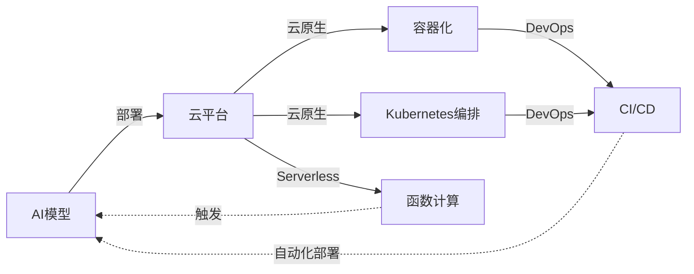

# AI模型部署到云原理与代码实战案例讲解

## 1. 背景介绍

### 1.1 人工智能模型部署的重要性
人工智能(AI)技术的快速发展和广泛应用,使得AI模型部署成为一个热门话题。将训练好的AI模型高效、可靠地部署到生产环境中,对于实现AI的商业价值和社会价值至关重要。部署是连接AI模型开发和实际应用的桥梁,只有通过部署,AI模型才能真正发挥作用。

### 1.2 云计算给AI部署带来的机遇
云计算的兴起为AI模型部署提供了新的机遇。云平台提供了海量的计算、存储资源和成熟的服务,使得部署AI模型变得更加便捷和高效。借助云的力量,即使是中小企业和个人开发者也能享受到大规模计算资源的支持,加速AI应用的开发和部署。

### 1.3 AI模型云端部署面临的挑战
尽管云计算为AI部署带来了诸多便利,但AI模型部署到云端仍然面临一些挑战:
1. 模型适配:如何将各种机器学习框架训练的模型高效转换并部署到云平台
2. 资源分配:如何根据模型的特点和需求合理分配云资源,实现高效计算
3. 弹性伸缩:如何应对请求量的动态变化,实现服务的自动弹性伸缩
4. 模型管理:如何方便地对云上部署的模型进行管理、更新、版本控制等
5. 安全与隐私:如何保证模型和数据在云上的安全,防止泄露和攻击

本文将围绕这些背景和挑战,深入探讨AI模型部署到云的原理,并给出详细的代码实践案例。

## 2. 核心概念与联系

### 2.1 AI模型
AI模型是指用机器学习算法在训练数据上训练得到的一组参数,可以用于对新数据进行预测。常见的AI模型包括:
- 深度学习模型:CNN、RNN、Transformer等
- 传统机器学习模型:SVM、决策树、逻辑回归等
- 强化学习模型:DQN、A3C等

### 2.2 模型部署
模型部署是指将训练好的AI模型集成到生产系统中,为终端用户提供服务的过程。部署需要考虑模型运行环境、接口设计、资源分配、自动化运维等因素,使模型能够高效稳定地持续服务。

### 2.3 云原生
云原生(Cloud Native)是一种构建和运行应用的方法,充分利用了云计算的分布式、弹性伸缩等优势。云原生应用通常采用微服务架构,容器化部署,借助Kubernetes等编排工具实现应用生命周期管理。

### 2.4 无服务器计算
无服务器计算(Serverless)是云计算的一种新模式,用户无需管理服务器等基础设施,只需专注于核心代码逻辑,云平台会自动分配资源、触发执行、进行伸缩。无服务器计算非常适合部署AI推理服务。

### 2.5 DevOps
DevOps是软件开发(Dev)和运维(Ops)的结合,倡导开发和运维紧密协作,高度自动化,实现应用快速、频繁、稳定的交付。DevOps中CI/CD流程可以帮助实现AI模型自动化部署。

### 2.6 核心概念联系
下图展示了以上核心概念之间的联系:



AI模型通过部署上云,借助云原生技术如容器和Kubernetes实现可扩展部署,或采用Serverless模式简化部署。整个部署过程通过DevOps实践如CI/CD实现自动化。

## 3. 核心算法原理具体操作步骤

AI模型部署到云的核心步骤如下:

### 3.1 模型训练
使用TensorFlow、PyTorch等机器学习框架,在本地或云上GPU集群完成模型训练,得到训练好的模型文件。

### 3.2 模型转换
将训练好的模型转换成适合在云上部署的格式。常用的模型格式有:
- SavedModel:TensorFlow的标准模型格式
- ONNX:开放的神经网络交换格式
- TorchScript:PyTorch的模型格式
- PMML:可移植的机器学习模型格式

转换示例(TensorFlow):
```python
import tensorflow as tf

model = create_model()
model.fit(train_data)

tf.saved_model.save(model, "model_path")
```

### 3.3 模型打包
将模型文件和推理代码一起打包成可部署的应用程序。常见的打包方式:
- 打包成Web应用:使用Flask、Django等Web框架,提供REST API
- 打包成Docker镜像:将模型和运行环境打包成镜像,方便部署和移植

示例(Docker):
```dockerfile
FROM tensorflow/serving

COPY model_path /models/model
ENV MODEL_NAME model
```

### 3.4 模型部署
将打包好的模型应用部署到云平台,配置相应的资源和服务。常见的部署方式:
- 部署到虚拟机:创建云服务器,手动部署模型应用
- 部署到容器平台:使用Kubernetes等编排工具管理模型容器
- 部署到Serverless:直接将模型部署为Serverless函数

示例(Kubernetes):
```yaml
apiVersion: apps/v1
kind: Deployment
metadata:
  name: model-server
spec:
  replicas: 3
  template:
    spec:
      containers:
      - name: model-server
        image: model-image
        ports:
        - containerPort: 8080
```

### 3.5 服务发布
为已部署的模型服务配置访问入口,实现服务发布。常见的服务发布方式:
- 配置负载均衡:如Nginx、云平台的负载均衡服务
- 配置API网关:提供统一的API管理和访问入口
- 配置域名和SSL:实现服务的安全访问

### 3.6 监控运维
对已发布的模型服务进行持续的监控和运维,确保服务的可用性和质量。监控的主要指标:
- 服务可用性:如服务在线率、响应时间等
- 资源使用率:如CPU、内存、网络等
- 预测质量:如预测准确率、异常请求等

发现问题时要及时调整资源配置,或重新部署模型版本。

以上是AI模型部署到云的主要步骤和操作,通过规范化、自动化的部署流程,可以提高部署效率和服务质量。

## 4. 数学模型和公式详细讲解举例说明

在AI模型的训练和推理过程中,往往涉及大量的数学模型和公式。下面以几个典型的机器学习模型为例,讲解其中的数学原理。

### 4.1 线性回归
线性回归是一种基本的机器学习模型,用于拟合连续型变量之间的线性关系。给定数据集$\{(x_1,y_1),...,(x_n,y_n)\}$,线性回归模型的目标是学习一个线性函数:

$$
\hat{y} = w^Tx + b
$$

其中$w$是权重向量,$b$是偏置项。通过最小化均方误差损失函数来求解最优参数:

$$
\min_{w,b} \frac{1}{n} \sum_{i=1}^n (w^Tx_i + b - y_i)^2
$$

求解该优化问题可以使用梯度下降法,迭代更新参数直至收敛:

$$
w := w - \alpha \frac{1}{n} \sum_{i=1}^n (w^Tx_i + b - y_i)x_i \\
b := b - \alpha \frac{1}{n} \sum_{i=1}^n (w^Tx_i + b - y_i)
$$

其中$\alpha$是学习率。

### 4.2 逻辑回归
逻辑回归是一种常用的分类模型,用于二分类问题。给定数据集$\{(x_1,y_1),...,(x_n,y_n)\}, y_i \in \{0,1\}$,逻辑回归模型使用Sigmoid函数将线性函数值映射到(0,1)区间,得到分类概率:

$$
\hat{y} = \sigma(w^Tx + b), \sigma(z) = \frac{1}{1+e^{-z}}
$$

通过最大化对数似然函数来求解最优参数:

$$
\max_{w,b} \sum_{i=1}^n [y_i \log \hat{y_i} + (1-y_i) \log (1-\hat{y_i})]
$$

同样可以使用梯度下降法求解,更新公式为:

$$
w := w + \alpha \sum_{i=1}^n (y_i - \hat{y_i})x_i \\
b := b + \alpha \sum_{i=1}^n (y_i - \hat{y_i})
$$

### 4.3 支持向量机
支持向量机(SVM)是一种经典的分类模型,特别适用于小样本、非线性分类问题。SVM的目标是在特征空间中找到一个最大间隔超平面,将不同类别的样本分开。

对于线性可分数据,SVM的优化目标可以表示为:

$$
\min_{w,b} \frac{1}{2} \lVert w \rVert^2 \\
s.t. \ y_i(w^Tx_i + b) \geq 1, i=1,...,n
$$

通过拉格朗日乘子法和对偶技巧,可以得到等价的对偶问题:

$$
\max_\alpha \sum_{i=1}^n \alpha_i - \frac{1}{2} \sum_{i,j=1}^n \alpha_i \alpha_j y_i y_j x_i^T x_j \\
s.t. \ \sum_{i=1}^n \alpha_i y_i = 0, 0 \leq \alpha_i \leq C, i=1,...,n
$$

其中$\alpha_i$是拉格朗日乘子,$C$是正则化参数。求解出最优$\alpha$后,可得到超平面参数:

$$
w = \sum_{i=1}^n \alpha_i y_i x_i \\
b = y_j - w^T x_j, j \in \{i | 0 < \alpha_i < C\}
$$

对于非线性问题,可以引入核函数$K(x,z)$,将特征映射到高维空间,使其线性可分。

以上是几个经典机器学习模型的数学原理,通过求解相应的优化问题,可以得到模型的最优参数。在实践中,我们通常使用成熟的机器学习库如Scikit-learn、TensorFlow等来训练和部署模型,它们已经封装了这些算法的高效实现。

## 5. 项目实践:代码实例和详细解释说明

下面通过一个实际项目案例,演示如何使用TensorFlow训练图像分类模型,并将其部署到Kubernetes集群中。

### 5.1 模型训练
首先使用TensorFlow训练一个图像分类模型,这里以经典的MNIST手写数字数据集为例:

```python
import tensorflow as tf

# 加载MNIST数据集
mnist = tf.keras.datasets.mnist
(train_images, train_labels), (test_images, test_labels) = mnist.load_data()

# 数据预处理
train_images = train_images / 255.0
test_images = test_images / 255.0

# 定义模型结构
model = tf.keras.models.Sequential([
    tf.keras.layers.Flatten(input_shape=(28, 28)),
    tf.keras.layers.Dense(128, activation='relu'),
    tf.keras.layers.Dense(10, activation='softmax')
])

# 编译模型
model.compile(optimizer='adam',
              loss='sparse_categorical_crossentropy',
              metrics=['accuracy'])

# 训练模型
model.fit(train_images, train_labels, epochs=5)

# 评估模型
test_loss, test_acc = model.evaluate(test_images, test_labels)
print('Test accuracy:', test_acc)

# 保存模型
model.save("model.h5")
```

这个简单的模型由两个全连接层组成,使用ReLU和Softmax激活函数,采用Adam优化器和交叉熵损失函数进行训练。训练5个epoch后,在测试集上评估模型性能,最后将模型保存为HDF5格式的文件。

### 5.2 服务化封装
接下来,我们将训练好的模型封装成HTTP服务,使用Flask编写推理服务代码`app.py`:

```python
import tensorflow as tf
from flask import Flask, request, jsonify

app = Flask(__