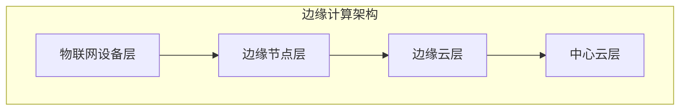

# AI模型部署到边缘原理与代码实战案例讲解

## 1.背景介绍

### 1.1 边缘计算的兴起

随着物联网(IoT)设备和智能终端的快速普及,传统的云计算架构面临着一些挑战,如高延迟、带宽限制、隐私和安全问题等。为了解决这些问题,边缘计算(Edge Computing)应运而生。边缘计算是一种将计算资源分散到靠近数据源的网络边缘节点上的分布式计算范式。

### 1.2 AI模型部署的重要性

人工智能(AI)模型已经广泛应用于各个领域,如计算机视觉、自然语言处理、推荐系统等。然而,传统上这些模型都是部署在云端或数据中心。随着边缘计算的兴起,将AI模型部署到边缘设备上变得越来越重要,这可以带来诸多好处:

- 降低延迟:将模型部署到边缘节点上,可以减少数据传输的距离,从而降低延迟,提高响应速度。
- 节省带宽:只需传输模型的输出结果,而不是原始数据,可以大幅节省带宽。
- 保护隐私:敏感数据可以在本地处理,而不需要传输到云端,从而提高隐私保护。
- 提高可靠性:即使网络中断,边缘设备仍可独立运行,提高系统的可靠性。

## 2.核心概念与联系

### 2.1 边缘计算架构

边缘计算架构通常包括以下几个层次:

1. **物联网设备层**:各种传感器、智能终端等数据采集设备。
2. **边缘节点层**:靠近数据源的边缘计算节点,如网关、路由器等。
3. **边缘云层**:位于边缘和云之间的中间层,用于管理和协调边缘节点。
4. **中心云层**:传统的云数据中心,用于大规模数据存储和复杂计算任务。



### 2.2 AI模型部署方式

将AI模型部署到边缘设备上,主要有以下几种方式:

1. **云-边缘协同**:模型训练在云端进行,训练好的模型下发到边缘节点进行推理。
2. **边缘训练**:在边缘节点上进行模型的训练和推理,无需依赖云端。
3. **模型压缩**:通过模型压缩技术(如量化、剪枝等)将大型模型压缩,以适应边缘设备的硬件资源限制。

### 2.3 边缘AI的应用场景

边缘AI可以应用于多个领域,例如:

- **智能视频分析**:在安防监控、交通管理等场景中,利用边缘AI进行实时视频分析。
- **语音交互系统**:在智能音箱、语音助手等场景中,将语音识别模型部署到边缘设备上。
- **机器人与自动驾驶**:在机器人控制、自动驾驶汽车等场景中,需要实时的感知和决策。
- **工业物联网**:在工厂自动化、预测性维护等场景中,利用边缘AI进行实时数据分析和决策。

## 3.核心算法原理具体操作步骤

在将AI模型部署到边缘设备之前,我们需要对模型进行优化和压缩,以适应边缘设备的硬件资源限制。常见的模型优化技术包括量化(Quantization)、剪枝(Pruning)和知识蒸馏(Knowledge Distillation)等。

### 3.1 量化(Quantization)

量化是将原始的浮点数模型参数转换为低比特的定点数表示,从而减小模型的大小和计算量。常见的量化方法包括:

1. **后训练量化(Post-Training Quantization)**:在模型训练完成后,对权重和激活值进行量化。
2. **量化感知训练(Quantization-Aware Training)**:在模型训练过程中,就考虑量化的影响,使模型更适合量化。

量化的具体操作步骤如下:

1. 确定量化的比特宽度(如8位或4位等)。
2. 确定量化方法(如线性量化或对数量化等)。
3. 计算量化范围(如最大值和最小值)。
4. 将浮点数映射到定点数表示。
5. 使用量化后的模型进行推理。

### 3.2 剪枝(Pruning)

剪枝是通过移除模型中的冗余参数和计算,来压缩模型的大小和计算量。常见的剪枝方法包括:

1. **权重剪枝(Weight Pruning)**:移除模型权重矩阵中的部分权重。
2. **滤波器剪枝(Filter Pruning)**:移除卷积层中的部分滤波器。
3. **通道剪枝(Channel Pruning)**:移除卷积层的输入通道或输出通道。

剪枝的具体操作步骤如下:

1. 确定剪枝策略(如基于权重大小、基于规范等)。
2. 根据剪枝策略,计算每个参数或滤波器的重要性得分。
3. 根据重要性得分,移除部分参数或滤波器。
4. 微调剪枝后的模型,恢复性能。
5. 使用剪枝后的模型进行推理。

### 3.3 知识蒸馏(Knowledge Distillation)

知识蒸馏是将一个大型的教师模型(Teacher Model)的知识转移到一个小型的学生模型(Student Model)上,从而压缩模型的大小。具体操作步骤如下:

1. 训练一个大型的教师模型,作为知识的来源。
2. 定义知识转移的损失函数,如软目标损失(Soft Target Loss)或关注转移损失(Attention Transfer Loss)等。
3. 使用教师模型的输出(如softmax概率或注意力映射等)作为软目标,训练学生模型。
4. 使用蒸馏后的小型学生模型进行推理。

## 4.数学模型和公式详细讲解举例说明

在模型压缩和优化过程中,常常需要使用一些数学模型和公式。下面我们将详细讲解其中的一些重要公式。

### 4.1 量化公式

在量化过程中,我们需要将浮点数映射到定点数表示。常见的线性量化公式如下:

$$
q(x) = \text{clamp}\left(\lfloor\frac{x}{S} + Z\rceil, 0, 2^{B}-1\right)
$$

其中:

- $x$是原始的浮点数值
- $S$是量化比例因子(Scale Factor)
- $Z$是量化零点(Zero Point)
- $B$是量化比特宽度
- $\lfloor\cdot\rceil$表示向最近整数舍入
- $\text{clamp}(\cdot, a, b)$函数将值限制在$[a, b]$范围内

量化比例因子$S$和量化零点$Z$可以通过以下公式计算:

$$
S = \frac{\max(|X|)}{2^{B-1} - 1}
$$

$$
Z = -\text{clamp}\left(\lfloor\min(X)/S\rceil, -(2^{B-1}-1), 2^{B-1}\right)
$$

其中$X$是原始浮点数值的集合。

### 4.2 剪枝重要性评分

在剪枝过程中,我们需要计算每个参数或滤波器的重要性得分,以决定保留或移除。常见的重要性评分方法包括:

1. **权重绝对值得分**:

   $$
   s_i = |w_i|
   $$

   其中$w_i$是第$i$个权重的值。

2. **权重范数得分**:

   $$
   s_i = \|w_i\|_p = \left(\sum_{j=1}^{n}|w_{ij}|^p\right)^{1/p}
   $$

   其中$w_i$是第$i$个滤波器的权重向量,$\|\cdot\|_p$表示$L_p$范数。

3. **BatchNorm缩放因子得分**:

   $$
   s_i = |\gamma_i|
   $$

   其中$\gamma_i$是第$i$个BatchNorm层的缩放因子(Scale Factor)。

根据得分的大小,我们可以移除得分较小的参数或滤波器,从而压缩模型。

### 4.3 知识蒸馏损失函数

在知识蒸馏过程中,我们需要定义一个损失函数,将教师模型的知识转移到学生模型。常见的损失函数包括:

1. **软目标损失(Soft Target Loss)**:

   $$
   \mathcal{L}_\text{distill} = (1-\lambda)\mathcal{L}_\text{CE}(y_s, y_t) + \lambda\tau^2\mathcal{L}_\text{KL}(p_s, p_t)
   $$

   其中:
   
   - $y_s$和$y_t$分别是学生模型和教师模型的硬标签输出
   - $p_s$和$p_t$分别是学生模型和教师模型的softmax概率输出
   - $\mathcal{L}_\text{CE}$是交叉熵损失函数
   - $\mathcal{L}_\text{KL}$是KL散度损失函数
   - $\tau$是温度超参数,用于软化概率分布
   - $\lambda$是平衡两个损失项的超参数

2. **关注转移损失(Attention Transfer Loss)**:

   $$
   \mathcal{L}_\text{att} = \|A_s - A_t\|_F^2
   $$

   其中$A_s$和$A_t$分别是学生模型和教师模型的注意力映射矩阵,$\|\cdot\|_F$表示Frobenius范数。

通过优化这些损失函数,我们可以将教师模型的知识有效地转移到学生模型上。

## 5.项目实践:代码实例和详细解释说明

在这一部分,我们将通过一个实际的代码示例,演示如何将一个预训练的图像分类模型(MobileNetV2)部署到边缘设备(如Raspberry Pi)上。我们将使用PyTorch框架,并采用量化和剪枝技术对模型进行优化和压缩。

### 5.1 环境准备

首先,我们需要准备好开发环境。在Raspberry Pi上,我们可以使用PyTorch官方提供的预编译版本,或者自行交叉编译PyTorch。此外,我们还需要安装一些必要的依赖库,如NumPy、Pillow等。

```bash
# 安装PyTorch
pip3 install torch torchvision

# 安装其他依赖库
pip3 install numpy pillow
```

### 5.2 模型加载和量化

接下来,我们将加载预训练的MobileNetV2模型,并对其进行量化。PyTorch提供了一个`torch.quantization`模块,用于量化模型。

```python
import torch
import torch.quantization

# 加载预训练模型
model = torch.hub.load('pytorch/vision:v0.10.0', 'mobilenet_v2', pretrained=True)

# 设置量化配置
model.eval()
model.qconfig = torch.quantization.get_default_qat_qconfig('fbgemm')

# 量化模型
torch.quantization.prepare_qat(model, inplace=True)
# 这里可以进行量化感知训练
model = torch.quantization.convert(model.eval())

# 保存量化模型
torch.jit.save(torch.jit.script(model), 'mobilenet_v2_quantized.pt')
```

在上面的代码中,我们首先加载了预训练的MobileNetV2模型。然后,我们设置了量化配置,并使用`torch.quantization.prepare_qat`函数准备量化。接下来,我们可以进行量化感知训练(可选)。最后,我们使用`torch.quantization.convert`函数将模型量化,并保存量化后的模型。

### 5.3 模型剪枝

除了量化,我们还可以对模型进行剪枝,进一步压缩模型的大小。PyTorch提供了一个`torch.nn.utils.prune`模块,用于剪枝模型。

```python
import torch.nn.utils.prune as prune

# 加载量化模型
model = torch.jit.load('mobilenet_v2_quantized.pt')

# 剪枝配置
pruning_plan = prune.l1_unstructured(model, name='weight', amount=0.5)
prune.remove(pruning_plan, prune.IdMask)

# 微调剪枝模型
# 这里可以进行微调训练

# 保存剪枝模型