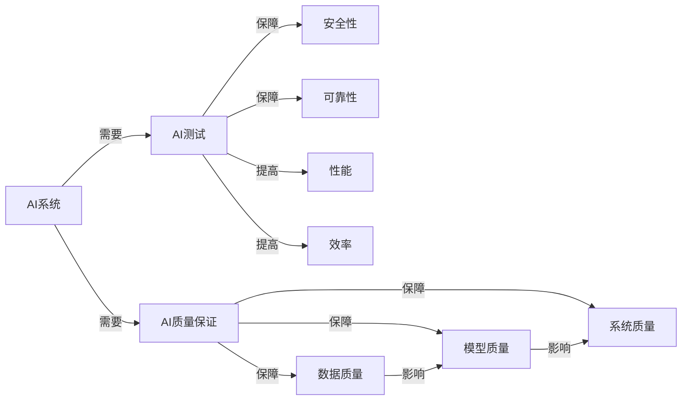

# AI测试与质量保证原理与代码实战案例讲解

## 1.背景介绍

随着人工智能技术的快速发展,AI系统已经广泛应用于各个领域,如自动驾驶、智能客服、医疗诊断等。然而,AI系统的复杂性、不确定性和黑盒特性给测试和质量保证带来了巨大挑战。传统的软件测试方法已经无法完全满足AI系统的测试需求。因此,探索AI测试与质量保证的原理和实践方法,对于保障AI系统的安全性、可靠性和有效性具有重要意义。

本文将深入探讨AI测试与质量保证的核心概念、关键技术和最佳实践,并通过代码实战案例,展示如何进行AI系统的全面测试与质量保障。

### 1.1 AI系统的特点与测试挑战
#### 1.1.1 AI系统的复杂性和不确定性
#### 1.1.2 AI系统的黑盒特性
#### 1.1.3 传统软件测试方法的局限性

### 1.2 AI测试与质量保证的重要性
#### 1.2.1 保障AI系统的安全性和可靠性
#### 1.2.2 提高AI系统的性能和效率
#### 1.2.3 增强用户对AI系统的信任和接受度

## 2.核心概念与联系

### 2.1 AI测试的定义与分类
#### 2.1.1 功能测试
#### 2.1.2 性能测试
#### 2.1.3 鲁棒性测试
#### 2.1.4 可解释性测试
#### 2.1.5 公平性测试

### 2.2 AI质量保证的定义与内涵
#### 2.2.1 数据质量保证
#### 2.2.2 模型质量保证
#### 2.2.3 系统质量保证

### 2.3 AI测试与质量保证的关系
#### 2.3.1 测试是质量保证的重要手段
#### 2.3.2 质量保证贯穿AI系统全生命周期

### 2.4 AI测试与质量保证的核心概念关系图



## 3.核心算法原理具体操作步骤

### 3.1 基于对抗样本的鲁棒性测试
#### 3.1.1 对抗样本的定义与生成方法
#### 3.1.2 基于对抗样本的模型鲁棒性评估
#### 3.1.3 对抗训练提高模型鲁棒性

### 3.2 基于变异测试的AI系统测试
#### 3.2.1 变异测试的基本原理
#### 3.2.2 AI系统的变异算子设计
#### 3.2.3 变异测试的效果评估

### 3.3 基于元学习的测试用例生成
#### 3.3.1 元学习的基本概念
#### 3.3.2 元学习在测试用例生成中的应用
#### 3.3.3 基于元学习的测试用例生成算法

### 3.4 基于因果推理的AI系统测试
#### 3.4.1 因果推理的基本原理
#### 3.4.2 因果图模型的构建
#### 3.4.3 基于因果推理的测试用例生成

## 4.数学模型和公式详细讲解举例说明

### 4.1 对抗样本生成的数学模型
对抗样本生成可以表示为一个优化问题:

$$\begin{aligned}
\mathop{\arg\max}_{\delta} &\quad L(f(x+\delta),y) \\
s.t. &\quad \|\delta\|_p \leq \epsilon
\end{aligned}$$

其中,$x$表示原始样本,$y$表示原始标签,$f$表示AI模型,$L$表示损失函数,$\delta$表示对抗扰动,$\epsilon$表示扰动的最大范数约束。

常见的对抗样本生成方法包括:
- FGSM(Fast Gradient Sign Method):
$$\delta = \epsilon \cdot \text{sign}(\nabla_x L(f(x),y))$$

- PGD(Projected Gradient Descent):
$$\begin{aligned}
x^{t+1} &= \Pi_{x+\mathcal{S}}(x^t + \alpha \cdot \text{sign}(\nabla_x L(f(x^t),y))) \\
x^0 &= x
\end{aligned}$$

其中,$\Pi$表示投影操作,$\mathcal{S}$表示扰动集合,$\alpha$表示步长。

### 4.2 变异测试的数学模型
变异测试可以用以下公式表示:

$$\begin{aligned}
MS(p,T) &= \frac{\sum_{t\in T}(p(t) \neq p'(t))}{|T|} \\
p' &= mutate(p)
\end{aligned}$$

其中,$p$表示原始程序,$T$表示测试集,$p'$表示变异体,$MS$表示变异分数。变异算子$mutate$用于生成变异体。

### 4.3 元学习的数学模型
元学习可以表示为一个双层优化问题:

$$\begin{aligned}
\mathop{\min}_{\theta} &\quad \mathbb{E}_{T_i \sim p(\mathcal{T})} [\mathcal{L}_{\mathcal{T}_i}(f_{\theta'})] \\
s.t. &\quad \theta' = \theta - \alpha \nabla_{\theta} \mathcal{L}_{\mathcal{T}_i}(f_{\theta})
\end{aligned}$$

其中,$\mathcal{T}$表示任务分布,$T_i$表示第$i$个任务,$f_{\theta}$表示参数为$\theta$的学习器,$\mathcal{L}$表示任务损失函数。元学习的目标是学习一个初始化参数$\theta$,使得学习器能够在新任务上快速适应。

### 4.4 因果推理的数学模型
因果推理可以用结构因果模型(Structural Causal Model, SCM)来表示:

$$\begin{aligned}
v_i &:= f_i(pa_i,u_i), \quad i=1,\dots,n \\
P(u) &= \prod_{i=1}^n P(u_i)
\end{aligned}$$

其中,$v_i$表示第$i$个变量,$pa_i$表示$v_i$的父节点集合,$u_i$表示第$i$个外生变量,$f_i$表示因果机制函数。因果推理就是根据SCM和观测数据推断因果关系。

## 5.项目实践：代码实例和详细解释说明

### 5.1 对抗样本生成与鲁棒性测试
```python
import torch
import torch.nn as nn
import torchvision.transforms as transforms
from torchvision.datasets import CIFAR10

# 加载预训练的CNN模型
model = nn.Sequential(
    nn.Conv2d(3, 32, 5),
    nn.ReLU(inplace=True),
    nn.MaxPool2d(2, 2),
    nn.Conv2d(32, 64, 5),
    nn.ReLU(inplace=True),
    nn.MaxPool2d(2, 2),
    nn.Flatten(),
    nn.Linear(64*5*5, 1024),
    nn.ReLU(inplace=True),
    nn.Linear(1024, 10)
)
model.load_state_dict(torch.load("cifar10_cnn.pt"))

# FGSM对抗样本生成
def fgsm_attack(image, epsilon, grad):
    sign_grad = grad.sign()
    perturbed_image = image + epsilon*sign_grad
    perturbed_image = torch.clamp(perturbed_image, 0, 1)
    return perturbed_image

# 对模型进行对抗攻击测试  
def test_adv(model, device, test_loader, epsilon):
    correct = 0
    adv_examples = []

    for data, target in test_loader:
        data, target = data.to(device), target.to(device)
        data.requires_grad = True
        output = model(data)
        loss = nn.CrossEntropyLoss()(output, target)
        model.zero_grad()
        loss.backward()
        grad = data.grad.data
        
        perturbed_data = fgsm_attack(data, epsilon, grad)
        output = model(perturbed_data)
        final_pred = output.max(1, keepdim=True)[1]
        
        if final_pred.item() == target.item():
            correct += 1
            if epsilon == 0 and len(adv_examples) < 5:
                adv_ex = perturbed_data.squeeze().detach().cpu().numpy()
                adv_examples.append((target.item(), final_pred.item(), adv_ex))
        else:
            if len(adv_examples) < 5:
                adv_ex = perturbed_data.squeeze().detach().cpu().numpy()
                adv_examples.append((target.item(), final_pred.item(), adv_ex))

    final_acc = correct/float(len(test_loader))
    print("Epsilon: {}\tTest Accuracy = {} / {} = {}".format(epsilon, correct, len(test_loader), final_acc))
    return final_acc, adv_examples

# 在CIFAR10数据集上进行对抗攻击测试
transform_test = transforms.Compose([transforms.ToTensor(),])
test_set = CIFAR10(root='./data', train=False, download=True, transform=transform_test)
test_loader = torch.utils.data.DataLoader(test_set, batch_size=1, shuffle=True)

device = torch.device("cuda" if torch.cuda.is_available() else "cpu")
model.to(device)
model.eval()

epsilons = [0, 0.05, 0.1, 0.15, 0.2, 0.25, 0.3]
accuracies = []
examples = []

for eps in epsilons:
    acc, ex = test_adv(model, device, test_loader, eps)
    accuracies.append(acc)
    examples.append(ex)
```

以上代码使用FGSM方法生成CIFAR10图像分类任务的对抗样本,并在不同扰动强度下测试模型的鲁棒性。通过观察不同$\epsilon$下的分类准确率,可以评估模型抵抗对抗攻击的能力。

### 5.2 变异测试实现
```python
import ast
import astor
import random

# 定义变异算子
def mutate_operator(op):
    if isinstance(op, ast.Add):
        return ast.Sub()
    elif isinstance(op, ast.Sub):
        return ast.Add()
    elif isinstance(op, ast.Mult):
        return ast.Div()
    elif isinstance(op, ast.Div):
        return ast.Mult()
    else:
        return op

# 生成变异体
def mutate(tree, mutate_ratio=0.1):
    mutate_nodes = []
    for node in ast.walk(tree):
        if isinstance(node, ast.UnaryOp):
            if random.random() < mutate_ratio:
                mutate_nodes.append(node)
        elif isinstance(node, ast.BinOp):
            if random.random() < mutate_ratio:
                mutate_nodes.append(node)
                
    for node in mutate_nodes:
        if isinstance(node, ast.UnaryOp):
            node.op = mutate_operator(node.op)
        elif isinstance(node, ast.BinOp):
            node.op = mutate_operator(node.op)
            
    return tree

# 原始程序
original_code = '''
def calculate(a, b):
    return a + b - a * b / (a + b)
'''

# 生成变异体并执行测试
original_tree = ast.parse(original_code)

for i in range(10):
    mutant_tree = mutate(original_tree)
    mutant_code = astor.to_source(mutant_tree)
    print("Mutant {}:\n{}".format(i+1, mutant_code))
    
    exec(mutant_code)
    
    try:
        assert calculate(2, 3) == eval("2 + 3 - 2 * 3 / (2 + 3)")
        print("Test passed!")
    except AssertionError:
        print("Test failed!")
```

以上代码定义了一些简单的变异算子,可以将加法变为减法,乘法变为除法等。然后对一个简单的计算函数生成变异体,并执行原始测试用例,判断变异体是否通过测试。

### 5.3 基于元学习的少样本学习
```python
import torch
import torch.nn as nn
import torch.optim as optim
import numpy as np
from sklearn.datasets import load_iris
from sklearn.model_selection import train_test_split

# 定义任务生成器
class TaskGenerator:
    def __init__(self, num_samples, num_classes):
        self.num_samples = num_samples
        self.num_classes = num_classes
        self.data = load_iris()['data'].astype(np.float32)
        self.labels = load_iris()['target']
        
    def get_task(self):
        classes = np.random.choice(range(3), self.num_classes, replace=False)
        