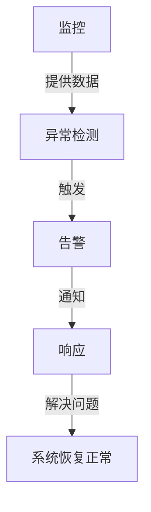

# AI系统告警机制原理与代码实战案例讲解

## 1.背景介绍

在当今快速发展的数字时代，人工智能(AI)系统已经广泛应用于各个领域,包括金融、医疗、制造业等。随着这些系统的复杂性不断增加,确保它们的可靠性和稳定性变得至关重要。因此,建立一个有效的告警机制对于监控AI系统的运行状态、及时发现和解决潜在问题是必不可少的。

### 1.1 告警机制的重要性

告警机制可以帮助我们及时发现系统中的异常情况,例如硬件故障、软件错误、数据质量问题等。及时发现和解决这些问题可以防止系统崩溃或数据损坏,从而确保AI系统的稳定运行。此外,告警机制还可以帮助我们了解系统的运行状态,优化系统性能,并为未来的系统改进提供宝贵的数据和见解。

### 1.2 告警机制的挑战

尽管告警机制的重要性不言而喻,但在实际应用中,构建一个有效的告警机制并非一蹴而就。主要挑战包括:

1. **数据复杂性**: AI系统通常需要处理大量的数据,这些数据可能来自多个来源,具有不同的格式和质量。如何有效地监控这些数据并及时发现异常情况是一个巨大的挑战。

2. **系统复杂性**: 现代AI系统通常由多个模块和组件组成,这些模块和组件之间存在复杂的依赖关系。监控整个系统的运行状态并及时发现潜在问题需要深入了解系统的架构和工作原理。

3. **异常检测**: 定义什么是"异常"并非一件易事。不同的系统和应用场景可能对异常的定义不同。因此,需要根据具体情况设计合适的异常检测算法和策略。

4. **告警策略**: 一旦发现异常情况,如何有效地通知相关人员并采取适当的措施也是一个需要解决的问题。告警策略需要考虑异常的严重程度、优先级以及通知方式等多个因素。

## 2.核心概念与联系

为了更好地理解AI系统的告警机制,我们需要先了解一些核心概念及它们之间的联系。

### 2.1 监控(Monitoring)

监控是告警机制的基础。它指的是持续收集和分析系统的运行数据,以了解系统的当前状态。监控数据可以来自多个来源,如日志文件、指标、事件等。有效的监控可以帮助我们及时发现系统中的异常情况。

### 2.2 异常检测(Anomaly Detection)

异常检测是告警机制的核心部分。它指的是通过分析监控数据,识别出与正常模式不符的异常情况。异常检测算法通常基于统计学、机器学习或深度学习等技术。选择合适的异常检测算法对于准确识别异常至关重要。

### 2.3 告警(Alerting)

当异常情况被检测到时,告警机制会触发相应的告警。告警可以采取多种形式,如发送电子邮件、短信、即时消息或调用API等。告警策略决定了何时触发告警以及通知谁。合理的告警策略可以避免过多的误报或漏报。

### 2.4 响应(Response)

收到告警后,需要采取相应的措施来解决异常情况。响应可以是自动化的,如重启服务或回滚代码;也可以是人工干预,如调查根本原因并采取纠正措施。有效的响应可以最大限度地减少异常情况对系统的影响。

### 2.5 关系图

这些核心概念之间的关系可以用下图来表示:



## 3.核心算法原理具体操作步骤

在上一节中,我们介绍了AI系统告警机制的核心概念。现在,让我们深入探讨异常检测算法的原理和具体操作步骤。

### 3.1 异常检测算法概述

异常检测算法的目标是从大量监控数据中识别出与正常模式不符的异常情况。根据算法的工作原理,异常检测算法可以分为以下几种类型:

1. **基于统计的算法**: 这类算法假设正常数据服从某种已知的统计分布(如高斯分布),并将偏离该分布的数据点视为异常。常见的算法包括基于高斯分布的异常检测、基于核密度估计的异常检测等。

2. **基于距离的算法**: 这类算法基于数据点之间的距离或相似性来判断是否为异常。常见的算法包括基于k-近邻的异常检测、基于聚类的异常检测等。

3. **基于机器学习的算法**: 这类算法利用机器学习技术(如支持向量机、决策树等)从历史数据中学习正常模式,并将偏离该模式的数据点视为异常。

4. **基于深度学习的算法**: 这类算法利用深度神经网络从复杂的数据中自动学习特征,并基于这些特征进行异常检测。常见的算法包括基于自编码器的异常检测、基于生成对抗网络的异常检测等。

选择合适的异常检测算法需要考虑数据的特征、异常的类型以及算法的准确性和效率等因素。在实际应用中,通常需要对多种算法进行比较和调优,以获得最佳的异常检测性能。

### 3.2 异常检测算法具体操作步骤

虽然不同的异常检测算法有所不同,但它们的基本操作步骤是相似的。以基于统计的异常检测算法为例,具体操作步骤如下:

1. **数据预处理**:
   - 清洗和规范化数据,处理缺失值和异常值
   - 对数据进行标准化或归一化,确保不同特征具有相同的数量级

2. **建立正常模式**:
   - 从历史数据中估计正常数据的统计分布,如高斯分布的均值和方差
   - 可以使用参数估计或非参数估计方法,如最大似然估计或核密度估计

3. **异常分数计算**:
   - 对于新的数据点,计算其与正常模式的偏离程度,通常使用概率密度函数或其他相似性度量
   - 偏离程度越大,被视为异常的可能性就越高

4. **异常阈值确定**:
   - 设置一个异常分数阈值,将分数高于该阈值的数据点标记为异常
   - 阈值的选择需要权衡漏报和误报之间的平衡

5. **评估和优化**:
   - 使用标记数据集评估算法的性能,计算精确率、召回率等指标
   - 根据评估结果调整算法参数或选择更合适的算法

6. **持续监控和更新**:
   - 持续监控新的数据,及时检测异常情况
   - 定期更新正常模式,以适应数据分布的变化

需要注意的是,对于不同类型的数据和异常,可能需要采用不同的异常检测算法。此外,在实际应用中,通常需要结合领域知识和专业经验来优化异常检测算法的性能。

## 4.数学模型和公式详细讲解举例说明

在上一节中,我们介绍了异常检测算法的原理和操作步骤。现在,让我们深入探讨一些常见的数学模型和公式,并通过具体示例来加深理解。

### 4.1 高斯分布模型

高斯分布(也称为正态分布)是最常见的统计分布之一,它在异常检测中扮演着重要角色。高斯分布的概率密度函数如下:

$$
f(x) = \frac{1}{\sqrt{2\pi\sigma^2}} \exp\left(-\frac{(x-\mu)^2}{2\sigma^2}\right)
$$

其中,$\mu$是均值,$\sigma^2$是方差。

在异常检测中,我们通常假设正常数据服从高斯分布,并从历史数据中估计$\mu$和$\sigma^2$。对于新的数据点$x$,我们可以计算其概率密度$f(x)$,将密度较低的点视为异常。

**示例**:假设我们正在监控一个服务器的CPU利用率,并希望检测异常的CPU利用率峰值。根据历史数据,我们估计CPU利用率服从均值为50%,标准差为10%的高斯分布。我们可以将概率密度低于某个阈值(例如0.01)的CPU利用率值标记为异常。

### 4.2 核密度估计

核密度估计(Kernel Density Estimation, KDE)是一种非参数密度估计方法,它不假设数据服从任何特定的分布。KDE的基本思想是将每个数据点看作一个核函数(如高斯核),并将所有核函数叠加得到密度估计。

对于一维数据$\{x_1, x_2, \dots, x_n\}$,KDE的公式如下:

$$
\hat{f}(x) = \frac{1}{nh}\sum_{i=1}^n K\left(\frac{x-x_i}{h}\right)
$$

其中,$K(\cdot)$是核函数,$h$是带宽参数,控制核函数的平滑程度。

在异常检测中,我们可以使用KDE来估计正常数据的密度分布,并将密度较低的点视为异常。

**示例**:假设我们正在监控一个网络流量数据集,并希望检测异常的流量峰值。由于网络流量的分布可能是复杂的,我们可以使用KDE来估计其密度分布,而不是假设服从特定的分布(如高斯分布)。

### 4.3 马哈拉诺比斯距离

马哈拉诺比斯距离(Mahalanobis Distance)是一种常用的相似性度量,它考虑了数据的协方差结构。对于$d$维数据点$\mathbf{x}$,其与均值$\boldsymbol{\mu}$的马哈拉诺比斯距离定义为:

$$
D(\mathbf{x}) = \sqrt{(\mathbf{x}-\boldsymbol{\mu})^T\Sigma^{-1}(\mathbf{x}-\boldsymbol{\mu})}
$$

其中,$\Sigma$是数据的协方差矩阵。

在异常检测中,我们可以将马哈拉诺比斯距离较大的点视为异常。这种方法适用于多维数据,并考虑了不同特征之间的相关性。

**示例**:假设我们正在监控一个金融交易系统,并希望检测异常的交易行为。每笔交易可以用多个特征(如金额、时间、地点等)来描述。我们可以从历史数据中估计正常交易的均值和协方差矩阵,并使用马哈拉诺比斯距离来识别异常交易。

## 5.项目实践:代码实例和详细解释说明

为了更好地理解AI系统告警机制的实现,我们将通过一个基于Python的实例项目来演示异常检测算法的具体应用。在这个项目中,我们将使用一个服务器监控数据集,并实现基于高斯分布的异常检测算法。

### 5.1 数据集介绍

我们将使用来自Kaggle的"服务器机器数据集"(Server Machine Dataset)。这个数据集包含了一台服务器在28天内的多个性能指标,如CPU利用率、内存使用情况等。我们的目标是检测CPU利用率的异常峰值。

### 5.2 代码实现

以下是基于高斯分布的异常检测算法的Python实现:

```python
import numpy as np
from scipy.stats import norm

class GaussianAnomalyDetector:
    def __init__(self):
        self.mu = None
        self.sigma = None

    def fit(self, X):
        """
        根据训练数据估计正常分布的均值和标准差
        """
        self.mu = np.mean(X)
        self.sigma = np.std(X)

    def predict(self, X, threshold):
        """
        对新数据进行异常检测,返回异常分数和异常标记
        """
        anomaly_scores = np.abs(X - self.mu) / self.sigma
        anomalies = anomaly_scores > threshold
        return anomaly_scores, anomalies

# 加载数据
data = ... # 从文件或数据库加载CPU利用率数据

# 划分训练集和测试集
train_data = data