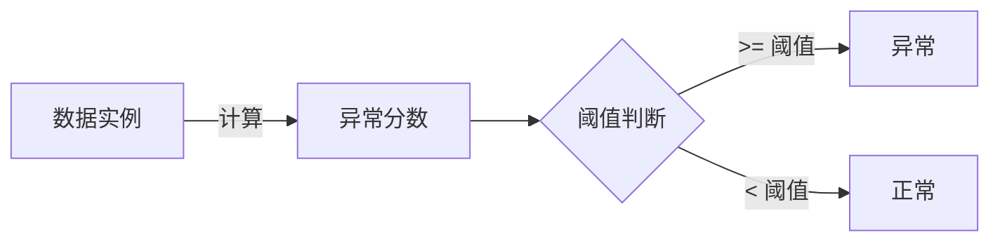

# AI系统异常检测原理与代码实战案例讲解

## 1.背景介绍

在当今快速发展的数字时代，人工智能(AI)系统无处不在。从推荐系统到自动驾驶汽车，AI已经渗透到我们生活的方方面面。然而，随着AI系统的复杂性不断增加,确保其正常运行和检测潜在异常变得至关重要。异常检测是一种识别数据集中异常模式或异常实例的技术,在AI系统的健康监控、故障预防和安全保障方面发挥着关键作用。

### 1.1 异常检测的重要性

异常检测有助于及时发现AI系统中的异常行为、错误或威胁,从而采取相应的纠正措施,避免系统故障或安全隐患。在以下几个领域,异常检测尤为重要:

- **网络安全**: 检测网络入侵、恶意软件活动和不正常的网络流量模式。
- **金融欺诈检测**: 识别可疑的信用卡交易、洗钱活动和其他金融欺诈行为。
- **制造业质量控制**: 监测生产线上的异常,确保产品质量。
- **预测性维护**: 通过检测设备的异常运行状态,提前进行维护,避免故障发生。
- **医疗保健**: 发现疾病症状、医疗影像异常和患者健康数据的异常模式。

### 1.2 异常检测的挑战

尽管异常检测在各个领域都扮演着重要角色,但它也面临着一些挑战:

- **数据不平衡**: 异常数据通常远少于正常数据,导致训练数据集不平衡。
- **异常类型多样**: 异常可能表现为不同的模式,难以用单一模型捕获所有异常类型。
- **数据标注成本高**: 获取大量标注的异常数据通常代价高昂。
- **概念漂移**: 随着时间推移,数据分布可能会发生变化,导致模型性能下降。

为了有效应对这些挑战,研究人员提出了多种异常检测算法和技术,本文将重点介绍其中的核心原理和实战案例。

## 2.核心概念与联系

在深入探讨异常检测算法之前,我们需要了解一些核心概念及其相互关系。

### 2.1 异常检测类型

根据是否利用标签数据进行训练,异常检测可分为三种类型:

1. **监督异常检测(Supervised Anomaly Detection)**: 利用标注的正常数据和异常数据进行训练,通常采用分类或回归模型。这种方法需要大量标注数据,代价较高。

2. **无监督异常检测(Unsupervised Anomaly Detection)**: 只使用未标注的正常数据进行训练,将偏离正常模式的数据视为异常。这种方法不需要异常数据,但可能会将新的正常模式误判为异常。

3. **半监督异常检测(Semi-Supervised Anomaly Detection)**: 利用少量标注的异常数据和大量未标注数据进行训练,结合了监督和无监督方法的优点。

### 2.2 异常分数和阈值

异常检测算法通常会为每个数据实例计算一个异常分数,用于衡量其异常程度。异常分数越高,表示该实例越有可能是异常。通过设置一个阈值,可以将异常分数高于阈值的实例标记为异常。

阈值的选择对异常检测的性能有重大影响。阈值过高,会导致许多异常被忽略;阈值过低,则会产生大量误报。通常需要在准确率和召回率之间进行权衡。

### 2.3 异常检测评估指标

评估异常检测模型的性能通常使用以下指标:

- **准确率(Accuracy)**: 正确预测的实例数占总实例数的比例。
- **精确率(Precision)**: 被正确预测为异常的实例数占所有预测为异常的实例数的比例。
- **召回率(Recall)**: 被正确预测为异常的实例数占所有真实异常实例数的比例。
- **F1分数(F1-Score)**: 精确率和召回率的调和平均值,综合考虑了两者。
- **ROC曲线和AUC(Area Under the Curve)**: ROC曲线显示了不同阈值下的真阳性率和假阳性率,AUC值越高,模型性能越好。

## 3.核心算法原理具体操作步骤

异常检测算法可分为多种类型,每种算法都有其适用场景和优缺点。本节将介绍几种核心算法的原理和具体操作步骤。

### 3.1 基于统计的异常检测算法

#### 3.1.1 高斯分布模型

高斯分布模型假设正常数据服从高斯(正态)分布,任何偏离均值超过一定阈值的数据点都被视为异常。

**算法步骤**:

1. 计算训练数据的均值向量 $\mu$ 和协方差矩阵 $\Sigma$。
2. 对于新的数据实例 $x$,计算其与均值的马哈拉诺比斯距离(Mahalanobis Distance):

$$
D(x) = \sqrt{(x - \mu)^T \Sigma^{-1} (x - \mu)}
$$

3. 设置一个阈值 $\tau$,如果 $D(x) > \tau$,则将 $x$ 标记为异常。

高斯分布模型简单高效,但假设数据服从高斯分布,对于非高斯分布的数据效果不佳。

#### 3.1.2 核密度估计

核密度估计(Kernel Density Estimation, KDE)是一种非参数密度估计方法,可以估计任意分布的概率密度函数。

**算法步骤**:

1. 选择一个核函数 $K(x)$ 和带宽参数 $h$。
2. 对于新的数据实例 $x$,计算其概率密度:

$$
\hat{f}(x) = \frac{1}{n} \sum_{i=1}^n K\left(\frac{x - x_i}{h}\right)
$$

其中 $n$ 是训练数据的数量,$ \{x_1, x_2, \dots, x_n\}$ 是训练数据集。

3. 设置一个阈值 $\tau$,如果 $\hat{f}(x) < \tau$,则将 $x$ 标记为异常。

核密度估计可以处理任意分布的数据,但计算复杂度较高,并且需要选择合适的核函数和带宽参数。

### 3.2 基于距离的异常检测算法

#### 3.2.1 k-最近邻算法(k-NN)

k-NN算法基于这样的假设:正常数据点周围会有足够多的k个最近邻居,而异常数据点周围的邻居数量较少。

**算法步骤**:

1. 对于新的数据实例 $x$,计算它与训练数据集中所有点的距离。
2. 选择距离 $x$ 最近的 $k$ 个邻居。
3. 计算 $x$ 到这 $k$ 个邻居的平均距离 $d_k(x)$。
4. 设置一个阈值 $\tau$,如果 $d_k(x) > \tau$,则将 $x$ 标记为异常。

k-NN算法简单直观,但对噪声和outlier敏感,并且需要选择合适的 $k$ 值和距离度量。

#### 3.2.2 局部异常系数(LOF)

局部异常系数(Local Outlier Factor, LOF)是一种基于密度的异常检测算法,它通过比较数据点与其邻居的密度来判断是否为异常。

**算法步骤**:

1. 对于每个数据点 $p$,计算其 $k$ 距离邻域 $N_k(p)$,即距离 $p$ 最近的 $k$ 个邻居。
2. 计算 $p$ 的可达密度(reachability density):

$$
\text{lrd}_k(p) = \frac{|N_k(p)|}{\sum_{o \in N_k(p)} d(p, o)}
$$

其中 $d(p, o)$ 是 $p$ 和 $o$ 之间的距离。

3. 计算 $p$ 的局部异常系数:

$$
\text{LOF}_k(p) = \frac{\sum_{o \in N_k(p)} \frac{\text{lrd}_k(o)}{\text{lrd}_k(p)}}{|N_k(p)|}
$$

4. 设置一个阈值 $\tau$,如果 $\text{LOF}_k(p) > \tau$,则将 $p$ 标记为异常。

LOF算法能够很好地检测出局部异常,但对全局异常的检测效果不佳,并且需要选择合适的 $k$ 值和距离度量。

### 3.3 基于模型的异常检测算法

#### 3.3.1 一类支持向量机(One-Class SVM)

一类支持向量机(One-Class SVM)是一种半监督异常检测算法,它试图在高维空间中找到一个超平面,将大部分数据点包围在一个紧凑的区域内,而将异常点隔离在外。

**算法步骤**:

1. 将训练数据映射到高维特征空间。
2. 在特征空间中找到一个超平面,使得大部分数据点落在该超平面的一侧,而异常点落在另一侧。
3. 对于新的数据实例 $x$,计算它与超平面的距离 $d(x)$。
4. 设置一个阈值 $\tau$,如果 $d(x) > \tau$,则将 $x$ 标记为异常。

One-Class SVM可以有效检测出异常点,但对异常点的分布形状敏感,并且需要选择合适的核函数和参数。

#### 3.3.2 自编码器(Autoencoder)

自编码器是一种无监督神经网络模型,它试图学习输入数据的压缩表示,并从该压缩表示重构原始输入。异常检测的思路是,正常数据可以被较好地重构,而异常数据则无法很好地重构。

**算法步骤**:

1. 使用正常数据训练一个自编码器模型,包括编码器和解码器。
2. 对于新的数据实例 $x$,将其输入编码器,得到压缩表示 $z$。
3. 将 $z$ 输入解码器,得到重构输出 $\hat{x}$。
4. 计算重构误差 $L(x, \hat{x})$,例如均方误差或交叉熵损失。
5. 设置一个阈值 $\tau$,如果 $L(x, \hat{x}) > \tau$,则将 $x$ 标记为异常。

自编码器可以学习数据的潜在特征,对复杂数据的异常检测效果较好,但需要大量的正常数据进行训练,并且对异常数据的重构误差阈值的选择较为敏感。

## 4.数学模型和公式详细讲解举例说明

在异常检测算法中,数学模型和公式扮演着重要的角色。本节将详细讲解一些核心公式,并给出具体的例子说明。

### 4.1 马哈拉诺比斯距离

马哈拉诺比斯距离(Mahalanobis Distance)是一种基于协方差矩阵的距离度量,它可以有效地衡量一个数据点与分布的偏离程度。在高斯分布模型中,我们使用马哈拉诺比斯距离来计算数据点与均值的距离。

$$
D(x) = \sqrt{(x - \mu)^T \Sigma^{-1} (x - \mu)}
$$

其中 $x$ 是数据点, $\mu$ 是均值向量, $\Sigma$ 是协方差矩阵。

**示例**:

假设我们有一个二维数据集,其均值为 $\mu = (0, 0)$,协方差矩阵为 $\Sigma = \begin{bmatrix}1 & 0.5\\0.5 & 1\end{bmatrix}$。对于数据点 $x = (2, 1)$,我们可以计算它的马哈拉诺比斯距离:

$$
D(x) = \sqrt{(2, 1) \begin{bmatrix}1 & -0.5\\-0.5 & 1\end{bmatrix} \begin{pmatrix}2\\1\end{pmatrix}} = \sqrt{2.5} \approx 1.58
$$

由于这个距离较大,我们可以将 $x$ 标记为异