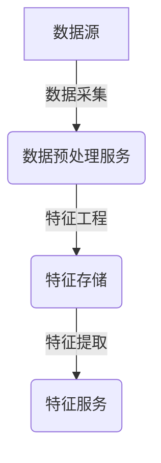
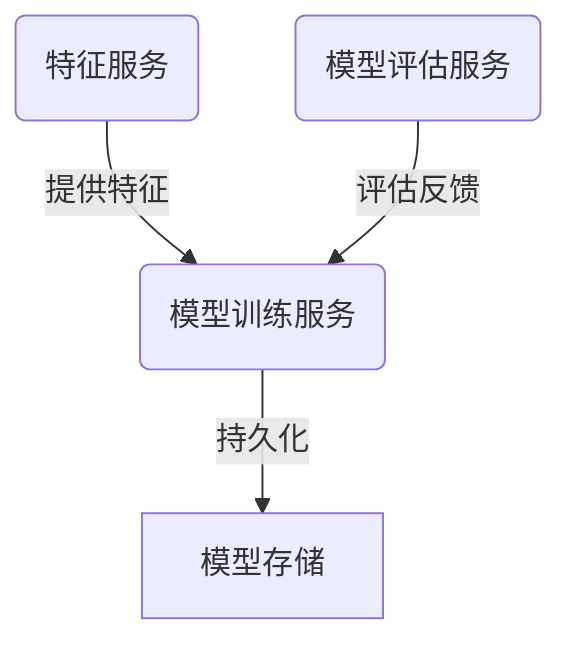
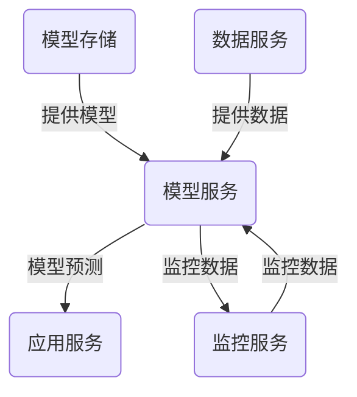

# AI系统微服务架构原理与代码实战案例讲解

## 1.背景介绍

### 1.1 微服务架构的兴起

随着云计算、DevOps和敏捷开发的兴起,软件系统架构也在发生着翻天覆地的变革。传统的单体应用程序架构已经无法满足现代软件系统的需求,如高可用性、可扩展性、敏捷交付等。微服务架构应运而生,它将庞大的单体应用拆分为一组小型、自治的服务,每个服务负责实现一个单一的业务能力,服务之间通过轻量级通信机制相互协作。

### 1.2 人工智能系统的复杂性

人工智能(AI)系统通常涉及大规模的数据处理、复杂的算法计算和模型训练等,对系统的可扩展性、弹性和并行处理能力提出了很高的要求。同时,AI系统还需要集成多种异构技术栈,如深度学习框架、大数据处理引擎等,系统的复杂性进一步增加。将微服务架构应用于AI系统,可以很好地解决这些挑战。

## 2.核心概念与联系

### 2.1 微服务架构

微服务架构是一种将单个应用程序作为一套小型服务的套件,这些服务是用不同编程语言编写的,并在自己的进程中运行,并相互通信来实现应用程序的业务目标。每个服务执行单个功能,服务之间通过轻量级通信机制(如HTTP RESTful API)相互协作。

微服务架构的核心理念包括:

- 服务的单一职责
- 服务的自治性
- 服务的去中心化
- 面向服务的通信
- 分散治理

### 2.2 人工智能系统

人工智能系统通常包括以下几个核心组件:

- 数据处理管道
- 算法和模型
- 训练和评估
- 部署和服务
- 监控和反馈

这些组件协同工作以构建智能系统,如计算机视觉、自然语言处理、推荐系统等。

### 2.3 微服务与人工智能的结合

将微服务架构应用于人工智能系统,可以将复杂的AI系统拆分为多个专注于单一职责的微服务,如数据采集服务、特征工程服务、模型训练服务、模型服务等。这些微服务可以独立开发、部署和扩展,提高了系统的灵活性和可维护性。同时,微服务架构天生支持分布式计算和并行处理,可以充分利用云计算资源,加速AI算法的训练和推理过程。

## 3.核心算法原理具体操作步骤 

在微服务架构中,AI系统的核心算法原理和操作步骤可以概括为以下几个方面:

### 3.1 数据处理管道



1. **数据采集**: 从各种数据源(如日志、传感器、网络等)收集原始数据,可以通过消息队列或数据湖等方式进行数据的缓冲和持久化存储。
2. **数据预处理**: 对原始数据进行清洗、转换、规范化等预处理,输出结构化的数据,可以作为独立的数据预处理微服务。
3. **特征工程**: 从预处理后的数据中提取特征,进行特征选择、特征编码等操作,输出特征数据,可以作为独立的特征工程微服务。
4. **特征服务**: 对特征数据进行服务化,为模型训练和模型服务提供特征数据支持。

### 3.2 模型训练和评估



1. **模型训练服务**: 根据特征数据、训练数据,选择合适的算法和模型,进行模型的训练,输出训练好的模型。
2. **模型评估服务**: 对训练好的模型进行评估,计算各种评估指标,并将评估结果反馈给模型训练服务,用于模型的优化和调整。
3. **模型存储**: 将训练好的模型持久化存储,为模型服务提供模型支持。

### 3.3 模型服务和监控



1. **模型服务**: 加载已训练好的模型,对输入数据进行预测或推理,为应用服务提供模型推理能力。
2. **数据服务**: 为模型服务提供待预测的数据支持,可以是实时数据流或离线数据集。
3. **应用服务**: 将模型服务的预测结果应用于具体的业务场景,如推荐系统、智能助手等。
4. **监控服务**: 监控模型服务的运行状态、性能指标、错误日志等,为模型的优化和迭代提供数据支持。

## 4.数学模型和公式详细讲解举例说明

在人工智能系统中,数学模型和公式扮演着至关重要的角色。以下是一些常见的数学模型和公式,以及它们在微服务架构中的应用:

### 4.1 线性回归

线性回归是一种常见的监督学习算法,用于预测连续型目标变量。它的数学模型如下:

$$y = \theta_0 + \theta_1x_1 + \theta_2x_2 + ... + \theta_nx_n$$

其中$y$是目标变量,$x_i$是特征变量,$\theta_i$是模型参数。

在微服务架构中,线性回归模型可以作为一个独立的模型服务,接收特征数据$x_i$,计算预测值$y$,并将结果返回给应用服务。

### 4.2 逻辑回归

逻辑回归是一种用于分类问题的监督学习算法,它的数学模型如下:

$$P(y=1|x) = \sigma(\theta_0 + \theta_1x_1 + \theta_2x_2 + ... + \theta_nx_n)$$
$$\sigma(z) = \frac{1}{1+e^{-z}}$$

其中$P(y=1|x)$表示给定特征$x$时,目标变量$y$为1的概率,$\sigma$是sigmoid函数,用于将线性组合的结果映射到(0,1)区间。

在微服务架构中,逻辑回归模型可以作为一个独立的分类模型服务,接收特征数据$x_i$,计算目标变量为1的概率$P(y=1|x)$,并将结果返回给应用服务。

### 4.3 决策树

决策树是一种常用的监督学习算法,可以用于分类和回归问题。它的工作原理是根据特征变量的值,递归地将数据集划分为更小的子集,直到每个子集都具有相同的目标变量值或满足某个停止条件。

决策树的构建过程可以用以下公式表示:

$$G(D,A) = \sum_{v=1}^V\frac{|D^v|}{|D|}H(D^v)$$

其中$G(D,A)$表示根据特征$A$对数据集$D$进行划分后的不纯度,$D^v$是根据$A$的取值$v$划分出的子集,$H(D^v)$是子集$D^v$的不纯度,通常使用信息熵或基尼指数来衡量。

在微服务架构中,决策树模型可以作为一个独立的模型服务,接收特征数据,构建决策树模型,并根据模型对新数据进行预测或分类,将结果返回给应用服务。

### 4.4 神经网络

神经网络是一种强大的机器学习模型,可以用于各种任务,如分类、回归、聚类等。它的数学模型如下:

$$y = f(W^{(L)}a^{(L-1)} + b^{(L)})$$
$$a^{(l)} = g(W^{(l)}a^{(l-1)} + b^{(l)})$$

其中$y$是输出,$a^{(l)}$是第$l$层的激活值,$W^{(l)}$和$b^{(l)}$分别是第$l$层的权重和偏置,$f$和$g$是激活函数,如sigmoid、ReLU等。

在微服务架构中,神经网络模型可以作为一个独立的深度学习模型服务,接收特征数据,进行模型的训练和推理,将预测结果返回给应用服务。

## 5.项目实践:代码实例和详细解释说明

为了更好地理解微服务架构在人工智能系统中的应用,我们将通过一个实际的代码示例来进行说明。在这个示例中,我们将构建一个简单的推荐系统,包括以下几个微服务:

- 数据采集服务
- 数据预处理服务
- 特征工程服务
- 模型训练服务
- 模型服务
- 推荐服务

### 5.1 数据采集服务

数据采集服务负责从各种数据源收集原始数据,例如用户行为日志、商品信息等。我们使用Python的Flask框架来实现这个服务。

```python
from flask import Flask, request

app = Flask(__name__)

# 模拟数据源
user_logs = [
    {"user_id": 1, "item_id": 101, "event": "view"},
    {"user_id": 1, "item_id": 102, "event": "purchase"},
    {"user_id": 2, "item_id": 103, "event": "view"},
    # ...
]

items = [
    {"item_id": 101, "name": "Product A", "category": "Electronics"},
    {"item_id": 102, "name": "Product B", "category": "Books"},
    {"item_id": 103, "name": "Product C", "category": "Clothing"},
    # ...
]

@app.route("/logs", methods=["GET"])
def get_logs():
    return {"logs": user_logs}

@app.route("/items", methods=["GET"])
def get_items():
    return {"items": items}

if __name__ == "__main__":
    app.run(host="0.0.0.0", port=5000)
```

在这个示例中,我们模拟了两个数据源:用户行为日志(`user_logs`)和商品信息(`items`)。我们使用Flask框架提供了两个API端点,分别返回这两个数据源的数据。

### 5.2 数据预处理服务

数据预处理服务负责对原始数据进行清洗、转换和规范化等预处理操作。我们使用Python的Pandas库来实现这个服务。

```python
import pandas as pd
import requests

# 从数据采集服务获取原始数据
logs_response = requests.get("http://data-collector:5000/logs")
items_response = requests.get("http://data-collector:5000/items")

# 将原始数据转换为DataFrame
logs_df = pd.DataFrame(logs_response.json()["logs"])
items_df = pd.DataFrame(items_response.json()["items"])

# 数据预处理
logs_df = logs_df.rename(columns={"event": "label"})
logs_df["label"] = logs_df["label"].apply(lambda x: 1 if x == "purchase" else 0)
logs_df = logs_df.merge(items_df[["item_id", "category"]], on="item_id", how="left")

# 保存预处理后的数据
logs_df.to_csv("processed_data.csv", index=False)
```

在这个示例中,我们首先从数据采集服务获取原始数据,并将其转换为Pandas DataFrame。然后,我们对数据进行以下预处理操作:

1. 将"event"列重命名为"label"
2. 将"label"列中的值映射为0(view)或1(purchase)
3. 将用户日志数据与商品信息进行合并,以获取商品类别信息

最后,我们将预处理后的数据保存为CSV文件,供后续的特征工程服务使用。

### 5.3 特征工程服务

特征工程服务负责从预处理后的数据中提取特征,进行特征选择和编码等操作。我们使用Python的scikit-learn库来实现这个服务。

```python
import pandas as pd
from sklearn.feature_extraction import DictVectorizer

# 加载预处理后的数据
data = pd.read_csv("processed_data.csv")

# 特征工程
feature_cols = ["user_id", "category"]
X = data[feature_cols].to_dict("records")

# 特征编码
vectorizer = DictVectorizer()
X_encoded = vectorizer.fit_transform(X)

# 保存特征数据和编码器
import pickle
pickle.dump