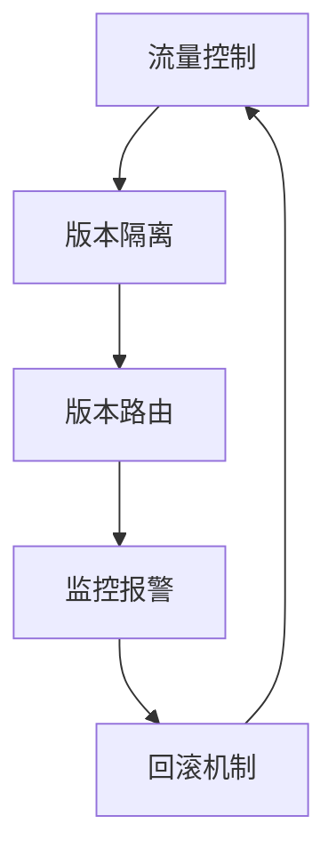

# AI系统灰度发布原理与代码实战案例讲解

## 1.背景介绍

在现代软件开发过程中,AI系统的上线发布是一个极其关键且具有挑战性的环节。由于AI系统的复杂性和不确定性,直接全量发布可能会带来严重的风险和影响。为了降低风险,确保系统的平稳过渡,灰度发布(也称为金丝雀发布或滚动发布)应运而生。

灰度发布是一种可控的渐进式发布策略,通过将系统逐步推广到部分用户或服务器上,监控系统运行状况,快速发现和解决问题,从而降低全量发布的风险。这种发布方式使得新版本系统可以在生产环境中得到充分测试,确保质量满足要求后再全量发布。

## 2.核心概念与联系

灰度发布的核心概念包括:

1. **流量控制**:通过配置规则控制新旧版本系统的流量占比,实现平滑过渡。

2. **版本隔离**:新旧版本系统相互隔离,避免相互影响。

3. **版本路由**:根据配置规则将请求路由到对应版本。

4. **监控报警**:实时监控新版本系统的运行状态,及时发现异常。

5. **回滚机制**:当新版本出现严重问题时,可快速回滚到旧版本。

这些概念相互关联,共同构建了灰度发布的完整流程。



## 3.核心算法原理具体操作步骤

灰度发布的核心算法原理可以概括为以下几个步骤:

1. **流量分流**

   通过配置规则,将总体流量按照预设比例分成两部分,分别路由到新旧版本系统。常用的分流算法包括:

   - 基于权重的随机分流
   - 基于哈希一致性的分流
   - 基于语义路由的分流

2. **版本隔离**

   新旧版本系统相互隔离,避免相互影响。可通过以下方式实现:

   - 部署在不同的服务器/集群上
   - 使用不同的命名空间或容器
   - 使用网络隔离(如Docker网络或K8s网络策略)

3. **版本路由**

   根据分流规则,将请求路由到对应的新旧版本系统。常用的路由方式包括:

   - 基于Nginx/Envoy的反向代理
   - 基于服务网格(如Istio)的路由
   - 基于API网关的路由

4. **监控报警**

   实时监控新版本系统的关键指标,如响应时间、错误率、流量等,并设置合理的阈值。一旦出现异常,立即触发报警,通知相关人员。

5. **回滚机制**

   当新版本出现严重问题时,需要快速回滚到旧版本,以免影响整体系统。回滚可通过以下方式实现:

   - 修改流量分流规则,将所有流量路由到旧版本
   - 关闭新版本实例,启用旧版本实例
   - 基于服务网格的流量镜像和即时回滚

以上步骤构成了灰度发布的核心算法流程,确保了发布过程的可控性和安全性。

## 4.数学模型和公式详细讲解举例说明

在灰度发布过程中,我们需要合理控制新旧版本系统的流量占比。假设总流量为 $\lambda$,我们希望将 $p$ 部分流量路由到新版本系统,剩余 $1-p$ 部分流量路由到旧版本系统。

我们可以使用**基于权重的随机分流算法**来实现这一目标。该算法的核心思想是:为新旧版本系统分配不同的权重,然后根据权重随机选择路由目标。

设新版本系统的权重为 $w_1$,旧版本系统的权重为 $w_2$,则有:

$$
\begin{aligned}
w_1 + w_2 &= 1 \\
p &= \frac{w_1}{w_1 + w_2} = w_1
\end{aligned}
$$

因此,只需要将新版本系统的权重设置为 $p$,旧版本系统的权重设置为 $1-p$,即可实现期望的流量分配。

例如,如果我们希望将 20% 的流量路由到新版本系统,80% 的流量路由到旧版本系统,则可以设置:

$$
\begin{aligned}
w_1 &= 0.2 \\
w_2 &= 0.8
\end{aligned}
$$

在实际实现中,我们可以使用伪随机数生成器,生成 $[0,1)$ 范围内的随机数 $r$。如果 $r < w_1$,则路由到新版本系统;否则路由到旧版本系统。

```python
import random

def route(w1, w2):
    r = random.random()
    if r < w1:
        return "new_version"
    else:
        return "old_version"

w1 = 0.2  # 新版本权重
w2 = 0.8  # 旧版本权重

print(route(w1, w2))  # 输出 "new_version" 或 "old_version"
```

通过调整 $w_1$ 和 $w_2$ 的值,我们可以动态控制新旧版本系统的流量占比,实现灰度发布的平滑过渡。

## 5.项目实践:代码实例和详细解释说明

为了更好地理解灰度发布的实现,我们将使用 Python 和 Flask 框架构建一个简单的示例项目。

### 5.1 项目结构

```
gray-release-demo/
├── app.py
├── requirements.txt
├── templates/
│   └── index.html
└── utils.py
```

- `app.py`: Flask 应用程序入口
- `requirements.txt`: 项目依赖库列表
- `templates/index.html`: 渲染页面模板
- `utils.py`: 实现灰度发布相关功能的工具模块

### 5.2 核心代码解释

1. `utils.py`

```python
import hashlib

def hash_routing(user_id, version_count=2):
    """基于哈希一致性的路由算法"""
    hash_value = hashlib.sha256(str(user_id).encode()).hexdigest()
    return int(hash_value, 16) % version_count

def weighted_random_routing(weights):
    """基于权重的随机路由算法"""
    import random
    total = sum(weights.values())
    r = random.uniform(0, total)
    cumulative = 0
    for version, weight in weights.items():
        cumulative += weight
        if r <= cumulative:
            return version
```

这个模块实现了两种常用的路由算法:

- `hash_routing`: 基于哈希一致性的路由算法,根据用户 ID 计算哈希值,将其映射到不同的版本。这种方式确保同一个用户始终被路由到同一个版本,避免了会话不一致的问题。
- `weighted_random_routing`: 基于权重的随机路由算法,根据配置的权重随机选择版本。这种方式可以灵活控制不同版本的流量占比。

2. `app.py`

```python
from flask import Flask, render_template, request
from utils import hash_routing, weighted_random_routing

app = Flask(__name__)

# 版本配置
VERSIONS = {
    "v1": "Version 1",
    "v2": "Version 2"
}

# 权重配置
WEIGHTS = {
    "v1": 0.8,
    "v2": 0.2
}

@app.route('/')
def index():
    user_id = request.args.get('user_id', 'default')

    # 使用哈希一致性路由算法
    version = VERSIONS[f"v{hash_routing(user_id, len(VERSIONS)) + 1}"]

    # 使用基于权重的随机路由算法
    # version = VERSIONS[weighted_random_routing(WEIGHTS)]

    return render_template('index.html', version=version)

if __name__ == '__main__':
    app.run(debug=True)
```

这是 Flask 应用程序的主要逻辑:

- 定义了两个版本 `v1` 和 `v2`
- 配置了版本权重,`v1` 占 80%,`v2` 占 20%
- 在 `/` 路由中,根据请求参数 `user_id` 使用不同的路由算法选择版本
  - 默认使用基于哈希一致性的路由算法 `hash_routing`
  - 也可以使用基于权重的随机路由算法 `weighted_random_routing`
- 将选择的版本渲染到 `index.html` 模板中

### 5.3 运行示例

1. 安装依赖库

```
pip install -r requirements.txt
```

2. 启动 Flask 应用程序

```
python app.py
```

3. 在浏览器中访问 `http://localhost:5000/?user_id=1`

你将看到渲染的页面显示了当前路由到的版本,例如 "Version 1"。

4. 尝试修改 `user_id` 参数或切换路由算法,观察版本的变化。

通过这个简单的示例,你可以更好地理解灰度发布的实现原理和代码细节。在实际项目中,你还需要考虑版本隔离、监控报警、回滚机制等其他重要组件,以确保灰度发布的安全性和可靠性。

## 6.实际应用场景

灰度发布广泛应用于各种场景,尤其是对于大型、复杂的分布式系统。以下是一些典型的应用场景:

1. **大型互联网公司**

   像谷歌、Facebook、Netflix 等大型互联网公司,他们的系统规模庞大,用户量巨大,任何小的变更都可能产生重大影响。因此,他们广泛采用灰度发布策略,先在小范围内测试新版本,确保稳定性后再逐步扩大范围,最终实现全量发布。

2. **电子商务平台**

   电商平台的系统需要保证7x24小时的高可用性,任何停机或故障都可能造成巨大的经济损失。因此,像亚马逊、淘宝等电商平台都采用灰度发布,先在非核心系统或小部分用户上线新版本,待验证无误后再全量发布。

3. **金融服务**

   金融行业对系统的可靠性和安全性要求极高,任何故障都可能造成严重后果。因此,银行、证券等金融机构在升级核心系统时,通常会采用灰度发布策略,先在非关键系统或内部测试环境中验证新版本,再逐步推广到生产环境。

4. **游戏行业**

   游戏行业的用户群体庞大,任何版本升级都可能影响大量玩家的体验。因此,像腾讯、网易等游戏公司在发布新版本时,通常会先在部分区服或部分玩家群体上线,收集反馈并修复问题,再逐步推广到全部区服和玩家。

5. **物联网和边缘计算**

   在物联网和边缘计算领域,设备种类繁多,环境复杂,直接全量升级风险很高。因此,通常会先在部分设备或区域上线新版本,验证稳定性后再逐步推广。

总的来说,对于任何规模较大、复杂度较高、对可靠性和安全性要求较高的系统,采用灰度发布策略都是一种明智的选择,可以最大程度降低风险,确保平稳过渡。

## 7.工具和资源推荐

为了更好地实现灰度发布,我们可以借助一些优秀的开源工具和资源:

1. **Istio**

   Istio 是一个开源的服务网格,提供了强大的流量管理、策略执行和遥测功能。它可以轻松实现灰度发布、金丝雀发布、A/B 测试等策略。Istio 支持多种流量路由算法,如基于权重、基于标签、基于HTTP头等。

2. **Nginx**

   Nginx 是一个高性能的 Web 服务器和反向代理服务器,可以用于实现灰度发布。通过配置 Nginx 的上游服务器组和权重,可以实现基于权重的流量分配。Nginx 还支持基于 IP 哈希、URL 哈希等路由算法。

3. **Envoy**

   Envoy 是一个开源的边缘代理和通信总线,类似于 Nginx,但更加现代化和云原生。它提供了丰富的流量管理功能,包括灰度发布、金丝雀发布、故障注入等。Envoy 可以与 Istio 等服务网格集成,也可以单独