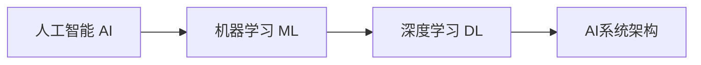

# AI系统设计原理与代码实战案例讲解

## 1.背景介绍

人工智能(AI)已经成为当今科技领域最热门、最具革命性的技术之一。从语音助手到自动驾驶汽车,从医疗诊断到金融分析,AI系统正在各个领域发挥着越来越重要的作用。然而,设计和构建高质量的AI系统并非易事,需要深入理解AI的核心原理,掌握相关算法和数学模型,并具备编程和系统架构方面的专业知识。

本文将深入探讨AI系统设计的核心原理,介绍常用的AI算法和数学模型,并通过实战案例讲解如何将理论付诸实践,开发出高效、可靠的AI应用程序。无论您是AI领域的从业者、开发者还是对该领域感兴趣的读者,本文都将为您提供宝贵的见解和实用的技术指导。

## 2.核心概念与联系

在深入探讨AI系统设计原理之前,我们需要先了解一些核心概念及其相互关系。

### 2.1 人工智能(AI)

人工智能是一门致力于让机器模拟人类智能行为的科学和技术。它涵盖了多个领域,包括机器学习、自然语言处理、计算机视觉、专家系统等。AI系统通过数据训练,学习模式并做出智能决策。

### 2.2 机器学习(ML)

机器学习是AI的一个重要分支,它使计算机能够从数据中自动学习并改进,而无需显式编程。常见的机器学习算法包括监督学习、非监督学习和强化学习等。

### 2.3 深度学习(DL)

深度学习是机器学习的一种特殊形式,它基于人工神经网络,通过多层非线性变换对数据进行特征提取和模式识别。深度学习在图像识别、语音识别等领域表现出色。

### 2.4 AI系统架构

AI系统架构描述了AI应用程序的整体结构和组件之间的交互方式。合理的架构设计对于构建高效、可扩展的AI系统至关重要。

这些核心概念相互关联、互为支撑,共同构成了AI系统设计的理论基础。下面我们将逐一深入探讨它们的原理和实现方法。

## 3.核心算法原理具体操作步骤

AI系统设计涉及多种算法和模型,本节将介绍几种常用算法的原理及具体操作步骤。

### 3.1 监督学习算法

监督学习是机器学习中最常见的一种范式,它使用带有标签的训练数据来学习一个模型,然后对新的未标记数据进行预测或分类。

#### 3.1.1 线性回归

线性回归是一种简单但有效的监督学习算法,用于预测连续值的目标变量。其基本思想是找到一条最佳拟合直线,使数据点到直线的距离之和最小。

1. 准备数据集,包括自变量(特征)和因变量(目标)。
2. 定义代价函数(如均方误差),衡量预测值与实际值之间的差异。
3. 使用梯度下降法最小化代价函数,迭代调整模型参数(权重和偏置)。
4. 在测试集上评估模型性能,如果不理想,可以尝试特征工程或调整超参数。

#### 3.1.2 逻辑回归

逻辑回归是一种用于分类任务的算法,常用于二分类问题。它通过sigmoid函数将输入映射到0到1之间的概率值,从而预测样本属于某个类别的概率。

1. 准备二分类数据集,将目标变量编码为0或1。
2. 定义代价函数,如交叉熵损失函数。
3. 使用梯度下降法最小化代价函数,迭代调整模型参数。
4. 在测试集上评估模型性能,可视化ROC曲线和计算AUC值。

#### 3.1.3 决策树和随机森林

决策树是一种基于树形结构的监督学习算法,通过对特征进行递归分割来进行预测或分类。随机森林是集成多个决策树的算法,通过投票或平均的方式提高预测精度。

1. 准备训练数据集,对于分类问题需要将目标变量编码。
2. 选择合适的决策树算法,如ID3、C4.5或CART。
3. 构建决策树模型,通过信息增益或基尼系数选择最优特征进行分割。
4. 对于随机森林,构建多个决策树,并对它们的预测结果进行组合。
5. 在测试集上评估模型性能,计算准确率或其他指标。

### 3.2 非监督学习算法

非监督学习旨在从未标记的数据中发现隐藏的模式或结构,常用于聚类和降维等任务。

#### 3.2.1 K-Means聚类

K-Means是一种简单而流行的聚类算法,它将数据划分为K个簇,使得每个数据点都属于离它最近的簇的质心。

1. 选择K个初始质心,通常是随机选取K个数据点。
2. 对于每个数据点,计算它与每个质心的距离,将其分配给最近的簇。
3. 重新计算每个簇的质心,即簇内所有点的均值。
4. 重复步骤2和3,直到簇分配不再发生变化或达到最大迭代次数。

#### 3.2.2 主成分分析(PCA)

PCA是一种常用的降维技术,它通过正交变换将原始特征投影到一组相互正交的主成分上,从而减少特征的维度。

1. 对数据进行归一化处理,使每个特征具有相同的尺度。
2. 计算数据的协方差矩阵。
3. 对协方差矩阵进行特征值分解,得到特征向量和特征值。
4. 选择前N个最大特征值对应的特征向量作为主成分。
5. 将原始数据投影到主成分空间,得到降维后的数据。

### 3.3 深度学习算法

深度学习算法基于人工神经网络,通过多层非线性变换对数据进行特征提取和模式识别。常见的深度学习模型包括卷积神经网络(CNN)和循环神经网络(RNN)等。

#### 3.3.1 卷积神经网络(CNN)

CNN是一种专门用于处理图像数据的深度神经网络,它通过卷积、池化等操作来提取图像的局部特征。

1. 构建CNN模型架构,包括卷积层、池化层和全连接层。
2. 初始化模型参数,如卷积核权重和偏置。
3. 对训练数据进行预处理,如归一化和数据增强。
4. 定义损失函数和优化器,通常使用交叉熵损失和Adam优化器。
5. 训练模型,使用反向传播算法更新模型参数。
6. 在测试集上评估模型性能,如准确率或其他指标。

#### 3.3.2 循环神经网络(RNN)

RNN是一种专门处理序列数据(如文本和时间序列)的深度神经网络,它能够捕捉数据中的时序依赖关系。

1. 构建RNN模型架构,包括embedding层、RNN层和全连接层。
2. 初始化模型参数,如embedding矩阵和RNN权重。
3. 对训练数据进行预处理,如文本TokenizationUnk和Padding。
4. 定义损失函数和优化器,常用交叉熵损失和Adam优化器。
5. 训练模型,使用反向传播算法更新模型参数。
6. 在测试集上评估模型性能,如准确率或其他指标。

## 4.数学模型和公式详细讲解举例说明

AI系统设计中涉及大量的数学概念和模型,本节将详细介绍其中的几个重要模型及公式。

### 4.1 线性代数

线性代数是AI领域的基础数学工具,它广泛应用于神经网络、主成分分析等算法中。

#### 4.1.1 矩阵和向量

矩阵是一种二维数组,用于表示多维数据和线性变换。向量是一维矩阵,可以表示特征向量或权重向量。

$$
A = \begin{bmatrix}
a_{11} & a_{12} & \cdots & a_{1n} \\
a_{21} & a_{22} & \cdots & a_{2n} \\
\vdots & \vdots & \ddots & \vdots \\
a_{m1} & a_{m2} & \cdots & a_{mn}
\end{bmatrix}, \quad
\vec{x} = \begin{bmatrix}
x_1 \\
x_2 \\
\vdots \\
x_n
\end{bmatrix}
$$

其中$A$是一个$m\times n$矩阵,$\vec{x}$是一个$n$维向量。

#### 4.1.2 矩阵运算

矩阵运算是线性代数中的基本运算,包括加法、乘法、转置等。在AI算法中,矩阵运算常用于权重更新、特征变换等操作。

$$
C = A + B \quad (\text{加法})\\
C = AB \quad (\text{乘法})\\
C = A^T \quad (\text{转置})
$$

### 4.2 概率论与统计

概率论和统计学为AI系统提供了处理不确定性和噪声的理论基础,在许多算法中扮演着重要角色。

#### 4.2.1 概率分布

概率分布描述了随机变量取值的可能性,是许多机器学习算法的基础。常见的概率分布包括高斯分布(正态分布)、伯努利分布、多项式分布等。

高斯分布的概率密度函数为:

$$
f(x) = \frac{1}{\sqrt{2\pi\sigma^2}}e^{-\frac{(x-\mu)^2}{2\sigma^2}}
$$

其中$\mu$是均值,$\sigma^2$是方差。

#### 4.2.2 最大似然估计

最大似然估计是一种常用的参数估计方法,它通过最大化观测数据的似然函数来估计模型参数。

设有观测数据$X=\{x_1,x_2,\ldots,x_n\}$,参数向量为$\theta$,似然函数为:

$$
L(\theta|X) = \prod_{i=1}^n f(x_i|\theta)
$$

最大似然估计即求解:

$$
\hat{\theta} = \arg\max_\theta L(\theta|X)
$$

### 4.3 优化理论

优化理论为AI算法提供了求解最优解的数学框架,如梯度下降法、拟牛顿法等,在训练神经网络时发挥着关键作用。

#### 4.3.1 梯度下降法

梯度下降法是一种常用的优化算法,它通过沿着目标函数的负梯度方向迭代更新参数,从而最小化目标函数。

设目标函数为$J(\theta)$,参数为$\theta$,则梯度下降法的迭代公式为:

$$
\theta_{t+1} = \theta_t - \eta \nabla J(\theta_t)
$$

其中$\eta$是学习率,控制每次迭代的步长。

#### 4.3.2 随机梯度下降

对于大规模数据集,可以使用随机梯度下降(SGD)算法来加速训练过程。SGD在每次迭代中只使用一个或少量样本来估计梯度,从而减少了计算开销。

设损失函数为$J(\theta;x^{(i)},y^{(i)})$,其中$(x^{(i)},y^{(i)})$是一个样本,SGD的更新公式为:

$$
\theta_{t+1} = \theta_t - \eta \nabla J(\theta_t;x^{(i)},y^{(i)})
$$

通过对多个小批量样本的梯度求平均,可以进一步提高SGD的稳定性和收敛速度。

## 5.项目实践:代码实例和详细解释说明

理论知识虽然重要,但将其付诸实践同样至关重要。本节将通过一个实际案例,展示如何使用Python和流行的机器学习库(如TensorFlow、Keras和scikit-learn)来构建AI系统。

### 5.1 案例背景

我们将构建一个图像分类系统,能够识别手写数字图像。这是一个典型的计算机视觉和模式识别任务,可以应用于光学字符识别(