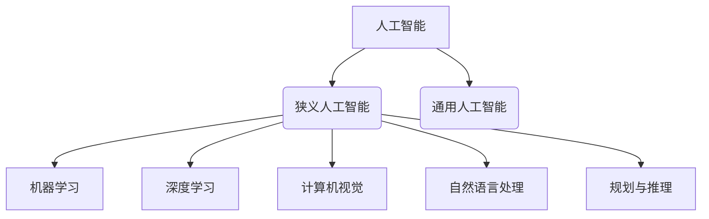

# Artificial Intelligence (AI)原理与代码实例讲解

## 1.背景介绍

人工智能(Artificial Intelligence, AI)是当前科技领域最热门、发展最快的前沿技术之一。AI的核心目标是开发能够模拟人类智能行为的智能系统,包括学习、推理、规划、感知和语言交互等方面。AI技术已广泛应用于计算机视觉、自然语言处理、机器学习、决策系统等诸多领域,正在深刻改变着人类的生产和生活方式。

## 2.核心概念与联系

### 2.1 人工智能的定义

人工智能是一门综合性的科学技术,涉及计算机科学、数学、生物学、心理学等多个学科。经典的人工智能定义是"使机器模拟或实现人类智能行为的理论、方法、技术及应用系统"。

### 2.2 人工智能的分类

人工智能可分为狭义人工智能(Narrow AI)和通用人工智能(General AI)两大类:

- 狭义人工智能专注于解决特定领域的问题,如语音识别、图像识别、游戏AI等。
- 通用人工智能则旨在创造出与人类智能相当,能够解决各种问题的通用智能系统。

### 2.3 人工智能的关键技术

人工智能涵盖多种技术,主要包括:

1. **机器学习**(Machine Learning): 使计算机具备学习和改进的能力。
2. **深度学习**(Deep Learning): 基于神经网络的机器学习技术。
3. **计算机视觉**(Computer Vision): 赋予计算机识别和理解图像、视频的能力。
4. **自然语言处理**(Natural Language Processing): 实现人机语言交互。
5. **规划与推理**(Planning and Reasoning): 使系统具备决策和解决问题的能力。

### 2.4 人工智能发展历程

人工智能的发展经历了几个重要阶段:

1. **早期阶段**(1950s-1960s): 提出人工智能概念,逻辑推理和专家系统成为主流。
2. **知识库阶段**(1970s-1980s): 发展知识库系统,但遇到了知识获取困难等瓶颈。
3. **机器学习兴起**(1990s-2000s): 机器学习和神经网络技术逐渐成为主流。
4. **深度学习时代**(2010s-至今): 受益于大数据、算力提升,深度学习取得突破性进展。

## 3.核心算法原理具体操作步骤

### 3.1 机器学习算法

机器学习是人工智能的核心技术之一,可分为监督学习、非监督学习和强化学习三大类。

#### 3.1.1 监督学习

监督学习是基于已标注的训练数据,学习出一个模型,用于对新的未标注数据进行预测或分类。常见算法包括:

1. **线性回归**: 用于预测连续值输出。
2. **逻辑回归**: 用于二分类问题。
3. **支持向量机**(SVM): 通过寻找最大边界来实现分类。
4. **决策树**和**随机森林**: 基于决策树的分类和回归算法。
5. **神经网络**: 模拟生物神经网络,用于分类和回归任务。

#### 3.1.2 非监督学习

非监督学习是基于未标注的数据,自动发现数据中的模式和规律。常见算法包括:

1. **聚类算法**(如K-Means): 将相似的数据点分组到同一个簇。
2. **关联规则挖掘**(如Apriori): 发现数据中的频繁模式。
3. **降维算法**(如PCA): 将高维数据映射到低维空间。

#### 3.1.3 强化学习

强化学习是基于环境反馈,通过试错学习获得最优策略。常见算法包括:

1. **Q-Learning**: 基于Q值迭代更新,寻找最优行为策略。
2. **策略梯度**(Policy Gradient): 直接优化策略函数的参数。
3. **深度强化学习**(如DQN): 结合深度神经网络的强化学习算法。

### 3.2 深度学习算法

深度学习是机器学习的一个重要分支,主要基于神经网络模型。常见的深度学习模型包括:

1. **前馈神经网络**(FeedForward Neural Network): 最基本的神经网络结构。
2. **卷积神经网络**(Convolutional Neural Network, CNN): 在计算机视觉领域表现出色。
3. **循环神经网络**(Recurrent Neural Network, RNN): 擅长处理序列数据。
4. **长短期记忆网络**(Long Short-Term Memory, LSTM): 改进版的RNN,解决了梯度消失问题。
5. **生成对抗网络**(Generative Adversarial Networks, GAN): 用于生成式建模。

深度学习算法通常采用以下步骤进行训练:

1. **数据预处理**: 对原始数据进行清洗、标准化等预处理。
2. **构建网络模型**: 设计合适的神经网络结构和参数。
3. **模型训练**: 使用优化算法(如梯度下降)迭代更新模型参数。
4. **模型评估**: 在测试集上评估模型性能,进行调优。
5. **模型部署**: 将训练好的模型应用于实际场景。

### 3.3 计算机视觉算法

计算机视觉是人工智能的一个重要分支,主要研究如何使计算机能够获取、处理和分析图像或视频数据。常见的计算机视觉算法包括:

1. **图像分类**: 将图像分类到预定义的类别中,如物体识别。
2. **目标检测**: 在图像中定位并识别出感兴趣的目标物体。
3. **语义分割**: 对图像中的每个像素进行语义标注,如分割出车辆、人物等。
4. **实例分割**: 在语义分割的基础上,进一步区分同类物体的不同实例。
5. **视觉追踪**: 在视频序列中跟踪感兴趣目标的运动轨迹。

计算机视觉算法通常包括以下几个步骤:

1. **图像预处理**: 进行图像去噪、增强、几何变换等预处理。
2. **特征提取**: 从图像中提取出有意义的特征,如边缘、角点、纹理等。
3. **模型训练**: 基于提取的特征,训练分类器、检测器等模型。
4. **后处理**: 对模型输出进行滤波、非极大值抑制等后处理,提高结果质量。

### 3.4 自然语言处理算法

自然语言处理(Natural Language Processing, NLP)是人工智能的另一个重要分支,旨在使计算机能够理解和生成人类语言。常见的NLP算法包括:

1. **词法分析**: 将文本分割成词汇单元(tokens)。
2. **句法分析**: 确定词汇单元之间的语法关系。
3. **词义消歧**: 根据上下文确定词语的准确含义。
4. **命名实体识别**: 识别出文本中的人名、地名、组织机构名等实体。
5. **情感分析**: 判断文本所表达的情感倾向(积极、消极等)。
6. **文本摘要**: 自动生成文本的摘要。
7. **机器翻译**: 将一种自然语言翻译成另一种语言。
8. **问答系统**: 基于知识库,回答用户提出的自然语言问题。

自然语言处理算法通常包括以下几个步骤:

1. **文本预处理**: 进行分词、去停用词、词形还原等预处理。
2. **特征提取**: 将文本转换为特征向量,如one-hot编码、词袋模型(Bag of Words)、词向量(Word Embedding)等。
3. **模型训练**: 基于特征向量,训练分类器、序列模型等。
4. **语义理解**: 对模型输出进行语义解析,获取相应的意义表示。

## 4.数学模型和公式详细讲解举例说明

人工智能算法中广泛使用了各种数学模型和公式,下面对一些常见的模型和公式进行详细讲解。

### 4.1 线性回归

线性回归是一种常用的监督学习算法,用于预测连续值输出。给定一组训练数据 $\{(x_i, y_i)\}_{i=1}^{n}$,其中 $x_i$ 是输入特征向量, $y_i$ 是对应的目标值。线性回归试图找到一个最佳拟合的线性函数 $f(x) = w^Tx + b$,使得预测值 $\hat{y}_i = f(x_i)$ 与真实值 $y_i$ 的差异最小。

通常采用最小二乘法来求解最优参数 $w$ 和 $b$,目标函数为:

$$J(w, b) = \frac{1}{2n}\sum_{i=1}^{n}(y_i - (w^Tx_i + b))^2$$

对 $w$ 和 $b$ 分别求偏导并令其等于0,可以得到闭式解:

$$w = (X^TX)^{-1}X^Ty$$
$$b = \frac{1}{n}\sum_{i=1}^{n}(y_i - w^Tx_i)$$

其中 $X$ 是输入特征矩阵, $y$ 是目标值向量。

### 4.2 逻辑回归

逻辑回归是一种用于二分类问题的监督学习算法。给定一组训练数据 $\{(x_i, y_i)\}_{i=1}^{n}$,其中 $x_i$ 是输入特征向量, $y_i \in \{0, 1\}$ 是二元类别标签。逻辑回归模型定义为:

$$P(y=1|x) = \sigma(w^Tx + b)$$
$$P(y=0|x) = 1 - \sigma(w^Tx + b)$$

其中 $\sigma(z) = \frac{1}{1 + e^{-z}}$ 是 Sigmoid 函数,用于将线性函数的输出值映射到 $(0, 1)$ 范围内,作为预测类别 1 的概率。

通过最大似然估计,可以求解参数 $w$ 和 $b$,目标函数为:

$$J(w, b) = -\frac{1}{n}\sum_{i=1}^{n}[y_i\log P(y_i=1|x_i) + (1-y_i)\log P(y_i=0|x_i)]$$

通常采用梯度下降法等优化算法来求解上述目标函数。

### 4.3 支持向量机

支持向量机(Support Vector Machine, SVM)是一种常用的监督学习算法,适用于分类和回归问题。SVM的基本思想是在训练数据集上寻找一个最大边界超平面,将不同类别的样本分开,同时最大化边界两侧的functional margin。

对于线性可分的二分类问题,SVM模型可表示为:

$$f(x) = w^Tx + b$$

其中 $w$ 是权重向量, $b$ 是偏置项。我们希望对于每个训练样本 $(x_i, y_i)$,都满足:

$$y_i(w^Tx_i + b) \geq 1$$

即正例点被正确分类时,functional margin至少为1。我们可以通过求解如下优化问题来获得最优的 $w$ 和 $b$:

$$\begin{aligned}
\min_{w, b} & \frac{1}{2}||w||^2 \\
\text{s.t.} & y_i(w^Tx_i + b) \geq 1, \quad i = 1, 2, \dots, n
\end{aligned}$$

对于线性不可分的情况,可以引入松弛变量,允许某些样本落在边界内或错分。此外,还可以通过核技巧(kernel trick)将数据映射到高维特征空间,从而实现非线性分类。

### 4.4 K-Means 聚类

K-Means 是一种常用的无监督学习算法,用于对未标注的数据进行聚类。给定一组数据点 $\{x_i\}_{i=1}^{n}$,K-Means 算法的目标是将这些数据点划分为 $K$ 个簇 $\{C_k\}_{k=1}^{K}$,使得簇内数据点的相似度尽