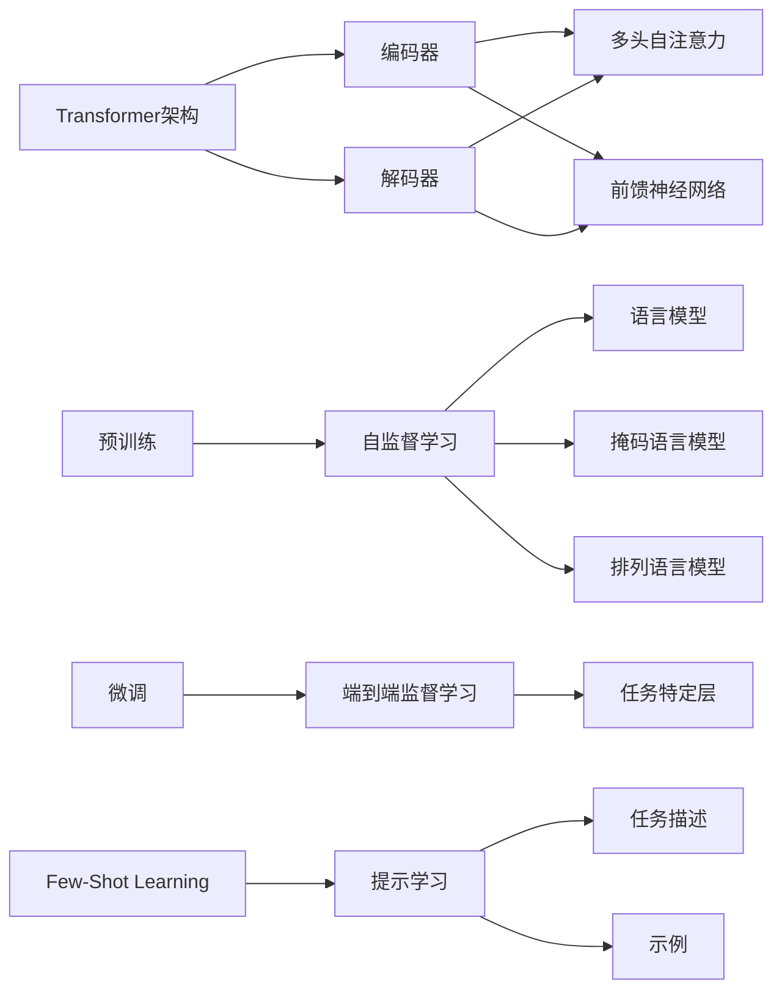

# ChatGPT原理与代码实例讲解

## 1.背景介绍

近年来,自然语言处理(NLP)和人工智能(AI)领域取得了巨大的进展。其中,以ChatGPT为代表的大型语言模型(Large Language Model, LLM)更是引起了广泛关注。ChatGPT由OpenAI公司开发,是一个基于Transformer架构的大规模预训练语言模型。它在海量文本数据上进行无监督预训练,可以完成对话、问答、写作等多种自然语言处理任务,展现出了惊人的语言理解和生成能力。

ChatGPT的问世标志着NLP技术迈入了一个新的里程碑。它不仅在学术界引发了热烈讨论,更在产业界掀起了一股AI应用热潮。越来越多的企业开始探索将ChatGPT等语言模型应用到客服、内容创作、教育等领域。可以预见,大型语言模型将为人机交互、知识获取、智能写作等方面带来革命性的变化。

本文将深入探讨ChatGPT的原理和实现,并通过代码实例讲解如何使用PyTorch构建一个简化版的ChatGPT模型。通过理论和实践相结合的方式,帮助读者全面理解ChatGPT的内在机制,为进一步研究和应用大型语言模型打下坚实基础。

## 2.核心概念与联系

### 2.1 Transformer架构

ChatGPT的核心架构是Transformer。Transformer是一种基于自注意力机制(Self-Attention)的神经网络模型,最初由Google于2017年提出,用于机器翻译任务。与传统的RNN和CNN不同,Transformer完全摒弃了循环和卷积操作,转而使用自注意力机制来建模序列数据之间的依赖关系。

Transformer由编码器(Encoder)和解码器(Decoder)两部分组成:
- 编码器负责将输入序列映射为一组向量表示,捕捉输入序列的上下文信息。
- 解码器根据编码器的输出和已生成的序列,自回归地生成目标序列。

编码器和解码器内部都由若干个相同的层(Layer)堆叠而成,每一层包含两个子层:
- 多头自注意力(Multi-Head Self-Attention)子层
- 前馈神经网络(Feed-Forward Network)子层

多头自注意力允许模型在不同的表示子空间中计算注意力,增强了模型捕捉序列间多样化依赖关系的能力。前馈神经网络则进一步增强了模型的表达能力。

Transformer中的自注意力机制和位置编码是其能够处理长序列并建模长距离依赖的关键所在。自注意力通过计算序列元素之间的相似度,使每个元素都能够attend到序列中的任意其他元素。位置编码则为模型引入了序列中元素的位置信息。

### 2.2 预训练和微调

ChatGPT采用了预训练(Pre-training)和微调(Fine-tuning)的范式。预训练阶段在大规模无标注文本语料上进行自监督学习,使模型习得通用的语言知识和结构。微调阶段则在特定任务的标注数据上进一步训练模型,使其适应具体的下游任务。

预训练一般采用基于自回归语言模型的目标,即根据前面的token预测下一个token。常见的预训练目标包括:

- 传统语言模型:给定前面的token,预测下一个token。
- 掩码语言模型(Masked Language Model, MLM):随机掩盖一部分token,预测被掩盖的token。
- 排列语言模型(Permuted Language Model, PLM):随机打乱序列的顺序,预测原始序列。

通过在大规模语料上进行预训练,模型可以学到丰富的语言知识,包括词汇、语法、语义、常识等,为后续的微调任务提供了良好的初始化参数。

微调阶段则在预训练模型的基础上,针对具体任务引入额外的任务特定层(如分类器),并在任务标注数据上进行端到端的监督学习。微调使预训练模型适应了特定任务的数据分布和目标,显著提升了模型在下游任务上的表现。

### 2.3 Few-Shot Learning

ChatGPT还引入了Few-Shot Learning的思想。Few-Shot Learning旨在使模型能够在只有少量标注样本的情况下快速适应新任务。ChatGPT采用了基于提示(Prompt)的Few-Shot Learning方法。

具体而言,在微调阶段,将任务描述(Task Description)和少量示例(Demonstration)作为提示,拼接到输入序列的前面。模型根据提示中的任务描述和示例,对输入序列进行自回归生成,得到目标输出。这种基于自然语言指令的方式使ChatGPT具备了一定的泛化和适应能力。

Few-Shot Learning的优势在于:
- 减少了对大量标注数据的依赖,降低了数据收集和标注的成本。
- 使模型能够快速适应新任务,无需从头训练,大大提高了开发效率。
- 赋予了模型一定的泛化能力,使其能够处理未见过的任务和领域。

### 2.4 核心概念关系图

下图展示了ChatGPT中几个核心概念之间的关系:

## 3.核心算法原理具体操作步骤

ChatGPT的训练过程可以分为预训练和微调两个阶段,下面分别介绍其中的核心算法和具体操作步骤。

### 3.1 预训练阶段

预训练阶段采用自监督学习的方式,在大规模无标注文本语料上训练模型。常见的预训练目标包括语言模型、掩码语言模型和排列语言模型。以掩码语言模型为例,其训练过程如下:

1. 准备大规模无标注文本语料,进行必要的清洗和预处理。
2. 对文本进行tokenization,将每个文本样本转换为token序列。
3. 对每个序列中的部分token进行随机掩码,用特殊的[MASK]符号替换。掩码比例一般为15%左右。
4. 将掩码后的序列输入到Transformer编码器中,经过多头自注意力和前馈神经网络的计算,得到每个token的隐向量表示。
5. 取出[MASK]位置的隐向量,通过一个全连接层映射到词表大小的维度,得到每个掩码位置的预测概率分布。
6. 将预测概率分布与真实的目标token进行交叉熵损失计算,得到预训练的损失函数。
7. 使用优化器(如Adam)对损失函数进行梯度反向传播,更新模型参数。
8. 重复步骤3-7,直到模型收敛或达到预设的训练轮数。

预训练的目的是让模型学习到通用的语言知识和结构,为后续的微调任务提供良好的初始化参数。预训练一般需要大规模的计算资源和较长的训练时间,但可以显著提升模型在下游任务上的表现。

### 3.2 微调阶段

微调阶段在预训练模型的基础上,针对具体任务进行端到端的监督学习。微调过程通常如下:

1. 准备任务特定的标注数据集,进行必要的清洗和预处理。
2. 对文本进行tokenization,将每个文本样本转换为token序列。
3. 在预训练模型的基础上,根据任务的类型和复杂度,选择合适的微调策略:
   - 对于分类任务,在Transformer编码器的输出上添加一个全连接分类器。
   - 对于序列标注任务,在Transformer编码器的每个位置上添加一个全连接标注器。
   - 对于生成任务,使用Transformer解码器进行自回归生成。
4. 将任务输入序列传入微调后的模型,得到任务输出。
5. 将模型输出与真实标签进行损失函数计算,常见的损失函数包括交叉熵损失、平方损失等。
6. 使用优化器对损失函数进行梯度反向传播,更新模型参数。
7. 重复步骤4-6,直到模型收敛或达到预设的训练轮数。
8. 在验证集或测试集上评估微调后模型的性能,进行必要的超参数调优。

微调使预训练模型适应了特定任务的数据分布和目标,显著提升了模型在下游任务上的表现。与从头训练相比,微调通常只需要较少的任务标注数据和计算资源,大大提高了开发效率。

### 3.3 推理阶段

微调完成后,模型就可以用于实际的推理任务了。推理过程一般比较简单:

1. 准备待预测的文本样本,进行必要的清洗和预处理。
2. 对文本进行tokenization,将每个文本样本转换为token序列。
3. 将token序列输入到微调后的模型中,得到模型输出。
4. 根据任务类型对模型输出进行后处理,如阈值过滤、解码生成等。
5. 返回最终的预测结果。

推理阶段的关键是权衡效率和效果,需要根据实际场景选择合适的批大小、序列长度等超参数,并进行必要的模型量化、剪枝等优化。

## 4.数学模型和公式详细讲解举例说明

ChatGPT中的核心数学模型是Transformer,下面我们详细讲解Transformer中的关键公式和原理。

### 4.1 自注意力机制

自注意力机制是Transformer的核心,它允许序列中的每个位置都能attend到序列中的其他位置。假设输入序列为$X \in \mathbb{R}^{n \times d}$,其中$n$为序列长度,$d$为隐向量维度。自注意力的计算过程如下:

1. 通过三个线性变换得到查询矩阵$Q$、键矩阵$K$和值矩阵$V$:

$$
\begin{aligned}
Q &= XW^Q \\
K &= XW^K \\
V &= XW^V
\end{aligned}
$$

其中$W^Q, W^K, W^V \in \mathbb{R}^{d \times d_k}$为可学习的参数矩阵,$d_k$为注意力头的维度。

2. 计算查询矩阵和键矩阵的点积注意力分数:

$$
A = \text{softmax}(\frac{QK^T}{\sqrt{d_k}})
$$

其中$A \in \mathbb{R}^{n \times n}$为注意力分数矩阵,softmax函数对每一行进行归一化,$\sqrt{d_k}$为缩放因子,用于控制点积结果的方差。

3. 将注意力分数矩阵与值矩阵相乘,得到加权求和的输出:

$$
\text{Attention}(Q, K, V) = AV
$$

其中$\text{Attention}(Q, K, V) \in \mathbb{R}^{n \times d_k}$为注意力输出。

4. 将多个注意力头的输出拼接起来,并通过一个线性变换得到最终的自注意力输出:

$$
\text{MultiHead}(X) = \text{Concat}(\text{head}_1, \dots, \text{head}_h)W^O
$$

其中$\text{head}_i = \text{Attention}(XW_i^Q, XW_i^K, XW_i^V)$为第$i$个注意力头的输出,$W^O \in \mathbb{R}^{hd_k \times d}$为可学习的参数矩阵。

自注意力机制通过将序列中每个位置与其他所有位置进行比较,有效地捕捉了序列内部的长距离依赖关系。多头自注意力则允许模型在不同的子空间中学习不同的注意力表示,增强了模型的表达能力。

### 4.2 位置编码

由于Transformer不包含任何循环或卷积结构,因此需要显式地为模型提供序列中元素的位置信息。位置编码(Positional Encoding)就是用于引入位置信息的机制。

ChatGPT中使用的是正弦