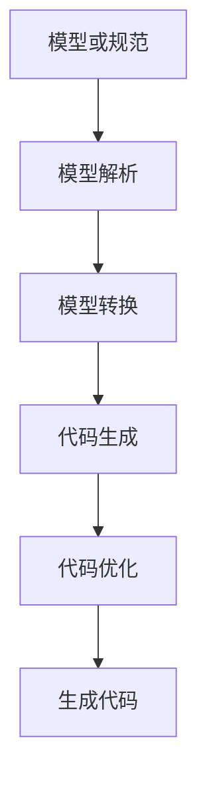

# CodeGen原理与代码实例讲解

## 1. 背景介绍

在软件开发过程中,代码生成(CodeGen)是一种自动化技术,旨在从高级模型或规范中生成源代码。它可以显著提高开发效率,减少手工编码的工作量,并提高代码质量和一致性。随着软件复杂度的不断增加,代码生成已经成为现代软件工程中不可或缺的一部分。

代码生成技术的起源可以追溯到20世纪60年代,当时程序员开始使用早期的代码生成工具来生成程序的框架和样板代码。随着时间的推移,代码生成技术不断发展,涌现出许多强大的代码生成工具和框架,如Microsoft Visual Studio的代码生成器、Eclipse的代码生成器等。

近年来,随着人工智能和机器学习技术的快速发展,代码生成领域也出现了一些令人兴奋的新进展。基于深度学习的代码生成模型能够从大量代码样本中学习编程模式和语法规则,从而生成高质量的代码。这种基于AI的代码生成方法具有巨大的潜力,可以极大地提高开发人员的生产力,并推动软件开发进入一个新的阶段。

## 2. 核心概念与联系

### 2.1 模型驱动开发(Model-Driven Development, MDD)

模型驱动开发是代码生成技术的核心概念之一。它是一种软件开发方法,强调使用模型作为软件开发的主要工件。在MDD中,开发人员首先创建一个高级抽象模型,描述系统的结构、行为和其他关键方面。然后,这个模型被用作输入,通过转换和代码生成过程自动生成源代码。

MDD的主要优点包括:

- 提高了开发效率和代码质量
- 促进了不同团队成员之间的沟通和协作
- 支持不同技术平台的代码生成
- 有利于软件的维护和演化

### 2.2 领域特定语言(Domain-Specific Language, DSL)

领域特定语言是另一个与代码生成密切相关的概念。DSL是一种专门为特定领域或问题域设计的计算机语言,它使用该领域的术语和概念来表达解决方案。DSL通常比通用编程语言更加简洁、易读和高级。

DSL在代码生成中扮演着重要角色。开发人员可以使用DSL来描述系统的规范或模型,然后通过代码生成工具将DSL转换为可执行的代码。这种方法可以提高开发效率,减少手工编码的工作量,并确保生成的代码符合预期的规范。

### 2.3 模板引擎

模板引擎是代码生成过程中常用的一种技术。它允许开发人员定义代码模板,其中包含静态代码片段和动态占位符。在代码生成过程中,模板引擎会将占位符替换为实际的值或代码片段,从而生成最终的源代码。

模板引擎通常支持各种控制流语句(如条件语句和循环语句),以及对模板数据的访问和操作。这使得模板引擎能够生成复杂的代码结构,并根据输入数据进行定制化。

一些流行的模板引擎包括Jinja(Python)、Mustache(多种语言)、Handlebars(JavaScript)等。

## 3. 核心算法原理具体操作步骤

代码生成过程通常包括以下几个核心步骤:



### 3.1 模型或规范

代码生成过程的第一步是获取描述系统的模型或规范。这可以是UML模型、DSL规范或其他形式的模型。模型应该包含足够的信息来描述系统的结构、行为和其他关键方面。

### 3.2 模型解析

在这一步骤中,代码生成工具会解析输入的模型或规范,将其转换为内部表示形式。这通常涉及到语法分析、语义分析和其他解析技术。解析后的模型数据将用于后续的转换和代码生成步骤。

### 3.3 模型转换

模型转换是将解析后的模型数据转换为适合代码生成的中间表示形式。这可能涉及到模型优化、重构或其他转换操作。转换后的模型数据将作为代码生成过程的输入。

### 3.4 代码生成

代码生成是整个过程的核心步骤。在这一步骤中,代码生成工具会根据转换后的模型数据,使用模板引擎或其他代码生成技术生成实际的源代码。生成的代码可能需要进一步的优化和后处理。

### 3.5 代码优化

在某些情况下,生成的代码可能需要进行优化,以提高其性能、可读性或其他质量属性。代码优化可能涉及到代码重构、优化技术(如内联、常量折叠等)或其他代码级别的转换。

### 3.6 生成代码

最后一步是将优化后的代码输出为可编译或可执行的源代码文件。根据不同的目标平台和编程语言,生成的代码可能需要进行进一步的处理或构建步骤。

## 4. 数学模型和公式详细讲解举例说明

在代码生成过程中,数学模型和公式可以用于各种目的,例如模型转换、代码优化和代码度量计算等。以下是一些常见的数学模型和公式:

### 4.1 形式语言和语法

形式语言和语法是代码生成中的基础概念。它们用于描述编程语言的语法结构,并为解析和代码生成提供理论基础。

一种常见的形式语言表示方法是上下文无关文法(Context-Free Grammar, CFG)。CFG由一组终结符(终端符号)、非终结符(非终端符号)、产生式(规则)和起始符号组成。它可以用于描述大多数编程语言的语法结构。

例如,以下是一个简单的算术表达式语法的CFG:

$$
\begin{align*}
E &\rightarrow E + T \mid E - T \mid T \\
T &\rightarrow T \times F \mid T \div F \mid F \\
F &\rightarrow (E) \mid \text{number}
\end{align*}
$$

其中,`E`、`T`和`F`是非终结符,`+`、`-`、`*`、`/`、`(`、`)`和`number`是终结符。产生式定义了语法规则。

### 4.2 模型转换

在代码生成过程中,模型转换是一个关键步骤。它涉及将输入模型转换为适合代码生成的中间表示形式。模型转换可以使用各种数学模型和算法来实现,例如图形重写系统、三值模型等。

图形重写系统是一种常见的模型转换技术。它使用一组重写规则来操作图形结构,实现模型的转换和优化。重写规则可以用数学公式来表示,例如:

$$
\begin{align*}
L \Rightarrow R
\end{align*}
$$

其中,`L`是左侧模式,`R`是右侧替换项。如果图形中存在与`L`匹配的子图,则将其替换为`R`。

### 4.3 代码度量

代码度量是评估代码质量的一种方法。它们通常基于代码的结构和属性,使用数学公式来计算各种度量值。这些度量值可用于代码优化、质量评估和风险分析等目的。

一个著名的代码度量是圈复杂度(Cyclomatic Complexity),它用于衡量代码的复杂性和测试覆盖率。圈复杂度的计算公式如下:

$$
\begin{align*}
M &= E - N + 2P \\
\text{where:} \\
M &= \text{cyclomatic complexity} \\
E &= \text{number of edges in the control flow graph} \\
N &= \text{number of nodes in the control flow graph} \\
P &= \text{number of connected components (exit nodes)}
\end{align*}
$$

圈复杂度越高,代码的复杂性和测试难度就越大。代码生成工具可以使用这种度量来优化生成的代码,或者提供代码质量反馈。

### 4.4 其他数学模型

除了上述模型和公式,代码生成过程中还可能涉及其他数学模型和算法,例如:

- **正则表达式**: 用于模式匹配和字符串操作。
- **有限状态机**: 用于描述系统的行为和状态转换。
- **图论**: 用于表示和操作代码的结构和依赖关系。
- **逻辑推理**: 用于验证代码的正确性和一致性。
- **概率模型**: 用于基于机器学习的代码生成和代码补全。

这些数学模型和算法为代码生成提供了强大的理论基础和实现技术,使其能够处理复杂的代码结构和转换需求。

## 5. 项目实践:代码实例和详细解释说明

为了更好地理解代码生成的原理和实践,让我们通过一个实际的项目示例来探讨代码生成的具体应用。在这个示例中,我们将使用Python和Jinja2模板引擎来生成一个简单的Web应用程序框架。

### 5.1 项目概述

我们的目标是生成一个基于Flask的Web应用程序框架,包括以下组件:

- 应用程序入口点(`app.py`)
- 路由和视图函数
- HTML模板
- 静态文件(CSS和JavaScript)

为了实现这个目标,我们将定义一个简单的DSL来描述应用程序的结构和组件。然后,我们将使用Jinja2模板引擎根据DSL规范生成相应的源代码文件。

### 5.2 DSL规范

我们的DSL规范将使用YAML格式来描述应用程序的结构和组件。以下是一个示例规范:

```yaml
app:
  name: MyApp
  routes:
    - path: /
      view: index
      template: index.html
    - path: /about
      view: about
      template: about.html
  static:
    - css/styles.css
    - js/app.js
```

在这个规范中,我们定义了应用程序的名称(`MyApp`)、路由路径和视图函数、HTML模板文件,以及静态文件。

### 5.3 代码生成器

下面是使用Jinja2模板引擎实现的代码生成器:

```python
import yaml
from jinja2 import Environment, FileSystemLoader

# 加载DSL规范
with open('app_spec.yml', 'r') as f:
    app_spec = yaml.safe_load(f)

# 创建Jinja2环境
env = Environment(loader=FileSystemLoader('templates'))

# 生成app.py
app_template = env.get_template('app.py.j2')
app_code = app_template.render(app_spec)
with open('app.py', 'w') as f:
    f.write(app_code)

# 生成HTML模板
for route in app_spec['app']['routes']:
    template_name = route['template']
    template_code = env.get_template(f'templates/{template_name}.j2').render()
    with open(f'templates/{template_name}', 'w') as f:
        f.write(template_code)

# 生成静态文件
for static_file in app_spec['app']['static']:
    static_code = env.get_template(f'static/{static_file}.j2').render()
    with open(f'static/{static_file}', 'w') as f:
        f.write(static_code)
```

在这个代码生成器中,我们首先加载DSL规范文件(`app_spec.yml`)。然后,我们创建一个Jinja2环境,并使用该环境渲染模板文件。

对于每个组件,我们从相应的模板文件(如`app.py.j2`、`index.html.j2`等)中渲染代码,并将生成的代码写入目标文件。

### 5.4 模板文件

以下是一些示例模板文件:

`app.py.j2`:

```python
from flask import Flask, render_template

app = Flask(__name__)


@app.route('{{ route.path }}')
def {{ route.view }}():
    return render_template('{{ route.template }}')


if __name__ == '__main__':
    app.run(debug=True)
```

`index.html.j2`:

```html
<!DOCTYPE html>
<html>
<head>
    <title>{{ app.name }}</title>
    <link rel="stylesheet" href="{{ url_for('static', filename='css/styles.css') }}">
</head>
<body>
    <h1>Welcome to {{ app.name }}!</h1>
    <script src="{{ url_for('static', filename='js/app.js') }}"></script>
</body>
</html>
```

`css/styles.css.j2`:

```css{"msg_type":"generate_answer_finish","data":"","from_module":null,"from_unit":null}