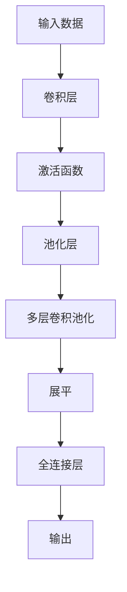
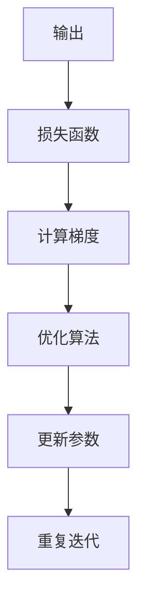

# Convolutional Neural Networks (CNN)原理与代码实例讲解

## 1.背景介绍

在深度学习领域中,卷积神经网络(Convolutional Neural Networks, CNN)是一种革命性的人工神经网络,它在计算机视觉、图像识别、自然语言处理等领域展现出了卓越的性能。CNN灵感来源于生物学中视觉皮层的神经结构,通过局部感受野、权值共享和池化操作等机制,可以有效地捕捉输入数据的局部特征,并逐层提取更加抽象和复杂的模式表示。

CNN在图像分类、目标检测、语义分割等计算机视觉任务中表现出色,也广泛应用于自然语言处理、推荐系统等领域。随着硬件计算能力的提升和大规模数据的涌现,CNN在各个领域的应用越来越广泛。深入理解CNN的原理和实现方式,对于开发人员和研究人员来说都是至关重要的。

## 2.核心概念与联系

CNN由多个卷积层、池化层和全连接层组成。下面是CNN中的几个核心概念:

### 2.1 卷积层(Convolutional Layer)

卷积层是CNN的核心部分,它通过滑动卷积核(kernel)在输入数据(如图像)上进行卷积操作,提取局部特征。卷积核是一个小矩阵,它在输入数据上滑动,计算加权和,生成特征映射(feature map)。


### 2.2 池化层(Pooling Layer)

池化层通常在卷积层之后,对特征映射进行下采样,减小数据量,提高计算效率。常见的池化操作包括最大池化(Max Pooling)和平均池化(Average Pooling)。


### 2.3 全连接层(Fully Connected Layer)

全连接层位于CNN的最后几层,将前面层的特征映射展平,并与全连接层的权重进行矩阵乘法运算,输出分类或回归结果。


### 2.4 激活函数(Activation Function)

激活函数引入非线性,增加网络的表达能力。常用的激活函数包括ReLU、Sigmoid和Tanh等。

### 2.5 权值共享(Weight Sharing)

在CNN中,同一卷积核的权重在整个输入数据上共享,大大减少了需要学习的参数数量,提高了计算效率。

### 2.6 局部感受野(Local Receptive Field)

卷积核只与输入数据的局部区域相连,这种局部连接模式称为局部感受野,有助于捕捉输入数据的局部特征。

## 3.核心算法原理具体操作步骤

CNN的核心算法原理包括前向传播(Forward Propagation)和反向传播(Backward Propagation)两个过程。

### 3.1 前向传播

前向传播过程将输入数据经过多个卷积层、池化层和全连接层,最终输出预测结果。具体步骤如下:

1. 输入数据(如图像)通过卷积层,进行卷积操作,生成特征映射。
2. 特征映射通过激活函数(如ReLU),引入非线性。
3. 特征映射通过池化层,进行下采样,减小数据量。
4. 重复步骤1-3,进行多层卷积和池化操作,提取更高级的特征表示。
5. 最后一层卷积层的输出特征映射被展平,输入到全连接层。
6. 全连接层进行矩阵乘法运算,输出分类或回归结果。



### 3.2 反向传播

反向传播过程通过计算损失函数对网络参数进行优化,使得预测结果逐渐接近真实值。具体步骤如下:

1. 计算输出层与真实标签之间的损失函数(如交叉熵损失)。
2. 利用链式法则,计算损失函数对各层参数(权重和偏置)的梯度。
3. 使用优化算法(如随机梯度下降),根据梯度更新参数。
4. 重复步骤1-3,直到损失函数收敛或达到指定迭代次数。



通过前向传播和反向传播的交替进行,CNN可以逐步学习到最优的参数,从而提高预测性能。

## 4.数学模型和公式详细讲解举例说明

### 4.1 卷积操作

卷积操作是CNN的核心运算,它通过卷积核在输入数据上滑动,计算加权和,生成特征映射。

设输入数据为 $I$,卷积核为 $K$,偏置为 $b$,输出特征映射为 $O$,则卷积操作可以表示为:

$$O(m,n) = \sum_{i=0}^{H-1}\sum_{j=0}^{W-1}I(m+i,n+j)K(i,j) + b$$

其中 $H$、$W$ 分别为卷积核的高度和宽度。

例如,对于一个 $5\times 5$ 的输入数据和一个 $3\times 3$ 的卷积核,卷积操作可以计算如下:

$$
\begin{bmatrix}
1 & 0 & 2 & 1 & 0\\
0 & 1 & 0 & 0 & 1\\
2 & 0 & 3 & 1 & 0\\
1 & 0 & 1 & 0 & 2\\
0 & 2 & 0 & 1 & 0
\end{bmatrix}
*
\begin{bmatrix}
1 & 0 & 1\\
0 & 1 & 0\\
1 & 0 & 1
\end{bmatrix}
=
\begin{bmatrix}
5 & 2 & 6\\
3 & 3 & 4\\
6 & 3 & 5
\end{bmatrix}
$$

### 4.2 池化操作

池化操作通过下采样特征映射,减小数据量,提高计算效率。常见的池化操作包括最大池化和平均池化。

最大池化操作可以表示为:

$$O(m,n) = \max_{(i,j)\in R_{mn}}I(m+i,n+j)$$

其中 $R_{mn}$ 表示以 $(m,n)$ 为中心的池化区域。

平均池化操作可以表示为:

$$O(m,n) = \frac{1}{|R_{mn}|}\sum_{(i,j)\in R_{mn}}I(m+i,n+j)$$

其中 $|R_{mn}|$ 表示池化区域的大小。

例如,对于一个 $4\times 4$ 的特征映射,进行 $2\times 2$ 的最大池化操作,结果如下:

$$
\begin{bmatrix}
1 & 3 & 2 & 4\\
5 & 6 & 7 & 8\\
9 & 7 & 5 & 6\\
3 & 2 & 1 & 4
\end{bmatrix}
\xrightarrow{\text{Max Pooling}}
\begin{bmatrix}
6 & 8\\
9 & 7
\end{bmatrix}
$$

### 4.3 全连接层

全连接层将前面层的特征映射展平,并与全连接层的权重进行矩阵乘法运算,输出分类或回归结果。

设输入为 $X$,权重为 $W$,偏置为 $b$,输出为 $Y$,则全连接层的运算可以表示为:

$$Y = W^TX + b$$

例如,对于一个包含 $3\times 3\times 2$ 个神经元的输入特征映射,经过展平后得到一个 $18\times 1$ 的向量。如果全连接层有 $5$ 个神经元,权重矩阵为 $5\times 18$,偏置向量为 $5\times 1$,则输出为 $5\times 1$ 的向量。

### 4.4 损失函数

损失函数用于衡量预测结果与真实标签之间的差异,常见的损失函数包括均方误差损失(Mean Squared Error, MSE)和交叉熵损失(Cross-Entropy Loss)等。

均方误差损失可以表示为:

$$\text{MSE} = \frac{1}{N}\sum_{i=1}^{N}(y_i - \hat{y}_i)^2$$

其中 $N$ 为样本数量, $y_i$ 为真实标签, $\hat{y}_i$ 为预测值。

交叉熵损失可以表示为:

$$\text{CrossEntropy} = -\frac{1}{N}\sum_{i=1}^{N}\sum_{j=1}^{C}y_{ij}\log(\hat{y}_{ij})$$

其中 $C$ 为类别数量, $y_{ij}$ 为样本 $i$ 对于类别 $j$ 的真实标签 (0或1), $\hat{y}_{ij}$ 为样本 $i$ 对于类别 $j$ 的预测概率。

## 5.项目实践：代码实例和详细解释说明

下面是一个使用PyTorch实现的CNN模型,用于对MNIST手写数字数据集进行分类。

```python
import torch
import torch.nn as nn
import torch.nn.functional as F

# 定义CNN模型
class CNN(nn.Module):
    def __init__(self):
        super(CNN, self).__init__()
        # 卷积层
        self.conv1 = nn.Conv2d(1, 16, 3, padding=1)
        self.conv2 = nn.Conv2d(16, 32, 3, padding=1)
        # 池化层
        self.pool = nn.MaxPool2d(2, 2)
        # 全连接层
        self.fc1 = nn.Linear(32 * 7 * 7, 128)
        self.fc2 = nn.Linear(128, 10)

    def forward(self, x):
        # 卷积层
        x = self.pool(F.relu(self.conv1(x)))
        x = self.pool(F.relu(self.conv2(x)))
        # 展平
        x = x.view(-1, 32 * 7 * 7)
        # 全连接层
        x = F.relu(self.fc1(x))
        x = self.fc2(x)
        return x

# 加载数据集
from torchvision import datasets, transforms

train_data = datasets.MNIST(root='data/', train=True, transform=transforms.ToTensor(), download=True)
test_data = datasets.MNIST(root='data/', train=False, transform=transforms.ToTensor())

# 数据加载器
batch_size = 64
train_loader = torch.utils.data.DataLoader(dataset=train_data, batch_size=batch_size, shuffle=True)
test_loader = torch.utils.data.DataLoader(dataset=test_data, batch_size=batch_size, shuffle=False)

# 初始化模型和优化器
model = CNN()
criterion = nn.CrossEntropyLoss()
optimizer = torch.optim.Adam(model.parameters(), lr=0.001)

# 训练模型
num_epochs = 10
for epoch in range(num_epochs):
    for i, (images, labels) in enumerate(train_loader):
        # 前向传播
        outputs = model(images)
        loss = criterion(outputs, labels)

        # 反向传播和优化
        optimizer.zero_grad()
        loss.backward()
        optimizer.step()

        # 打印训练信息
        if (i + 1) % 100 == 0:
            print(f'Epoch [{epoch + 1}/{num_epochs}], Step [{i + 1}/{len(train_loader)}], Loss: {loss.item():.4f}')

# 测试模型
model.eval()
with torch.no_grad():
    correct = 0
    total = 0
    for images, labels in test_loader:
        outputs = model(images)
        _, predicted = torch.max(outputs.data, 1)
        total += labels.size(0)
        correct += (predicted == labels).sum().item()

    print(f'测试准确率: {100 * correct / total:.2f}%')
```

代码解释:

1. 定义CNN模型类,包含两个卷积层、两个池化层和两个全连接层。
2. 在 `forward` 函数中,输入数据首先经过卷积层和池化层,提取特征;然后将特征映射展平,输入到全连接层,输出分类结果。
3. 加载MNIST数据集,并使用 `DataLoader` 创建数据加载器。
4. 初始化模型、损失函数和优化器。
5. 进入训练循环,对每个批次的数据进行