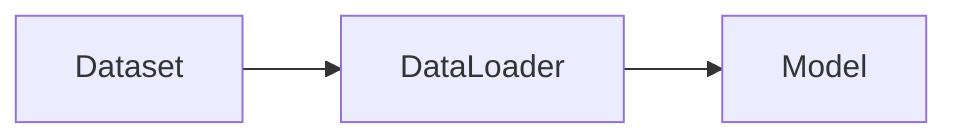

# DataSet原理与代码实例讲解

## 1.背景介绍

### 1.1 数据集的重要性

在机器学习和深度学习领域,数据集是模型训练和评估的基础。高质量的数据集对于训练出高性能的模型至关重要。然而,构建一个优质的数据集并非易事,需要考虑数据的代表性、多样性、标注质量等多个因素。

### 1.2 常见的数据集格式

目前常用的数据集格式包括:

- CSV(Comma-Separated Values):以逗号分隔的文本格式,适合存储结构化数据。
- JSON(JavaScript Object Notation):轻量级的数据交换格式,易于人类阅读和编写。
- TFRecord:TensorFlow的二进制数据格式,可以更高效地存储和读取大规模数据。
- HDF5(Hierarchical Data Format):一种用于存储科学数据的文件格式,支持多维数组和复杂数据类型。

### 1.3 本文的主要内容

本文将重点介绍PyTorch中的Dataset类,它是构建自定义数据集的基础。我们将深入探讨Dataset的原理,并通过代码实例演示如何使用Dataset构建图像分类、文本分类等常见任务的数据集。同时,我们也会讨论如何优化数据加载和预处理的性能。

## 2.核心概念与联系

### 2.1 Dataset 类

PyTorch中的Dataset是一个抽象类,用于表示数据集。它定义了两个核心方法:

- `__getitem__(self, index)`:根据给定的索引获取数据样本。
- `__len__(self)`:返回数据集中的样本数量。

通过继承Dataset类并实现这两个方法,我们可以创建自定义的数据集。

### 2.2 DataLoader 类

DataLoader是PyTorch中数据加载和批处理的核心类。它接受一个Dataset对象作为参数,并提供了以下功能:

- 数据的随机打乱(shuffle)
- 批处理(batch)
- 多进程数据加载(num_workers)
- 自动内存锁页(pin_memory)

使用DataLoader可以大大简化数据加载和预处理的过程,提高训练效率。

### 2.3 Dataset 与 DataLoader 的关系

下图展示了Dataset与DataLoader之间的关系:



Dataset负责定义数据集的结构和访问方式,而DataLoader则负责数据的加载、批处理和预处理。它们共同构成了PyTorch中数据管道的基础。

## 3.核心算法原理具体操作步骤

### 3.1 自定义 Dataset 的步骤

创建自定义Dataset的一般步骤如下:

1. 继承`torch.utils.data.Dataset`类
2. 实现`__init__`方法,初始化数据集
3. 实现`__getitem__`方法,根据索引获取样本
4. 实现`__len__`方法,返回数据集的样本数量

下面是一个简单的自定义Dataset示例:

```python
class MyDataset(Dataset):
    def __init__(self, data, labels):
        self.data = data
        self.labels = labels
        
    def __getitem__(self, index):
        x = self.data[index]
        y = self.labels[index]
        return x, y
    
    def __len__(self):
        return len(self.data)
```

### 3.2 使用 DataLoader 加载数据

创建好Dataset后,我们可以使用DataLoader来加载数据:

```python
dataset = MyDataset(data, labels)
dataloader = DataLoader(dataset, batch_size=32, shuffle=True, num_workers=4)

for batch_x, batch_y in dataloader:
    # 训练模型
    ...
```

DataLoader会自动处理数据的批处理、随机打乱和多进程加载,大大简化了数据管理的过程。

## 4.数学模型和公式详细讲解举例说明

### 4.1 图像分类数据集

对于图像分类任务,我们通常需要将图像和标签打包成一个Dataset。假设我们有一个包含N张图像的数据集,每张图像的大小为$H \times W \times C$,其中$H$为高度,$W$为宽度,$C$为通道数。标签为一个整数,表示图像的类别。

我们可以将图像表示为一个张量$\mathbf{X} \in \mathbb{R}^{N \times C \times H \times W}$,标签表示为一个向量$\mathbf{y} \in \mathbb{R}^N$。那么,图像分类数据集可以表示为:

$$\mathcal{D} = \{(\mathbf{x}_i, y_i)\}_{i=1}^N$$

其中$\mathbf{x}_i \in \mathbb{R}^{C \times H \times W}$表示第$i$张图像,而$y_i \in \{1, 2, \dots, K\}$表示第$i$张图像的类别标签,共有$K$个类别。

### 4.2 文本分类数据集

对于文本分类任务,我们需要将文本和标签打包成一个Dataset。假设我们有一个包含$N$个文本的数据集,每个文本由$L$个单词组成。标签为一个整数,表示文本的类别。

我们可以将每个文本表示为一个长度为$L$的整数序列$\mathbf{x} \in \mathbb{Z}^L$,其中每个整数表示一个单词的索引。标签表示为一个整数$y \in \{1, 2, \dots, K\}$,共有$K$个类别。那么,文本分类数据集可以表示为:

$$\mathcal{D} = \{(\mathbf{x}_i, y_i)\}_{i=1}^N$$

其中$\mathbf{x}_i \in \mathbb{Z}^L$表示第$i$个文本,而$y_i \in \{1, 2, \dots, K\}$表示第$i$个文本的类别标签。

## 5.项目实践：代码实例和详细解释说明

### 5.1 图像分类数据集示例

下面是一个使用Dataset构建图像分类数据集的示例:

```python
class ImageDataset(Dataset):
    def __init__(self, img_dir, transform=None):
        self.img_dir = img_dir
        self.img_list = os.listdir(img_dir)
        self.transform = transform
        
    def __getitem__(self, index):
        img_path = os.path.join(self.img_dir, self.img_list[index])
        img = Image.open(img_path).convert('RGB')
        label = int(self.img_list[index].split('_')[0])
        
        if self.transform is not None:
            img = self.transform(img)
        
        return img, label
    
    def __len__(self):
        return len(self.img_list)
```

在这个示例中,我们假设图像数据集的目录结构如下:

```
img_dir/
    0_xxx.jpg
    0_xxy.jpg
    1_xxx.jpg
    1_xxy.jpg
    ...
```

其中,每个图像文件的命名格式为`{label}_{filename}.jpg`。在`__init__`方法中,我们传入图像目录`img_dir`和图像变换`transform`,并获取目录下的所有图像文件名。在`__getitem__`方法中,我们根据索引读取对应的图像和标签,并对图像应用变换。最后,在`__len__`方法中返回数据集的样本数量。

使用这个Dataset的示例代码如下:

```python
transform = transforms.Compose([
    transforms.Resize((224, 224)),
    transforms.ToTensor(),
    transforms.Normalize(mean=[0.485, 0.456, 0.406], std=[0.229, 0.224, 0.225])
])

dataset = ImageDataset('path/to/img_dir', transform=transform)
dataloader = DataLoader(dataset, batch_size=32, shuffle=True, num_workers=4)

for img, label in dataloader:
    # 训练模型
    ...
```

### 5.2 文本分类数据集示例

下面是一个使用Dataset构建文本分类数据集的示例:

```python
class TextDataset(Dataset):
    def __init__(self, data_path, vocab):
        self.data = []
        self.labels = []
        self.vocab = vocab
        
        with open(data_path, 'r') as f:
            for line in f:
                text, label = line.strip().split('\t')
                self.data.append(text)
                self.labels.append(int(label))
        
    def __getitem__(self, index):
        text = self.data[index]
        label = self.labels[index]
        
        tokens = [self.vocab[token] for token in text.split()]
        
        return torch.tensor(tokens), torch.tensor(label)
    
    def __len__(self):
        return len(self.data)
```

在这个示例中,我们假设文本数据集的格式如下:

```
text1\tlabel1
text2\tlabel2
...
```

其中,每行包含一个文本和对应的标签,用制表符`\t`分隔。在`__init__`方法中,我们传入数据集文件路径`data_path`和词表`vocab`,并读取文本和标签。在`__getitem__`方法中,我们根据索引获取对应的文本和标签,并将文本转换为词表中的索引序列。最后,在`__len__`方法中返回数据集的样本数量。

使用这个Dataset的示例代码如下:

```python
vocab = {'<PAD>': 0, '<UNK>': 1, 'this': 2, 'is': 3, 'a': 4, 'text': 5}

dataset = TextDataset('path/to/data.txt', vocab)
dataloader = DataLoader(dataset, batch_size=32, shuffle=True, num_workers=4)

for tokens, label in dataloader:
    # 训练模型
    ...
```

## 6.实际应用场景

Dataset和DataLoader在各种机器学习和深度学习任务中都有广泛应用,下面列举几个典型的应用场景:

### 6.1 图像分类

在图像分类任务中,我们需要将一组图像和对应的类别标签构建成Dataset,然后使用DataLoader进行批处理和随机打乱,最后送入卷积神经网络进行训练和预测。

### 6.2 语义分割

在语义分割任务中,我们需要将图像和对应的分割掩码构建成Dataset。通常,我们还需要对图像和掩码进行随机裁剪、翻转等数据增强操作,以提高模型的泛化能力。

### 6.3 文本分类

在文本分类任务中,我们需要将一组文本和对应的类别标签构建成Dataset。同时,我们还需要对文本进行分词、词表构建、索引转换等预处理操作。

### 6.4 机器翻译

在机器翻译任务中,我们需要将成对的源语言句子和目标语言句子构建成Dataset。通常,我们还需要对句子进行截断、填充等操作,以保证每个批次的句子长度一致。

## 7.工具和资源推荐

以下是一些常用的数据集构建和加载工具:

- [PyTorch Vision](https://pytorch.org/vision/):PyTorch官方的计算机视觉库,提供了常用的图像数据集和数据变换。
- [HuggingFace Datasets](https://huggingface.co/docs/datasets/):一个包含多种NLP数据集的库,支持丰富的数据处理和转换功能。
- [TensorFlow Datasets](https://www.tensorflow.org/datasets):TensorFlow官方的数据集库,提供了多个领域的常用数据集。
- [NLTK](https://www.nltk.org/):自然语言处理工具包,提供了多种语料库和数据处理工具。
- [Pandas](https://pandas.pydata.org/):强大的数据分析和处理库,可用于构建结构化数据集。

## 8.总结：未来发展趋势与挑战

随着深度学习的快速发展,数据集的构建和管理也面临着新的挑战和机遇:

- 数据集的规模不断增大,如何高效地存储、加载和处理海量数据是一个重要的研究方向。
- 数据集的质量和多样性越来越受到重视,如何构建高质量、无偏的数据集是一个亟待解决的问题。
- 数据隐私和安全问题日益突出,如何在保护隐私的前提下进行数据共享和利用是一个重要的挑战。
- 跨模态数据集的构建和应用越来越广泛,如何有效地融合不同模态的数据也是一个值得探索的方向。

未来,数据集的构建和管理将更加智能化和自动化,数据质量和多样性将得到进一步提升,数据隐私和安全问题也将得到更好的解决。同时,跨模态数据集的应用也将为人工智能的发展带来新的机遇和挑战。

## 9.附录：常见问题与解答

### 9.1 如何处理数据集中的缺失值?

对于缺失值,我们可以采取以下几种策略:

- 删除包含缺失值的样本
- 对缺失值进行填充,如用均值、中位数、众数等统计值填