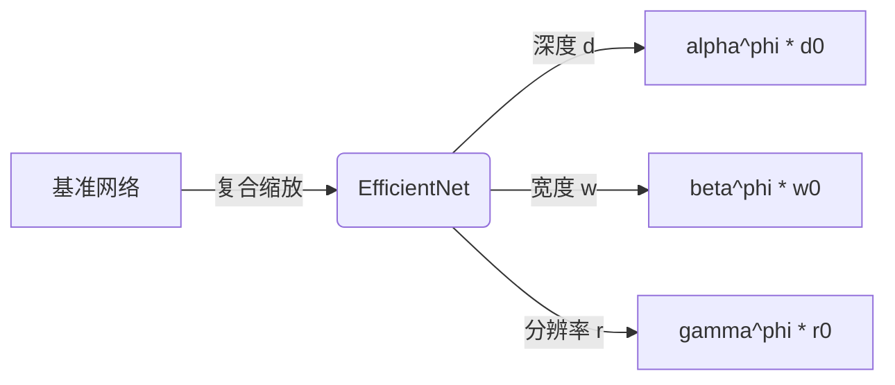
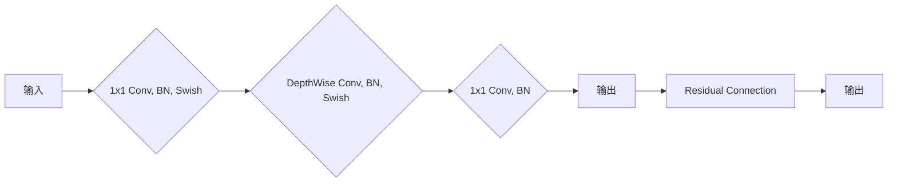

# EfficientNet原理与代码实例讲解

## 1.背景介绍

### 1.1 卷积神经网络发展历程

卷积神经网络(Convolutional Neural Networks, CNN)是一种深度学习模型,在计算机视觉、图像识别、自然语言处理等领域有着广泛的应用。早期的LeNet、AlexNet等网络结构相对简单,但随着研究的不断深入,网络结构变得越来越复杂,层数越来越深。

然而,复杂的网络结构往往需要大量的计算资源和内存,这对于移动端等资源受限的设备来说是一个巨大的挑战。因此,如何在保持高精度的同时,降低模型的计算复杂度和内存占用,成为了深度学习领域的一个重要研究方向。

### 1.2 模型压缩与高效网络设计

为了解决上述问题,研究人员提出了多种模型压缩和高效网络设计的方法,例如剪枝、量化、知识蒸馏等。这些方法旨在减小模型的大小和计算量,从而提高推理效率。

然而,这些方法往往需要对已有的大型网络进行额外的优化,而无法从头开始设计出高效的网络结构。因此,谷歌大脑团队在2019年提出了EfficientNet,一种通过模型缩放的方式,系统地构建出一系列高效的卷积神经网络。

## 2.核心概念与联系

### 2.1 模型缩放

EfficientNet的核心思想是通过平衡网络的深度、宽度和分辨率三个维度,来构建出一系列高效的网络结构。具体来说,它使用了一个简单而又高效的复合缩放方法,将这三个维度同时缩放,从而获得更高的精度和更好的效率。

传统的网络设计方法通常只关注单个维度的缩放,例如增加网络的深度或宽度。然而,EfficientNet的作者发现,单独缩放某个维度会达到收益递减的状态,而同时缩放三个维度可以获得更好的效果。

### 2.2 复合模型缩放

EfficientNet使用了一个简单的复合缩放方法,通过一个统一的缩放系数 $\phi$ 来控制网络的深度、宽度和分辨率。具体来说,假设我们有一个基准网络,其深度为 $d_0$、宽度为 $w_0$、分辨率为 $r_0$,那么缩放后的网络的深度、宽度和分辨率分别为:

$$
\begin{aligned}
d &= \alpha^{\phi} \cdot d_0\\
w &= \beta^{\phi} \cdot w_0\\
r &= \gamma^{\phi} \cdot r_0\\
\end{aligned}
$$

其中 $\alpha$、$\beta$、$\gamma$ 是预先设定的常数,用于控制各个维度的缩放比例。通过改变 $\phi$ 的值,我们可以获得一系列不同规模的高效网络。



上图展示了EfficientNet的复合缩放过程。通过同时缩放网络的深度、宽度和分辨率三个维度,可以获得一系列高效的网络结构。

### 2.3 网络架构搜索

除了复合缩放方法,EfficientNet还使用了一种基于强化学习的网络架构搜索(Neural Architecture Search, NAS)技术,来寻找最优的网络架构。

NAS是一种自动机器学习(AutoML)技术,它可以自动探索大量可能的网络架构,并选择性能最优的架构。EfficientNet使用了一种名为"小网络搜索、大网络复现"的策略,先在较小的网络上进行架构搜索,然后将搜索到的最优架构缩放到更大的网络上。

通过NAS和复合缩放的结合,EfficientNet可以在保持较高精度的同时,极大地提高推理效率。

## 3.核心算法原理具体操作步骤

### 3.1 Mobile Inverted Residual Block

EfficientNet的基本构建块是Mobile Inverted Residual Block,它是对MobileNetV2中的Inverted Residual Block的改进版本。

Mobile Inverted Residual Block的结构如下:



1. 首先,输入特征图通过一个1x1的卷积层进行通道数的升维,并使用批归一化(BN)和Swish激活函数。
2. 然后,进行一个深度可分离卷积(DepthWise Convolution),同样使用BN和Swish激活函数。
3. 接下来,使用另一个1x1的卷积层将通道数降维回原始大小,并使用BN层。
4. 最后,将输出特征图与输入特征图相加,形成残差连接。

Mobile Inverted Residual Block的优点在于,它可以有效地减少计算量和内存占用,同时保持较高的精度。深度可分离卷积可以极大地降低参数量,而1x1卷积则用于调整通道数,实现特征融合。

### 3.2 Squeeze-and-Excitation优化

为了进一步提高网络的表现,EfficientNet在Mobile Inverted Residual Block的基础上,引入了Squeeze-and-Excitation(SE)优化。

SE模块的作用是自适应地重新校准每个通道的重要性,从而增强网络对于重要特征的关注度。它包括两个步骤:

1. Squeeze: 对输入特征图的每个通道进行全局平均池化,得到一个向量。
2. Excitation: 将上一步得到的向量通过两个全连接层,得到每个通道的重要性权重。

将SE模块嵌入到Mobile Inverted Residual Block中,可以进一步提高网络的表现。

### 3.3 自动增强数据

为了提高模型的泛化能力,EfficientNet采用了自动增强(AutoAugment)数据增强策略。

AutoAugment是一种基于强化学习的数据增强方法,它可以自动搜索出最优的数据增强策略。具体来说,它将数据增强策略表示为一系列子策略的序列,然后使用强化学习算法来搜索子策略及其应用顺序,以最大化模型在验证集上的准确率。

通过AutoAugment,EfficientNet可以有效地增强训练数据的多样性,从而提高模型的泛化能力,避免过拟合。

## 4.数学模型和公式详细讲解举例说明

### 4.1 复合缩放公式

如前所述,EfficientNet使用了一个简单的复合缩放方法,通过一个统一的缩放系数 $\phi$ 来控制网络的深度、宽度和分辨率。具体的缩放公式如下:

$$
\begin{aligned}
d &= \alpha^{\phi} \cdot d_0\\
w &= \beta^{\phi} \cdot w_0\\
r &= \gamma^{\phi} \cdot r_0\\
\end{aligned}
$$

其中:

- $d$、$w$、$r$ 分别表示缩放后网络的深度、宽度和分辨率。
- $d_0$、$w_0$、$r_0$ 分别表示基准网络的深度、宽度和分辨率。
- $\alpha$、$\beta$、$\gamma$ 是预先设定的常数,用于控制各个维度的缩放比例。
- $\phi$ 是一个统一的缩放系数,控制整个网络的缩放程度。

通过改变 $\phi$ 的值,我们可以获得一系列不同规模的高效网络。例如,当 $\phi=1$ 时,我们得到的是基准网络;当 $\phi>1$ 时,我们得到的是一个更大的网络;当 $\phi<1$ 时,我们得到的是一个更小的网络。

### 4.2 网络架构搜索目标函数

在网络架构搜索过程中,EfficientNet使用了一种基于强化学习的方法,目标是最大化一个组合目标函数,该函数同时考虑了模型的精度和效率。具体来说,目标函数定义如下:

$$
\mathcal{L}_{combined} = \mathcal{L}_{acc} + \lambda \cdot \mathcal{L}_{fms}
$$

其中:

- $\mathcal{L}_{acc}$ 是模型在验证集上的精度损失函数,通常使用交叉熵损失。
- $\mathcal{L}_{fms}$ 是模型的浮点运算量(FLOPs)和模型大小(Model Size)的加权和,用于衡量模型的效率。
- $\lambda$ 是一个超参数,用于平衡精度和效率之间的权衡。

通过最小化组合目标函数 $\mathcal{L}_{combined}$,我们可以获得一个在精度和效率之间达到最佳平衡的网络架构。

### 4.3 Squeeze-and-Excitation模块

Squeeze-and-Excitation(SE)模块是EfficientNet中用于增强网络表现的一种优化策略。它的作用是自适应地重新校准每个通道的重要性,从而增强网络对于重要特征的关注度。

SE模块的数学表达式如下:

$$
\mathbf{x}_{se} = \mathbf{x} \odot \sigma(\mathbf{W}_2 \delta(\mathbf{W}_1 \mathbf{x}_{sq}))
$$

其中:

- $\mathbf{x}$ 是输入特征图。
- $\mathbf{x}_{sq}$ 是对输入特征图的每个通道进行全局平均池化得到的向量,即 Squeeze 操作。
- $\mathbf{W}_1$ 和 $\mathbf{W}_2$ 是两个全连接层的权重矩阵,用于学习通道之间的依赖关系。
- $\delta$ 是 ReLU 激活函数,用于增加非线性。
- $\sigma$ 是 Sigmoid 激活函数,用于将输出映射到 $(0, 1)$ 范围内,作为每个通道的重要性权重。
- $\odot$ 表示元素wise乘积,将重要性权重与原始特征图相乘,得到重新校准后的特征图 $\mathbf{x}_{se}$。

通过引入 SE 模块,EfficientNet 可以自适应地调整每个通道的重要性,从而提高网络对于重要特征的关注度,进一步提升模型的性能。

## 5.项目实践:代码实例和详细解释说明

为了更好地理解 EfficientNet 的原理和实现细节,我们将通过一个实际的代码示例来进行讲解。在这个示例中,我们将使用 PyTorch 框架实现一个简化版本的 EfficientNet,并在 CIFAR-10 数据集上进行训练和测试。

### 5.1 导入所需库

```python
import torch
import torch.nn as nn
import torch.nn.functional as F
from torchvision import datasets, transforms
```

### 5.2 定义 MBConv 块

MBConv 块是 EfficientNet 的基本构建单元,它包括深度可分离卷积、Squeeze-and-Excitation 模块以及残差连接。

```python
class MBConv(nn.Module):
    def __init__(self, in_channels, out_channels, kernel_size, stride, expand_ratio, se_ratio):
        super(MBConv, self).__init__()
        self.stride = stride
        self.se = nn.Sequential(
            nn.AdaptiveAvgPool2d(1),
            nn.Conv2d(in_channels, int(in_channels * se_ratio), 1),
            nn.ReLU(),
            nn.Conv2d(int(in_channels * se_ratio), out_channels, 1),
            nn.Sigmoid()
        )

        self.conv = nn.Sequential(
            nn.Conv2d(in_channels, in_channels * expand_ratio, 1),
            nn.BatchNorm2d(in_channels * expand_ratio),
            nn.ReLU6(),
            nn.Conv2d(in_channels * expand_ratio, in_channels * expand_ratio, kernel_size, stride, kernel_size // 2, groups=in_channels * expand_ratio),
            nn.BatchNorm2d(in_channels * expand_ratio),
            nn.ReLU6(),
            nn.Conv2d(in_channels * expand_ratio, out_channels, 1),
            nn.BatchNorm2d(out_channels)
        )

    def forward(self, x):
        out = self.conv(x)
        weight = self.se(out)
        out = out * weight
        if self.stride == 1 and x.size