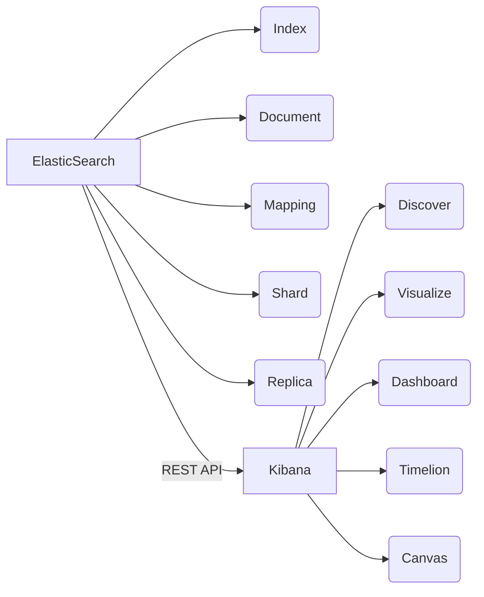

# ElasticSearch Kibana原理与代码实例讲解

## 1. 背景介绍
### 1.1 搜索引擎的发展历程
#### 1.1.1 全文搜索的诞生
#### 1.1.2 分布式搜索的兴起 
#### 1.1.3 近实时搜索成为主流
### 1.2 ElasticSearch的崛起
#### 1.2.1 ElasticSearch的诞生
#### 1.2.2 ElasticSearch的发展历程
#### 1.2.3 ElasticSearch生态圈的繁荣
### 1.3 Kibana的出现
#### 1.3.1 可视化分析需求的增长
#### 1.3.2 Kibana的诞生与发展
#### 1.3.3 Kibana成为ElasticSearch生态中的重要一员

## 2. 核心概念与联系
### 2.1 ElasticSearch的核心概念
#### 2.1.1 Index（索引）
#### 2.1.2 Document（文档）
#### 2.1.3 Mapping（映射）  
#### 2.1.4 Shard（分片）
#### 2.1.5 Replica（副本）
### 2.2 Kibana的核心概念
#### 2.2.1 Discover（数据探索）
#### 2.2.2 Visualize（可视化）
#### 2.2.3 Dashboard（仪表盘）
#### 2.2.4 Timelion（时序数据分析）
#### 2.2.5 Canvas（画布）
### 2.3 ElasticSearch与Kibana的关系
#### 2.3.1 数据存储与分析的完美结合
#### 2.3.2 REST API的无缝对接
#### 2.3.3 插件化架构的互补



## 3. 核心算法原理具体操作步骤
### 3.1 ElasticSearch的倒排索引
#### 3.1.1 分词
#### 3.1.2 构建词典
#### 3.1.3 建立倒排表
### 3.2 ElasticSearch的相关性评分
#### 3.2.1 TF-IDF算法
#### 3.2.2 BM25算法
#### 3.2.3 字段长度归一化
#### 3.2.4 协调因子
### 3.3 ElasticSearch的查询过程
#### 3.3.1 查询解析
#### 3.3.2 查询重写
#### 3.3.3 查询执行
#### 3.3.4 结果合并与排序
### 3.4 Kibana的聚合分析
#### 3.4.1 Metric聚合
#### 3.4.2 Bucket聚合
#### 3.4.3 Pipeline聚合
#### 3.4.4 聚合的嵌套使用

## 4. 数学模型和公式详细讲解举例说明
### 4.1 TF-IDF模型
TF-IDF（Term Frequency-Inverse Document Frequency）是一种用于信息检索与文本挖掘的常用加权技术。TF意思是词频(Term Frequency)，IDF意思是逆文本频率指数(Inverse Document Frequency)。
- TF计算公式：
  $tf_{t,d} = \frac{f_{t,d}}{\sum_{t'\in d} f_{t',d}}$
  其中，$f_{t,d}$表示词条t在文档d中出现的频率。分母则是文档d中所有词条的频率之和。
- IDF计算公式：
  $idf_t = \log \frac{N}{n_t}$
  其中，$N$表示语料库中文档总数，$n_t$表示包含词条t的文档数。
- TF-IDF计算公式：  
  $tfidf_{t,d} = tf_{t,d} \times idf_t$

TF-IDF的主要思想是：如果某个词或短语在一篇文章中出现的频率高，并且在其他文章中很少出现，则认为此词或者短语具有很好的类别区分能力，适合用来分类。

### 4.2 BM25模型
BM25（Best Match 25）是一种基于概率检索模型的排序函数，是Okapi BM25的简称。ElasticSearch的相关性评分默认使用的就是BM25算法。
BM25的计算公式如下：
$$score(D,Q) = \sum_{i=1}^{n} IDF(q_i) \cdot \frac{f(q_i,D) \cdot (k_1+1)}{f(q_i,D) + k_1 \cdot (1-b+b \cdot \frac{|D|}{avgdl})}$$

其中：
- $f(q_i,D)$表示查询中每个词条$q_i$在文档$D$中的出现频率
- $|D|$表示文档$D$的长度，$avgdl$表示文档集合的平均长度
- $k_1$和$b$是自由参数，$k_1$控制词频的饱和度，$b$控制文档长度的归一化程度

BM25相比TF-IDF，在词频饱和度和文档长度归一化方面进行了优化，更符合实际的相关性需求。

## 5. 项目实践：代码实例和详细解释说明
### 5.1 ElasticSearch索引的创建与删除
```java
// 创建索引
CreateIndexRequest request = new CreateIndexRequest("my-index"); 
CreateIndexResponse createIndexResponse = client.indices().create(request, RequestOptions.DEFAULT);

// 删除索引
DeleteIndexRequest deleteIndexRequest = new DeleteIndexRequest("my-index");
AcknowledgedResponse deleteIndexResponse = client.indices().delete(deleteIndexRequest, RequestOptions.DEFAULT);
```
在ElasticSearch中，我们可以使用CreateIndexRequest来创建一个新的索引，索引的名称在构造函数中指定。通过client.indices().create()方法发送请求，就可以完成索引的创建。
删除索引则是使用DeleteIndexRequest指定要删除的索引名，通过client.indices().delete()方法发送删除请求即可。

### 5.2 ElasticSearch文档的增删改查
```java
// 新增/更新文档
IndexRequest indexRequest = new IndexRequest("my-index");
indexRequest.id("1");
indexRequest.source("name", "John", "age", 30);
IndexResponse indexResponse = client.index(indexRequest, RequestOptions.DEFAULT);

// 查询文档
GetRequest getRequest = new GetRequest("my-index", "1");
GetResponse getResponse = client.get(getRequest, RequestOptions.DEFAULT);

// 删除文档  
DeleteRequest deleteRequest = new DeleteRequest("my-index", "1");
DeleteResponse deleteResponse = client.delete(deleteRequest, RequestOptions.DEFAULT);
```
对于文档的CRUD操作，ElasticSearch提供了一套完善的API。新增和更新可以在IndexRequest中指定文档id，然后传入field和value的键值对。查询通过GetRequest指定索引和文档id即可查询。删除则是通过DeleteRequest指定要删除的文档的索引和id。

### 5.3 Kibana的可视化图表配置
在Kibana的Visualize模块，我们可以基于ElasticSearch的聚合分析，方便地创建各种可视化图表。
以创建一个柱状图为例：
1. 选择柱状图的类型，例如Vertical Bar
2. 配置图表使用的索引，以及聚合的字段
3. 在Metrics中配置Y轴聚合，例如求和Sum
4. 在Buckets中配置X轴分桶，例如根据Terms进行分组
5. 在Options中配置图表的其他选项，如图例、样式等
6. 点击Save保存图表配置

通过Kibana的可视化配置，我们无需编写复杂的聚合查询语句，就能轻松实现数据的多维度分析与展示。

## 6. 实际应用场景
### 6.1 日志分析与异常监控
ELK（ElasticSearch、Logstash、Kibana）是一套广泛用于日志收集、分析与监控的开源解决方案。我们可以通过Logstash或Beats采集各种服务器、应用的日志，将其导入ElasticSearch进行集中式存储与分析。
在Kibana中，我们可以实时查看日志的时间趋势、构建日志仪表盘、创建监控告警等。通过对日志中的异常内容（如错误堆栈、异常IP）进行挖掘，能够帮助我们快速定位系统问题，提升运维效率。

### 6.2 电商搜索与推荐
ElasticSearch凭借其强大的全文检索与多字段搜索能力，非常适合用于电商领域的商品搜索引擎。我们可以将商品的各种属性（如标题、描述、品牌、价格等）索引到ElasticSearch中，通过合理的Mapping设计与索引优化，实现亿级商品的毫秒级搜索响应。
同时，基于ElasticSearch的More Like This查询，我们还可以实现相似商品的推荐。通过分析用户的历史浏览、购买行为，找到与之相似的其他商品，从而提升推荐的精准度。

### 6.3 GIS地理位置分析
ElasticSearch内置了强大的GEO地理位置搜索与聚合分析能力。通过ES的Geo Point类型，我们可以对地理坐标数据进行索引。
在位置相关的场景，如外卖订单分析、共享单车轨迹分析等，我们可以利用ES的Geo Distance聚合，分析用户与商家、单车的地理距离分布。通过Geo Bounding Box聚合，还能实现对特定地理区域的订单、车辆分布统计。
Kibana的Tile Map图表，则能够直观地在地图上展示位置数据的聚合结果。帮助我们洞察区域热力分布、识别潜在的地理规律。

## 7. 工具和资源推荐
- ElasticSearch官方文档：https://www.elastic.co/guide/en/elasticsearch/reference/current/index.html
- Kibana官方文档：https://www.elastic.co/guide/en/kibana/current/index.html
- ElasticSearch Java API文档：https://www.elastic.co/guide/en/elasticsearch/client/java-rest/current/index.html
- Elastic Stack中文社区：https://elasticsearch.cn/
- 《Elasticsearch 权威指南》：https://www.elastic.co/guide/cn/elasticsearch/guide/current/index.html
- 《Mastering Elasticsearch》：https://www.packtpub.com/product/mastering-elasticsearch-7-x/9781789957754

## 8. 总结：未来发展趋势与挑战
### 8.1 云原生与Kubernetes部署
随着云计算的发展，越来越多的公司选择将ElasticSearch部署在云环境中。ELK Stack与Kubernetes的结合，让ElasticSearch集群的编排、调度、运维变得更加自动化和高效。
未来ElasticSearch在云原生方面，如何实现更灵活的资源调度、更可靠的故障自愈、更便捷的版本升级，将是一个重要的发展方向。

### 8.2 机器学习智能分析
ElasticSearch近年来不断加强对机器学习的支持，推出了诸如异常检测、时序预测等内置的机器学习特性。
通过与ElasticSearch中海量数据的无缝整合，用户可以更加便捷地应用机器学习算法，挖掘数据背后的规律与趋势。未来，ElasticSearch有望成为实现"搜索+机器学习"的一站式平台。

### 8.3 知识图谱与语义搜索
知识图谱是AI时代的重要基础设施，其与搜索引擎的结合，被称为"语义搜索"。ElasticSearch本身对于结构化、半结构化数据的支持非常完善，非常适合用于知识图谱的存储与检索。
未来，ElasticSearch可以与知识图谱技术深度融合，实现更加智能、精准的搜索体验。用户可以用自然语言提问，搜索引擎能够"理解"问题背后的语义，给出更符合用户意图的搜索结果。

### 8.4 算法模型的不断优化
尽管ElasticSearch的倒排索引、相关性算法已经相当成熟，但仍然存在着优化的空间。如何权衡索引的写入与检索性能？如何根据不同的数据特征和查询场景，动态调整评分算法？如何引入更多的机器学习算法，让排序结果更加个性化？
这些都是ElasticSearch未来在算法模型上持续研究的课题。

## 9. 附录：常见问题与解答
### 9.1 ElasticSearch如何实现近实时搜索？
ElasticSearch之所以能实现近实时搜索，原因在于其独特的文档提交与刷新机制。
当新文档写入ElasticSearch时，首先会被写入内存缓冲区和追加到磁盘上的translog日志文件，这一过程速度非常快。默认情况下，每隔1秒会将内存缓冲区的数据写