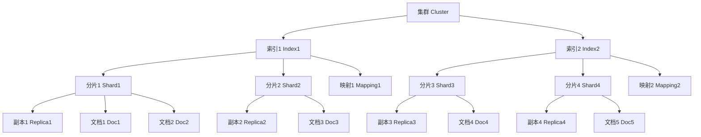

# ElasticSearch原理与代码实例讲解

## 1.背景介绍

在当今的数字时代,数据的爆炸式增长已成为一个不争的事实。无论是企业、政府还是个人,都面临着如何高效地存储、检索和分析海量数据的挑战。传统的关系型数据库虽然在结构化数据的管理方面表现出色,但在处理非结构化和半结构化数据时却显得力不从心。这就催生了一种新型的数据存储和检索解决方案——全文搜索引擎。

ElasticSearch作为当前最流行的开源全文搜索引擎之一,凭借其高度可扩展性、近乎实时的搜索能力和分布式特性,成为了企业级应用中不可或缺的重要组件。它不仅可以用于全文检索,还能够对数据进行复杂的分析和挖掘,为数据驱动型应用提供强有力的支持。

## 2.核心概念与联系

在深入探讨ElasticSearch的原理之前,我们需要先了解一些核心概念:

### 2.1 集群(Cluster)

ElasticSearch是一个分布式系统,可以由多个节点(Node)组成一个集群。集群不仅提高了系统的容错性和可用性,还能够实现数据的自动分片和负载均衡,从而支持PB级的数据存储和近乎实时的搜索响应。

### 2.2 索引(Index)

索引是ElasticSearch中的逻辑数据空间,用于存储相关的文档。它相当于关系型数据库中的"数据库"概念。一个集群可以包含多个索引,每个索引又由多个分片(Shard)组成,这些分片可以分布在不同的节点上,从而实现数据的水平扩展。

### 2.3 文档(Document)

文档是ElasticSearch中最小的数据单元,相当于关系型数据库中的一行记录。它以JSON格式表示,可以包含多个字段(Field),每个字段可以是不同的数据类型,如数值、字符串、日期等。

### 2.4 映射(Mapping)

映射类似于关系型数据库中的"表结构定义",用于定义索引中文档的字段名、数据类型和相关属性。ElasticSearch会根据映射自动构建反向索引,以支持快速的全文检索。

### 2.5 分片(Shard)和副本(Replica)

为了实现数据的水平扩展和高可用,ElasticSearch将索引划分为多个分片,每个分片可以分配到不同的节点上。同时,每个分片还可以有一个或多个副本,用于提高数据的冗余备份和查询吞吐量。

这些核心概念相互关联、相辅相成,共同构建了ElasticSearch的基础架构。下面我们将通过一个流程图来直观地展示它们之间的关系:



## 3.核心算法原理具体操作步骤

ElasticSearch的核心算法原理主要包括以下几个方面:

### 3.1 倒排索引

倒排索引是ElasticSearch实现全文检索的关键技术。与传统的正向索引不同,倒排索引将文档中的每个词作为键,记录了该词出现的文档列表及其在文档中的位置信息。这种设计大大提高了检索效率,因为我们只需要查找包含查询词的文档列表,而无需扫描全部文档。

倒排索引的构建过程如下:

1. **分词(Tokenizing)**: 将文本按照一定的规则切分为多个词条(Token)。
2. **归一化(Normalization)**: 对词条进行归一化处理,如转小写、去除标点符号等。
3. **索引(Indexing)**: 为每个归一化后的词条创建一个倒排索引项,记录该词条出现的文档ID及位置信息。
4. **合并(Merging)**: 定期将新建的索引项与旧索引合并,以提高查询效率。

### 3.2 分布式架构

ElasticSearch采用分布式架构,可以将索引数据自动分片并分布在多个节点上,从而实现数据的水平扩展。当有新文档需要索引时,系统会根据特定的路由算法将其分配到对应的分片上。查询时,则需要将查询请求发送到相关的分片,并合并它们的查询结果。

分布式架构的优势在于:

1. **可扩展性**: 通过增加节点,可以线性扩展系统的存储和处理能力。
2. **高可用性**: 每个分片都可以有多个副本,即使某些节点宕机,数据也不会丢失。
3. **负载均衡**: 查询请求可以在多个节点之间自动负载均衡,提高吞吐量。

### 3.3 近实时搜索

ElasticSearch使用了一种近实时(Near Real-Time)的架构设计,能够在文档索引后的秒级时间内就可被搜索到。这是通过以下机制实现的:

1. **新建段(New Segment)**: 当有新文档需要索引时,ElasticSearch会先将其写入一个新的内存段(Segment)中。
2. **刷新(Refresh)**: 定期(默认为1秒)将内存段的数据刷新到一个新的磁盘段文件中,使其可被搜索。
3. **合并(Merge)**: 在后台定期将较小的段文件合并为更大的段文件,以减少打开过多文件的开销。

通过这种设计,ElasticSearch可以在低延迟的情况下实现近乎实时的搜索体验。

## 4.数学模型和公式详细讲解举例说明

在ElasticSearch中,相关性评分(Relevance Scoring)是一个非常重要的概念。它决定了搜索结果的排序,使得最相关的文档能够排在最前面。ElasticSearch采用了一种基于TF-IDF算法的相似度评分模型,我们将在这一节对其进行详细讲解。

### 4.1 TF-IDF算法

TF-IDF(Term Frequency-Inverse Document Frequency)是一种广泛使用的信息检索算法,用于评估一个词对于一个文档集或语料库的重要程度。它由两个部分组成:

1. **词频(Term Frequency, TF)**: 描述一个词在文档中出现的频率。一个词在文档中出现的次数越多,其重要性就越高。

   $$TF(t,d) = \frac{n_{t,d}}{\sum_{t' \in d}n_{t',d}}$$

   其中,\\(n_{t,d}\\)表示词\\(t\\)在文档\\(d\\)中出现的次数,分母则是文档\\(d\\)中所有词的总数。

2. **逆向文档频率(Inverse Document Frequency, IDF)**: 描述一个词在整个文档集中的普遍重要性。一个词在文档集中出现的次数越少,其重要性就越高。

   $$IDF(t,D) = \log\frac{|D|}{|d \in D: t \in d|}$$

   其中,\\(|D|\\)表示文档集\\(D\\)中文档的总数,\\(|d \in D: t \in d|\\)表示包含词\\(t\\)的文档数量。

最终,TF-IDF的评分公式为:

$$\text{TF-IDF}(t,d,D) = TF(t,d) \times IDF(t,D)$$

### 4.2 ElasticSearch中的相关性评分

ElasticSearch在TF-IDF算法的基础上,引入了更多的因素来计算文档与查询的相关性评分,主要包括:

1. **字段长度规范化(Field-Length Norm)**: 考虑到较长的文档更容易包含更多的词,因此需要对较长文档的评分进行适当的惩罚。
2. **词条增量(Term Boost)**: 允许为某些词条设置更高的权重,以提高其在评分中的影响力。
3. **查询规范化(Query Normalization)**: 对查询中的每个词条进行归一化处理,以确保它们在评分中的权重相同。

ElasticSearch的相关性评分公式如下:

$$\text{score}(q,d) = \sum_{t \in q} \frac{tf(t,d)}{k_1 \times ((1-b)+b \times \frac{|d|}{avgdl})} \times idf(t)^2 \times t.getBoost() \times \text{norm}(t,d)$$

其中:

- \\(q\\)表示查询,\\(d\\)表示文档
- \\(tf(t,d)\\)表示词\\(t\\)在文档\\(d\\)中的词频
- \\(|d|\\)表示文档\\(d\\)的长度(词数)
- \\(avgdl\\)表示文档集中所有文档的平均长度
- \\(k_1\\)和\\(b\\)是用于调节字段长度规范化的常量
- \\(idf(t)\\)表示词\\(t\\)的逆向文档频率
- \\(t.getBoost()\\)表示词\\(t\\)的增量权重
- \\(norm(t,d)\\)表示对词\\(t\\)在文档\\(d\\)中的评分进行的其他规范化处理

通过上述公式,ElasticSearch可以为每个文档计算出一个相关性评分,并按照评分从高到低的顺序返回搜索结果。

## 5.项目实践:代码实例和详细解释说明

在本节中,我们将通过一个实际的代码示例,演示如何使用ElasticSearch的Java客户端API对文档进行索引和搜索操作。

### 5.1 环境准备

首先,我们需要在项目中引入ElasticSearch的Java客户端依赖:

```xml
<dependency>
    <groupId>org.elasticsearch.client</groupId>
    <artifactId>elasticsearch-rest-high-level-client</artifactId>
    <version>7.17.3</version>
</dependency>
```

### 5.2 创建ElasticSearch客户端

```java
RestHighLevelClient client = new RestHighLevelClient(
    RestClient.builder(
        new HttpHost("localhost", 9200, "http")));
```

上面的代码创建了一个`RestHighLevelClient`对象,用于与ElasticSearch集群进行通信。`HttpHost`对象指定了ElasticSearch节点的地址和端口。

### 5.3 创建索引

在开始索引文档之前,我们需要先创建一个索引:

```java
CreateIndexRequest request = new CreateIndexRequest("blog");
CreateIndexResponse createIndexResponse = client.indices().create(request, RequestOptions.DEFAULT);
```

这段代码创建了一个名为`blog`的索引。如果需要为索引设置映射,可以通过`CreateIndexRequest`对象的`mapping`方法来实现。

### 5.4 索引文档

接下来,我们将一篇博客文章索引到ElasticSearch中:

```java
IndexRequest indexRequest = new IndexRequest("blog")
    .id("1")
    .source("""
        {
          "title": "ElasticSearch入门教程",
          "content": "本文将介绍ElasticSearch的基本概念和使用方法...",
          "author": "张三",
          "postDate": "2023-05-01"
        }
        """, XContentType.JSON);

IndexResponse indexResponse = client.index(indexRequest, RequestOptions.DEFAULT);
```

上面的代码创建了一个`IndexRequest`对象,指定了索引名称、文档ID和文档内容(JSON格式)。`client.index`方法将文档索引到ElasticSearch集群中。

### 5.5 搜索文档

现在,我们可以尝试搜索刚才索引的文档:

```java
SearchRequest searchRequest = new SearchRequest("blog");
SearchSourceBuilder searchSourceBuilder = new SearchSourceBuilder();
searchSourceBuilder.query(QueryBuilders.matchQuery("content", "ElasticSearch"));
searchRequest.source(searchSourceBuilder);

SearchResponse searchResponse = client.search(searchRequest, RequestOptions.DEFAULT);
SearchHits hits = searchResponse.getHits();
for (SearchHit hit : hits) {
    String sourceAsString = hit.getSourceAsString();
    System.out.println(sourceAsString);
}
```

这段代码创建了一个`SearchRequest`对象,并使用`SearchSourceBuilder