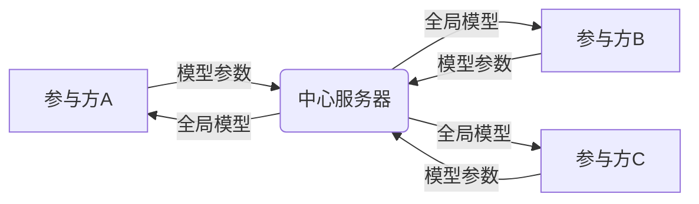

# Federated Learning原理与代码实例讲解

## 1. 背景介绍

### 1.1 传统机器学习的局限性

传统的机器学习方法通常需要将所有的训练数据集中到一个中心节点进行训练,这存在以下几个问题:

1. 隐私泄露风险:敏感数据(如用户信息、医疗记录等)需要上传到中心节点,存在隐私泄露的风险。 
2. 数据孤岛问题:不同机构之间数据难以共享,导致数据孤岛,模型性能受限。
3. 通信开销大:海量数据集中上传训练,通信成本高。
4. 计算资源需求大:中心节点需要强大的计算和存储能力。

### 1.2 联邦学习的提出

为了解决上述问题,谷歌在2016年提出了联邦学习(Federated Learning,FL)的概念。联邦学习是一种分布式机器学习范式,旨在在不集中原始数据的情况下,通过多个参与方协作训练模型。

联邦学习的优势包括:

1. 保护数据隐私:原始数据不出本地,降低隐私泄露风险。
2. 突破数据孤岛:不同机构可以在不共享原始数据的情况下协作建模。
3. 减少通信开销:模型参数在参与方之间传递,通信量小。
4. 利用分布式资源:利用各参与方的计算资源训练模型。

### 1.3 联邦学习的应用场景

联邦学习在以下场景有广泛的应用前景:

1. 金融领域:多家银行协作建模,检测欺诈交易。
2. 医疗健康:多个医院共享病例数据,诊断疾病。
3. 智能手机:手机终端协同训练语音助手、输入法等模型。
4. 工业互联网:设备厂商、用户协作优化预测性维护模型。
5. 智慧交通:不同路段监控数据训练交通流量预测模型。

## 2. 核心概念与联系

### 2.1 联邦学习架构

联邦学习系统通常由以下角色组成:

- 参与方(Party):拥有本地数据集的实体,如手机、IOT设备、机构等。
- 中心服务器(Server):协调各参与方进行联邦建模。
- 联邦:多个参与方组成的联盟,为解决共同问题协作建模。

### 2.2 横向联邦学习与纵向联邦学习

根据参与方的数据分布,联邦学习可分为横向联邦学习和纵向联邦学习两种:

- 横向联邦学习(Horizontal FL):参与方拥有不同用户的相同特征数据。如多个银行,各自拥有不同客户的相同特征(收入、年龄等)数据。

- 纵向联邦学习(Vertical FL):参与方拥有相同用户的不同特征数据。如银行和电商平台,分别拥有相同用户的银行流水和购物记录特征。



<center>图1 横向联邦学习架构示意图</center>

### 2.3 联邦学习生命周期

典型的联邦学习过程如下:

1. 参与方与服务器协商学习目标,确定超参数。
2. 参与方在本地用私有数据训练模型。
3. 各参与方上传本地模型参数到服务器。
4. 服务器聚合各参与方模型,生成全局模型。
5. 参与方下载全局模型,更新本地模型。
6. 重复2-5步,直到模型收敛或达到预设轮数。

## 3. 核心算法原理

### 3.1 FederatedAveraging算法

最经典的联邦学习算法是FederatedAveraging(FedAvg),由McMahan等人在2017年提出。FedAvg算法的核心思想是各参与方在本地用私有数据训练,周期性地将模型参数上传到服务器进行聚合,得到全局模型再分发回各参与方更新本地模型。

FedAvg的具体步骤如下:

1. 服务器初始化全局模型参数$w_0$,发送给所有参与方。
2. 对于第$t$轮通信:
   1. 服务器从参与方集合中随机选择一部分参与方子集$S_t$
   2. 服务器将当前全局模型参数$w_t$下发给$S_t$中的每个参与方$k$
   3. 每个参与方$k$基于本地私有数据集$D_k$,用$w_t$初始化,训练$E$轮,得到更新后的本地模型$w_{t+1}^k$
   4. 参与方$k$将$w_{t+1}^k$上传到服务器
   5. 服务器对收到的$K$个本地模型参数进行聚合,更新全局模型参数:

$$w_{t+1} = \sum_{k=1}^K \frac{n_k}{n} w_{t+1}^k$$

其中$n_k$为参与方$k$的样本数,$n$为总样本数。
   
3. 重复步骤2,直至算法收敛。

可以看出,FedAvg本质上是将分布式SGD(Stochastic Gradient Descent)应用到横向联邦学习中。服务器聚合相当于全局梯度下降,参与方的本地训练相当于计算局部梯度。

### 3.2 联邦学习优化策略

为了提高联邦学习的效率和鲁棒性,研究者们提出了许多优化策略,主要包括:

1. 通信优化:减少通信轮数和通信量。如FedPAQ量化梯度、TernGrad三值化梯度等。

2. 异构性优化:解决Non-IID数据分布下模型性能下降问题。如FedProx添加正则项、SCAFFOLD引入控制变量等。

3. 隐私保护:防止模型反向推测隐私数据。如差分隐私、安全多方计算等。

4. 公平性优化:平衡不同参与方的贡献和收益。如q-FFL根据参与方质量分配聚合权重。

5. 模型个性化:使全局模型兼顾个性化需求。如FedPer添加个性化层等。

## 4. 数学模型与公式推导

本节我们详细推导FedAvg算法的数学模型。考虑一个由$K$个参与方组成的联邦,每个参与方$k$有私有数据集$D_k$,样本数为$n_k$。联邦的目标是最小化如下损失函数:

$$\min_{w} f(w) = \sum_{k=1}^K \frac{n_k}{n} F_k(w)$$

其中$w$为模型参数,$n=\sum_{k=1}^K n_k$为总样本数,$F_k(w)$为参与方$k$的本地损失函数,定义为:

$$F_k(w) = \frac{1}{n_k} \sum_{i \in D_k} f_i(w)$$

其中$f_i(w)$为样本$i$的损失函数。

FedAvg算法的目标是求解上述最优化问题。假设当前第$t$轮通信,全局模型参数为$w_t$。在参与方$k$本地,基于$w_t$训练$E$轮,损失函数为:

$$\min_{w_k} F_k(w_k) = \frac{1}{n_k} \sum_{i \in D_k} f_i(w_k), \quad w_k(0) = w_t$$

用梯度下降法求解,更新公式为:

$$w_k(e+1) = w_k(e) - \eta \nabla F_k(w_k(e)), \quad e=0,1,...,E-1$$

其中$\eta$为学习率。记参与方$k$训练$E$轮后的模型参数为$w_{t+1}^k = w_k(E)$。

服务器收集所有参与方上传的$w_{t+1}^k$后,进行聚合以更新全局模型:

$$w_{t+1} = \sum_{k=1}^K \frac{n_k}{n} w_{t+1}^k$$

可以证明,当参与方数$K$趋于无穷大时,FedAvg算法等价于用全量数据集中训练,即最小化总损失$f(w)$。

为了加速收敛,FedAvg通常从参与方集合中随机选择一个子集$S_t$来参与第$t$轮聚合,即:

$$w_{t+1} = \frac{1}{K} \sum_{k \in S_t} \frac{n_k}{n_{S_t}} w_{t+1}^k, \quad n_{S_t} = \sum_{k \in S_t} n_k$$

以上就是FedAvg的数学模型推导。可以看出,本质上是用分布式SGD来优化联邦目标函数。

## 5. 代码实例详解

本节我们用PyTorch实现一个简单的联邦学习系统,以FedAvg算法为例,在MNIST手写数字识别任务上进行演示。

### 5.1 环境准备

首先导入需要的库:

```python
import os
import copy
import time
import pickle
import numpy as np
from tqdm import tqdm

import torch
from torch import nn
import torch.nn.functional as F
from torchvision import transforms
from torch.utils.data import DataLoader, Dataset
```

### 5.2 数据分发

我们将MNIST数据集分发到10个参与方,每个参与方拥有600张图片。为了模拟Non-IID数据分布,我们让每个参与方的数据只包含2个类别的图片。

```python
class DatasetSplit(Dataset):
    def __init__(self, dataset, idxs):
        self.dataset = dataset
        self.idxs = [int(i) for i in idxs]

    def __len__(self):
        return len(self.idxs)

    def __getitem__(self, item):
        image, label = self.dataset[self.idxs[item]]
        return torch.tensor(image), torch.tensor(label)

def mnist_noniid(dataset, num_users):
    num_shards, num_imgs = 20, 3000
    idx_shard = [i for i in range(num_shards)]
    dict_users = {i: np.array([]) for i in range(num_users)}
    idxs = np.arange(num_shards*num_imgs)
    labels = dataset.train_labels.numpy()

    idxs_labels = np.vstack((idxs, labels))
    idxs_labels = idxs_labels[:, idxs_labels[1, :].argsort()]
    idxs = idxs_labels[0, :]

    for i in range(num_users):
        rand_set = set(np.random.choice(idx_shard, 2, replace=False))
        idx_shard = list(set(idx_shard) - rand_set)
        for rand in rand_set:
            dict_users[i] = np.concatenate((dict_users[i], idxs[rand*num_imgs:(rand+1)*num_imgs]), axis=0)
    return dict_users
```

### 5.3 模型定义

我们使用一个简单的CNN模型进行手写数字识别:

```python
class CNNMnist(nn.Module):
    def __init__(self):
        super(CNNMnist, self).__init__()
        self.conv1 = nn.Conv2d(1, 10, kernel_size=5)
        self.conv2 = nn.Conv2d(10, 20, kernel_size=5)
        self.conv2_drop = nn.Dropout2d()
        self.fc1 = nn.Linear(320, 50)
        self.fc2 = nn.Linear(50, 10)

    def forward(self, x):
        x = F.relu(F.max_pool2d(self.conv1(x), 2))
        x = F.relu(F.max_pool2d(self.conv2_drop(self.conv2(x)), 2))
        x = x.view(-1, x.shape[1]*x.shape[2]*x.shape[3])
        x = F.relu(self.fc1(x))
        x = F.dropout(x, training=self.training)
        x = self.fc2(x)
        return F.log_softmax(x, dim=1)
```

### 5.4 联邦学习过程

现在我们实现FedAvg算法的关键步骤。首先定义每个客户端的本地训练函数:

```python
def train(net, trainloader, epochs, lr):
    criterion = nn.NLLLoss()
    optimizer = torch.optim.SGD(net.parameters(), lr=lr)
    for epoch in range(epochs):
        for images, labels in trainloader:
            optimizer.zero_grad()
            output = net(images)
            loss = criterion(output, labels)
            loss.backward()
            optimizer.step()
```

然后定义服务器的全局聚合函数:

```python
def aggregate(w_locals):
    w_glob = copy.deepcopy(w_locals[0])
    for k in w_glob.keys():
        for i in range(1