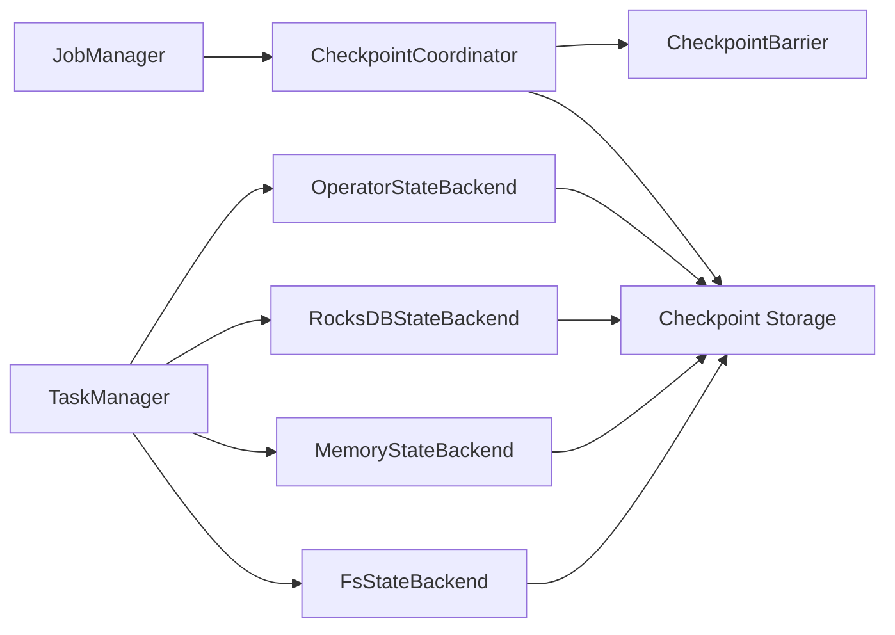

# Flink CheckpointCoordinator原理与代码实例讲解

## 1. 背景介绍

### 1.1 Flink简介

Apache Flink是一个开源的分布式流处理和批处理框架,由Apache软件基金会开发。Flink以数据并行和流水线方式执行任意流数据程序,Flink的流水线运行时系统可以执行批处理和流处理程序。Flink以其低延迟、高吞吐、高可用等特点,被广泛应用于实时数据处理、实时数据分析、实时数据仓库等领域。

### 1.2 Checkpoint机制概述

Flink使用Checkpoint机制来保证exactly-once语义,Checkpoint是Flink容错机制的核心。Checkpoint是Flink定期对作业进行快照,当作业失败时,Flink可以从最近的一次Checkpoint恢复,从而保证作业的exactly-once语义。

Flink的Checkpoint机制主要由以下几个部分组成:

- CheckpointCoordinator:Checkpoint的协调者,负责触发Checkpoint、协调各个算子进行快照、处理Checkpoint成功/失败的消息等。
- OperatorStateBackend:算子状态后端,负责管理和存储算子的状态数据。
- StateBackend:状态后端,提供状态的存储和访问,常见的有MemoryStateBackend、FsStateBackend、RocksDBStateBackend等。

### 1.3 文章结构

本文将围绕Flink CheckpointCoordinator展开,主要包含以下内容:

- CheckpointCoordinator的核心概念与关系
- CheckpointCoordinator的工作原理和算法步骤
- CheckpointCoordinator相关的数学模型和公式
- CheckpointCoordinator的代码实现与讲解
- CheckpointCoordinator的实际应用场景
- 相关工具和学习资源推荐
- 总结与展望

## 2. 核心概念与联系

### 2.1 CheckpointCoordinator

CheckpointCoordinator是Flink中负责Checkpoint的协调者,是JobManager的一个组件。每个Flink作业都有一个CheckpointCoordinator实例。其主要职责包括:

- 根据Checkpoint配置定期触发Checkpoint
- 向所有算子发送Barrier,协调算子进行快照
- 收集所有算子的快照完成的Ack消息
- 如果所有算子快照成功,则向所有算子发送Commit消息,确认这次Checkpoint完成
- 如果有算子快照失败,则向所有算子发送Abort消息,回滚这次Checkpoint
- 负责Checkpoint的持久化存储和清理工作

### 2.2 Checkpoint Barrier

CheckpointBarrier是CheckpointCoordinator触发Checkpoint时向所有算子广播的一条特殊数据,标识本次Checkpoint的ID和Timestamp。当算子收到Barrier时,会暂停当前的处理,将状态数据保存快照,然后向CheckpointCoordinator发送Ack消息,再恢复数据处理。

### 2.3 OperatorStateBackend

OperatorStateBackend是Flink中管理和存储算子状态的组件。Flink中有两类状态:

- KeyedState:根据Key分区的状态,只能用于KeyedStream
- OperatorState:算子的状态,每个算子一份,与Key无关

OperatorStateBackend负责管理OperatorState,在进行快照时将状态数据写入StateBackend中,在恢复时从StateBackend中读取状态数据。

### 2.4 StateBackend

StateBackend是Flink中管理和存储状态的组件,提供状态的持久化存储和访问。Flink内置了3种StateBackend:

- MemoryStateBackend:基于JVM Heap内存的StateBackend,将状态数据保存在TaskManager的内存中,Checkpoint时将状态快照写入JobManager的内存中。
- FsStateBackend:基于文件系统的StateBackend,将状态数据保存在TaskManager的内存中,Checkpoint时将状态快照写入到配置的文件系统中,如HDFS。 
- RocksDBStateBackend:基于RocksDB的StateBackend,将状态数据保存在RocksDB中,Checkpoint时将状态快照写入到配置的文件系统中。

### 2.5 核心概念关系图

下面是CheckpointCoordinator相关核心概念的关系图:



- JobManager中包含一个CheckpointCoordinator
- CheckpointCoordinator触发Checkpoint时向所有算子发送CheckpointBarrier
- 算子收到Barrier时通过OperatorStateBackend进行状态快照,保存到相应的StateBackend中
- StateBackend负责状态快照的持久化存储,Checkpoint完成后也负责清理旧的状态快照
- CheckpointCoordinator负责协调整个Checkpoint过程并处理快照的元数据

## 3. 核心算法原理具体操作步骤

### 3.1 Checkpoint的触发

CheckpointCoordinator根据Checkpoint配置定期触发Checkpoint,主要步骤如下:

1. 等待一个Checkpoint间隔时间
2. 检查是否有未完成的Checkpoint,如果有则等待
3. 增加Checkpoint的ID (unique long型)
4. 记录这次Checkpoint的开始时间戳
5. 向所有算子发送Barrier,Barrier中包含Checkpoint ID和Timestamp
6. 等待所有算子的Ack消息,如果在指定时间内收到所有Ack则认为本次Checkpoint成功,否则失败
7. 如果成功,向所有算子发送Commit消息,确认Checkpoint完成;失败则发送Abort消息,回滚状态
8. 如果Checkpoint完成,则对状态快照进行持久化存储,并清理旧的状态快照

### 3.2 算子状态快照

当算子收到Barrier时,会进行状态快照,主要步骤如下:

1. 暂停当前的数据处理
2. 将当前的状态数据通过OperatorStateBackend进行快照
3. 将状态快照数据写入配置的StateBackend中
4. 向CheckpointCoordinator发送Ack消息
5. 恢复数据处理

算子的状态快照是一个异步的过程,不会阻塞数据处理,但会占用一定的IO和CPU资源。

### 3.3 快照的持久化存储

当Checkpoint完成时,CheckpointCoordinator会将所有算子的状态快照进行持久化存储,主要步骤如下:

1. 向所有算子发送Commit消息,确认状态快照完成
2. 将所有算子的状态快照元数据写入持久化存储,包括Checkpoint ID、Timestamp、StateBackend地址等
3. 清理旧的状态快照数据和元数据,只保留最近的几个Checkpoint

持久化存储可以配置为HDFS等可靠的文件系统。当作业失败恢复时,可以从持久化存储中读取状态快照数据进行恢复。

## 4. 数学模型和公式详细讲解举例说明

### 4.1 Chandy-Lamport分布式快照算法

Flink的Checkpoint机制参考了Chandy-Lamport分布式快照算法。该算法用于在分布式系统中获取一致性的全局状态快照。其核心思想是:

1. 在某一时刻,快照发起者向所有节点广播一条Marker消息
2. 节点收到Marker后,保存当前状态,并开始记录之后的输出消息
3. 节点将Marker消息转发给其他节点,直到所有节点都收到Marker
4. 节点收到Marker后,将已记录的输出消息发送给对应的节点
5. 当所有节点都收到Marker并处理完已记录的消息后,本次快照完成

Chandy-Lamport算法保证了快照的一致性和完整性,是一种非阻塞的分布式快照算法。

Flink的Checkpoint机制与Chandy-Lamport算法的对应关系如下:

- Flink的JobManager相当于快照发起者
- Flink的Checkpoint Barrier相当于Marker消息
- Flink的算子相当于分布式节点
- Flink的算子状态相当于节点状态
- Flink的算子输出流相当于节点间通信消息

可以看出,Flink的Checkpoint机制是Chandy-Lamport算法的一种实现和优化。

### 4.2 Checkpoint时间间隔计算

Flink中Checkpoint的时间间隔可以通过如下公式计算:

$interval = max(minPauseBetweenCheckpoints, checkpointTimeout)$

其中:

- $minPauseBetweenCheckpoints$:两次Checkpoint之间的最小间隔时间,默认值为0
- $checkpointTimeout$:Checkpoint的超时时间,默认值为10分钟

如果设置了$minPauseBetweenCheckpoints$,则Checkpoint的实际间隔为$minPauseBetweenCheckpoints$和$checkpointTimeout$中的较大值。这样可以避免Checkpoint过于频繁而导致的性能下降。

举例:如果设置$minPauseBetweenCheckpoints$为5分钟,$checkpointTimeout$为10分钟,则Checkpoint的实际间隔为10分钟。

### 4.3 Checkpoint超时时间计算

Flink中Checkpoint的超时时间可以通过如下公式计算:

$timeout = baseInterval \times exponentialBackoffFactor^{failureCount}$

其中:

- $baseInterval$:Checkpoint的基础间隔时间,即用户配置的Checkpoint Interval
- $exponentialBackoffFactor$:指数回退因子,默认值为2
- $failureCount$:Checkpoint连续失败次数

当Checkpoint连续失败时,下一次Checkpoint的超时时间会根据指数回退因子乘以基础间隔时间。这样可以避免因为某些临时故障导致的频繁Checkpoint失败。

举例:如果设置$baseInterval$为5分钟,$exponentialBackoffFactor$为2,在第一次Checkpoint失败后,下一次Checkpoint的超时时间为$5 \times 2^1=10$分钟;如果再次失败,下一次超时时间为$5 \times 2^2=20$分钟。

## 5. 项目实践:代码实例和详细解释说明

下面通过一个简单的Flink作业示例,展示如何启用Checkpoint并配置相关参数。

```java
StreamExecutionEnvironment env = StreamExecutionEnvironment.getExecutionEnvironment();

// 启用Checkpoint,间隔时间为1000ms
env.enableCheckpointing(1000);

// 设置Checkpoint的模式为EXACTLY_ONCE
env.getCheckpointConfig().setCheckpointingMode(CheckpointingMode.EXACTLY_ONCE);

// 设置Checkpoint的超时时间为60s
env.getCheckpointConfig().setCheckpointTimeout(60000);

// 设置两次Checkpoint之间的最小间隔时间为500ms
env.getCheckpointConfig().setMinPauseBetweenCheckpoints(500);

// 设置同时进行的Checkpoint的最大个数为1
env.getCheckpointConfig().setMaxConcurrentCheckpoints(1);

// 设置StateBackend为FsStateBackend,存储路径为hdfs://namenode:40010/flink/checkpoints
env.setStateBackend(new FsStateBackend("hdfs://namenode:40010/flink/checkpoints"));
```

代码说明:

- `enableCheckpointing(1000)`:表示启用Checkpoint,间隔时间为1秒。Checkpoint默认是禁用的,需要显式启用。
- `setCheckpointingMode(CheckpointingMode.EXACTLY_ONCE)`:表示设置Checkpoint的语义为EXACTLY_ONCE,这也是默认值。Flink还支持AT_LEAST_ONCE语义,可根据需求选择。
- `setCheckpointTimeout(60000)`:表示设置Checkpoint的超时时间为1分钟。如果Checkpoint在超时时间内没有完成,则会被认为失败。
- `setMinPauseBetweenCheckpoints(500)`:表示设置两次Checkpoint之间的最小间隔时间为500ms。这可以避免Checkpoint太过频繁。
- `setMaxConcurrentCheckpoints(1)`:表示设置同时进行的Checkpoint的最大个数为1。这可以避免多个Checkpoint同时进行时占用过多资源。
- `setStateBackend`:表示设置状态后端为FsStateBackend,状态数据将保存到HDFS上。也可以选择MemoryStateBackend或RocksDBStateBackend。

在Flink作业中启用Checkpoint后,Flink会定期自动触发Checkpoint,将算子状态数据保存到配置的StateBackend中,以便在作业失败时进行恢复。

## 6. 实际应用场景

Flink的Checkpoint机制可以应用于多种实际场景,例如:

### 6.1 实时数据处理

在实时数据处理中,数据源源不断地产生,需要Flink实时地进行处理。但在处理过程中可能会遇到各种故障,如果没有容错机制,可能会导致数据丢失或重复处理。Flink的Checkpoint机制可以定期地保存算子状态,当作业失败时可以从最近的Checkpoint恢复,避{"msg_type":"generate_answer_finish","data":"","from_module":null,"from_unit":null}