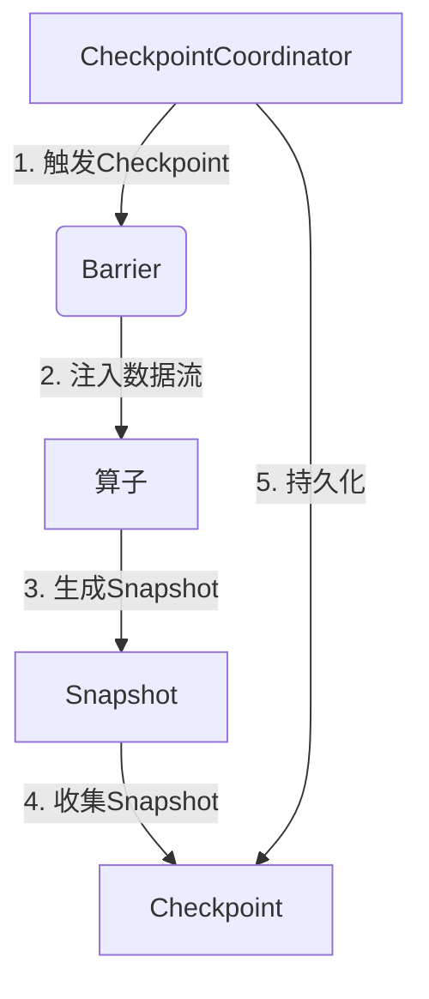
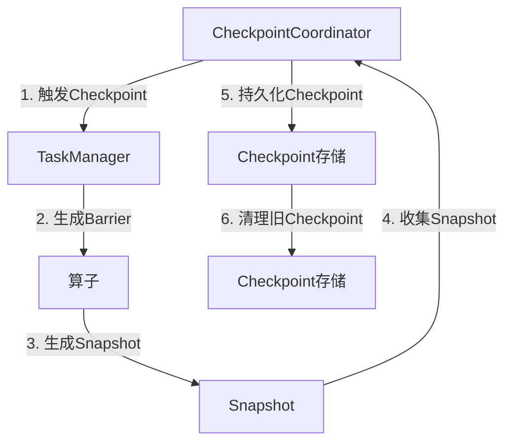

# Flink Checkpoint容错机制原理与代码实例讲解

## 1.背景介绍

在分布式流处理系统中,容错机制是一个非常重要的特性。由于流处理作业通常需要长时间运行,因此任何中断或故障都可能导致数据丢失或计算结果不正确。为了确保系统的可靠性和一致性,需要采用有效的容错机制来应对各种故障情况。

Apache Flink作为一款流行的分布式流处理框架,提供了强大的容错能力。其中,Checkpoint机制是Flink实现容错的核心机制,可以在发生故障时恢复作业状态,从而避免数据丢失和计算结果不正确。

### 1.1 Checkpoint的作用

Checkpoint机制的主要作用如下:

1. **容错恢复**: 当TaskManager发生故障时,Checkpoint可以将作业状态恢复到最近一次成功的Checkpoint,从而避免数据丢失和计算结果不正确。

2. **状态一致性**: Checkpoint可以确保所有并行任务的状态在同一个一致性切面上,从而保证了状态的一致性。

3. **高可用性**: 通过定期进行Checkpoint,Flink可以在发生故障时快速恢复作业,提高了系统的可用性。

### 1.2 Checkpoint的工作原理

Flink的Checkpoint机制基于流水线执行模型和分层状态存储架构。在执行过程中,Flink会定期为每个并行任务生成Checkpoint barrier,并将barrier注入到数据流中。当barrier到达算子时,算子会对当前状态进行Snapshot并生成Checkpoint,然后将barrier向下游传递。所有下游算子完成Checkpoint后,作业管理器(JobManager)会收集这些Checkpoint并将它们持久化存储。

## 2.核心概念与联系

### 2.1 Barrier(栅栏)

Barrier是Flink实现Checkpoint的关键机制。它是一种控制事件,被注入到数据流中,用于划分数据流的边界。当Barrier到达算子时,算子会对当前状态进行Snapshot并生成Checkpoint。Barrier在数据流中的传递顺序与数据元素的顺序相同,这样可以确保Checkpoint的一致性。

### 2.2 Snapshot(快照)

Snapshot是算子状态在某个一致性切面上的拷贝。当Barrier到达算子时,算子会根据当前状态生成一个Snapshot,并将其作为Checkpoint的一部分。Snapshot包含了算子的所有状态,如窗口状态、计数器等。

### 2.3 Checkpoint(检查点)

Checkpoint是作业在某个一致性切面上的全局状态快照。它由所有并行任务的Snapshot组成,并由JobManager收集和持久化存储。在发生故障时,Flink可以从最近一次成功的Checkpoint恢复作业状态。

### 2.4 CheckpointCoordinator

CheckpointCoordinator是Flink中负责协调Checkpoint的组件。它负责触发Checkpoint,向所有TaskManager发送Barrier,收集并持久化Checkpoint。CheckpointCoordinator运行在JobManager进程中。

### 2.5 核心概念关系

上述核心概念之间的关系如下所示:



1. CheckpointCoordinator触发Checkpoint,并向所有TaskManager发送Barrier。
2. Barrier被注入到数据流中,并沿着数据流向下游传递。
3. 当Barrier到达算子时,算子会根据当前状态生成Snapshot。
4. JobManager收集所有Snapshot,组成一个完整的Checkpoint。
5. CheckpointCoordinator将Checkpoint持久化存储。

## 3.核心算法原理具体操作步骤

Flink的Checkpoint机制涉及多个组件之间的协作,其核心算法原理包括以下几个步骤:

### 3.1 触发Checkpoint

CheckpointCoordinator根据配置的Checkpoint间隔时间或者其他策略(如处理的数据量)决定何时触发新的Checkpoint。当决定触发Checkpoint时,CheckpointCoordinator会生成一个新的Checkpoint ID,并将其发送给所有TaskManager。

### 3.2 生成Barrier

TaskManager收到Checkpoint ID后,会为每个输入流生成一个Barrier,并将其注入到数据流中。Barrier在数据流中的传递顺序与数据元素的顺序相同,这样可以确保Checkpoint的一致性。

### 3.3 算子执行Snapshot

当Barrier到达算子时,算子会根据当前状态生成一个Snapshot。Snapshot包含了算子的所有状态,如窗口状态、计数器等。算子会将生成的Snapshot通知给JobManager,并将Barrier向下游传递。

### 3.4 收集Snapshot

JobManager会收集所有并行任务的Snapshot。当所有Snapshot都到达后,JobManager会将它们组成一个完整的Checkpoint。

### 3.5 持久化Checkpoint

CheckpointCoordinator会将完整的Checkpoint持久化存储,通常是写入分布式文件系统(如HDFS)或状态后端(如RocksDB)。持久化完成后,CheckpointCoordinator会通知所有TaskManager该Checkpoint已成功完成。

### 3.6 清理旧Checkpoint

为了节省存储空间,Flink会定期清理旧的Checkpoint。默认情况下,Flink会保留最近的n个完整Checkpoint(n可配置)。

上述算法步骤可以用以下流程图表示:



## 4.数学模型和公式详细讲解举例说明

在Flink的Checkpoint机制中,有一些重要的数学模型和公式需要了解。

### 4.1 Checkpoint间隔时间

Checkpoint间隔时间是指两次Checkpoint之间的时间间隔。Flink允许用户配置Checkpoint间隔时间,以权衡Checkpoint的开销和容错能力。间隔时间越短,容错能力越强,但开销也越大。

Checkpoint间隔时间可以用以下公式表示:

$$
T_{interval} = \frac{T_{total}}{N}
$$

其中:
- $T_{interval}$表示Checkpoint间隔时间
- $T_{total}$表示作业总运行时间
- $N$表示Checkpoint的总数量

例如,如果作业总运行时间为1小时,并且需要进行10次Checkpoint,那么Checkpoint间隔时间为:

$$
T_{interval} = \frac{1\text{小时}}{10} = 6\text{分钟}
$$

### 4.2 Checkpoint开销

Checkpoint会带来一定的开销,包括计算开销和存储开销。计算开销主要来自于算子状态的Snapshot操作,而存储开销则来自于Checkpoint的持久化操作。

Checkpoint的计算开销可以用以下公式估算:

$$
C_{compute} = \sum_{i=1}^{n} S_i \times R_i
$$

其中:
- $C_{compute}$表示Checkpoint的计算开销
- $n$表示算子的数量
- $S_i$表示第$i$个算子的状态大小
- $R_i$表示第$i$个算子的Snapshot速率

Checkpoint的存储开销则取决于Checkpoint的大小和持久化方式。例如,如果将Checkpoint存储在HDFS上,存储开销可以用以下公式估算:

$$
C_{storage} = \sum_{i=1}^{n} S_i \times R_{hdfs}
$$

其中:
- $C_{storage}$表示Checkpoint的存储开销
- $R_{hdfs}$表示HDFS的写入速率

### 4.3 恢复时间

当发生故障时,Flink需要从最近一次成功的Checkpoint恢复作业状态。恢复时间取决于Checkpoint的大小和读取速率。

恢复时间可以用以下公式估算:

$$
T_{recovery} = \frac{\sum_{i=1}^{n} S_i}{R_{read}}
$$

其中:
- $T_{recovery}$表示恢复时间
- $R_{read}$表示从存储系统读取Checkpoint的速率

例如,如果Checkpoint的总大小为10GB,读取速率为100MB/s,那么恢复时间约为:

$$
T_{recovery} = \frac{10\text{GB}}{100\text{MB/s}} = 100\text{秒} = 1.67\text{分钟}
$$

通过上述公式,用户可以根据实际情况估算Checkpoint的开销和恢复时间,从而合理配置Checkpoint参数。

## 5.项目实践:代码实例和详细解释说明

为了更好地理解Flink的Checkpoint机制,我们将通过一个实际项目来演示相关代码。本示例使用Flink 1.14.4版本。

### 5.1 启用Checkpoint

要启用Checkpoint,需要在Flink作业中进行相应配置。以下代码展示了如何在Java代码中启用Checkpoint:

```java
// 获取执行环境
StreamExecutionEnvironment env = StreamExecutionEnvironment.getExecutionEnvironment();

// 每隔1分钟进行一次Checkpoint
env.enableCheckpointing(60000);

// 设置Checkpoint模式为EXACTLY_ONCE
env.getCheckpointConfig().setCheckpointingMode(CheckpointingMode.EXACTLY_ONCE);

// 设置两次Checkpoint之间最少要有500ms的间隔时间
env.getCheckpointConfig().setMinPauseBetweenCheckpoints(500);

// 设置Checkpoint超时时间为60秒
env.getCheckpointConfig().setCheckpointTimeout(60000);

// 设置同一时间只允许进行一个Checkpoint
env.getCheckpointConfig().setMaxConcurrentCheckpoints(1);

// 设置Checkpoint的存储路径
env.setStateBackend(new FsStateBackend("hdfs://namenode:8020/flink/checkpoints"));
```

上述代码中,我们首先通过`enableCheckpointing()`方法启用Checkpoint,并设置Checkpoint间隔时间为1分钟。然后,我们配置了Checkpoint的一些参数,如Checkpoint模式、最小暂停时间、超时时间、最大并发数等。最后,我们设置了Checkpoint的存储路径为HDFS。

### 5.2 状态管理

为了演示Checkpoint的效果,我们需要在作业中定义一些状态。以下代码展示了如何定义和使用KeyedState:

```java
// 定义KeyedState
private ValueStateDescriptor<Long> countState = new ValueStateDescriptor<>("count", Long.class);

// 在算子函数中使用KeyedState
public void flatMap(String value, Context ctx, Collector<String> out) throws Exception {
    ValueState<Long> state = getRuntimeContext().getState(countState);
    long count = state.value() == null ? 0 : state.value();
    count++;
    state.update(count);
    out.collect(value + " - Count: " + count);
}
```

在上述代码中,我们首先定义了一个`ValueStateDescriptor`来描述KeyedState的类型和名称。然后,在算子函数中,我们通过`getRuntimeContext().getState()`方法获取KeyedState实例,并对其进行读写操作。

### 5.3 触发Checkpoint

在作业运行过程中,Flink会根据配置的Checkpoint间隔时间自动触发Checkpoint。但是,我们也可以手动触发Checkpoint,如下所示:

```java
// 手动触发Checkpoint
env.executeAsync("MyJob").getJobExecutionResult().thenAccept(
    (JobExecutionResult result) -> {
        try {
            result.getJobID().runAsync(new CheckpointTriggerUtil.CheckpointTrigger());
        } catch (Exception e) {
            e.printStackTrace();
        }
    }
);
```

上述代码中,我们通过`CheckpointTriggerUtil.CheckpointTrigger()`类手动触发了一次Checkpoint。需要注意的是,手动触发Checkpoint会导致作业暂停,因此不建议频繁使用。

### 5.4 恢复作业

当发生故障时,Flink会自动从最近一次成功的Checkpoint恢复作业状态。但是,我们也可以手动恢复作业,如下所示:

```java
// 手动恢复作业
final StreamExecutionEnvironment env = StreamExecutionEnvironment.getExecutionEnvironment();

// 设置Checkpoint存储路径
env.setStateBackend(new FsStateBackend("hdfs://namenode:8020/flink/checkpoints"));

// 从指定的Checkpoint恢复作业
env.setRestartStrategy(RestartStrategies.fixedDelayRestart(
    Integer.MAX_VALUE, // 最大重启次数
    Time.seconds(10)   // 重启延迟时间
));

final CompletableFuture<JobSubmissionResult> jobSubmissionResult = CompletableFuture.supplyAsync(
    () -> {
        try {
            return env.loadFromCheckpoint("hdfs://namenode:8020/flink/checkpoints/1234567890");
        } catch (