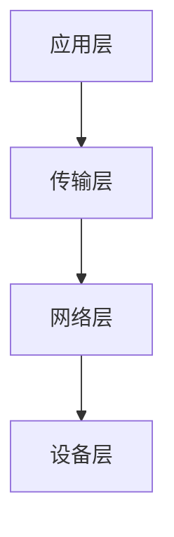
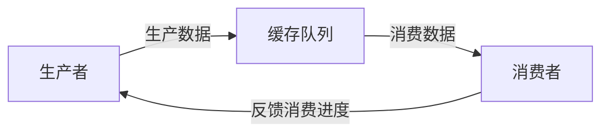

# Flink网络传输：Shuffle与数据交换

## 1. 背景介绍

在大数据处理领域,数据在不同节点之间的传输和交换是一个关键问题。Apache Flink作为一个高性能、高吞吐的分布式流处理框架,其内部的网络传输机制——Shuffle与数据交换值得我们深入探究。本文将从Flink的网络传输原理出发,详细阐述Shuffle与数据交换的核心概念、算法实现、数学模型以及实际应用,并提供代码实例,以期为读者提供有价值的参考。

## 2. 核心概念与联系

### 2.1 Flink的网络传输栈

在深入探讨Shuffle与数据交换之前,我们需要先了解Flink的网络传输栈。Flink的网络传输采用了一个分层的架构:



- 应用层:定义了数据传输的高层抽象,如数据流、数据分区等。
- 传输层:提供了可靠的、基于缓存的数据传输。
- 网络层:基于Netty等高性能网络框架,提供异步IO能力。  
- 设备层:对接操作系统内核,进行实际的网络数据读写。

### 2.2 Shuffle的定义

Shuffle指的是数据在并行计算过程中,从上游算子所在的节点传输到下游算子所在节点的过程。Shuffle的目的是将数据按照一定规则在节点之间进行重分布,以满足下游算子的数据依赖。

### 2.3 数据交换的模式

Flink支持多种数据交换模式,常见的有:

- Forward:上下游算子一对一传输数据。
- Broadcast:上游算子将数据广播到所有下游算子。
- Key-by:根据指定的Key对数据进行分区,具有相同Key的数据会被发送到同一个下游算子。
- Rebalance:对数据进行轮询分发,使各下游算子获得均等的数据量。

不同的数据交换模式对应了不同的应用场景和性能特征。

## 3. 核心算法原理与具体操作步骤

### 3.1 基于信用的流控

为了实现高效可靠的网络传输,Flink采用了基于信用(Credit-based)的流控算法。其基本原理是:

1. 下游节点向上游节点申请信用额度(Credit)。
2. 上游节点根据下游申请的额度,发送相应数量的数据。
3. 下游节点消费接收到的数据,释放等量的信用额度。
4. 上游节点根据下游释放的信用额度,继续发送数据。

通过信用机制,上下游节点可以动态协调数据的生产和消费速率,避免下游被数据淹没。

### 3.2 数据序列化

为了在网络中高效传输数据,Flink会对数据进行序列化和反序列化。Flink支持多种序列化框架,包括:

- 类型序列化器:针对Java基本类型和String等内置类型的序列化器。
- Kryo序列化器:基于Kryo框架的通用序列化器,可高效序列化任意Java对象。
- Avro序列化器:支持对Avro格式数据的序列化。

序列化后的数据以二进制形式在网络中传输,减小了数据体积,提升了传输效率。

### 3.3 缓存管理与数据发送

Flink为每个网络连接维护了一个发送缓存和接收缓存,缓存的大小可配置。数据发送的具体步骤如下:

1. 数据写入发送缓存。 
2. 当发送缓存满或超过一定阈值时,触发实际的网络发送。
3. 数据从发送缓存拷贝到Netty的DirectBuffer。
4. Netty执行异步IO,将数据写入内核Socket缓存区。

接收数据的步骤与之类似,最终将数据写入算子的接收缓存供其消费。

## 4. 数学模型和公式详解

### 4.1 背压模型

Flink的流控基于背压(Back pressure)模型。我们可以将上下游算子之间的数据传输看作一个生产者-消费者系统:



假设生产者的数据生产速率为 $v_p$,消费者的数据消费速率为 $v_c$,缓存队列的大小为 $q$。那么当满足以下条件时,系统能够正常工作而不会出现数据积压:

$$ v_p \leq v_c $$

$$ \int_{0}^{t} (v_p - v_c) dt \leq q $$

即生产速率不超过消费速率,或者瞬时的速率差在缓存允许的范围内。

### 4.2 流量控制

信用额度反映了下游算子当前可用的缓存空间。假设下游算子每次申请的信用额度为 $c$,上游算子根据信用发送的数据量为 $d$,且有 $d \leq c$。

令下游算子在时间 $t$ 拥有的信用额度为 $C(t)$,它与 $t$ 时刻下游的数据消费量 $D(t)$ 和上游的数据发送量 $S(t)$ 满足如下关系:

$$ C(t) = C(t-1) + D(t) - S(t) $$

上式表明,下游算子的信用额度随着数据消费而增加,随着数据接收而减少。上游算子根据 $C(t)$ 的反馈值,动态调整发送量 $S(t)$,以适应下游的消费能力。

## 5. 项目实践：代码实例和详解

下面我们通过一个简单的Flink程序,演示Shuffle与数据交换的实际应用。该程序从Kafka读取文本数据,按照单词进行分组计数,然后将结果写入MySQL。

```java
StreamExecutionEnvironment env = StreamExecutionEnvironment.getExecutionEnvironment();

// 从Kafka读取数据
DataStream<String> lines = env.addSource(
    new FlinkKafkaConsumer<>("words", new SimpleStringSchema(), properties));

// 按单词分组计数
DataStream<Tuple2<String, Integer>> counts = lines
    .flatMap(new LineSplitter())
    .keyBy(0)
    .sum(1);

// 将结果写入MySQL
counts.addSink(new JdbcSink());

env.execute("Word Count");
```

其中,flatMap算子将文本行按空格切分为单词,由于并行度为4,因此会将单词Shuffle到4个并行的子任务。keyBy算子根据单词进行分组,相同单词的元组会被发送到同一个子任务进行聚合计数。

数据在算子之间的传输由Flink的网络栈负责。flatMap的子任务根据keyBy的分区策略,将数据发送到对应的keyBy子任务。这里的Shuffle过程采用了Key-by的数据交换模式。

## 6. 实际应用场景

Shuffle与数据交换在许多实际的流处理场景中扮演着关键角色,例如:

- 流式ETL:将不同来源的数据按照规则进行清洗、转换和汇总,需要在多个算子之间传输和交换数据。

- 实时数仓:将实时数据流按照维度和指标进行聚合,构建实时的OLAP多维数据集,涉及大量的Shuffle操作。

- 实时特征工程:将原始数据流转换为机器学习特征向量,需要对海量数据进行分组、JOIN和聚合计算。

- 实时监控与异常检测:对系统指标、日志等实时数据流进行统计分析,实时发现异常,Shuffle在其并行处理过程中发挥了重要作用。

## 7. 工具和资源推荐

对于Flink的学习和应用,推荐以下工具和资源:

- [Flink官方文档](https://flink.apache.org/):权威、详尽的Flink使用指南和API参考。
- [Ververica Platform](https://www.ververica.com/platform):基于Flink构建的端到端流处理平台,提供开箱即用的开发和运维功能。
- [Flink Forward大会](https://flink-forward.org/):讨论Flink应用实践与未来发展的行业盛会。
- [《Stream Processing with Apache Flink》](https://www.oreilly.com/library/view/stream-processing-with/9781491974285/):O'Reilly的Flink权威指南,深入讲解了Flink的架构和实现。

## 8. 总结：未来发展趋势与挑战

Flink凭借其优异的网络传输性能,已成为流处理领域的佼佼者。未来在以下方面值得持续关注:

- 与新硬件技术的结合:如RDMA、NVMe等高速网络和存储设备,有望进一步提升Shuffle性能。
- 自适应的Shuffle策略:根据数据特征和负载情况,动态选择最优的数据交换模式和并行度。
- 大规模流批一体:Shuffle机制在支持海量数据的流批统一处理中,面临更大的扩展性挑战。
- 机器学习pipeline的Shuffle优化:针对机器学习中的数据流图,设计定制的Shuffle和调度策略。

Flink社区正在积极探索Shuffle的新机制和优化手段,以应对未来更加复杂和苛刻的流处理需求。相信经过产学研各界的共同努力,Flink的Shuffle与数据交换必将更上一层楼。

## 9. 附录：常见问题与解答

Q: Flink的Shuffle性能瓶颈在哪里?
A: Shuffle的性能主要取决于网络IO和序列化。可以通过增大网络带宽、使用高效的序列化方法、调优缓存参数等手段进行优化。

Q: Flink是否支持第三方的Shuffle实现?
A: 除了内置的Shuffle实现,Flink还支持使用第三方的Shuffle服务,如Hadoop MapReduce的Shuffle。

Q: Flink Shuffle过程中如何处理反压?
A: Flink采用基于信用的流控机制,动态平衡上下游算子的生产和消费速率。当下游算子反馈的信用不足时,上游算子会暂停发送数据以缓解反压。

Q: Flink是否支持Shuffle数据的断点续传?
A: Flink提供了端到端的 exactly-once 处理语义,Shuffle数据可以在出现故障时进行断点续传,以保证数据处理的完整性和一致性。

作者：禅与计算机程序设计艺术 / Zen and the Art of Computer Programming