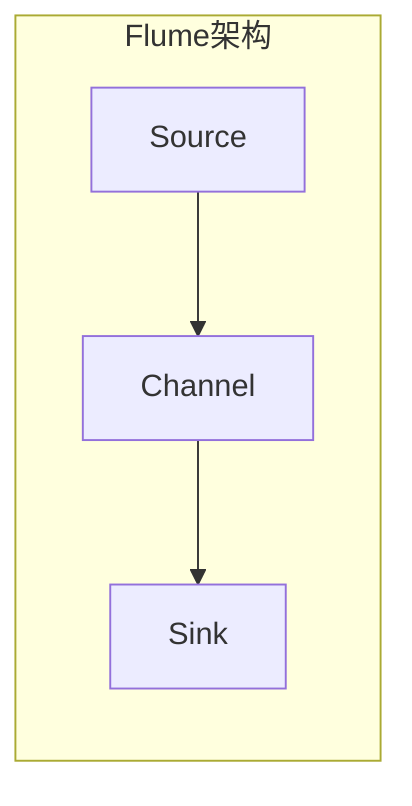
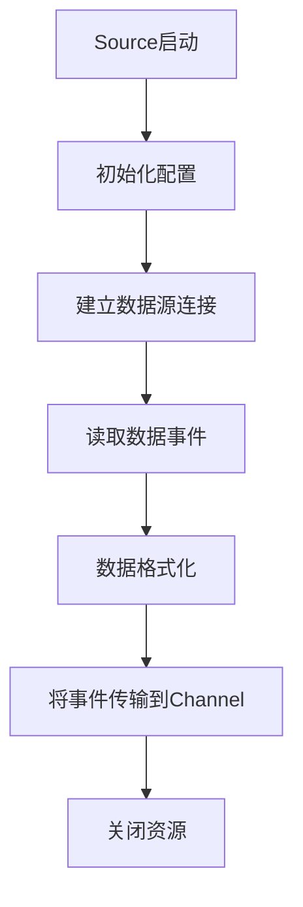

# Flume Source原理与代码实例讲解

## 1.背景介绍

在大数据时代,数据是企业最宝贵的资源之一。然而,数据通常分散在不同的系统和位置,如服务器日志、网络流量、社交媒体等。因此,有效地收集和传输这些海量数据至数据存储和分析系统变得至关重要。Apache Flume是一个分布式、可靠、高可用的海量日志采集系统,旨在高效地从不同数据源收集、聚合和移动大量日志数据到集中存储系统中,为后续的数据处理和分析做准备。

Flume的核心组件之一就是Source,它负责从各种数据源获取数据,是整个数据收集过程的入口。本文将深入探讨Flume Source的原理和实现,并通过代码示例帮助读者更好地理解和应用这一重要组件。

## 2.核心概念与联系

### 2.1 Flume架构概览

在了解Flume Source之前,我们先简要介绍一下Flume的整体架构。Flume采用简单灵活的三层架构,包括Source、Channel和Sink三个核心组件。



- **Source**:从外部数据源收集数据,将其传输到Channel中。
- **Channel**:作为Source和Sink之间的传输通道,临时缓存事件数据。
- **Sink**:从Channel中获取数据,并将其传输到下一个目的地,如HDFS或HBase等。

Source、Channel和Sink可以根据需求进行组合和配置,形成数据传输管道。此外,Flume还支持多个Source或Sink通过Channel进行扇入或扇出,从而实现更加灵活和复杂的数据收集场景。

### 2.2 Source类型

Flume提供了多种内置的Source类型,用于从不同的数据源采集数据,包括:

- **AvroSource**:通过Avro接收数据事件。
- **JMSSource**:使用Java消息服务(JMS)接收数据事件。
- **KafkaSource**:从Apache Kafka消费数据事件。
- **NetcatSource**:使用TCP端口接收数据。
- **SpoolDirectorySource**:从磁盘文件中读取数据。
- **SyslogSource**:接收Syslog数据流。
- **HTTPSource**:通过HTTP POST和GET请求接收数据。

此外,Flume还允许用户自定义Source,以满足特定的数据采集需求。

## 3.核心算法原理具体操作步骤

虽然Flume提供了多种Source类型,但它们的核心原理和操作步骤大致相似。以下是Flume Source的基本工作流程:



1. **Source启动**:Flume启动时,会根据配置文件实例化相应的Source。

2. **初始化配置**:Source读取配置参数,如数据源地址、端口号等,并进行必要的初始化操作。

3. **建立数据源连接**:Source与数据源建立连接或监听数据流,准备接收数据。

4. **读取数据事件**:Source从数据源读取原始数据,并将其封装为Flume事件(Event)对象。

5. **数据格式化**:根据需求,Source可能会对原始数据进行格式化或预处理,如添加头部信息、过滤无效数据等。

6. **将事件传输到Channel**:格式化后的事件被传输到Channel中,等待被Sink消费。

7. **关闭资源**:在Source关闭或重启时,需要正确地释放资源,如断开连接、关闭文件等。

需要注意的是,不同类型的Source在具体实现上可能会有所不同,但整体流程是类似的。

## 4.数学模型和公式详细讲解举例说明

在Flume Source的实现中,通常不需要使用复杂的数学模型或公式。但是,在某些特殊情况下,可能需要使用一些简单的公式或算法来优化Source的性能或功能。

例如,在实现一个基于网络流量的Source时,我们可能需要使用一些统计算法来计算数据流的平均速率、峰值等指标,从而动态调整Source的缓冲区大小或读取速率。这可以通过以下公式实现:

$$
\text{Average Rate} = \frac{\sum_{i=1}^{n} x_i}{n}
$$

其中,$ x_i $表示第i个时间段内的数据流量,n表示总的时间段数。

此外,在处理日志数据时,我们可能需要使用一些字符串匹配算法来提取特定格式的日志信息。例如,使用正则表达式匹配特定的日志模式:

```
^(\d{4}-\d{2}-\d{2} \d{2}:\d{2}:\d{2},\d{3}) \[(.*?)\] (.*) (.*?) (.*)$
```

这个正则表达式可以匹配常见的日志格式,并将日期时间、日志级别、线程信息、类名和日志消息分别捕获到不同的组中,方便后续处理。

总的来说,虽然Flume Source的实现通常不需要复杂的数学模型,但在某些特定场景下,使用一些简单的公式或算法可以优化Source的性能和功能。

## 5.项目实践:代码实例和详细解释说明

为了更好地理解Flume Source的实现原理,我们将通过一个实际的代码示例来演示如何创建一个自定义的Source。在本例中,我们将实现一个简单的NetcatSource,用于从TCP端口接收数据。

### 5.1 创建NetcatSource类

首先,我们需要创建一个新的Source类,继承自`AbstractSource`类,并实现必要的方法。

```java
import org.apache.flume.Context;
import org.apache.flume.EventDeliveryException;
import org.apache.flume.Event;
import org.apache.flume.source.AbstractSource;

import java.net.ServerSocket;
import java.net.Socket;
import java.util.concurrent.ExecutorService;
import java.util.concurrent.Executors;

public class NetcatSource extends AbstractSource {
    private static final Logger logger = LoggerFactory.getLogger(NetcatSource.class);

    private ServerSocket serverSocket;
    private ExecutorService executorService;
    private int port;

    @Override
    public void configure(Context context) {
        port = context.getInteger("port", 44444);
    }

    @Override
    public void start() {
        try {
            serverSocket = new ServerSocket(port);
            executorService = Executors.newCachedThreadPool();
            logger.info("NetcatSource started on port {}", port);
        } catch (Exception e) {
            logger.error("Error starting NetcatSource", e);
        }
    }

    @Override
    public void stop() {
        try {
            serverSocket.close();
            executorService.shutdown();
            logger.info("NetcatSource stopped");
        } catch (Exception e) {
            logger.error("Error stopping NetcatSource", e);
        }
    }

    @Override
    public Status process() throws EventDeliveryException {
        try {
            Socket socket = serverSocket.accept();
            executorService.execute(new NetcatSourceThread(socket, getChannelProcessor()));
        } catch (Exception e) {
            logger.error("Error accepting connection", e);
        }
        return Status.READY;
    }
}
```

在这个示例中,我们首先在`configure`方法中读取配置参数,即监听的端口号。在`start`方法中,我们创建了一个`ServerSocket`实例,并启动了一个线程池`ExecutorService`。

在`process`方法中,我们通过`serverSocket.accept()`接受新的TCP连接,并为每个连接创建一个新的线程`NetcatSourceThread`来处理数据。

最后,在`stop`方法中,我们关闭`ServerSocket`和线程池,释放资源。

### 5.2 实现NetcatSourceThread类

接下来,我们需要实现`NetcatSourceThread`类,用于从TCP连接中读取数据并将其传输到Channel中。

```java
import org.apache.flume.Event;
import org.apache.flume.event.EventBuilder;
import org.apache.flume.source.AbstractSource;

import java.io.BufferedReader;
import java.io.InputStreamReader;
import java.net.Socket;

public class NetcatSourceThread implements Runnable {
    private static final Logger logger = LoggerFactory.getLogger(NetcatSourceThread.class);

    private Socket socket;
    private ChannelProcessor channelProcessor;

    public NetcatSourceThread(Socket socket, ChannelProcessor channelProcessor) {
        this.socket = socket;
        this.channelProcessor = channelProcessor;
    }

    @Override
    public void run() {
        try (BufferedReader reader = new BufferedReader(new InputStreamReader(socket.getInputStream()))) {
            String line;
            while ((line = reader.readLine()) != null) {
                Event event = EventBuilder.withBody(line.getBytes());
                channelProcessor.processEvent(event);
            }
        } catch (Exception e) {
            logger.error("Error reading from socket", e);
        } finally {
            try {
                socket.close();
            } catch (Exception e) {
                logger.error("Error closing socket", e);
            }
        }
    }
}
```

在`NetcatSourceThread`类中,我们首先从构造函数获取`Socket`实例和`ChannelProcessor`实例。在`run`方法中,我们使用`BufferedReader`从`Socket`的输入流中读取数据。

对于每一行数据,我们创建一个`Event`对象,并将其传输到`ChannelProcessor`中。最后,在finally块中,我们关闭`Socket`连接。

### 5.3 配置和使用NetcatSource

要使用我们的自定义`NetcatSource`,我们需要在Flume的配置文件中进行相应的配置。以下是一个示例配置:

```properties
# Define the NetcatSource
a1.sources = r1
a1.sources.r1.type = com.example.NetcatSource
a1.sources.r1.port = 44444

# Define the Channel
a1.channels = c1
a1.channels.c1.type = memory
a1.channels.c1.capacity = 1000
a1.channels.c1.transactionCapacity = 100

# Define the Sink
a1.sinks = k1
a1.sinks.k1.type = logger

# Bind the Source, Channel, and Sink
a1.sources.r1.channels = c1
a1.sinks.k1.channel = c1
```

在这个配置文件中,我们定义了一个`NetcatSource`实例,监听端口44444。我们还定义了一个内存Channel和一个日志Sink。最后,我们将Source、Channel和Sink绑定在一起,形成一个完整的数据传输管道。

启动Flume后,我们可以使用`netcat`命令向`NetcatSource`发送数据:

```
$ nc localhost 44444
Hello, Flume!
This is a test message.
```

发送的数据将被`NetcatSource`接收,并通过Channel传输到Sink中,最终输出到日志文件中。

## 6.实际应用场景

Flume Source在实际应用中扮演着重要的角色,可以从各种数据源高效地采集数据,为后续的数据处理和分析奠定基础。以下是一些典型的应用场景:

1. **日志采集**:使用Flume的`SpoolDirectorySource`或`SyslogSource`从服务器、网络设备等采集日志数据,并将其传输到HDFS或其他存储系统中,为日志分析和监控提供数据源。

2. **网络流量采集**:通过`NetcatSource`或自定义Source从网络设备、防火墙等采集网络流量数据,用于网络安全分析和流量监控。

3. **消息队列集成**:利用`KafkaSource`或`JMSSource`将Kafka、ActiveMQ等消息队列中的数据导入到Hadoop生态系统中,实现数据的实时处理和分析。

4. **社交媒体数据采集**:开发自定义Source,从Twitter、Facebook等社交媒体平台采集用户数据,用于情感分析、用户行为分析等应用。

5. **物联网数据采集**:在物联网场景中,可以使用Flume从各种传感器和设备采集数据,如环境监测数据、设备运行状态数据等,为物联网大数据分析提供支持。

6. **Web日志采集**:通过`SpoolDirectorySource`或自定义Source从Web服务器采集访问日志,用于Web日志分析、用户行为分析等应用。

总的来说,Flume Source的灵活性和可扩展性使其能够适应各种数据采集场景,为大数据处理和分析提供可靠的数据源。

## 7.工具和资源推荐

在使用和开发Flume Source时,以下工具和资源可能会非常有用:

1. **Apache Flume官方文档**:Flume官方文档提供了详细的概念介绍、配置指南和API参考,是学习和使用Flume的重要资源。

2. **Flume源码**:阅读Flume的源代码可以帮助您更深入地理