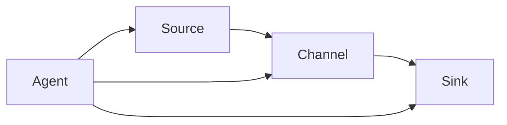

# Flume原理与代码实例讲解

## 1.背景介绍

Apache Flume是一个分布式、可靠且可用的服务,用于高效地收集、聚合和移动大量日志数据。它是Apache Hadoop生态系统中的一个关键组件,旨在从不同的数据源高效地收集、聚合和移动大量日志数据到集中存储系统中,以供后续的数据处理。

在大数据时代,数据量呈现出爆炸式增长,这些数据来自于Web服务器、移动设备、传感器等多种来源。有效地收集和处理这些海量数据对企业来说至关重要,可以帮助企业洞察业务运营状况、发现新的商机、优化产品和服务等。然而,传统的日志收集方式往往效率低下、难以扩展,无法满足现代数据处理的要求。

Apache Flume应运而生,它提供了一种灵活、可靠且容错的方式来收集、聚合和移动大量日志数据,使得数据可以被高效地传输到Hadoop分布式文件系统(HDFS)、Apache HBase、Apache Kafka等存储系统中,为后续的数据分析和处理做好准备。

## 2.核心概念与联系

Apache Flume的核心概念包括Event、Source、Channel、Sink和Agent。理解这些概念及其之间的关系对于掌握Flume的工作原理至关重要。

### 2.1 Event

Event是Flume中表示数据的基本单元,它由一个字节有效载荷(byte payload)和一些元数据(metadata)组成。字节有效载荷用于存储实际的日志数据,而元数据则包含了一些描述性信息,如时间戳、主机名等。

### 2.2 Source

Source是数据进入Flume的入口,它从外部数据源(如Web服务器日志、网络流量数据等)消费数据,并将其转换为Flume可识别的Event格式。Flume支持多种类型的Source,如Avro Source、Syslog Source、Kafka Source等,可以满足不同场景下的数据收集需求。

### 2.3 Channel

Channel是位于Source和Sink之间的临时数据存储区域,用于缓冲Event,以防止数据丢失。当Source产生的Event无法立即被Sink消费时,Event会被临时存储在Channel中。Channel具有多种实现方式,如内存Channel、文件Channel和Kafka Channel等,可根据实际需求进行选择。

### 2.4 Sink

Sink是Flume中的数据出口,它从Channel中消费Event,并将其传输到下游系统,如HDFS、HBase、Kafka等。与Source类似,Flume也支持多种类型的Sink,如HDFS Sink、Kafka Sink、Hbase Sink等。

### 2.5 Agent

Agent是Flume中的最小独立单元,它由一个Source、一个Channel和一个或多个Sink组成。Agent负责从Source接收Event,并通过Channel临时存储,最终由Sink将Event传输到下游系统。Agent可以单独运行,也可以与其他Agent组成复杂的数据流拓扑结构。

这些核心概念之间的关系如下所示:



## 3.核心算法原理具体操作步骤

Flume的核心算法原理主要体现在数据流转过程中,包括Event的生成、Channel的缓冲机制以及Sink的数据传输机制。下面将详细介绍Flume的核心算法原理及其具体操作步骤。

### 3.1 Event生成

Flume的数据流转过程始于Event的生成。Source从外部数据源消费数据,并将其转换为Flume可识别的Event格式。Event的生成过程如下:

1. Source从外部数据源读取数据,如日志文件、网络流量等。
2. Source将读取到的数据封装为Event,包括字节有效载荷(byte payload)和元数据(metadata)。
3. Source将生成的Event传递给Channel。

不同类型的Source采用不同的方式从外部数据源读取数据,并将其转换为Event。例如,Syslog Source可以从syslog协议的数据流中读取日志数据,而Kafka Source则从Kafka主题中消费数据。

### 3.2 Channel缓冲机制

Channel作为Source和Sink之间的缓冲区,负责临时存储Event,以防止数据丢失。Channel的缓冲机制如下:

1. Source将生成的Event传递给Channel。
2. Channel将Event存储在内部的缓冲区中。
3. 当Sink准备好消费Event时,Channel将Event传递给Sink。
4. 如果Channel的缓冲区已满,Source将阻塞,直到有空间可用。

Channel的缓冲机制可以确保在Source和Sink之间的数据传输过程中不会丢失数据。不同类型的Channel采用不同的存储方式,如内存Channel使用内存缓冲区,而文件Channel则使用本地文件系统进行缓冲。

### 3.3 Sink数据传输

Sink从Channel中消费Event,并将其传输到下游系统。Sink的数据传输过程如下:

1. Sink从Channel中获取Event。
2. Sink将Event传输到下游系统,如HDFS、HBase或Kafka等。
3. 如果传输过程中出现错误,Sink可以根据配置的重试策略进行重试。

不同类型的Sink采用不同的方式将Event传输到下游系统。例如,HDFS Sink将Event写入HDFS文件系统,而Kafka Sink则将Event发送到Kafka主题。

## 4.数学模型和公式详细讲解举例说明

在Flume中,Channel的缓冲机制涉及到一些数学模型和公式,用于确保数据的可靠性和高效性。下面将详细讲解这些数学模型和公式。

### 4.1 Channel容量

Channel的容量指的是Channel可以存储的最大Event数量。Channel容量的计算公式如下:

$$
Channel\ Capacity = \frac{Total\ Memory}{Event\ Size}
$$

其中:

- `Total Memory`表示分配给Channel的总内存大小。
- `Event Size`表示单个Event的平均大小。

例如,如果分配给Channel的总内存为1GB,而单个Event的平均大小为1KB,则Channel的容量为:

$$
Channel\ Capacity = \frac{1GB}{1KB} = 1,048,576
$$

因此,该Channel最多可以存储1,048,576个Event。

### 4.2 Channel吞吐量

Channel吞吐量指的是Channel每秒可以处理的Event数量。Channel吞吐量的计算公式如下:

$$
Channel\ Throughput = \frac{Network\ Bandwidth}{Event\ Size}
$$

其中:

- `Network Bandwidth`表示网络带宽。
- `Event Size`表示单个Event的平均大小。

例如,如果网络带宽为100Mbps,而单个Event的平均大小为1KB,则Channel的吞吐量为:

$$
Channel\ Throughput = \frac{100Mbps}{1KB} = 12,800\ Events/s
$$

因此,该Channel每秒可以处理12,800个Event。

### 4.3 Channel重传机制

为了确保数据的可靠性,Flume采用了Channel重传机制。当Sink无法将Event传输到下游系统时,Event会被重新放回Channel中,等待下一次重试。Channel重传机制的数学模型如下:

$$
Retransmission\ Interval = Backoff\ Factor \times (Attempt - 1)
$$

其中:

- `Retransmission Interval`表示重传的时间间隔。
- `Backoff Factor`表示指数回退因子,用于控制重传间隔的增长速度。
- `Attempt`表示重传的次数。

例如,如果`Backoff Factor`设置为1000毫秒,第一次重传的时间间隔为0毫秒,第二次重传的时间间隔为1000毫秒,第三次重传的时间间隔为2000毫秒,依此类推。这种指数回退机制可以有效避免重传过于频繁,从而降低系统负载。

## 5.项目实践:代码实例和详细解释说明

为了更好地理解Flume的工作原理,我们将通过一个实际项目实践来演示Flume的配置和使用。在本例中,我们将使用Flume从本地文件系统收集日志数据,并将其传输到HDFS中。

### 5.1 环境准备

在开始之前,请确保您已经安装并配置好以下组件:

- Apache Flume
- Apache Hadoop (包括HDFS)

### 5.2 配置Flume Agent

首先,我们需要配置Flume Agent。创建一个名为`flume.conf`的配置文件,内容如下:

```properties
# 定义Agent的组件
agent.sources = source1
agent.channels = channel1
agent.sinks = sink1

# 配置Source
agent.sources.source1.type = exec
agent.sources.source1.command = tail -F /path/to/log/file.log

# 配置Channel
agent.channels.channel1.type = memory
agent.channels.channel1.capacity = 1000
agent.channels.channel1.transactionCapacity = 100

# 配置Sink
agent.sinks.sink1.type = hdfs
agent.sinks.sink1.hdfs.path = hdfs://namenode:8020/flume/events/%y-%m-%d/%H%M/
agent.sinks.sink1.hdfs.filePrefix = events-
agent.sinks.sink1.hdfs.round = true
agent.sinks.sink1.hdfs.roundValue = 10
agent.sinks.sink1.hdfs.roundUnit = minute

# 绑定Source和Sink到Channel
agent.sources.source1.channels = channel1
agent.sinks.sink1.channel = channel1
```

这个配置文件定义了一个Flume Agent,包含以下组件:

- **Source**: 使用`exec`类型的Source,从本地文件系统的`/path/to/log/file.log`文件中读取日志数据。
- **Channel**: 使用`memory`类型的Channel,容量为1000个Event,每次事务最多处理100个Event。
- **Sink**: 使用`hdfs`类型的Sink,将Event写入HDFS。HDFS路径为`hdfs://namenode:8020/flume/events/%y-%m-%d/%H%M/`,文件前缀为`events-`,每10分钟滚动一次新文件。

### 5.3 启动Flume Agent

配置完成后,我们可以启动Flume Agent。在Flume的安装目录下,执行以下命令:

```bash
bin/flume-ng agent --conf conf --conf-file /path/to/flume.conf --name agent --Dflume.root.logger=INFO,console
```

这将启动一个名为`agent`的Flume Agent,使用我们之前定义的`flume.conf`配置文件。`--Dflume.root.logger=INFO,console`选项用于在控制台输出日志信息。

### 5.4 验证结果

启动Flume Agent后,它将开始从本地文件系统读取日志数据,并将其传输到HDFS中。您可以在HDFS上查看传输的文件,路径为`hdfs://namenode:8020/flume/events/`。

每10分钟,Flume将创建一个新的文件,文件名格式为`events-<timestamp>`。您可以使用以下命令查看文件内容:

```bash
hdfs dfs -cat hdfs://namenode:8020/flume/events/<year>-<month>-<day>/<hour><minute>/events-*
```

这将输出Flume从本地文件系统收集的日志数据。

## 6.实际应用场景

Flume具有广泛的应用场景,尤其在大数据领域。下面列出了一些典型的应用场景:

### 6.1 日志收集

Flume最常见的应用场景是收集各种来源的日志数据,如Web服务器日志、应用程序日志、安全日志等。通过Flume,这些分散的日志数据可以被高效地收集并传输到集中存储系统中,为后续的数据分析和处理做好准备。

### 6.2 网络流量监控

Flume可以用于收集网络流量数据,如网络设备日志、网络安全事件等。这些数据对于网络运维和安全监控至关重要,可以帮助管理员及时发现和解决网络问题,提高网络的可靠性和安全性。

### 6.3 物联网数据采集

在物联网领域,Flume可以用于采集来自各种传感器和设备的数据,如温度、湿度、压力等。这些数据可以被传输到大数据平台进行存储和分析,为智能家居、智能城市等应用提供支持。

### 6.4 流式数据处理

Flume可以与Apache Kafka等流式处理系统集成,用于实时收集和传输数据流。这种架构可以支持各种实时数据处理场景,如实时监控、实时分析、实时决策等。

### 6.5 数据湖构建

在构建数据湖时,Flume可以作为数据收集和传输的关键组件。它可以从各种数据源收集数据,并将其传输到数据湖中的存储系统,如HDFS或对象存储。这为后续的数据分析{"msg_type":"generate_answer_finish","data":"","from_module":null,"from_unit":null}