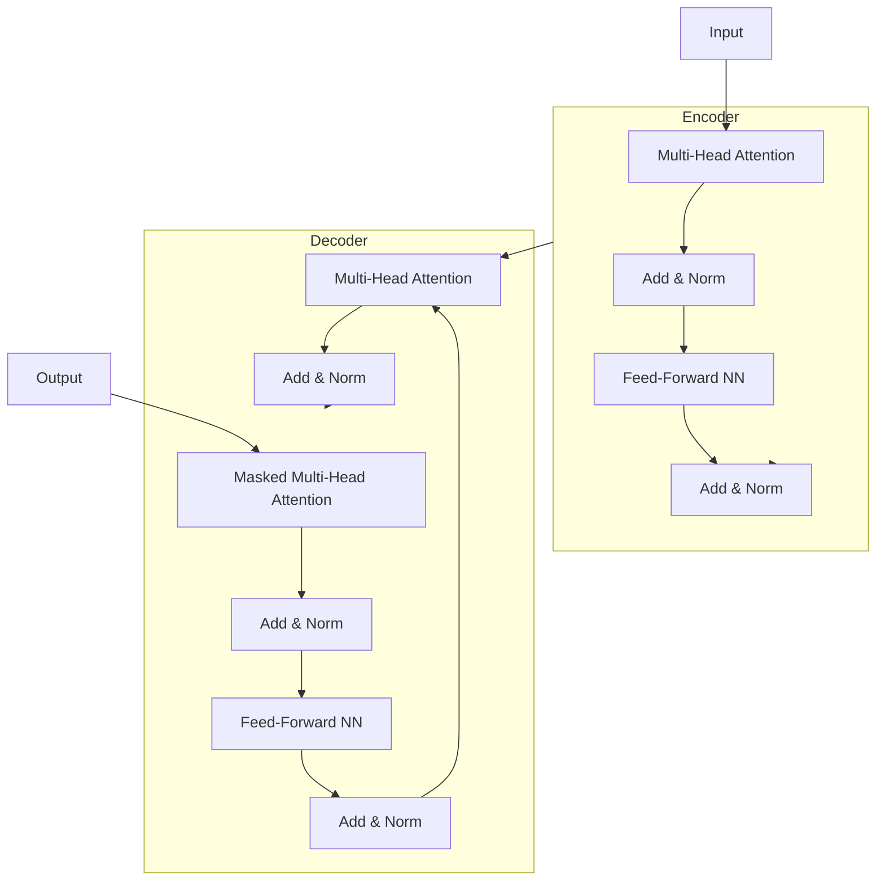

# GPT 原理与代码实例讲解

## 1. 背景介绍

在过去几年中,自然语言处理(NLP)领域取得了长足的进步,其中一个重要的里程碑是Transformer模型的提出。Transformer是一种基于注意力机制的神经网络模型,它能够有效地捕捉序列数据中的长期依赖关系。2018年,谷歌的研究人员发表了一篇题为"Attention Is All You Need"的论文,介绍了Transformer模型在机器翻译任务上的卓越表现。

随后,OpenAI提出了生成式预训练Transformer(GPT)模型,这是一种通过自回归语言建模在大规模文本语料库上进行预训练的模型。GPT模型可以被微调以适应各种自然语言处理任务,例如文本生成、问答系统、文本摘要等。GPT模型的出现标志着NLP领域进入了一个新的里程碑。

## 2. 核心概念与联系

### 2.1 Transformer 模型

Transformer模型是GPT的核心组成部分,它由编码器(Encoder)和解码器(Decoder)两个主要模块组成。编码器负责处理输入序列,而解码器则生成输出序列。两个模块都使用了多头注意力机制(Multi-Head Attention)和前馈神经网络(Feed-Forward Neural Network)。

Transformer模型的关键创新在于完全放弃了循环神经网络(RNN)和卷积神经网络(CNN),而是完全依赖注意力机制来捕捉输入和输出序列之间的依赖关系。这种设计使得模型可以更好地并行化,从而提高训练和推理的效率。

### 2.2 自回归语言建模

自回归语言建模(Autoregressive Language Modeling)是GPT的核心任务。它的目标是根据给定的文本序列,预测下一个单词或标记的概率分布。具体来说,对于一个长度为n的文本序列$X = (x_1, x_2, ..., x_n)$,自回归语言建模的目标是最大化下式中的概率:

$$P(X) = \prod_{i=1}^{n} P(x_i | x_1, x_2, ..., x_{i-1})$$

通过在大规模语料库上预训练自回归语言模型,GPT可以学习到丰富的语言知识和上下文信息,从而为下游任务提供有力的基础。

### 2.3 预训练与微调

GPT采用了预训练与微调(Pre-training and Fine-tuning)的范式。在预训练阶段,GPT在大规模语料库上进行自回归语言建模训练,学习到通用的语言知识。在微调阶段,GPT模型的参数被进一步调整以适应特定的下游任务,例如文本生成、问答系统等。

这种预训练与微调的范式使得GPT模型可以在较小的任务数据集上快速收敛,并获得良好的性能表现。同时,由于预训练阶段已经学习到了通用的语言知识,GPT模型也展现出了强大的迁移学习能力,可以轻松地应用于不同的自然语言处理任务。

## 3. 核心算法原理具体操作步骤

### 3.1 Transformer 模型架构

Transformer模型由编码器(Encoder)和解码器(Decoder)两个主要模块组成。编码器负责处理输入序列,而解码器则生成输出序列。两个模块都使用了多头注意力机制(Multi-Head Attention)和前馈神经网络(Feed-Forward Neural Network)。

下图展示了Transformer模型的整体架构:



编码器的工作流程如下:

1. 输入序列首先经过多头注意力层(Multi-Head Attention)。
2. 注意力层的输出通过残差连接(Residual Connection)与输入相加,再经过层归一化(Layer Normalization)。
3. 归一化后的结果作为前馈神经网络(Feed-Forward Neural Network)的输入。
4. 前馈神经网络的输出再次经过残差连接和层归一化,得到编码器的最终输出。

解码器的工作流程与编码器类似,但有两个额外的注意力层:

1. 第一个注意力层是掩码多头注意力层(Masked Multi-Head Attention),它只能关注当前位置之前的输出序列,以保持自回归性质。
2. 第二个注意力层是普通的多头注意力层,它关注编码器的输出,以捕获输入序列和输出序列之间的依赖关系。

### 3.2 多头注意力机制

多头注意力机制(Multi-Head Attention)是Transformer模型的核心组件之一。它允许模型同时关注输入序列的不同表示,从而捕获更丰富的依赖关系。

具体来说,多头注意力机制由多个独立的注意力头(Attention Head)组成,每个注意力头都会学习到输入序列的不同表示。最终,所有注意力头的输出会被concatenate在一起,并经过一个线性变换,得到最终的注意力输出。

单个注意力头的计算过程如下:

1. 计算查询(Query)、键(Key)和值(Value)向量:

   $$\begin{aligned}
   Q &= XW^Q \\
   K &= XW^K \\
   V &= XW^V
   \end{aligned}$$

   其中$X$是输入序列,$W^Q$、$W^K$和$W^V$分别是可学习的查询、键和值的权重矩阵。

2. 计算注意力分数:

   $$\text{Attention}(Q, K, V) = \text{softmax}\left(\frac{QK^T}{\sqrt{d_k}}\right)V$$

   其中$d_k$是缩放因子,用于防止内积过大导致的梯度饱和问题。

3. 对所有注意力头的输出进行concatenate和线性变换:

   $$\text{MultiHead}(Q, K, V) = \text{Concat}(head_1, ..., head_h)W^O$$

   其中$head_i$是第$i$个注意力头的输出,$W^O$是可学习的线性变换权重矩阵。

通过多头注意力机制,Transformer模型可以同时关注输入序列的不同表示,从而捕获更丰富的依赖关系,提高模型的表现能力。

### 3.3 位置编码

由于Transformer模型完全放弃了循环神经网络和卷积神经网络,因此它无法直接捕获序列的位置信息。为了解决这个问题,Transformer引入了位置编码(Positional Encoding)的概念。

位置编码是一种将序列位置信息编码到向量中的方法。具体来说,对于序列中的每个位置$i$,它都会被赋予一个位置编码向量$P_i$。这个向量会被加到输入序列的嵌入向量中,从而为模型提供位置信息。

位置编码向量可以通过不同的函数来生成,例如正弦函数和余弦函数:

$$\begin{aligned}
P_{i, 2j} &= \sin\left(i / 10000^{2j/d_\text{model}}\right) \\
P_{i, 2j+1} &= \cos\left(i / 10000^{2j/d_\text{model}}\right)
\end{aligned}$$

其中$i$是序列位置,$j$是维度索引,$d_\text{model}$是模型的嵌入维度。

通过位置编码,Transformer模型可以有效地捕获序列的位置信息,从而更好地建模序列数据。

## 4. 数学模型和公式详细讲解举例说明

### 4.1 自回归语言建模

自回归语言建模是GPT的核心任务,它的目标是根据给定的文本序列,预测下一个单词或标记的概率分布。具体来说,对于一个长度为$n$的文本序列$X = (x_1, x_2, ..., x_n)$,自回归语言建模的目标是最大化下式中的概率:

$$P(X) = \prod_{i=1}^{n} P(x_i | x_1, x_2, ..., x_{i-1})$$

这个公式表示,整个序列$X$的概率等于每个单词$x_i$在给定前面所有单词的条件下出现的概率的乘积。

例如,对于一个简单的句子"我爱编程",自回归语言建模需要计算以下概率:

$$\begin{aligned}
P(\text{"我爱编程"}) &= P(\text{"我"}) \times P(\text{"爱"} | \text{"我"}) \\
                     &\quad\times P(\text{"编"} | \text{"我爱"}) \times P(\text{"程"} | \text{"我爱编"})
\end{aligned}$$

在训练过程中,GPT模型会最大化这个概率,从而学习到语言的统计规律和上下文信息。

### 4.2 注意力机制

注意力机制(Attention Mechanism)是Transformer模型的核心组件之一,它允许模型动态地关注输入序列的不同部分,从而捕获长期依赖关系。

注意力机制的计算过程可以用下面的公式表示:

$$\text{Attention}(Q, K, V) = \text{softmax}\left(\frac{QK^T}{\sqrt{d_k}}\right)V$$

其中:

- $Q$是查询(Query)向量,表示当前需要关注的部分。
- $K$是键(Key)向量,表示输入序列的不同表示。
- $V$是值(Value)向量,表示输入序列的实际值。
- $d_k$是缩放因子,用于防止内积过大导致的梯度饱和问题。

具体来说,注意力机制首先计算查询$Q$和所有键$K$之间的相似性分数,然后通过softmax函数将这些分数转换为概率分布。最后,将概率分布与值$V$相乘,得到加权求和的注意力输出。

例如,假设我们有一个长度为3的输入序列$X = (x_1, x_2, x_3)$,其对应的键$K$和值$V$如下:

$$\begin{aligned}
K &= \begin{bmatrix}
k_1 & k_2 & k_3
\end{bmatrix} \\
V &= \begin{bmatrix}
v_1 & v_2 & v_3
\end{bmatrix}
\end{aligned}$$

对于查询$q$,注意力机制会计算出一个概率分布$\alpha$:

$$\alpha = \text{softmax}\left(\frac{q \cdot [k_1, k_2, k_3]^T}{\sqrt{d_k}}\right)$$

然后,注意力输出就是$\alpha$与$V$的加权求和:

$$\text{Attention}(q, K, V) = \alpha \cdot \begin{bmatrix}
v_1 & v_2 & v_3
\end{bmatrix}^T$$

通过注意力机制,Transformer模型可以动态地关注输入序列的不同部分,从而更好地捕获长期依赖关系。

## 5. 项目实践: 代码实例和详细解释说明

在这一部分,我们将介绍如何使用Python和PyTorch库来实现一个简单的GPT模型。虽然这个示例代码远远无法与真实的GPT模型相媲美,但它可以帮助我们理解GPT的核心原理和实现细节。

### 5.1 导入必要的库

```python
import torch
import torch.nn as nn
import torch.nn.functional as F
```

我们首先导入PyTorch库及其子模块`nn`和`nn.functional`。`nn`模块提供了构建神经网络层和模型的接口,而`nn.functional`模块则包含了一些常用的激活函数和损失函数。

### 5.2 定义多头注意力层

```python
class MultiHeadAttention(nn.Module):
    def __init__(self, embed_dim, num_heads):
        super().__init__()
        self.embed_dim = embed_dim
        self.num_heads = num_heads
        self.head_dim = embed_dim // num_heads

        self.qkv_proj = nn.Linear(embed_dim, 3 * embed_dim)
        self.out_proj = nn.Linear(embed_dim, embed_dim)

    def forward(self, x):
        batch_size, seq_len, _ = x.size()

        qkv = self.qkv_proj(x)
        q, k, v = qkv.chunk(3, dim=-1)

        q = q.view(batch_size, seq_len, self.num_heads, self.head_dim).transpose