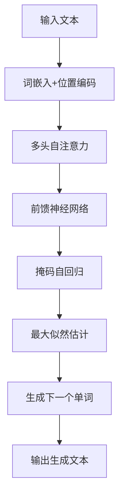

# GPT-2原理与代码实例讲解

## 1.背景介绍

GPT-2是一种基于Transformer的大型语言模型,由OpenAI开发。它是GPT(生成式预训练转换器)的第二代版本,在自然语言处理(NLP)任务中表现出色。GPT-2可以生成连贯、逻辑性强的长文本,在文本生成、机器翻译、问答系统等领域有广泛应用。

GPT-2的训练语料来自互联网上的大量高质量文本数据,包括书籍、网页和维基百科文章。通过无监督的预训练,GPT-2学习了人类语言的模式和结构,从而能够生成类似于人类写作风格的文本。

与GPT相比,GPT-2在模型规模、训练数据量和生成质量上都有显著提升。它采用了Transformer解码器结构,可以高效地并行化训练。GPT-2的最大版本拥有约17亿个参数,是目前最大的语言模型之一。

## 2.核心概念与联系

### 2.1 Transformer架构

Transformer是GPT-2的核心架构,它是一种基于注意力机制的序列到序列模型。Transformer由编码器和解码器组成,用于处理输入序列和生成输出序列。

GPT-2只使用了Transformer的解码器部分,因为它主要用于语言生成任务。解码器由多个相同的层组成,每层包含多头自注意力机制和前馈神经网络。

自注意力机制允许模型捕捉输入序列中任意两个位置之间的关系,从而更好地理解上下文信息。多头注意力机制可以从不同的表示子空间捕捉不同的相关性模式,提高模型的表达能力。

### 2.2 掩码自回归语言建模

GPT-2采用掩码自回归语言建模(Masked Auto-regressive Language Modeling)的方式进行训练。在训练过程中,模型会根据给定的上文,预测下一个单词的概率分布。

通过最大化预测正确单词的概率,GPT-2可以学习到语言的统计规律。由于每个单词的预测都依赖于前面的上文,因此模型可以很好地捕捉上下文信息,生成连贯的长文本。

### 2.3 生成式预训练

GPT-2使用生成式预训练(Generative Pre-training)的方法,通过大规模无监督预训练,学习通用的语言表示。预训练后的模型可以在下游任务上进行微调(fine-tuning),从而快速适应特定领域的数据。

生成式预训练的优势在于,模型可以从海量的文本数据中学习到丰富的语言知识,而不需要人工标注数据。这种方法可以减少人工标注的成本,并且可以更好地利用现有的大量文本资源。

## 3.核心算法原理具体操作步骤

GPT-2的核心算法原理可以概括为以下几个步骤:

1. **输入表示**:将输入文本序列转换为词嵌入向量序列,作为模型的输入。

2. **位置编码**:由于Transformer没有递归或卷积结构,因此需要添加位置编码,使模型能够捕捉序列中每个位置的信息。

3. **多头自注意力**:计算输入序列中每个位置与其他位置之间的注意力权重,捕捉长距离依赖关系。

4. **前馈神经网络**:对注意力输出进行非线性变换,提取更高层次的特征表示。

5. **掩码自回归**:在训练时,将输入序列中的某些单词用掩码符号替换,模型需要根据上文预测被掩码的单词。

6. **最大化似然估计**:通过最大化被掩码单词的预测概率,优化模型参数。

7. **生成**:在推理阶段,给定一个起始文本,模型会自回归地生成下一个单词,直到达到预设的长度或生成终止符号。

以下是GPT-2生成文本的基本流程图:



## 4.数学模型和公式详细讲解举例说明

### 4.1 自注意力机制

自注意力机制是Transformer的核心组件,它允许模型捕捉输入序列中任意两个位置之间的关系。对于长度为 $n$ 的输入序列 $X = (x_1, x_2, \dots, x_n)$,自注意力计算如下:

$$\begin{aligned}
Q &= XW^Q \\
K &= XW^K \\
V &= XW^V \\
\text{Attention}(Q, K, V) &= \text{softmax}\left(\frac{QK^T}{\sqrt{d_k}}\right)V
\end{aligned}$$

其中 $Q$、$K$、$V$ 分别表示查询(Query)、键(Key)和值(Value)矩阵,通过线性变换 $W^Q$、$W^K$、$W^V$ 从输入 $X$ 计算得到。$d_k$ 是缩放因子,用于防止点积过大导致梯度消失。

注意力分数 $\alpha_{ij}$ 表示第 $i$ 个位置对第 $j$ 个位置的注意力权重,计算如下:

$$\alpha_{ij} = \frac{\exp(q_i^Tk_j)}{\sum_{l=1}^n\exp(q_i^Tk_l)}$$

最终的注意力输出是注意力分数与值矩阵 $V$ 的加权和:

$$\text{Attention}(Q, K, V)_i = \sum_{j=1}^n\alpha_{ij}v_j$$

多头注意力机制是将多个注意力头的输出拼接在一起,捕捉不同的相关性模式:

$$\text{MultiHead}(Q, K, V) = \text{Concat}(\text{head}_1, \dots, \text{head}_h)W^O$$

其中 $\text{head}_i = \text{Attention}(QW_i^Q, KW_i^K, VW_i^V)$,表示第 $i$ 个注意力头的输出。$W_i^Q$、$W_i^K$、$W_i^V$ 和 $W^O$ 是可学习的线性变换参数。

### 4.2 掩码自回归语言建模

在掩码自回归语言建模中,给定长度为 $n$ 的输入序列 $X = (x_1, x_2, \dots, x_n)$,模型需要预测被掩码的单词 $x_i$。定义掩码向量 $M = (m_1, m_2, \dots, m_n)$,其中 $m_i = 0$ 表示第 $i$ 个单词被掩码,需要预测;$m_i = 1$ 表示第 $i$ 个单词是已知的。

模型的目标是最大化被掩码单词的条件概率:

$$\mathcal{L} = \sum_{i=1}^n\log P(x_i|X_{<i}, M)$$

其中 $X_{<i} = (x_1, x_2, \dots, x_{i-1})$ 表示第 $i$ 个单词之前的上文。

在训练过程中,GPT-2会随机选择一些单词进行掩码,并最大化被掩码单词的条件概率。通过这种方式,模型可以学习到语言的统计规律,生成连贯的文本。

## 5.项目实践:代码实例和详细解释说明

以下是使用Hugging Face的Transformers库加载和使用GPT-2模型的Python代码示例:

```python
from transformers import GPT2LMHeadModel, GPT2Tokenizer

# 加载预训练模型和分词器
model = GPT2LMHeadModel.from_pretrained('gpt2')
tokenizer = GPT2Tokenizer.from_pretrained('gpt2')

# 输入文本
input_text = "Once upon a time, there was a"

# 对输入文本进行编码
input_ids = tokenizer.encode(input_text, return_tensors='pt')

# 生成文本
output = model.generate(input_ids, max_length=100, do_sample=True, top_k=50, top_p=0.95, num_return_sequences=1)

# 解码输出
generated_text = tokenizer.decode(output[0], skip_special_tokens=True)

print(generated_text)
```

代码解释:

1. 导入必要的模块和类。
2. 使用 `from_pretrained` 方法加载预训练的GPT-2模型和分词器。
3. 定义输入文本 `input_text`。
4. 使用分词器的 `encode` 方法将输入文本编码为模型可接受的张量形式。
5. 调用模型的 `generate` 方法生成文本。`max_length` 参数控制生成文本的最大长度,`do_sample` 参数指定是否进行采样生成,`top_k` 和 `top_p` 参数用于控制生成的多样性。`num_return_sequences` 参数指定生成序列的数量。
6. 使用分词器的 `decode` 方法将生成的张量解码为文本形式,`skip_special_tokens` 参数指定是否跳过特殊标记。
7. 打印生成的文本。

运行上述代码,您将看到GPT-2根据给定的起始文本生成了一段连贯的故事。您可以尝试修改输入文本和生成参数,观察生成结果的变化。

## 6.实际应用场景

GPT-2在自然语言处理领域有广泛的应用场景,包括但不限于:

1. **文本生成**: GPT-2可以生成高质量、连贯的长文本,如小说、新闻报道、营销文案等。

2. **机器翻译**: 通过微调,GPT-2可以用于机器翻译任务,生成流畅的目标语言文本。

3. **问答系统**: GPT-2可以根据上下文生成相关的回答,应用于开放域问答系统。

4. **文本摘要**: GPT-2可以生成高质量的文本摘要,捕捉原文的核心内容。

5. **代码生成**: 经过适当的训练,GPT-2可以生成编程语言代码,辅助开发人员编写代码。

6. **对话系统**: GPT-2可以生成人性化的对话响应,用于构建对话代理和虚拟助手。

7. **内容创作辅助**: GPT-2可以为作家、营销人员等提供内容创作建议和灵感。

8. **数据增强**: GPT-2生成的文本可用于扩充训练数据集,提高其他NLP模型的性能。

总的来说,GPT-2的强大文本生成能力为各种自然语言处理任务提供了新的解决方案,在工业界和学术界都有广泛的应用前景。

## 7.工具和资源推荐

以下是一些与GPT-2相关的有用工具和资源:

1. **Hugging Face Transformers**: 一个强大的自然语言处理库,提供了GPT-2和其他Transformer模型的预训练权重和代码示例。网址: https://huggingface.co/transformers/

2. **GPT-2 Output Dataset**: OpenAI发布的GPT-2生成文本数据集,包含了模型生成的各种主题的文本。网址: https://openai.com/blog/gpt-2-output-dataset/

3. **GPT-2 Simple**: 一个简单的Python包,提供了GPT-2的文本生成功能。网址: https://github.com/minimaxir/gpt-2-simple

4. **GPT-2 Explorer**: 一个在线工具,允许用户输入起始文本,并查看GPT-2生成的结果。网址: https://gpt2explorer.xyz/

5. **GPT-2 Output Detector**: 一个用于检测GPT-2生成文本的工具,可以帮助识别人工生成的内容。网址: https://github.com/openai/gpt-2-output-dataset/tree/master/detector

6. **GPT-2 Fine-tuning**: 一个教程,介绍如何在特定数据集上微调GPT-2模型。网址: https://github.com/openai/gpt-2-output-dataset/tree/master/finetuning

7. **GPT-2 Papers**: 一些与GPT-2相关的研究论文,探讨了模型的原理、应用和局限性。

这些工具和资源可以帮助您更好地理解和使用GPT-2模型,并为您的自然语言处理项目提供支持。

## 8.总结:未来发展趋势与挑战

GPT-2是一个里程碑式的语言模型,展示了大规模预训练模型在自然语言处理任务中的强大能力。然而,GPT-2也面临一些挑战和局限性,未来的发展