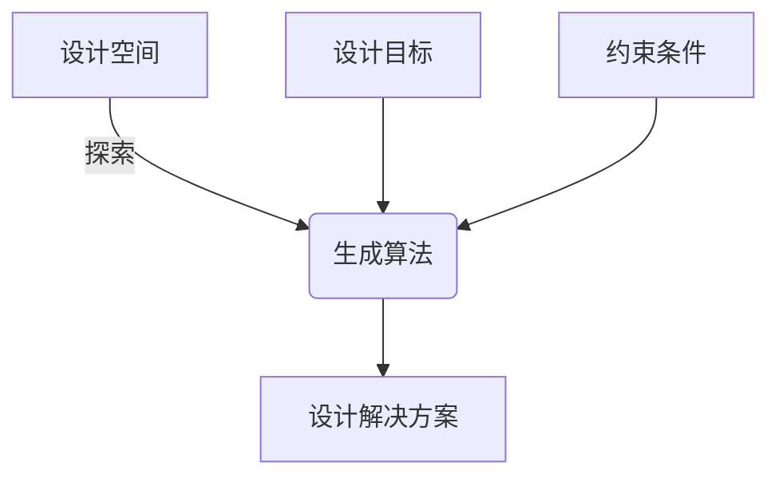

# Generative Design原理与代码实例讲解

## 1.背景介绍

### 1.1 什么是Generative Design?

Generative Design(生成式设计)是一种新兴的设计方法,利用人工智能算法和计算机辅助设计,通过定义设计目标和约束条件,自动生成满足要求的设计方案。与传统的人工设计不同,Generative Design可以探索更多的可能性,发现创新和优化的设计解决方案。

### 1.2 Generative Design的发展历程

Generative Design的概念源于20世纪60年代的建筑设计,当时建筑师开始探索使用计算机程序来生成建筑形式。随着计算机技术的发展,Generative Design逐渐应用于产品设计、工程设计等多个领域。近年来,人工智能和机器学习算法的快速进步为Generative Design注入了新的活力。

### 1.3 Generative Design的优势

相比传统设计方式,Generative Design具有以下优势:

- 探索更多可能性,发现创新解决方案
- 实现设计自动化,提高效率
- 优化设计,满足多重约束条件
- 促进跨学科协作,融合不同领域知识

## 2.核心概念与联系

### 2.1 设计空间

设计空间是指所有可能的设计解决方案的集合。在Generative Design中,设计空间通常是高维的,包含大量的变量和参数。探索设计空间是Generative Design的核心任务。

### 2.2 设计目标

设计目标是期望达到的设计要求,如性能、成本、重量等。在Generative Design中,设计目标通常被定义为一个或多个优化函数。

### 2.3 约束条件

约束条件是设计必须满足的限制,如材料属性、制造工艺、法规要求等。约束条件限定了可行的设计解决方案。

### 2.4 生成算法

生成算法是Generative Design的核心,用于在设计空间中搜索满足设计目标和约束条件的解决方案。常用的生成算法包括:

- 启发式算法(如遗传算法、蚁群算法等)
- 拓扑优化算法
- 机器学习算法(如深度学习、强化学习等)

### 2.5 Mermaid流程图



## 3.核心算法原理具体操作步骤

### 3.1 遗传算法

遗传算法是Generative Design中常用的生成算法,模拟生物进化过程,通过选择、交叉和变异操作来优化设计解决方案。

1. 初始化种群
2. 评估个体适应度
3. 选择
4. 交叉
5. 变异
6. 重复2-5,直到满足终止条件

### 3.2 拓扑优化算法

拓扑优化算法用于优化材料分布,以获得满足约束条件的最佳结构。常见的拓扑优化算法包括:

1. 同质化拓扑优化(SIMP)
2. 双等距场拓扑优化(BESO)
3. 水平集拓扑优化(Level Set)

### 3.3 深度学习算法

深度学习算法可以从大量数据中学习设计规则,生成新的设计解决方案。常见的深度学习算法包括:

1. 生成对抗网络(GAN)
2. 变分自编码器(VAE)
3. 转换器(Transformer)

## 4.数学模型和公式详细讲解举例说明

### 4.1 遗传算法数学模型

在遗传算法中,设计解决方案通常被编码为二进制串或实数向量。适应度函数用于评估个体的优劣,通常定义为:

$$
f(x) = \sum_{i=1}^{n} w_i f_i(x)
$$

其中,$f(x)$是适应度函数,$f_i(x)$是第$i$个目标函数,$w_i$是相应的权重。

选择操作根据适应度值选择个体,常用的选择方法有轮盘赌选择、锦标赛选择等。

交叉操作通过组合父代个体的基因来产生新的个体,常用的交叉方法有单点交叉、多点交叉等。

变异操作通过改变个体的部分基因来增加种群的多样性,常用的变异方法有位反转变异、高斯变异等。

### 4.2 拓扑优化数学模型

在拓扑优化中,结构通常被离散化为有限元素,每个元素的相对密度$\rho_e$作为设计变量。目标函数可以是结构的合规性或性能指标,如:

$$
\min\limits_{\rho} \quad f(\rho) \\
\text{s.t.} \quad g_j(\rho) \leq 0, \quad j = 1, 2, \ldots, m \\
\quad\quad\quad\quad 0 \leq \rho_e \leq 1, \quad e = 1, 2, \ldots, n
$$

其中,$f(\rho)$是目标函数,$g_j(\rho)$是第$j$个约束条件,$\rho$是所有元素相对密度的向量,$m$是约束条件的个数,$n$是元素的个数。

### 4.3 深度学习数学模型

在深度学习中,生成对抗网络(GAN)是一种常用的生成模型。GAN由生成器$G$和判别器$D$组成,目标是找到一个生成器$G$,使得生成的数据$G(z)$与真实数据$x$的分布相同,即:

$$
\min\limits_G \max\limits_D V(D, G) = \mathbb{E}_{x \sim p_\text{data}(x)}[\log D(x)] + \mathbb{E}_{z \sim p_z(z)}[\log (1 - D(G(z)))]
$$

其中,$p_\text{data}(x)$是真实数据的分布,$p_z(z)$是噪声变量$z$的分布,$D(x)$是判别器对$x$为真实数据的判别概率。

通过交替优化生成器$G$和判别器$D$,可以使生成器$G$产生逼近真实数据分布的数据。

## 5.项目实践:代码实例和详细解释说明

### 5.1 Python实现遗传算法

```python
import random

# 定义适应度函数
def fitness_func(x):
    return x**2 - 10*x + 25

# 初始化种群
population = [random.randint(0, 30) for _ in range(100)]

# 遗传算法主循环
for generation in range(1000):
    # 评估适应度
    fitness = [fitness_func(x) for x in population]
    
    # 选择
    new_population = []
    for _ in range(100):
        parent1 = random.choices(population, weights=fitness, k=1)[0]
        parent2 = random.choices(population, weights=fitness, k=1)[0]
        
        # 交叉
        child = random.randint(min(parent1, parent2), max(parent1, parent2))
        
        # 变异
        if random.random() < 0.1:
            child = random.randint(0, 30)
        
        new_population.append(child)
    
    population = new_population
    
    # 输出当前最优解
    best_individual = max(population, key=fitness_func)
    print(f"Generation {generation}: Best individual = {best_individual}, Fitness = {fitness_func(best_individual)}")
```

在这个示例中,我们使用遗传算法求解一个简单的函数优化问题。首先定义适应度函数`fitness_func`。然后初始化一个随机种群`population`。

在主循环中,我们首先计算每个个体的适应度值`fitness`。然后进行选择操作,根据适应度值选择父代个体`parent1`和`parent2`。接着进行交叉操作,产生新的个体`child`。变异操作随机改变个体的基因。最后,我们用新的种群`new_population`替换旧的种群`population`。

每一代都输出当前最优解及其适应度值。

### 5.2 MATLAB实现拓扑优化

```matlab
% 定义设计域
ndx = 60; 
ndy = 30;
nvars = ndx*ndy;

% 定义约束条件
nl = 2*(ndy+1);
nu = nvars;
A = sparse(nl,nvars);
for i = 1:ndy
    n1 = (i-1)*ndx+1; 
    n2 = (i)*ndx;
    A(i,n1:n2) = 1;
end
for i = 1:ndx
    A(i+ndy,i:ndx:nvars) = 1;
end
b = ones(nl,1);

% 定义目标函数
c = ones(nvars,1);

% 调用拓扑优化算法求解
x0 = ones(nvars,1);
x = fmincon(@(x)c'*x,x0,A,b);

% 绘制结果
figure;
xval = reshape(x,ndy,ndx);
spy(1-xval')
axis equal; axis tight; axis off;
```

在这个示例中,我们使用MATLAB内置的`fmincon`函数求解一个拓扑优化问题。首先定义设计域的大小`ndx`和`ndy`。然后定义约束条件矩阵`A`和向量`b`,表示每行和每列的体积分数之和等于1。目标函数`c`是一个全1向量,表示最小化总体积。

调用`fmincon`函数求解约束优化问题,得到相对密度向量`x`。最后将`x`重塑为矩阵`xval`,并使用`spy`函数绘制结果。

### 5.3 PyTorch实现生成对抗网络

```python
import torch
import torch.nn as nn

# 定义生成器
class Generator(nn.Module):
    def __init__(self, z_dim, img_dim):
        super().__init__()
        self.net = nn.Sequential(
            nn.Linear(z_dim, 256),
            nn.ReLU(),
            nn.Linear(256, img_dim),
            nn.Tanh()
        )
    
    def forward(self, z):
        return self.net(z)

# 定义判别器
class Discriminator(nn.Module):
    def __init__(self, img_dim):
        super().__init__()
        self.net = nn.Sequential(
            nn.Linear(img_dim, 256),
            nn.LeakyReLU(0.2),
            nn.Linear(256, 1),
            nn.Sigmoid()
        )
    
    def forward(self, x):
        return self.net(x)

# 训练GAN
z_dim = 100
img_dim = 784
batch_size = 64
epochs = 100

generator = Generator(z_dim, img_dim)
discriminator = Discriminator(img_dim)

optim_g = torch.optim.Adam(generator.parameters(), lr=0.0002)
optim_d = torch.optim.Adam(discriminator.parameters(), lr=0.0002)

criterion = nn.BCELoss()

for epoch in range(epochs):
    for real_imgs in real_data_loader:
        # 训练判别器
        optim_d.zero_grad()
        
        real_preds = discriminator(real_imgs)
        real_loss = criterion(real_preds, torch.ones_like(real_preds))
        
        z = torch.randn(batch_size, z_dim)
        fake_imgs = generator(z)
        fake_preds = discriminator(fake_imgs)
        fake_loss = criterion(fake_preds, torch.zeros_like(fake_preds))
        
        d_loss = real_loss + fake_loss
        d_loss.backward()
        optim_d.step()
        
        # 训练生成器
        optim_g.zero_grad()
        
        z = torch.randn(batch_size, z_dim)
        fake_imgs = generator(z)
        fake_preds = discriminator(fake_imgs)
        g_loss = criterion(fake_preds, torch.ones_like(fake_preds))
        
        g_loss.backward()
        optim_g.step()
    
    # 输出训练过程
    print(f"Epoch {epoch+1}/{epochs}, D Loss: {d_loss.item()}, G Loss: {g_loss.item()}")
```

在这个示例中,我们使用PyTorch实现了一个简单的生成对抗网络(GAN)。首先定义生成器`Generator`和判别器`Discriminator`的网络结构。

在训练循环中,我们首先训练判别器`Discriminator`。计算真实数据的损失`real_loss`和生成数据的损失`fake_loss`,并求和得到判别器的总损失`d_loss`。然后反向传播并更新判别器的参数。

接着训练生成器`Generator`。生成一批假数据`fake_imgs`,通过判别器计算生成器的损失`g_loss`。反向传播并更新生成器的参数。

每个epoch都输出当前的损失值,以监控训练过程。

## 6.实际应用场景

Generative Design已经在多个领域得到了应用,包括:

### 6.1 产品设计

在产品设计中,Generative Design可以生成满足多重约束条件的优化结构,如减轻重