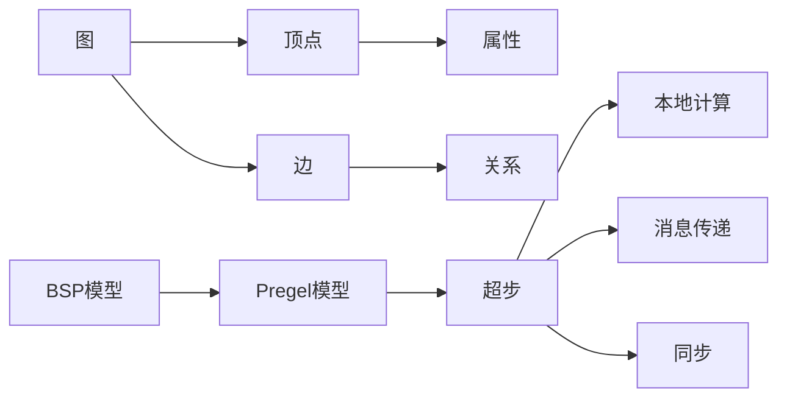
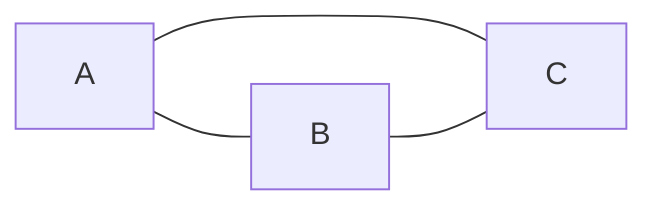
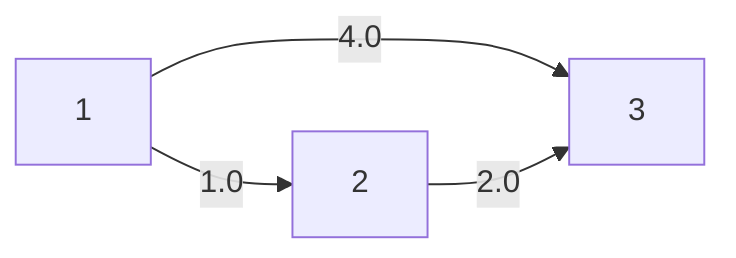

# Giraph原理与代码实例讲解

## 1. 背景介绍
### 1.1 大数据处理的挑战
在当今大数据时代,我们面临着海量数据处理的巨大挑战。传统的单机处理方式已经无法满足日益增长的数据规模和计算复杂度。为了应对这一挑战,分布式计算框架应运而生。
### 1.2 图计算的重要性
在众多的大数据处理场景中,图计算占据着重要的地位。图是一种非常重要的数据结构,广泛应用于社交网络、推荐系统、金融风控等领域。高效地处理大规模图数据,对于挖掘其中的价值和洞察至关重要。
### 1.3 Giraph的诞生
Apache Giraph是一个开源的分布式图处理框架,由Yahoo!开发并贡献给Apache软件基金会。它基于Google的Pregel模型,专门用于处理大规模图数据,具有良好的可扩展性和容错性。

## 2. 核心概念与联系
### 2.1 图的基本概念
在深入了解Giraph之前,我们需要先了解图的一些基本概念。图由顶点(Vertex)和边(Edge)组成。每个顶点可以有自己的属性,每条边连接两个顶点,表示它们之间的关系。
### 2.2 Pregel编程模型
Giraph采用了Pregel编程模型。在该模型中,图计算被抽象为一系列的超步(Superstep)。在每个超步中,每个顶点可以接收来自上一超步的消息,更新自己的状态,并向其他顶点发送消息。这个过程不断迭代,直到所有顶点都没有消息可发。
### 2.3 BSP模型
Pregel编程模型实际上是基于BSP(Bulk Synchronous Parallel)模型的。BSP将计算过程分为多个超步,每个超步包括本地计算、通信和屏障同步三个阶段。Giraph利用BSP模型实现了高效的分布式图计算。
### 2.4 核心概念关系图
下面是Giraph核心概念之间的关系图,使用Mermaid绘制:


## 3. 核心算法原理与具体操作步骤
### 3.1 顶点切分
为了在多台机器上并行处理图数据,Giraph首先需要将图的顶点划分到不同的分区(Partition)。常见的切分策略有哈希切分和范围切分。哈希切分根据顶点ID的哈希值将顶点分配到不同的分区;范围切分则根据顶点ID的范围进行分区。
### 3.2 消息传递
在每个超步中,顶点可以给其他顶点发送消息。Giraph使用消息传递机制来实现顶点之间的通信。消息以(目标顶点ID,消息值)的形式存在。Giraph会自动将消息路由到目标顶点所在的分区。
### 3.3 顶点计算
当一个顶点收到消息后,它会根据接收到的消息更新自己的状态。顶点的计算逻辑由用户自定义的compute函数决定。在compute函数中,用户可以访问顶点的属性、边以及接收到的消息,并执行相应的计算。
### 3.4 同步与迭代
在每个超步结束时,Giraph会进行一次全局同步,确保所有的消息都已经传递完毕,所有的顶点都完成了本轮计算。然后进入下一个超步,重复上述过程,直到达到终止条件(例如没有消息传递或达到最大迭代次数)。
### 3.5 容错机制
Giraph提供了容错机制来应对机器故障。它通过定期检查点(Checkpoint)来保存计算状态,当某个Worker失败时,可以从最近的检查点恢复计算。此外,Giraph还支持Out-of-Core计算,可以处理超过内存大小的图数据。

## 4. 数学模型和公式详细讲解举例说明
### 4.1 图的数学表示
图可以用数学语言来表示。我们用$G=(V,E)$来表示一个图,其中$V$是顶点集合,$E$是边集合。对于无向图,边是无序对$(u,v)$,表示顶点$u$和$v$之间的连接。对于有向图,边是有序对$(u,v)$,表示从顶点$u$到$v$的有向边。
### 4.2 邻接矩阵
邻接矩阵是表示图的一种常见方式。对于一个有$n$个顶点的图,它的邻接矩阵$A$是一个$n \times n$的方阵。如果顶点$i$和$j$之间有边连接,则$A_{ij}=1$,否则$A_{ij}=0$。对于带权图,$A_{ij}$的值为边的权重。
例如,对于下面这个无向图:

它的邻接矩阵为:
$$
A = \begin{bmatrix}
0 & 1 & 1 \\
1 & 0 & 1 \\
1 & 1 & 0
\end{bmatrix}
$$
### 4.3 度数与度数矩阵
顶点的度数表示与该顶点相连的边数。对于无向图,顶点$i$的度数$d_i$可以通过邻接矩阵计算:
$$
d_i = \sum_{j=1}^{n} A_{ij}
$$
度数矩阵$D$是一个对角矩阵,对角线上的元素为各个顶点的度数,其他元素为0:
$$
D = \begin{bmatrix}
d_1 & 0 & \cdots & 0 \\
0 & d_2 & \cdots & 0 \\
\vdots & \vdots & \ddots & \vdots \\
0 & 0 & \cdots & d_n
\end{bmatrix}
$$
### 4.4 拉普拉斯矩阵
图的拉普拉斯矩阵$L$定义为度数矩阵$D$与邻接矩阵$A$之差:
$$
L = D - A
$$
拉普拉斯矩阵在图的谱理论和图嵌入等领域有重要应用。
### 4.5 PageRank算法
PageRank是一种著名的图算法,用于评估网页的重要性。它基于以下假设:如果一个网页被很多其他重要网页链接,那么它也是重要的。PageRank可以用以下迭代公式表示:
$$
PR(u) = \frac{1-d}{N} + d \sum_{v \in B(u)} \frac{PR(v)}{L(v)}
$$
其中,$PR(u)$是网页$u$的PageRank值,$B(u)$是链接到$u$的网页集合,$L(v)$是网页$v$的出链数,$N$是网页总数,$d$是阻尼系数,通常取0.85。

## 5. 项目实践:代码实例和详细解释说明
下面我们通过一个简单的Giraph项目来说明如何使用Giraph进行图计算。这个项目实现了单源最短路径(SSSP)算法。
### 5.1 项目依赖
首先,我们需要在项目中引入Giraph的依赖:
```xml
<dependency>
  <groupId>org.apache.giraph</groupId>
  <artifactId>giraph-core</artifactId>
  <version>1.2.0</version>
</dependency>
```
### 5.2 定义顶点类
我们定义一个`SSSPVertex`类,表示图中的顶点:
```java
public class SSSPVertex extends Vertex<LongWritable, DoubleWritable, FloatWritable, DoubleWritable> {
  @Override
  public void compute(Iterable<DoubleWritable> messages) {
    if (getSuperstep() == 0) {
      setValue(new DoubleWritable(Double.MAX_VALUE));
    }
    double minDist = isSource() ? 0d : Double.MAX_VALUE;
    for (DoubleWritable message : messages) {
      minDist = Math.min(minDist, message.get());
    }
    if (minDist < getValue().get()) {
      setValue(new DoubleWritable(minDist));
      for (Edge<LongWritable, FloatWritable> edge : getEdges()) {
        double distance = minDist + edge.getValue().get();
        sendMessage(edge.getTargetVertexId(), new DoubleWritable(distance));
      }
    }
    voteToHalt();
  }
  
  private boolean isSource() {
    return getId().get() == 1;
  }
}
```
在`compute`方法中,我们首先检查是否是源顶点,如果是,将距离初始化为0,否则初始化为无穷大。然后,我们遍历收到的消息,找到最小的距离。如果该距离小于当前顶点的距离,则更新顶点的距离,并将新的距离加上边的权重,发送给相邻的顶点。最后,我们调用`voteToHalt`方法,表示当前顶点已经计算完毕。
### 5.3 定义主类
接下来,我们定义一个`SSSPJob`类,用于配置和运行Giraph作业:
```java
public class SSSPJob {
  public static void main(String[] args) throws Exception {
    GiraphConfiguration conf = new GiraphConfiguration();
    conf.setVertexClass(SSSPVertex.class);
    conf.setVertexInputFormatClass(TextVertexInputFormat.class);
    conf.setVertexOutputFormatClass(TextVertexOutputFormat.class);
    GraphJob job = new GraphJob(conf, "Single Source Shortest Path");
    job.run(true);
  }
}
```
在`main`方法中,我们创建了一个`GiraphConfiguration`对象,设置了顶点类、输入格式和输出格式。然后,我们创建了一个`GraphJob`对象,传入配置和作业名称,最后调用`run`方法来执行作业。
### 5.4 准备输入数据
我们需要准备一个输入文件,描述图的结构。假设我们有以下的图:

相应的输入文件`input.txt`内容如下:
```
[1,0.0,[[2,1.0],[3,4.0]]]
[2,0.0,[[3,2.0]]]
[3,0.0,[]]
```
每一行表示一个顶点,格式为`[vertexId,vertexValue,[[destVertexId,edgeValue],...]]`。
### 5.5 运行作业
现在,我们可以运行Giraph作业了:
```bash
hadoop jar sssp.jar SSSPJob input.txt output
```
运行完成后,我们可以在`output`目录下看到计算结果:
```
1   0.0
2   1.0
3   3.0
```
结果表明,从顶点1到顶点2的最短距离为1.0,到顶点3的最短距离为3.0。

## 6. 实际应用场景
Giraph在许多实际场景中都有广泛应用,下面列举几个典型的例子:
### 6.1 社交网络分析
Giraph可以用于分析社交网络,例如计算用户之间的最短路径、发现社区结构、识别影响力节点等。这对于社交网络的推荐、营销和广告投放等任务非常有帮助。
### 6.2 网页排名
像PageRank这样的算法可以用Giraph实现,用于评估网页的重要性和权威性。这是搜索引擎的核心技术之一,对于提供高质量的搜索结果至关重要。
### 6.3 交通路径规划
将交通网络抽象为图,Giraph可以用于计算最短路径、最小生成树等,为交通路径规划和导航提供支持。
### 6.4 金融风险分析
在金融领域,Giraph可以用于分析交易网络,发现风险传播路径,评估系统性风险。这对于金融监管和风险管理具有重要意义。

## 7. 工具和资源推荐
### 7.1 官方网站
Giraph的官方网站 http://giraph.apache.org 提供了丰富的文档、教程和示例,是学习和使用Giraph的最佳起点。
### 7.2 Giraph源码
Giraph是开源项目,其源码托管在GitHub上:https://github.com/apache/giraph。通过阅读和分析源码,可以深入理解Giraph的实现原理。
### 7.3 Giraph Debugger
Giraph Debugger是一个交互式调试工具,可以用于调试Giraph作业。它允许在超步之间设置断点、检查