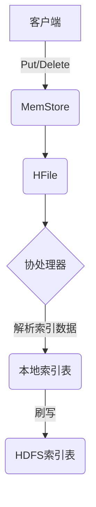
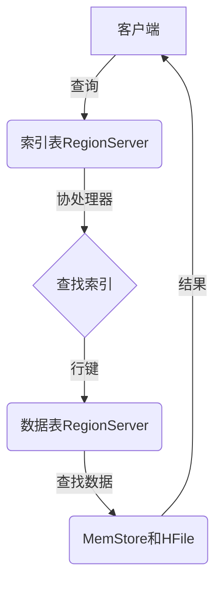

# HBase二级索引原理与代码实例讲解

## 1.背景介绍

在大数据时代,数据量的快速增长使得传统的关系型数据库难以满足海量数据的存储和查询需求。这就催生了像HBase这样的分布式NoSQL数据库的诞生。HBase是一个高可靠性、高性能、面向列、可伸缩的分布式存储系统,它基于Google的Bigtable构建,运行于HDFS之上。

HBase的数据模型类似于Google的Bigtable模型,数据按照行键(Row Key)、列族(Column Family)和列限定符(Column Qualifier)排序存储。这种面向列的存储模型使得HBase擅长于单行查询,但是对于范围查询和多行查询就显得力不从心了。为了解决这个问题,HBase引入了二级索引(Secondary Index)的概念。

## 2.核心概念与联系

### 2.1 HBase数据模型

HBase的逻辑数据模型可以看作是一个多维的稀疏存储空间,由行和列组成。行是按行键(Row Key)的字典序排序的,列由列族(Column Family)和列限定符(Column Qualifier)组成,并按照列族和列限定符的字典序排序。

每个数据单元由行键、列族、列限定符和版本号唯一确定,这个数据单元称为单元(Cell)。单元中存储的是未解释的字节码(byte[])。

### 2.2 二级索引概念

二级索引是在HBase基本数据模型之上构建的一种索引机制。它的主要作用是加速数据的查询,尤其是范围查询和多行查询。二级索引的基本思想是将数据值和行键做一个反向索引,使查询时可以先查找到行键,再根据行键查找数据。

二级索引建立在额外的索引表之上,索引表中存储着数据值到行键的映射关系。当数据表中插入或者修改数据时,对应的索引数据也会被更新。查询时先在索引表中查找数据值对应的行键,再根据行键在数据表中查找数据。

## 3.核心算法原理具体操作步骤

HBase二级索引的实现有多种方案,我们这里介绍一种常用的基于HBase协处理器(Coprocessor)的实现方式。

### 3.1 写数据流程

当向HBase表中插入或修改数据时,数据不仅会被写入数据表,还会触发协处理器,将索引数据写入索引表。写数据的具体流程如下:

1. 客户端发起Put或Delete操作,将数据写入MemStore
2. MemStore被刷写到HFile
3. RegionServer上的协处理器观察到数据写操作,从HFile中解析出需要建立索引的数据
4. 协处理器将索引数据写入本地索引表
5. 本地索引表的数据会被刷写到HDFS



### 3.2 读数据流程

当需要根据索引列的值查询数据时,查询会先在索引表中查找到对应的行键,再根据行键在数据表中查找数据。读数据的具体流程如下:

1. 客户端发起查询,查询被路由到存储索引表的RegionServer
2. 协处理器从索引表中查找到满足条件的索引数据,得到对应的行键
3. 协处理器将行键发送给存储数据表的RegionServer
4. 存储数据表的RegionServer根据行键从MemStore和HFile中查找数据
5. 查询结果返回给客户端



## 4.数学模型和公式详细讲解举例说明

在HBase二级索引的实现中,常常需要对行键进行编码和解码,以支持复合行键的索引。这里我们介绍一种基于前缀编码的行键编码方式。

假设我们有一个表结构如下:

```
rowkey: userId_eventType_eventTime
column family: event
column qualifier: info:data
```

我们希望对eventType和eventTime两个列建立复合索引,以支持根据eventType和eventTime的范围查询。我们可以将rowkey编码为:

```
rowkey = eventType_eventTime_userId
```

其中,eventType和eventTime作为前缀,userId作为后缀。这样的编码方式可以保证具有相同eventType和eventTime的行会被存储在一起,从而加速范围查询。

在进行查询时,我们可以构造一个范围的起始rowkey和结束rowkey,例如查询eventType为"click"并且eventTime在[20200101,20200131]范围内的数据,起始rowkey为"click_20200101",结束rowkey为"click_20200131"。

我们可以使用如下代码对rowkey进行编码和解码:

```java
import java.nio.ByteBuffer;

public class RowKeyCodec {
    public static byte[] encodeRowKey(String eventType, long eventTime, long userId) {
        ByteBuffer buffer = ByteBuffer.allocate(4 + 8 + 8);
        buffer.putInt(eventType.getBytes().length);
        buffer.put(eventType.getBytes());
        buffer.putLong(eventTime);
        buffer.putLong(userId);
        return buffer.array();
    }

    public static String decodeEventType(byte[] rowkey) {
        ByteBuffer buffer = ByteBuffer.wrap(rowkey);
        int len = buffer.getInt();
        byte[] bytes = new byte[len];
        buffer.get(bytes);
        return new String(bytes);
    }

    public static long decodeEventTime(byte[] rowkey) {
        ByteBuffer buffer = ByteBuffer.wrap(rowkey, 4 + rowkey[3], 8);
        return buffer.getLong();
    }

    public static long decodeUserId(byte[] rowkey) {
        ByteBuffer buffer = ByteBuffer.wrap(rowkey, 4 + rowkey[3] + 8, 8);
        return buffer.getLong();
    }
}
```

在上面的代码中,我们使用ByteBuffer对rowkey进行编码和解码。encodeRowKey方法将eventType、eventTime和userId编码为一个字节数组,作为rowkey。decodeEventType、decodeEventTime和decodeUserId方法则从rowkey中解码出对应的值。

使用这种编码方式,我们可以高效地对eventType和eventTime进行范围查询,从而充分利用HBase的排序和范围查询优势。

## 5.项目实践:代码实例和详细解释说明

下面是一个使用HBase二级索引的Java代码示例,它包括创建表、插入数据、查询数据等操作。

### 5.1 创建表

```java
import org.apache.hadoop.conf.Configuration;
import org.apache.hadoop.hbase.HBaseConfiguration;
import org.apache.hadoop.hbase.HColumnDescriptor;
import org.apache.hadoop.hbase.HTableDescriptor;
import org.apache.hadoop.hbase.TableName;
import org.apache.hadoop.hbase.client.Admin;
import org.apache.hadoop.hbase.client.Connection;
import org.apache.hadoop.hbase.client.ConnectionFactory;
import org.apache.hadoop.hbase.util.Bytes;

public class HBaseExample {
    private static final String TABLE_NAME = "events";
    private static final byte[] CF_EVENT = Bytes.toBytes("event");

    public static void createTable(Configuration config) throws Exception {
        try (Connection conn = ConnectionFactory.createConnection(config);
             Admin admin = conn.getAdmin()) {
            HTableDescriptor tableDesc = new HTableDescriptor(TableName.valueOf(TABLE_NAME));
            tableDesc.addFamily(new HColumnDescriptor(CF_EVENT));
            admin.createTable(tableDesc);
        }
    }

    // 其他代码...
}
```

在上面的代码中,我们首先创建了一个名为"events"的表,并添加了一个列族"event"。

### 5.2 插入数据

```java
import org.apache.hadoop.hbase.client.Put;
import org.apache.hadoop.hbase.client.Table;
import org.apache.hadoop.hbase.util.Bytes;

public class HBaseExample {
    // ...

    public static void insertData(Configuration config) throws Exception {
        try (Connection conn = ConnectionFactory.createConnection(config);
             Table table = conn.getTable(TableName.valueOf(TABLE_NAME))) {
            String rowkey = RowKeyCodec.encodeRowKey("click", 20200101, 1);
            Put put = new Put(Bytes.toBytes(rowkey));
            put.addColumn(CF_EVENT, Bytes.toBytes("info:data"), Bytes.toBytes("click event"));
            table.put(put);
        }
    }

    // 其他代码...
}
```

在上面的代码中,我们使用之前介绍的RowKeyCodec类对rowkey进行编码,然后创建一个Put对象,并将数据插入到表中。

### 5.3 查询数据

```java
import org.apache.hadoop.hbase.client.Result;
import org.apache.hadoop.hbase.client.ResultScanner;
import org.apache.hadoop.hbase.client.Scan;
import org.apache.hadoop.hbase.filter.PrefixFilter;
import org.apache.hadoop.hbase.util.Bytes;

public class HBaseExample {
    // ...

    public static void queryData(Configuration config) throws Exception {
        try (Connection conn = ConnectionFactory.createConnection(config);
             Table table = conn.getTable(TableName.valueOf(TABLE_NAME))) {
            Scan scan = new Scan();
            scan.setFilter(new PrefixFilter(Bytes.toBytes("click_20200101")));
            ResultScanner scanner = table.getScanner(scan);
            for (Result result : scanner) {
                String rowkey = Bytes.toString(result.getRow());
                String eventType = RowKeyCodec.decodeEventType(result.getRow());
                long eventTime = RowKeyCodec.decodeEventTime(result.getRow());
                long userId = RowKeyCodec.decodeUserId(result.getRow());
                String data = Bytes.toString(result.getValue(CF_EVENT, Bytes.toBytes("info:data")));
                System.out.printf("rowkey: %s, eventType: %s, eventTime: %d, userId: %d, data: %s\n",
                        rowkey, eventType, eventTime, userId, data);
            }
        }
    }

    // 其他代码...
}
```

在上面的查询示例中,我们创建了一个Scan对象,并使用PrefixFilter设置了前缀为"click_20200101"的行键范围。然后使用ResultScanner遍历查询结果,并从rowkey中解码出eventType、eventTime和userId,最后打印出查询结果。

通过这个示例,我们可以看到如何使用HBase二级索引进行高效的范围查询。

## 6.实际应用场景

HBase二级索引在实际应用中有着广泛的用途,下面列举了一些典型的应用场景:

1. **日志分析系统**:在日志分析系统中,我们通常需要根据各种条件(如时间范围、日志级别、服务名称等)对日志数据进行查询和分析。使用HBase二级索引可以加速这些查询操作。

2. **物联网数据存储**:在物联网系统中,会产生大量的设备数据,这些数据通常需要根据设备ID、数据类型、时间范围等条件进行查询。使用HBase二级索引可以提高查询效率。

3. **推荐系统**:在推荐系统中,我们需要根据用户的行为数据(如浏览记录、购买记录等)为用户推荐合适的商品或内容。使用HBase二级索引可以加速对用户行为数据的查询。

4. **时序数据存储**:HBase非常适合存储时序数据,如传感器数据、股票数据等。使用HBase二级索引可以加速对时间范围的查询。

5. **社交网络数据存储**:在社交网络中,我们需要存储大量的用户数据、关系数据和内容数据。使用HBase二级索引可以加速对这些数据的查询和分析。

总的来说,HBase二级索引适用于需要对大量数据进行高效范围查询和多维度查询的场景。它可以极大地提高查询效率,满足各种复杂的查询需求。

## 7.工具和资源推荐

在使用HBase二级索引时,有一些工具和资源可以为我们提供帮助:

1. **Apache Phoenix**:Apache Phoenix是一个开源的SQL查询引擎,它为HBase提供了SQL接口,并支持二级索引。使用Phoenix可以大大简化HBase的使用和管理。

2. **Lily HBase Indexer**:Lily HBase Indexer是一个开源的HBase二级索引实现,它提供了多种索引类型和高级查询功能。

3. **HBase官方文档**:HBase官方文档提供了详细的介绍和示例,是学习HBase的重要资源。

4. **HBase书籍**:市面上有多本介绍HBase的书籍,如《HBase权威指南》、《HBase操作指南》等,可以作为入门和深入学习的参考。

5. **HBase社区**:HBase有一个活跃的社区,可以在邮件列表、论坛和Stack Overflow上