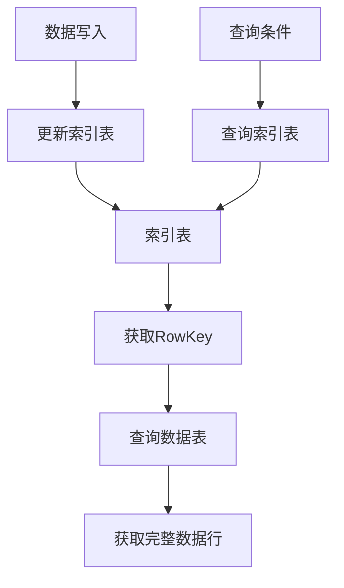

# HBase二级索引原理与代码实例讲解

## 1.背景介绍

在大数据时代,数据量的急剧增长对传统的数据库系统带来了巨大的挑战。HBase作为一种分布式、可伸缩的NoSQL数据库,被广泛应用于需要存储和处理海量数据的场景。然而,HBase原生只支持通过行键(RowKey)进行数据查询,这在某些情况下可能会导致查询效率低下。为了解决这个问题,引入二级索引(Secondary Index)的概念就显得尤为重要。

二级索引为HBase提供了基于列值进行数据查询的能力,极大地提高了查询效率。它通过在HBase表的某些列上建立索引,使得我们可以根据这些列的值快速查找到相应的行键,从而加速数据查询。二级索引在许多应用场景中都有着广泛的应用,如电商网站的商品搜索、社交网络中的好友查找等。

本文将深入探讨HBase二级索引的原理、实现方式和使用场景,并提供详细的代码示例,帮助读者更好地理解和运用这一重要技术。

## 2.核心概念与联系

### 2.1 HBase数据模型

在讨论二级索引之前,我们先来简单回顾一下HBase的数据模型。HBase中的数据存储在表(Table)中,每个表由多个行(Row)组成。每一行又由一个行键(RowKey)和多个列族(Column Family)构成。列族中包含了多个列(Column),每个列由列名(Column Name)和值(Value)组成,并带有时间戳(Timestamp)。

HBase的设计理念是面向列的存储,这意味着数据是按列族方式存储的,而不是按行方式存储。这种存储方式使得HBase在处理海量数据时具有很高的写入性能。

### 2.2 二级索引概念

二级索引是在HBase的数据表之外,额外维护的一种索引数据结构。它将表中的某些列值作为索引键(Index Key),与对应的行键(RowKey)建立映射关系,存储在另一张索引表(Index Table)中。

当我们需要根据某个列值进行查询时,可以先在索引表中查找到对应的行键,再根据行键在数据表中获取完整的数据行。这种两次查询的方式,虽然比全表扫描要高效得多,但仍然存在一定的性能开销。

### 2.3 二级索引的类型

根据索引表的存储方式,二级索引可以分为以下几种类型:

1. **数据覆盖索引(Data Overlaying Index)**:索引表中存储了数据表的全部数据,因此查询时只需要访问索引表即可,无需访问数据表。
2. **数据合并索引(Data Merging Index)**:索引表中只存储索引键和行键的映射关系,查询时需要先在索引表查找行键,再到数据表中获取完整数据。
3. **部分数据索引(Partial Data Index)**:索引表中存储了部分列的数据,查询时可以先在索引表获取部分数据,再到数据表补充剩余数据。

不同类型的索引在查询性能和存储开销之间存在权衡,应根据具体场景进行选择。

## 3.核心算法原理具体操作步骤

HBase二级索引的实现原理可以概括为以下几个步骤:

1. **创建索引表**:根据需要建立索引的列,在HBase中创建一张新的索引表。
2. **写入索引数据**:当向数据表插入或更新数据时,同时向索引表中插入或更新对应的索引数据。
3. **查询索引**:当需要根据某个列值进行查询时,先在索引表中查找对应的行键。
4. **查询数据表**:根据从索引表中获取的行键,在数据表中查询并获取完整的数据行。

这个过程可以用下面的流程图来描述:



### 3.1 创建索引表

创建索引表的过程与创建普通的HBase表类似,只是需要根据索引的类型决定存储哪些数据。以数据合并索引为例,索引表只需存储索引键和行键的映射关系即可。

我们可以使用HBase的Java API或者HBase Shell来创建索引表,下面是一个使用Java API创建索引表的示例代码:

```java
// 创建索引表描述符
HTableDescriptor indexTableDescriptor = new HTableDescriptor(TableName.valueOf("index_table"));

// 创建列族描述符
HColumnDescriptor columnDescriptor = new HColumnDescriptor("index_family");

// 将列族添加到表描述符
indexTableDescriptor.addFamily(columnDescriptor);

// 创建索引表
admin.createTable(indexTableDescriptor);
```

### 3.2 写入索引数据

当向数据表插入或更新数据时,我们需要同时向索引表中插入或更新对应的索引数据。这一步骤通常是在应用程序层完成的,可以通过编写自定义的Coprocessor或者Observer来实现。

下面是一个使用Coprocessor实现数据合并索引的示例代码:

```java
public class IndexingCoprocessor extends BaseRegionObserver {

    @Override
    public void postPut(ObservedRegionContext observed, Put put, WALEdit edit, Durability durability) throws IOException {
        // 获取数据表和索引表的相关信息
        HRegionInfo regionInfo = observed.getEnvironment().getRegionInfo();
        HTableDescriptor tableDescriptor = observed.getEnvironment().getRegionInfo().getTableDescriptor();
        byte[] indexedFamily = Bytes.toBytes("indexed_family");
        byte[] indexedQualifier = Bytes.toBytes("indexed_qualifier");

        // 从Put操作中获取行键和索引键
        byte[] rowKey = put.getRow();
        byte[] indexKey = put.has(indexedFamily, indexedQualifier) ?
                put.getValue(indexedFamily, indexedQualifier) : null;

        if (indexKey != null) {
            // 构建索引表的Put操作
            Put indexPut = new Put(Bytes.toBytes(Bytes.toString(indexKey) + "_" + Bytes.toString(rowKey)));
            indexPut.addColumn(Bytes.toBytes("index_family"), Bytes.toBytes("row_key"), rowKey);

            // 写入索引数据
            HRegion indexRegion = observed.getEnvironment().getRegion(tableDescriptor.getTableName(), IndexUtils.getIndexTableName(regionInfo));
            indexRegion.put(indexPut);
        }
    }
}
```

这段代码实现了一个简单的数据合并索引,它在每次向数据表插入或更新数据时,都会将索引键和行键的映射关系插入到索引表中。

### 3.3 查询索引

当需要根据某个列值进行查询时,我们首先需要在索引表中查找对应的行键。查询索引表的方式与查询普通HBase表类似,可以使用HBase的Java API或者HBase Shell。

下面是一个使用Java API查询索引表的示例代码:

```java
// 创建Get请求
Get get = new Get(Bytes.toBytes("index_key_value"));

// 查询索引表
Result result = indexTable.get(get);

// 获取行键
byte[] rowKey = result.getValue(Bytes.toBytes("index_family"), Bytes.toBytes("row_key"));
```

在这个示例中,我们首先创建一个`Get`请求,其中的行键是我们要查询的索引键值。然后,我们使用`indexTable.get(get)`方法查询索引表,并从结果中获取对应的行键。

### 3.4 查询数据表

获取到行键之后,我们就可以在数据表中查询并获取完整的数据行了。这一步骤与普通的HBase查询无异,可以使用HBase的Java API或者HBase Shell。

下面是一个使用Java API查询数据表的示例代码:

```java
// 创建Get请求
Get get = new Get(rowKey);

// 查询数据表
Result result = dataTable.get(get);

// 处理查询结果
// ...
```

在这个示例中,我们首先创建一个`Get`请求,其中的行键是我们从索引表中获取的行键。然后,我们使用`dataTable.get(get)`方法查询数据表,并获取完整的数据行。

## 4.数学模型和公式详细讲解举例说明

在讨论二级索引的性能时,我们通常会涉及到一些数学模型和公式。下面我们将详细介绍其中的一些重要概念。

### 4.1 布隆过滤器(Bloom Filter)

布隆过滤器是一种空间高效的概率数据结构,常被用于快速判断一个元素是否存在于集合中。它的原理是使用多个哈希函数将元素映射到一个位数组中,如果所有哈希函数映射的位置都为1,则认为该元素存在于集合中。

布隆过滤器的优点是空间占用小、查询效率高,缺点是存在一定的误报率。在HBase中,布隆过滤器常被用于优化RowKey的查询,避免不必要的磁盘IO操作。

布隆过滤器的误报率公式如下:

$$
P = (1 - e^{-\frac{kn}{m}})^k
$$

其中:

- $P$ 表示误报率
- $k$ 表示哈希函数的个数
- $n$ 表示插入的元素个数
- $m$ 表示位数组的长度

通过调整$k$和$m$的值,我们可以在空间占用和误报率之间进行权衡。

### 4.2 局部性原理(Locality Principle)

局部性原理是计算机系统设计中的一个重要概念,它描述了程序在执行过程中对数据和指令的访问模式。局部性原理包括时间局部性和空间局部性两个方面。

**时间局部性**指的是,如果某个数据被访问过一次,在不久的将来它很可能会被再次访问。**空间局部性**指的是,如果某个数据被访问过,与它相邻的数据也很可能会被访问。

在HBase中,局部性原理体现在数据的存储和查询方式上。HBase将相关的数据存储在相邻的Region中,利用了空间局部性原理,提高了数据查询的效率。同时,HBase还使用了内存缓存机制,利用了时间局部性原理,进一步优化了查询性能。

### 4.3 数据分布模型

在设计二级索引时,我们需要考虑数据在索引表和数据表中的分布情况。不同的数据分布模型会对查询性能产生不同的影响。

假设我们有一个包含$N$条记录的数据表,其中有$M$种不同的索引键值。我们将这些记录均匀分布到$R$个Region中,每个Region包含$\frac{N}{R}$条记录。

如果索引键值在数据表中也是均匀分布的,那么每个Region中将包含$\frac{M}{R}$种不同的索引键值。在查询时,我们需要访问$\frac{N}{M}$个Region才能获取完整的查询结果。

但是,如果索引键值在数据表中是高度倾斜分布的,那么情况就会变得复杂。假设有$\alpha$个热门索引键值占据了$\beta$部分的记录,剩余的$(1-\beta)$部分记录分布在其他$(M-\alpha)$个索引键值上。在这种情况下,查询热门索引键值时,我们只需要访问$\frac{\beta N}{R}$个Region;而查询非热门索引键值时,我们需要访问$\frac{(1-\beta)N}{(M-\alpha)R}$个Region。

因此,在设计二级索引时,我们需要充分考虑数据的分布情况,并采取适当的策略(如数据分区、缓存等)来优化查询性能。

## 5.项目实践:代码实例和详细解释说明

为了更好地理解HBase二级索引的实现,我们将提供一个完整的代码示例,并对其中的关键步骤进行详细解释。

在这个示例中,我们将创建一个用于存储电子商务订单数据的HBase表`order_table`,并为其建立一个基于`customer_id`列的二级索引。我们将使用数据合并索引的方式,即在索引表中只存储索引键(`customer_id`)和行键(`order_id`)的映射关系。

### 5.1 创建数据表和索引表

首先,我们需要创建数据表`order_table`和索引表`customer_index_table`。下面是创建这两张表的代码:

```java
// 创建数据表
HTableDescriptor orderTableDescriptor = new HTableDescriptor(TableName.valueOf("order_table"));
HColumnDescriptor orderColumn