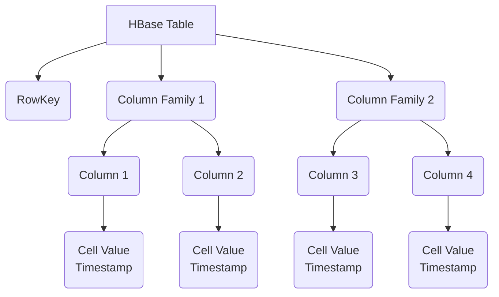
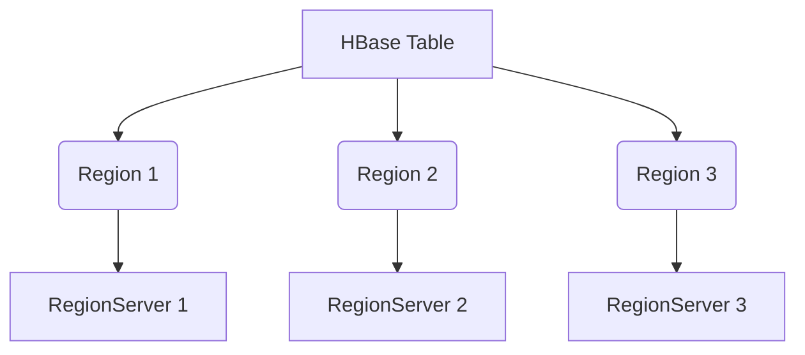
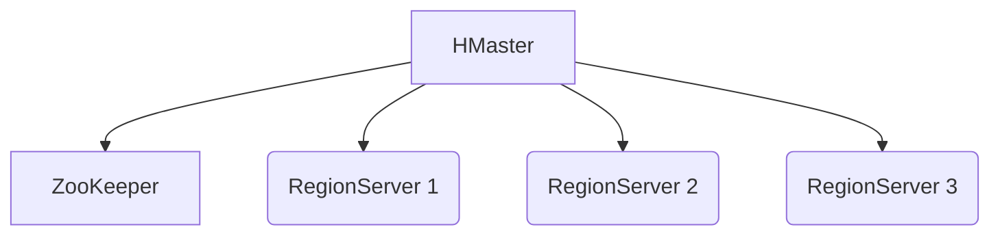
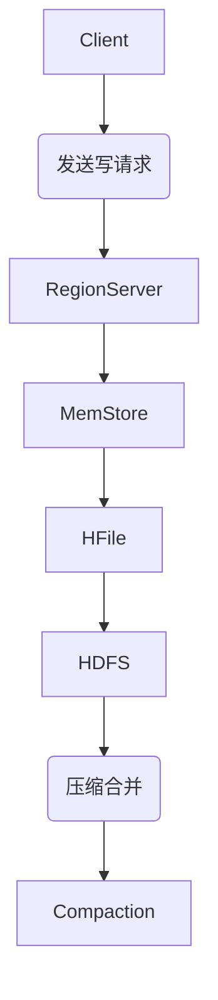
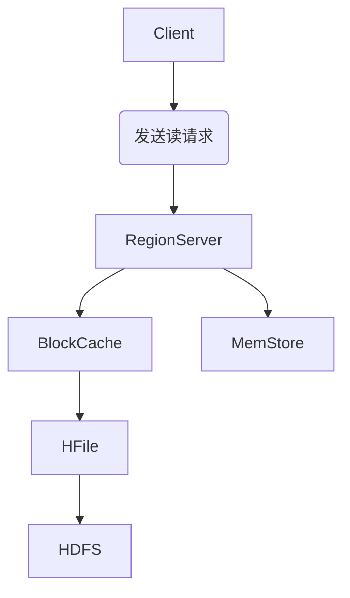

# HBase原理与代码实例讲解

## 1. 背景介绍

在当今大数据时代，数据量的爆炸式增长对传统的关系型数据库系统带来了巨大的挑战。为了应对这一挑战,一种全新的数据存储解决方案应运而生——HBase。HBase是一个分布式、可伸缩、面向列族的开源NoSQL数据库,它建立在Hadoop文件系统(HDFS)之上,能够对海量数据提供随机、实时的读写访问。

HBase的设计灵感来源于Google的BigTable论文,旨在为Hadoop提供高可靠性、高性能、面向列的数据存储解决方案。它具有线性和模块化的伸缩能力,可以通过简单地添加更多的节点来处理数据量的增长。HBase在许多行业中得到了广泛应用,如Facebook的消息系统、Twitter的Feed系统、雅虎的数据分析系统等。

## 2. 核心概念与联系

### 2.1 数据模型

HBase采用了BigTable的数据模型,将数据存储在一个三维的稀疏、持久、分布式的多维度映射表中。这三个维度分别是行键(Row Key)、列族(Column Family)和时间戳(Timestamp)。

- **行键(Row Key)**:行键是用来检索记录的主键,访问HBase table中的行,只需要对其进行了解即可。
- **列族(Column Family)**: 列族是在表结构设计阶段就需要确定的模式定义,是列的逻辑分组。列族中的列是无模式的,可以在插入新的记录时动态创建。
- **列(Column)**: 列由列族和列限定符组成,例如`info:name`、`info:age`。
- **时间戳(Timestamp)**: 每个单元格都会自动赋予一个时间戳,用于表示数据的版本。



### 2.2 Region

为了实现数据的自动分区和负载均衡,HBase会将表按照RowKey的范围划分为多个Region。每个Region都由一个RegionServer负责处理读写请求,并将数据持久化存储在HDFS上。当一个Region的数据达到一定阈值时,就会触发拆分操作,产生两个新的子Region。



### 2.3 HMaster和ZooKeeper

HMaster是HBase集群的主节点,负责监控集群状态、协调RegionServer的工作、处理故障转移等任务。ZooKeeper则是HBase的核心组件之一,用于存储集群元数据、维护服务状态、处理服务器故障转移等。



## 3. 核心算法原理具体操作步骤

### 3.1 写数据流程

1. **Client向RegionServer发送写请求**

   客户端首先通过RowKey定位到目标Region所在的RegionServer,并将写请求发送给它。

2. **MemStore写内存**

   RegionServer会先将数据写入内存中的MemStore(Write Ahead Log),以提高写性能。

3. **MemStore刷写到HFile**

   当MemStore的大小达到一定阈值时,就会将其中的数据刷写到HFile(Hadoop序列化文件)中,并存储在HDFS上。

4. **执行合并压缩**

   定期执行压缩合并操作,将多个HFile合并成一个更大的HFile,以减少文件数量,释放空间。



### 3.2 读数据流程

1. **Client向RegionServer发送读请求**

   客户端通过RowKey定位到目标Region所在的RegionServer,并发送读请求。

2. **BlockCache缓存读取**

   RegionServer首先会检查BlockCache(读缓存),如果命中则直接从内存返回数据。

3. **HFile磁盘读取**

   如果BlockCache未命中,则从对应的HFile中读取数据,并将读取的数据块缓存到BlockCache中。

4. **MemStore内存读取**

   如果HFile中也未查到数据,则从MemStore内存中读取最新的数据。



## 4. 数学模型和公式详细讲解举例说明

在HBase中,数据是按照RowKey的字典序排列存储的。为了提高查询效率,HBase采用了多级索引的设计。

### 4.1 Bloom Filter

Bloom Filter是一种高效的概率数据结构,用于快速判断一个元素是否存在于集合中。它通过将元素映射到一个位数组中,可以有效地减少磁盘I/O操作,提高查询性能。

Bloom Filter的关键操作是插入和查询,涉及到哈希函数的使用。假设我们有一个大小为m的位数组,以及k个哈希函数。

**插入操作**:

对于每个元素x,计算k个哈希值$h_1(x), h_2(x), ..., h_k(x)$,并将对应的位数组位置设置为1。

$$
\text{bits}[h_i(x)] = 1, \quad 1 \leq i \leq k
$$

**查询操作**:

对于查询元素y,计算k个哈希值$h_1(y), h_2(y), ..., h_k(y)$,检查对应的位数组位置是否都为1。如果任何一个位置为0,则可以确定y不在集合中;如果全部为1,则有很大概率y在集合中(存在一定的假阳性率)。

$$
\text{if } \exists i, 1 \leq i \leq k, \text{ s.t. } \text{bits}[h_i(y)] = 0, \text{ then } y \notin S
$$

Bloom Filter的空间效率很高,但存在一定的假阳性率。在HBase中,Bloom Filter被用于快速判断一个RowKey是否存在于某个Region中,从而避免不必要的磁盘I/O操作。

### 4.2 RowKey设计

RowKey在HBase中扮演着至关重要的角色,它决定了数据在Region中的分布,以及查询的效率。一个好的RowKey设计应该遵循以下原则:

1. **行键分布**

   RowKey应该设计得足够随机,避免出现热点问题。可以考虑在RowKey前面添加随机前缀或者散列值。

2. **查询效率**

   如果有范围查询的需求,RowKey应该按照查询条件的顺序进行设计,以提高查询效率。

3. **单调递增**

   RowKey应该具有一定的单调递增性,以避免单个Region过热。可以考虑在RowKey中加入时间戳或者其他单调递增的元素。

假设我们有一个用户信息表,其中包含用户ID、姓名、年龄等字段。我们可以将RowKey设计为:

$$
\text{RowKey} = \text{Hash}(\text{userId}) + \text{reversedTimestamp} + \text{userId}
$$

其中,`Hash(userId)`是用户ID的哈希值,用于打散热点;`reversedTimestamp`是反转的时间戳,用于实现单调递增;`userId`则保证了相同用户ID的数据存储在相邻的位置,方便范围查询。

## 5. 项目实践:代码实例和详细解释说明

下面是一个使用Java编写的HBase客户端程序示例,演示了如何创建表、插入数据、查询数据和扫描表的操作。

### 5.1 创建表

```java
import org.apache.hadoop.conf.Configuration;
import org.apache.hadoop.hbase.HBaseConfiguration;
import org.apache.hadoop.hbase.HColumnDescriptor;
import org.apache.hadoop.hbase.HTableDescriptor;
import org.apache.hadoop.hbase.TableName;
import org.apache.hadoop.hbase.client.Admin;
import org.apache.hadoop.hbase.client.Connection;
import org.apache.hadoop.hbase.client.ConnectionFactory;

public class HBaseExample {
    public static void createTable(String tableName, String... columnFamilies) throws Exception {
        Configuration conf = HBaseConfiguration.create();
        Connection connection = ConnectionFactory.createConnection(conf);
        Admin admin = connection.getAdmin();

        HTableDescriptor tableDescriptor = new HTableDescriptor(TableName.valueOf(tableName));
        for (String columnFamily : columnFamilies) {
            HColumnDescriptor columnDescriptor = new HColumnDescriptor(columnFamily);
            tableDescriptor.addFamily(columnDescriptor);
        }

        admin.createTable(tableDescriptor);
        admin.close();
        connection.close();
    }

    public static void main(String[] args) throws Exception {
        String tableName = "user_info";
        String[] columnFamilies = {"personal", "contact"};
        createTable(tableName, columnFamilies);
    }
}
```

在上面的代码中,我们首先创建了一个HBase配置对象`conf`和一个连接对象`connection`。然后,我们构建了一个`HTableDescriptor`对象,并为其添加了两个列族`personal`和`contact`。最后,我们调用`admin.createTable()`方法创建了一个名为`user_info`的表。

### 5.2 插入数据

```java
import org.apache.hadoop.conf.Configuration;
import org.apache.hadoop.hbase.HBaseConfiguration;
import org.apache.hadoop.hbase.TableName;
import org.apache.hadoop.hbase.client.Connection;
import org.apache.hadoop.hbase.client.ConnectionFactory;
import org.apache.hadoop.hbase.client.Put;
import org.apache.hadoop.hbase.client.Table;
import org.apache.hadoop.hbase.util.Bytes;

public class HBaseExample {
    public static void insertData(String tableName, String rowKey, String columnFamily, String column, String value) throws Exception {
        Configuration conf = HBaseConfiguration.create();
        Connection connection = ConnectionFactory.createConnection(conf);
        Table table = connection.getTable(TableName.valueOf(tableName));

        Put put = new Put(Bytes.toBytes(rowKey));
        put.addColumn(Bytes.toBytes(columnFamily), Bytes.toBytes(column), Bytes.toBytes(value));

        table.put(put);
        table.close();
        connection.close();
    }

    public static void main(String[] args) throws Exception {
        String tableName = "user_info";
        String rowKey = "user_1";
        String columnFamily = "personal";
        String column = "name";
        String value = "John Doe";
        insertData(tableName, rowKey, columnFamily, column, value);
    }
}
```

在上面的代码中,我们定义了一个`insertData`方法,用于将数据插入到HBase表中。我们首先获取了一个`Table`对象,然后创建了一个`Put`对象,并使用`put.addColumn()`方法添加了一个新的列值。最后,我们调用`table.put()`方法将数据插入到表中。

在`main`方法中,我们插入了一条记录,其中`rowKey`为`user_1`,`columnFamily`为`personal`,`column`为`name`,`value`为`John Doe`。

### 5.3 查询数据

```java
import org.apache.hadoop.conf.Configuration;
import org.apache.hadoop.hbase.HBaseConfiguration;
import org.apache.hadoop.hbase.TableName;
import org.apache.hadoop.hbase.client.Connection;
import org.apache.hadoop.hbase.client.ConnectionFactory;
import org.apache.hadoop.hbase.client.Get;
import org.apache.hadoop.hbase.client.Result;
import org.apache.hadoop.hbase.client.Table;
import org.apache.hadoop.hbase.util.Bytes;

public class HBaseExample {
    public static void getData(String tableName, String rowKey, String columnFamily, String column) throws Exception {
        Configuration conf = HBaseConfiguration.create();
        Connection connection = ConnectionFactory.createConnection(conf);
        Table table = connection.getTable(TableName.valueOf(tableName));

        Get get = new Get(Bytes.toBytes(rowKey));
        get.addColumn(Bytes.toBytes(columnFamily), Bytes.toBytes(column));

        Result result = table.get(get);
        byte[] valueBytes = result.getValue(Bytes.toBytes(columnFamily), Bytes.toBytes(column));
        String value = Bytes.toString(valueBytes);

        System.out.println("Value for rowKey " + rowKey + ", column " + column + ": " + value);

        table.close();
        connection.close();
    }

    public static void main(String[] args