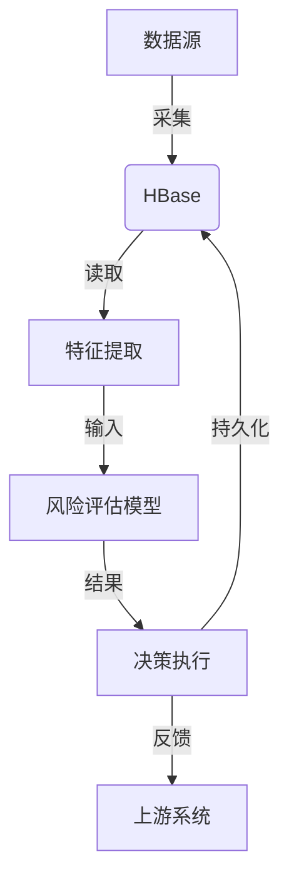

# HBase应用案例:金融风控实时决策系统

## 1.背景介绍

在金融行业中,风险控制(Risk Control)是一个极其重要的环节。传统的风控系统大多采用批处理的方式,将数据定期加载到数据仓库中进行分析。然而,这种方式存在一些明显的缺陷:

1. 延迟性高:批处理作业通常需要较长的时间来完成,导致风控决策无法及时作出。
2. 可扩展性差:随着业务规模的扩大,数据量会快速增长,批处理系统难以满足实时处理的需求。
3. 数据一致性差:由于数据来源多样,不同系统之间的数据同步存在一定延迟,导致决策依据的数据不够准确。

为了解决上述问题,金融机构迫切需要一种实时的风控决策系统,能够基于最新的数据快速作出风控决策。HBase凭借其高并发、高可靠、高可扩展等优势,非常适合构建这种实时风控决策系统。

## 2.核心概念与联系

在介绍HBase实时风控决策系统之前,我们先了解一些核心概念:

1. **风控决策(Risk Control Decision)**: 根据客户信息、交易信息等数据,判断交易是否存在风险,并采取相应的措施(如拒绝、审核等)。
2. **实时(Real-time)**: 指系统能够在毫秒或秒级的时间内作出响应,满足业务的高时效性要求。
3. **HBase**: 一种分布式、面向列的开源NoSQL数据库,基于Google的Bigtable论文,由Apache软件基金会开发和维护。

这些概念之间的联系如下:

- 风控决策需要基于大量的客户信息、交易信息等数据,这些数据通常存储在数据库中。
- 为了实现实时风控,需要一种高性能、高可靠的数据库,能够快速读写大量数据。
- HBase作为一种分布式、高性能的NoSQL数据库,非常适合存储和处理这些结构化的风控数据。

## 3.核心算法原理具体操作步骤

实时风控决策系统的核心算法可以概括为以下几个步骤:

1. **数据采集**:从各个数据源(如交易系统、客户信息系统等)采集相关数据,并进行数据清洗和转换,将数据存储到HBase中。

2. **特征提取**:从HBase中读取相关数据,提取风控决策所需的特征,如客户信息、交易金额、交易时间等。

3. **风险评估**:将提取的特征输入风控模型(如机器学习模型、规则引擎等),对交易的风险进行评估和打分。

4. **决策执行**:根据风险评估的结果,执行相应的决策操作,如拒绝交易、人工审核等。

5. **决策反馈**:将决策结果反馈给上游系统(如交易系统),同时将决策数据持久化存储到HBase中,用于后续的模型训练和优化。

以上步骤可以通过流式计算框架(如Spark Streaming、Flink等)实现,具体操作步骤如下所示:



其中,HBase承担了数据存储和快速读写的核心任务,为实时风控决策提供了高效、可靠的数据支撑。

## 4.数学模型和公式详细讲解举例说明

在风险评估环节,通常会采用机器学习模型对交易风险进行评估和打分。以逻辑回归模型为例,其数学原理如下:

假设我们有一个二分类问题,需要根据特征向量$\boldsymbol{x}$预测类别$y$的概率$P(y=1|\boldsymbol{x})$。逻辑回归模型的假设函数为:

$$h_\theta(\boldsymbol{x}) = P(y=1|\boldsymbol{x}) = \frac{1}{1+e^{-\theta^T\boldsymbol{x}}}$$

其中,$\theta$是模型参数向量。

为了求解$\theta$,我们需要定义代价函数(Cost Function),常用的是对数似然函数:

$$J(\theta) = -\frac{1}{m}\sum_{i=1}^m[y^{(i)}\log h_\theta(x^{(i)}) + (1-y^{(i)})\log(1-h_\theta(x^{(i)}))]$$

其中,$m$是训练样本数量。

我们可以使用梯度下降法等优化算法,求解能够最小化代价函数的$\theta$值。得到$\theta$后,我们就可以使用假设函数$h_\theta(\boldsymbol{x})$对新的样本$\boldsymbol{x}$进行风险评估。

例如,假设我们有以下训练数据:

| 特征1(年龄) | 特征2(收入) | 特征3(信用分数) | 类别(是否拒绝贷款) |
| ----------- | ------------ | ---------------- | ------------------ |
| 25          | 50000        | 680              | 0                  |
| 40          | 70000        | 720              | 0                  |
| 35          | 40000        | 550              | 1                  |
| ...         | ...          | ...              | ...                |

我们可以使用上述逻辑回归模型,基于客户的年龄、收入和信用分数等特征,预测其贷款申请是否会被拒绝。模型训练完成后,我们将其部署到实时风控决策系统中,对每一笔交易进行风险评估。

## 5.项目实践:代码实例和详细解释说明

以下是一个使用Python和HBase实现实时风控决策系统的简单示例:

### 5.1 连接HBase

```python
import happybase

# 连接HBase
connection = happybase.Connection('hostname')
table = connection.table('risk_data')
```

### 5.2 存储风控数据

```python
# 存储客户信息
row_key = 'customer_1'
data = {
    'personal:name': 'John Doe',
    'personal:age': 35,
    'financial:income': 60000,
    'financial:credit_score': 720
}
table.put(row_key, data)

# 存储交易信息
row_key = 'transaction_1'
data = {
    'transaction:amount': 5000,
    'transaction:time': '2023-05-01 10:30:00',
    'transaction:type': 'online_purchase'
}
table.put(row_key, data)
```

### 5.3 实时风控决策

```python
# 读取客户信息和交易信息
customer_data = table.row('customer_1')
transaction_data = table.row('transaction_1')

# 特征提取
features = [
    customer_data['personal:age'],
    customer_data['financial:income'],
    customer_data['financial:credit_score'],
    transaction_data['transaction:amount']
]

# 风险评估(假设使用简单的规则引擎)
if customer_data['financial:credit_score'] < 600 or transaction_data['transaction:amount'] > 10000:
    risk_score = 'high'
else:
    risk_score = 'low'

# 决策执行
if risk_score == 'high':
    print('Transaction rejected due to high risk.')
else:
    print('Transaction approved.')

# 持久化决策结果
row_key = 'decision_1'
data = {
    'decision:risk_score': risk_score,
    'decision:time': '2023-05-01 10:30:15'
}
table.put(row_key, data)
```

在上述示例中,我们首先连接到HBase,然后将客户信息和交易信息存储到HBase表中。接下来,我们读取相关数据,提取特征,并使用简单的规则引擎对风险进行评估。根据评估结果,我们执行相应的决策操作(如拒绝或批准交易)。最后,我们将决策结果持久化存储到HBase中。

需要注意的是,这只是一个简单的示例,实际的风控决策系统会更加复杂,可能需要引入机器学习模型、流式计算框架等。但基本的思路和流程是类似的。

## 6.实际应用场景

实时风控决策系统在金融行业有着广泛的应用场景,包括但不限于:

1. **贷款审批**: 对贷款申请进行实时风险评估,快速作出审批决策。
2. **信用卡交易监控**: 实时监控信用卡交易,识别潜在的欺诈行为。
3. **反洗钱**: 实时分析大额交易,识别可疑的洗钱活动。
4. **保险核保**: 对投保人的风险进行实时评估,决定是否承保。
5. **交易监控**: 监控证券交易,识别内幕交易、操纵市场等违规行为。

除了金融行业,实时风控决策系统也可以应用于其他领域,如电商防刷、网络安全等。只要存在实时处理大量数据、快速作出决策的需求,都可以考虑采用类似的架构。

## 7.工具和资源推荐

在构建实时风控决策系统时,可以使用以下工具和资源:

1. **HBase**: 作为核心的数据存储组件,提供高性能、高可靠的数据支撑。
2. **Spark Streaming/Flink**: 流式计算框架,用于实现实时数据处理和风险评估。
3. **机器学习框架(如TensorFlow、PyTorch、XGBoost等)**: 用于训练和部署风险评估模型。
4. **规则引擎(如Drools、Easy Rules等)**: 用于实现基于规则的风险评估。
5. **Apache Kafka**: 用于实现系统之间的数据流传输和解耦。
6. **监控和可视化工具(如Grafana、Kibana等)**: 用于监控系统运行状态和可视化风控数据。

此外,还可以参考一些开源项目和社区资源,如Apache HBase官方文档、Stack Overflow等。

## 8.总结:未来发展趋势与挑战

实时风控决策系统是金融科技领域的一个重要发展方向。随着金融业务的不断创新,实时风控决策系统也面临着新的挑战和发展趋势:

1. **人工智能技术的深入应用**: 未来的风控决策系统将更多地采用人工智能技术,如深度学习、自然语言处理等,提高风险识别和决策的准确性。
2. **数据隐私保护**: 如何在保护客户隐私的同时,有效利用数据进行风控决策,将是一个重要的课题。
3. **多源异构数据融合**: 随着数据来源的增加,如何有效融合多源异构数据,提高风控决策的全面性,也是一个挑战。
4. **可解释性**: 人工智能模型的"黑箱"特性可能会影响风控决策的可解释性,需要探索新的可解释AI技术。
5. **实时性和可扩展性**: 随着业务规模的扩大,实时风控决策系统需要进一步提高实时性和可扩展性,以满足不断增长的需求。

总的来说,实时风控决策系统将在未来的金融科技发展中扮演越来越重要的角色,吸引更多的研究和创新。

## 9.附录:常见问题与解答

1. **为什么选择HBase作为风控数据存储?**

HBase作为一种分布式、面向列的NoSQL数据库,具有高并发、高可靠、高可扩展等优势,非常适合存储和处理结构化的风控数据。相比传统的关系型数据库,HBase在处理大规模数据时表现更加出色。

2. **如何保证风控决策的实时性?**

实现实时风控决策的关键在于快速读写数据和高效的计算能力。我们可以采用流式计算框架(如Spark Streaming、Flink等)实时处理数据,并将计算结果快速写入HBase。同时,HBase本身也提供了高并发的读写能力,能够满足实时决策的需求。

3. **如何提高风控模型的准确性?**

提高风控模型准确性的方法包括:
- 使用更多的特征数据,如地理位置、设备信息等,丰富模型的输入。
- 采用更加先进的机器学习算法,如深度学习、集成学习等。
- 持续优化模型,利用新的决策反馈数据不断训练和调整模型。

4. **如何处理数据隐私和安全问题?**

数据隐私和安全是构建风控系统时需要重点考虑的问题。我们可以采取以下措施:
- 加密存储和传输敏感数据,如客