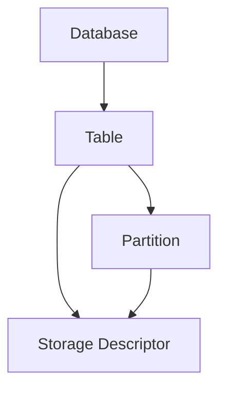

# HCatalogWebUI：图形化界面操作指南

## 1.背景介绍

### 1.1 HCatalog概述
HCatalog是Apache Hive项目的一个子项目,旨在为Hadoop生态系统中的各种数据处理工具提供一个统一的元数据管理和数据访问接口。它允许用户以表的形式定义数据结构,并使用这些表在不同的数据处理框架之间共享数据,而无需担心底层数据的存储格式和位置等细节。

### 1.2 WebUI的必要性
HCatalog虽然功能强大,但是其命令行操作方式对于非技术背景的用户来说存在一定的使用门槛。为了让更多的用户能够便捷地使用HCatalog的功能,开发一个直观易用的Web图形化界面就显得尤为重要。HCatalogWebUI正是在这样的背景下应运而生。

### 1.3 HCatalogWebUI的优势
HCatalogWebUI为用户提供了一个可视化的操作平台,用户无需掌握复杂的命令和语法,通过简单的鼠标点击和拖拽等操作就能完成数据表的创建、查询、修改等任务。同时,WebUI还提供了更加丰富的交互功能,如数据预览、SQL编辑器等,大大提升了用户的操作体验。

## 2.核心概念与联系

### 2.1 表(Table)
HCatalog中的表是一个逻辑概念,它定义了数据的结构(Schema),包括字段名称、字段类型等。一个表可以对应不同的底层数据格式,如TextFile、SequenceFile、RCFile等。

### 2.2 分区(Partition) 
分区是HCatalog组织数据的一种方式。通过为表定义分区键,可以将表中的数据按照某些属性值进行划分,从而加速数据的查询。比如,对于一个日志表,可以按照日期对数据进行分区。

### 2.3 存储描述符(Storage Descriptor)
存储描述符定义了表或分区的数据存储信息,包括数据格式(InputFormat/OutputFormat)、数据所在位置(Location)、SerDe信息等。

### 2.4 关系图
下面是HCatalog中几个核心概念之间的关系图:



一个Database包含多个Table,每个Table可以有多个Partition,每个Table和Partition都有对应的Storage Descriptor来定义其存储信息。

## 3.核心操作步骤

HCatalogWebUI提供了一系列常用的数据定义和操作功能,下面以创建表为例,介绍其核心步骤:

### 3.1 选择Database
在WebUI首页选择需要操作的数据库,如default。

### 3.2 新建表
点击"新建表"按钮,进入表创建页面。

### 3.3 填写表基本信息
填写表的名称、字段定义等基本信息。字段定义包括字段名和字段类型。

### 3.4 定义分区键(可选)
如果需要对表进行分区,可以在"分区键"中添加分区字段。常见的分区字段如日期等。

### 3.5 定义存储信息
选择表的存储格式(如TextFile),并指定数据文件所在的HDFS路径。如果使用Hive兼容格式,还需要指定SerDe信息。

### 3.6 提交创建
点击"创建"按钮,提交表的创建请求。WebUI会将建表语句提交给HCatalog执行。

### 3.7 查看结果
如果表创建成功,可以在表列表页面看到新建的表。可以通过"查看表结构"、"浏览数据"等操作进一步了解表的信息。

## 4.数学模型和公式详细讲解

### 4.1 数据压缩率计算
在使用HCatalog存储数据时,通常会对数据进行压缩,以节省存储空间。压缩率可以用下面的公式来计算:

$$ 压缩率 = 1 - \frac{压缩后数据大小}{原始数据大小} $$

例如,如果原始数据大小为100MB,压缩后的数据大小为20MB,则压缩率为:

$$ 压缩率 = 1 - \frac{20MB}{100MB} = 80\% $$

### 4.2 数据块大小设置
在HDFS中,数据是按照块(Block)的方式进行存储的。块的大小设置需要权衡数据的可并行处理能力和元数据开销。可以用下面的公式来估算最佳的块大小:

$$ 最佳块大小 = min(\frac{HDFS总容量}{DataNode数量 * 100}, 数据总大小) $$

其中,HDFS总容量和DataNode数量可以从Hadoop集群的配置信息中获取。数据总大小可以通过统计所有数据文件的大小得到。

例如,假设HDFS总容量为10PB,集群中有100个DataNode,数据总大小为1TB。则最佳块大小为:

$$ 最佳块大小 = min(\frac{10PB}{100 * 100}, 1TB) = 1GB $$

## 5.项目实践：代码实例和详细解释

下面是使用HCatalog Java API创建表的代码示例:

```java
// 创建HCatalog客户端
HCatClient client = HCatClient.create(new Configuration());

// 定义表结构
HCatCreateTableDesc tableDesc = HCatCreateTableDesc.create("mytable")
    .cols(new HCatFieldSchema("id", Type.INT, "ID"),
          new HCatFieldSchema("name", Type.STRING, "Name"))
    .partCols(new HCatFieldSchema("date", Type.STRING, "Date"))
    .fileFormat("org.apache.hadoop.mapred.TextInputFormat")
    .build();

// 创建表
client.createTable(tableDesc);
```

代码解释:

1. 首先,通过`HCatClient.create()`方法创建一个HCatClient对象,用于与HCatalog服务交互。
2. 接着,使用`HCatCreateTableDesc.create()`方法创建一个表描述符对象,并指定表名为"mytable"。
3. 通过`cols()`方法定义表的字段,包括字段名、字段类型和注释。这里定义了两个字段:"id"和"name"。
4. 通过`partCols()`方法定义表的分区键,这里使用"date"作为分区键。
5. 通过`fileFormat()`方法指定表的存储格式,这里使用TextInputFormat,表示数据是文本格式。
6. 调用`build()`方法生成最终的表描述符对象。
7. 最后,调用`client.createTable()`方法,将表描述符对象传递给HCatalog服务,创建表。

通过上面的代码,就可以在HCatalog中创建一个名为"mytable"的表,其中有"id"、"name"两个字段,并按照"date"进行分区,数据存储格式为文本格式。

## 6.实际应用场景

HCatalogWebUI在实际环境中有广泛的应用,下面是一些常见的使用场景:

### 6.1 数据仓库管理
在构建企业级数据仓库时,通常需要将来自不同来源的数据统一存储和管理。HCatalog提供了一个统一的元数据层,可以将Hive、Pig、MapReduce等多种计算框架的数据抽象成表的形式,方便数据的共享和交换。HCatalogWebUI则进一步简化了表管理的操作,使得非技术人员也能轻松完成数据的定义和查询。

### 6.2 数据分析平台
在数据分析平台中,往往需要将多种数据处理工具和算法集成到一起,形成一个完整的分析流程。HCatalog可以作为这些工具之间的数据交换枢纽,不同的工具可以通过HCatalog访问和处理相同的数据集。HCatalogWebUI提供了一个可视化的数据访问界面,分析人员可以直观地浏览数据、编写SQL语句,提高分析效率。

### 6.3 数据服务层
在大数据架构中,通常需要一个独立的数据服务层,负责对外提供数据访问和查询的API接口。HCatalog可以作为这个数据服务层的后端存储,为上层应用提供统一的数据视图。HCatalogWebUI可以作为数据服务层的管理控制台,运维人员可以通过WebUI实时监控数据表的状态,进行数据表的创建、修改、删除等操作。

## 7.工具和资源推荐

### 7.1 HCatalog官方文档
HCatalog的官方文档是学习和使用HCatalog的权威资料,其中详细介绍了HCatalog的架构、原理、安装配置、使用方法等。

官方文档地址:https://cwiki.apache.org/confluence/display/Hive/HCatalog

### 7.2 Ambari
Ambari是一个Hadoop管理平台,提供了可视化的集群部署、管理、监控等功能。在Ambari中可以方便地管理HCatalog服务。

Ambari官网:https://ambari.apache.org/

### 7.3 Hue
Hue是一个开源的Hadoop UI系统,为Hadoop生态系统中的各种组件提供了Web UI支持,包括HCatalog、Hive、Pig等。

Hue官网:https://gethue.com/

### 7.4 Apache Ranger
Apache Ranger是一个Hadoop安全管理框架,可以为Hadoop组件提供集中式的权限管理、访问控制等功能,HCatalog也可以集成Ranger进行安全管控。

Ranger官网:https://ranger.apache.org/

## 8.总结：未来发展趋势与挑战

### 8.1 融合更多计算框架
目前HCatalog主要支持Hive、Pig、MapReduce等计算框架,未来有望进一步扩展对Spark、Flink等新兴计算框架的支持,提供更加全面的数据管理功能。

### 8.2 更智能的数据发现和数据治理
随着数据量的增长,如何从海量数据中发现有价值的数据资产,并对其进行有效管理和治理,成为了HCatalog面临的新挑战。未来HCatalog可以借助人工智能、数据挖掘等技术,实现智能化的数据发现和数据治理。

### 8.3 云原生支持
云计算已经成为大数据平台的主流部署方式,HCatalog需要更好地适配云环境,提供弹性伸缩、多租户、安全隔离等云原生特性,以满足云上用户的需求。

### 8.4 更易用的WebUI
HCatalogWebUI的出现大大简化了HCatalog的使用,但是在易用性上还有进一步提升的空间,比如提供更加智能的SQL编辑器、可视化的数据血缘分析等,让更多的用户能够轻松上手HCatalog。

## 9.附录：常见问题与解答

### 9.1 HCatalog与Hive Metastore的区别是什么?
HCatalog是在Hive Metastore的基础上,提供了更加通用的元数据服务。Hive Metastore主要服务于Hive,而HCatalog可以为Pig、MapReduce等多种计算框架提供元数据支持。

### 9.2 HCatalog是否支持Spark SQL?
目前HCatalog并不直接支持Spark SQL,但是Spark SQL可以通过Hive Metastore访问HCatalog管理的元数据和数据。也就是说,可以在HCatalog中定义表,然后在Spark SQL中操作这些表。

### 9.3 HCatalog支持哪些文件存储格式?
HCatalog支持TextFile、SequenceFile、RCFile、ORC、Parquet、Avro等多种常用的Hadoop文件存储格式。

### 9.4 HCatalogWebUI如何进行权限控制?
HCatalogWebUI可以集成Hadoop生态中常用的权限管理工具,如Apache Ranger、Apache Sentry等。通过这些工具可以对WebUI的登录、数据表的访问等进行细粒度的权限控制。

### 9.5 HCatalog与关系型数据库相比有何优势?
与传统的关系型数据库相比,HCatalog具有更好的扩展性和灵活性。它可以存储结构化、半结构化和非结构化的多种数据,并支持PB级别的海量数据存储。同时,HCatalog与Hadoop生态的紧密集成,使得它可以充分利用Hadoop的并行计算能力,实现高性能的数据处理和分析。

作者：禅与计算机程序设计艺术 / Zen and the Art of Computer Programming