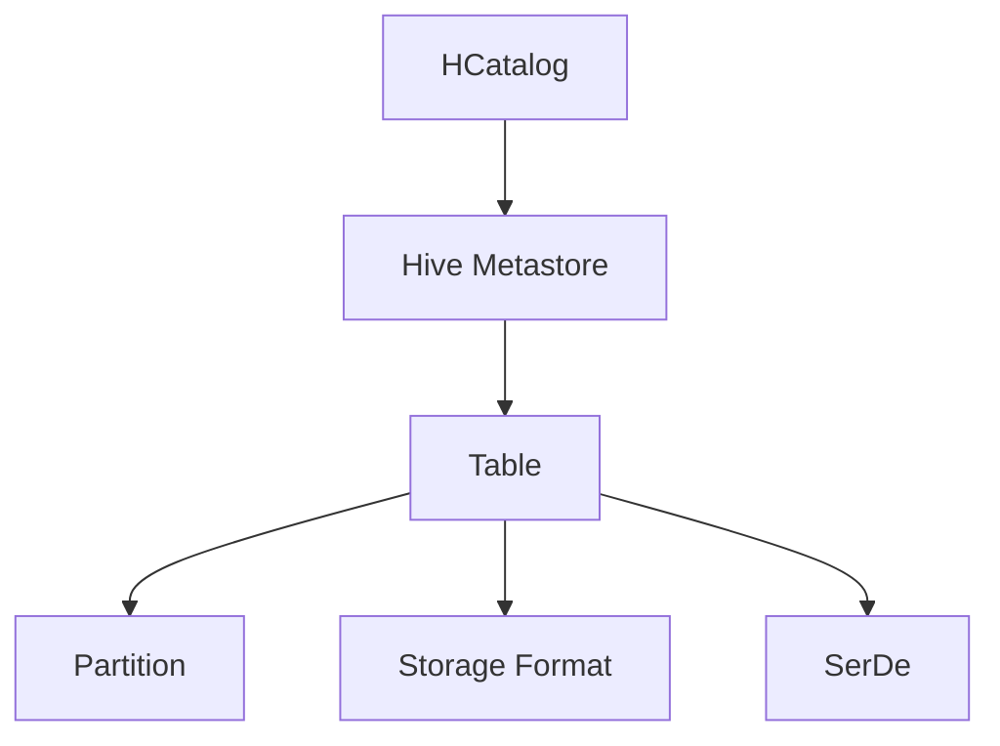

# HCatalog原理与代码实例讲解

## 1. 背景介绍

### 1.1 大数据处理面临的挑战
随着大数据时代的到来,企业需要处理和分析的数据量呈爆炸式增长。传统的数据处理方式已经无法满足海量数据的存储、计算和分析需求。Hadoop作为一个开源的分布式计算平台,为大数据处理提供了高效、可靠的解决方案。然而,Hadoop生态系统中各个组件之间的数据共享和交互仍然存在一些挑战。

### 1.2 元数据管理的重要性
在Hadoop生态系统中,不同的组件和工具使用不同的数据格式和存储方式,导致数据的互操作性和共享变得困难。为了解决这个问题,需要一个统一的元数据管理机制来描述和管理数据的模式(Schema)、位置、格式等元数据信息。HCatalog应运而生,它提供了一个统一的元数据管理和共享平台,使得不同的Hadoop组件可以方便地访问和操作结构化和半结构化数据。

### 1.3 HCatalog的定位与价值
HCatalog是Apache Hadoop生态系统中的一个关键组件,它位于Hadoop的数据处理层和应用层之间,充当了数据和元数据的桥梁。HCatalog的主要价值在于:

1. 提供统一的元数据管理:HCatalog将Hive Metastore作为统一的元数据存储,支持多种数据格式和存储系统。
2. 简化数据访问和共享:通过HCatalog,不同的Hadoop工具和应用可以使用统一的API和SQL接口来访问和操作数据,无需关注底层的数据格式和存储细节。
3. 促进数据互操作性:HCatalog消除了不同Hadoop组件之间的数据隔阂,使得数据可以在Hive、Pig、MapReduce等组件之间无缝共享和交互。
4. 扩展Hadoop的应用场景:借助HCatalog,Hadoop可以更好地支持结构化和半结构化数据的处理,拓展了Hadoop的应用范围。

## 2. 核心概念与联系

### 2.1 表(Table)
在HCatalog中,表是数据的逻辑容器,类似于关系型数据库中的表概念。一个表由行(Row)和列(Column)组成,每一行表示一个数据记录,每一列表示一个字段。表的模式(Schema)定义了表中字段的名称和数据类型。

### 2.2 分区(Partition)  
HCatalog支持表的分区功能,可以将表按照某些字段的值划分为多个分区。分区提供了一种数据组织和优化的机制,可以提高数据的检索和处理效率。例如,可以按照日期字段对表进行分区,每天的数据存储在不同的分区目录中。

### 2.3 存储格式(Storage Format)
HCatalog支持多种数据存储格式,包括:

- TextFile:文本文件格式,每行一个记录。
- SequenceFile:Hadoop的二进制文件格式,以键值对的形式存储数据。
- RCFile:行列存储格式,适合于数据的列式访问和压缩。
- ORC:优化的行列存储格式,提供了高效的压缩和编码机制。
- Avro:基于JSON的行存储格式,支持模式演化。
- Parquet:列式存储格式,适合于分析型工作负载。

### 2.4 SerDe(Serializer and Deserializer)
SerDe是Serializer和Deserializer的缩写,用于将数据在内存中的表示和存储格式之间进行转换。HCatalog使用SerDe来处理不同的数据格式,如JSON、CSV、Thrift等。SerDe定义了如何将数据序列化为存储格式,以及如何将存储格式反序列化为内存中的对象。

### 2.5 Hive Metastore
HCatalog使用Hive Metastore作为统一的元数据存储和管理服务。Hive Metastore是一个独立的服务,负责存储和管理Hive表、分区、SerDe等元数据信息。HCatalog通过与Hive Metastore交互,实现了元数据的集中管理和共享。

下图展示了HCatalog的核心概念以及它们之间的关系:



## 3. 核心算法原理与具体操作步骤

### 3.1 表的创建与删除

#### 3.1.1 创建表
HCatalog支持通过HCatCreateTableDesc类来创建表。创建表的步骤如下:

1. 创建HCatCreateTableDesc对象,指定表名、数据库名等信息。
2. 设置表的分区键(可选)。
3. 设置表的存储格式和SerDe信息。
4. 设置表的模式(Schema),定义字段名和数据类型。
5. 调用HCatClient的createTable方法创建表。

示例代码:

```java
// 创建HCatCreateTableDesc对象
HCatCreateTableDesc tableDesc = new HCatCreateTableDesc("my_table", "my_db");

// 设置分区键
tableDesc.setPartCols(Arrays.asList("date"));

// 设置存储格式和SerDe
tableDesc.setFileFormat("TextFile");
tableDesc.setSerdeInfo(new HCatSerDeInfo("org.apache.hadoop.hive.serde2.lazy.LazySimpleSerDe"));

// 设置表模式
List<HCatFieldSchema> fields = new ArrayList<>();
fields.add(new HCatFieldSchema("id", HCatFieldSchema.Type.INT, "ID"));
fields.add(new HCatFieldSchema("name", HCatFieldSchema.Type.STRING, "Name"));
tableDesc.setCols(fields);

// 创建表
HCatClient client = HCatClient.create();
client.createTable(tableDesc);
```

#### 3.1.2 删除表
删除表可以使用HCatClient的dropTable方法,指定要删除的表名和数据库名。

示例代码:

```java
HCatClient client = HCatClient.create();
client.dropTable("my_db", "my_table");
```

### 3.2 数据的读写操作

#### 3.2.1 写入数据
HCatalog提供了HCatWriter类用于将数据写入表中。写入数据的步骤如下:

1. 创建HCatWriter对象,指定要写入的表名和分区。
2. 创建HCatRecord对象,表示要写入的数据记录。
3. 设置HCatRecord中各个字段的值。
4. 调用HCatWriter的write方法写入数据。
5. 关闭HCatWriter。

示例代码:

```java
// 创建HCatWriter
HCatWriter writer = client.getWriter("my_db", "my_table", "date='2023-06-03'");

// 创建HCatRecord并设置字段值
HCatRecord record = new DefaultHCatRecord(2);
record.set(0, 1);
record.set(1, "John");

// 写入数据
writer.write(record);

// 关闭Writer  
writer.close();
```

#### 3.2.2 读取数据
HCatalog提供了HCatReader类用于从表中读取数据。读取数据的步骤如下:

1. 创建HCatReader对象,指定要读取的表名和分区。
2. 调用HCatReader的next方法读取下一条记录。
3. 获取HCatRecord对象,访问记录中的字段值。
4. 重复步骤2和步骤3,直到读取完所有记录。
5. 关闭HCatReader。

示例代码:

```java
// 创建HCatReader
HCatReader reader = client.getReader("my_db", "my_table", "date='2023-06-03'");

// 读取数据
while (reader.hasNext()) {
    HCatRecord record = reader.next();
    int id = (int) record.get(0);
    String name = (String) record.get(1);
    // 处理读取到的数据
}

// 关闭Reader
reader.close();
```

### 3.3 数据的查询与过滤

#### 3.3.1 使用HCatReader进行查询
HCatReader支持对数据进行查询和过滤。可以通过设置过滤条件来选择符合条件的记录。

示例代码:

```java
// 创建HCatReader,设置过滤条件
String filter = "id > 10";
HCatReader reader = client.getReader("my_db", "my_table", filter);

// 读取符合条件的数据
while (reader.hasNext()) {
    HCatRecord record = reader.next();
    // 处理读取到的数据
}

reader.close();
```

#### 3.3.2 使用Hive SQL进行查询
HCatalog还支持使用Hive SQL对数据进行查询和分析。可以通过HiveQL语句来执行复杂的数据查询和聚合操作。

示例代码:

```java
// 创建HiveQL查询语句
String query = "SELECT * FROM my_table WHERE id > 10";

// 执行Hive查询
List<HCatRecord> records = client.executeQuery(query);

// 处理查询结果
for (HCatRecord record : records) {
    // 访问记录中的字段值
}
```

## 4. 数学模型和公式详细讲解举例说明
HCatalog本身并不涉及复杂的数学模型和公式,它主要是一个元数据管理和数据访问的框架。但是,在使用HCatalog处理数据时,可能会涉及到一些基本的数学运算和统计分析。

### 4.1 数据聚合和统计
在数据分析场景中,经常需要对数据进行聚合和统计运算,如求和、平均值、最大值、最小值等。HCatalog可以与Hive、Pig等工具配合使用,通过SQL或脚本语言来实现数据聚合和统计。

例如,使用Hive SQL计算表中某个字段的总和:

```sql
SELECT SUM(amount) AS total_amount FROM my_table;
```

再如,使用Pig Latin脚本计算表中某个字段的平均值:

```pig
data = LOAD 'my_table' USING org.apache.hcatalog.pig.HCatLoader();
grouped = GROUP data ALL;
avg = FOREACH grouped GENERATE AVG(data.amount);
DUMP avg;
```

### 4.2 数据采样和概率统计
在处理大规模数据集时,对全量数据进行分析可能会非常耗时。此时,可以使用数据采样技术,通过对数据集的一个子集进行分析,来估计整个数据集的统计特征。

假设我们要对一个大表进行数据采样,并计算样本的均值和标准差。可以使用以下Hive SQL语句:

```sql
-- 对表进行随机采样,选取10%的数据
CREATE TABLE my_table_sample AS
SELECT * FROM my_table
WHERE RAND() < 0.1;

-- 计算样本的均值和标准差
SELECT 
    AVG(amount) AS sample_mean,
    STDDEV_POP(amount) AS sample_stddev
FROM my_table_sample;
```

上述示例中,我们首先使用RAND()函数对表进行随机采样,选取了10%的数据作为样本。然后,对样本数据计算了均值(AVG)和总体标准差(STDDEV_POP)。

通过数据采样和概率统计,可以快速获得数据集的统计特征,而无需对全量数据进行计算,提高了数据分析的效率。

## 5. 项目实践:代码实例和详细解释说明
下面通过一个完整的项目实践示例,来演示如何使用HCatalog进行数据管理和处理。该项目将涵盖表的创建、数据的写入和读取、数据的查询和过滤等核心操作。

### 5.1 项目准备
在开始项目之前,需要确保已经正确安装和配置了以下组件:

- Hadoop集群环境
- Hive元数据服务(Hive Metastore)
- HCatalog库和依赖

### 5.2 创建表
首先,我们需要创建一个HCatalog表来存储数据。假设我们要创建一个名为"employee"的表,包含员工的ID、姓名、部门和薪资信息。

```java
import org.apache.hadoop.hive.metastore.api.FieldSchema;
import org.apache.hcatalog.common.HCatException;
import org.apache.hcatalog.data.schema.HCatFieldSchema;
import org.apache.hcatalog.data.schema.HCatSchema;

public class CreateEmployeeTable {
    public static void main(String[] args) throws HCatException {
        // 创建HCatClient
        HCatClient client = HCatClient.create();

        // 定义表模式
        List<HCatFieldSchema> columns = Arrays.asList(
                new HCatFieldSchema("id", HCatFieldSchema.Type.INT, "Employee ID"),
                new HCatFieldSchema("name", HCatFieldSchema.Type.STRING, "Employee Name"),
                new HCatFieldSchema("department", HCatFieldSchema.Type.STRING, "Department"),
                new HCatFieldSchema("