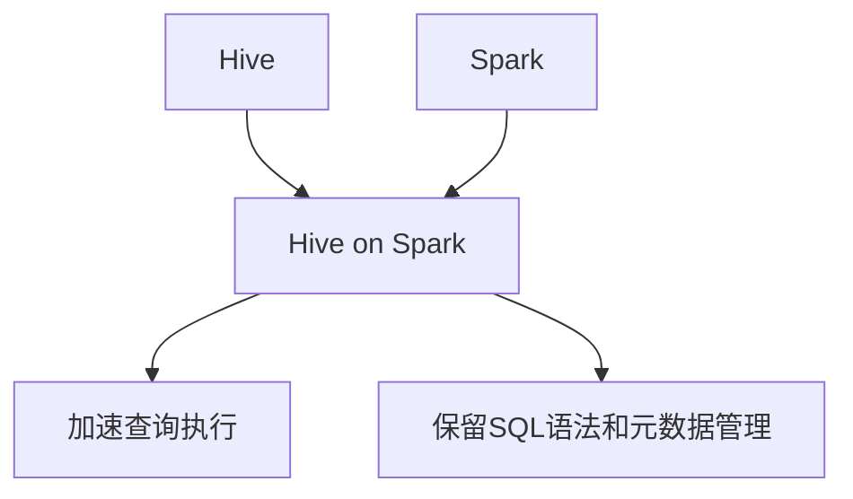
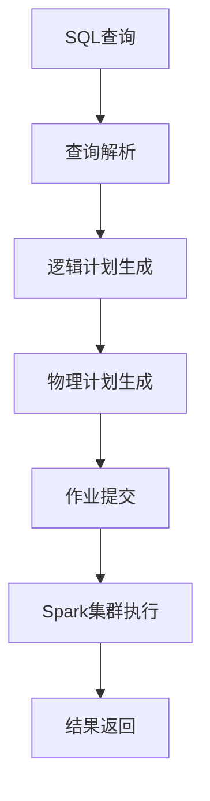

# Hive-Spark整合原理与代码实例讲解

## 1.背景介绍

随着大数据时代的到来,数据量呈现爆炸式增长,传统的数据处理方式已经无法满足现代企业对数据分析的需求。Apache Hive和Apache Spark作为两个流行的大数据处理框架,它们各自具有独特的优势和适用场景。Hive擅长于批处理和交互式查询,而Spark则擅长于流式计算、机器学习和图形计算等场景。将Hive和Spark整合在一起,可以最大限度地发挥两者的优势,提供更加强大和灵活的大数据处理能力。

## 2.核心概念与联系

### 2.1 Apache Hive

Apache Hive是一个建立在Hadoop之上的数据仓库基础构件,它可以让用户使用类SQL语言(HiveQL)来查询和管理存储在Hadoop分布式文件系统(HDFS)中的数据。Hive支持多种数据格式,包括文本文件、SequenceFile和RCFile等,并且可以通过外部表的方式访问其他数据源,如关系型数据库。

### 2.2 Apache Spark

Apache Spark是一个快速、通用的集群计算系统,它可以在内存中进行数据处理,从而提高了计算效率。Spark提供了多种高级API,如RDD、DataFrame和Dataset,支持多种编程语言,如Scala、Java、Python和R。Spark不仅可以用于批处理,还可以用于流式计算、机器学习和图形计算等场景。

### 2.3 Hive on Spark

Hive on Spark是Hive和Spark的整合,它将Hive的SQL查询引擎移植到Spark上,利用Spark的内存计算能力来加速Hive的查询执行。在Hive on Spark模式下,Hive查询会被转换为Spark作业,并由Spark集群执行。这种整合不仅保留了Hive的SQL语法和元数据管理功能,还提高了查询执行效率。



## 3.核心算法原理具体操作步骤

Hive on Spark的核心算法原理可以分为以下几个步骤:

1. **查询解析**: Hive会将SQL查询解析为抽象语法树(AST)。

2. **逻辑计划生成**: Hive会根据AST生成逻辑计划,即一系列逻辑操作的有向无环图。

3. **物理计划生成**: Hive会将逻辑计划转换为物理计划,即一系列可执行的Spark作业。在这个过程中,Hive会根据数据统计信息选择最优的执行策略。

4. **作业提交**: Hive会将物理计划提交给Spark集群执行。

5. **结果返回**: Spark集群执行完成后,将结果返回给Hive。



## 4.数学模型和公式详细讲解举例说明

在Hive on Spark中,查询优化是一个非常重要的环节,它直接影响查询的执行效率。Hive使用基于代价的优化器(Cost-Based Optimizer,CBO)来选择最优的执行计划。CBO会根据数据统计信息估算每个执行计划的代价,并选择代价最小的执行计划。

假设有一个连接查询:

$$
SELECT \; \* \; FROM \; table1 \; JOIN \; table2 \; ON \; table1.id = table2.id
$$

连接操作的代价可以用下面的公式估算:

$$
Cost = N_1 \times N_2 \times C_{cpu} + (N_1 + N_2) \times C_{io}
$$

其中:

- $N_1$和$N_2$分别表示两个表的行数
- $C_{cpu}$表示CPU代价常数
- $C_{io}$表示IO代价常数

如果有多个连接条件,代价公式会更加复杂。CBO会根据这些代价公式选择最优的连接顺序和连接算法。

## 5.项目实践:代码实例和详细解释说明

### 5.1 启用Hive on Spark

要启用Hive on Spark,需要在`hive-site.xml`文件中添加以下配置:

```xml
<property>
    <name>hive.execution.engine</name>
    <value>spark</value>
</property>
```

### 5.2 创建Hive表

```sql
CREATE TABLE employee (
    id INT,
    name STRING,
    department STRING,
    salary DOUBLE
)
ROW FORMAT DELIMITED
FIELDS TERMINATED BY ','
STORED AS TEXTFILE;

LOAD DATA LOCAL INPATH '/path/to/employee.csv' OVERWRITE INTO TABLE employee;
```

### 5.3 使用Spark SQL执行查询

```sql
SELECT department, AVG(salary) AS avg_salary
FROM employee
GROUP BY department
ORDER BY avg_salary DESC
LIMIT 3;
```

在Hive on Spark模式下,上述查询会被转换为Spark作业执行。我们可以使用Spark UI查看作业执行情况。

```scala
// Scala代码示例,展示如何使用Spark SQL执行同样的查询
val employeeDF = spark.table("employee")
val result = employeeDF
  .groupBy("department")
  .agg(avg("salary").alias("avg_salary"))
  .orderBy(desc("avg_salary"))
  .limit(3)

result.show()
```

## 6.实际应用场景

Hive on Spark可以应用于以下场景:

- **交互式查询**: Hive on Spark可以加速交互式查询,提高数据分析的效率。
- **ETL工作流**: Hive on Spark可以用于构建ETL(提取、转换、加载)工作流,处理和清洗大规模数据。
- **机器学习**: Spark提供了强大的机器学习库MLlib,可以与Hive on Spark集成,在大数据集上训练模型。
- **实时数据处理**: Spark Streaming可以与Hive on Spark集成,实现实时数据处理和分析。

## 7.工具和资源推荐

- **Apache Hive官网**: https://hive.apache.org/
- **Apache Spark官网**: https://spark.apache.org/
- **Hive on Spark教程**: https://cwiki.apache.org/confluence/display/Hive/Hive+on+Spark%3A+Getting+Started
- **Spark UI**: Spark提供了Web UI,可以监控作业执行情况和资源使用情况。
- **Zeppelin Notebook**: Zeppelin是一个基于Web的交互式笔记本,支持Spark、Hive等多种解释器,可以用于数据探索和可视化。

## 8.总结:未来发展趋势与挑战

Hive on Spark是大数据处理领域的一个重要发展方向,它结合了Hive和Spark的优势,提供了更加强大和灵活的数据处理能力。未来,Hive on Spark可能会在以下几个方面继续发展:

1. **性能优化**: 继续优化查询执行引擎,提高查询执行效率。
2. **语言支持**: 支持更多的查询语言,如Python和R,方便数据科学家使用。
3. **机器学习集成**: 与Spark MLlib更加紧密集成,支持在大数据集上训练和部署机器学习模型。
4. **流式处理**: 与Spark Streaming更加紧密集成,支持实时数据处理和分析。

同时,Hive on Spark也面临一些挑战:

1. **资源管理**: 如何在多个作业之间合理分配资源,避免资源竞争。
2. **故障恢复**: 如何提高系统的容错能力,在发生故障时快速恢复。
3. **安全性**: 如何保证数据的安全性和隐私性。
4. **易用性**: 如何降低使用门槛,让更多用户能够轻松使用Hive on Spark。

## 9.附录:常见问题与解答

1. **Hive on Spark与Hive on Tez有什么区别?**

Hive on Tez是另一种Hive执行引擎,它基于Tez框架执行查询。相比之下,Hive on Spark基于Spark框架执行查询。两者在查询执行效率、资源利用率等方面各有优缺点,需要根据具体场景选择合适的执行引擎。

2. **如何监控Hive on Spark作业的执行情况?**

可以使用Spark Web UI监控作业的执行情况,包括作业进度、资源使用情况等。另外,也可以在Hive日志中查看作业执行信息。

3. **Hive on Spark是否支持所有的Hive功能?**

目前Hive on Spark还不支持所有的Hive功能,例如某些数据格式、某些UDF等。但是随着版本的不断迭代,支持的功能也在不断增加。

4. **如何在Hive on Spark中调试查询?**

可以在Hive CLI中设置`set hive.spark.sql.execution.dumpstats=true;`来输出查询执行计划和统计信息,帮助调试查询。

5. **Hive on Spark是否支持事务?**

目前Hive on Spark还不支持事务,但是可以通过其他方式来实现类似的功能,例如使用Spark Structured Streaming进行增量更新。

作者:禅与计算机程序设计艺术 / Zen and the Art of Computer Programming