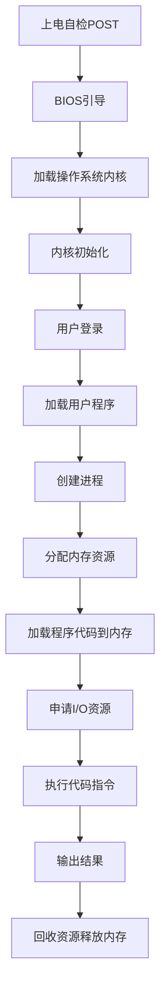

# IT基础资源（硬软件）运行流程

## 1. 背景介绍
### 1.1 IT基础资源的重要性
在当今信息化时代,IT基础资源是支撑各行各业运转的关键要素。无论是企业、政府机构还是个人用户,都离不开计算机硬件设备和各类软件系统的支持。深入理解IT基础资源的运行流程,对于优化IT系统性能、提升业务效率、确保信息安全都具有重要意义。

### 1.2 IT基础资源的构成
IT基础资源主要包括两大类:硬件资源和软件资源。
- 硬件资源:包括服务器、PC机、移动设备等物理设备,以及CPU、内存、存储、网络等核心硬件组件。
- 软件资源:包括操作系统、数据库、中间件、应用软件等各类软件系统。

硬件是IT系统的物理基础,软件则赋予硬件以灵魂,两者相辅相成,缺一不可。

### 1.3 运行流程概览
IT基础资源并非独立运行,而是通过一系列复杂的流程协同工作,支撑起庞大的信息化应用。下面我们将从宏观和微观两个层面,对IT基础资源的运行流程进行系统阐述。

## 2. 核心概念与联系
### 2.1 冯·诺依曼体系结构
冯·诺依曼体系结构是现代计算机的理论基础,它规定了计算机由运算器、控制器、存储器、输入设备和输出设备五大部分组成。程序和数据都存储在存储器中,指令一条接一条执行。这种"存储程序"思想奠定了现代计算机的工作方式。

### 2.2 操作系统
操作系统是管理和控制计算机硬件与软件资源的程序,是应用软件和硬件之间的桥梁。它负责任务调度、内存分配、设备管理、文件管理等重要功能,使得用户和应用程序能够更方便地使用计算机资源。

### 2.3 指令执行过程
计算机执行任务的过程,本质上是一系列指令的执行过程。CPU从内存中逐条读取指令,经过取指、译码、执行等环节,完成相应的操作。程序计数器(PC)记录下一条要执行的指令地址,形成周而复始的指令执行循环。

### 2.4 存储层次结构
为了平衡存储器的容量和速度,现代计算机采用了多级存储层次结构。从上到下通常包括:CPU寄存器、高速缓存(Cache)、内存(Memory)、硬盘等。层次越高,速度越快但容量越小。数据在不同层次间的频繁交换,是程序执行的重要一环。

### 2.5 硬件与软件的交互
硬件和软件并非独立的个体,而是相互交织、密不可分的。操作系统通过驱动程序和硬件直接交互,应用软件通过系统调用请求操作系统的服务。反过来,硬件通过中断机制主动通知CPU有事件需要处理。这种交互构成了IT系统的运行基础。

## 3. 核心运行流程
下图展示了IT基础资源从开机到运行应用程序的核心流程:



1. 上电自检(POST):计算机通电后,BIOS程序首先对硬件进行自检,确保各个部件工作正常。
2. BIOS引导:自检通过后,BIOS加载磁盘上的引导程序(如GRUB),开始引导操作系统。
3. 加载内核:引导程序将操作系统内核加载到内存,并将控制权交给内核。
4. 内核初始化:内核进行各种初始化工作,如探测硬件、加载驱动、创建进程等。
5. 用户登录:内核启动init进程,提示用户登录。用户输入正确的用户名和密码后,开始进入用户会话。
6. 加载用户程序:用户通过shell或GUI启动应用程序,操作系统开始加载程序文件。
7. 创建进程:为应用程序创建进程,分配进程ID、打开文件描述符等。
8. 分配内存资源:为进程分配必要的内存空间,包括代码段、数据段、堆栈等。
9. 加载程序代码:将程序的可执行代码加载到内存的代码段。
10. 申请I/O资源:进程运行过程中,可能需要申请I/O资源,如打开文件、建立网络连接等。
11. 执行代码指令:CPU从内存中逐条读取指令并执行,完成程序的既定算法和功能。
12. 输出结果:进程将计算结果输出到显示器、写入文件或通过网络传输。
13. 回收资源:进程执行完毕,操作系统回收分配给它的内存、I/O等资源,结束进程的生命周期。

## 4. 数学模型和公式
### 4.1 进程调度模型
操作系统需要决策将CPU时间分配给哪个进程,以实现系统的最优性能。常见的调度算法有:
- 先来先服务(FCFS):按照进程请求CPU的顺序分配,用队列可以方便实现。
- 最短作业优先(SJF):优先调度估计运行时间最短的进程,可以保证平均等待时间最短。
- 时间片轮转(RR):为每个进程分配固定的CPU时间片,用完后就切换到下一个进程。
- 多级反馈队列(MLFQ):设置多个优先级不同的队列,优先级越高时间片越短。进程用完时间片会降低优先级。

以FCFS为例,假设有n个进程,到达时间为$a_i$,服务时间为$s_i$,则第i个进程的等待时间为:

$$
w_i = \sum_{j=1}^{i-1} s_j - a_i
$$

平均等待时间为:

$$
\overline{w} = \frac{1}{n} \sum_{i=1}^{n} w_i
$$

### 4.2 内存分配模型
程序执行前需要先放到内存中,操作系统负责内存空间的分配和回收。基本的分配方式有:
- 连续分配:为进程分配一块连续的内存区域。容易产生内存碎片,需要紧凑和交换技术。
- 非连续分配:允许进程使用分散的内存块。需要采取分页或分段机制,通过页表或段表实现地址映射。

以最先适应算法(First Fit)为例,假设内存中有n个空闲块,大小为$s_i$。当进程请求大小为r的内存时,分配第一个满足$s_i \geq r$的空闲块。

平均查找长度为:

$$
\overline{l} = \frac{1}{2} \cdot \frac{n(n+1)}{n} = \frac{n+1}{2}
$$

### 4.3 磁盘调度模型
读写磁盘数据时,为了降低寻道时间,操作系统需要合理安排磁盘I/O请求的处理顺序。常用的磁盘调度算法有:
- 先来先服务(FCFS):按照请求到达的顺序依次处理。
- 最短寻道时间优先(SSTF):优先处理与当前磁头位置最近的请求。
- 扫描算法(SCAN):磁头单向移动,依次处理路径上的请求,到达一端后反向移动。
- 循环扫描算法(CSCAN):磁头单向移动,到达一端后直接返回起点,再次单向扫描。

以SSTF为例,假设有n个I/O请求,位置为$p_i$,当前磁头位置为h。总寻道距离为:

$$
d = \sum_{i=1}^{n} |p_i - h|
$$

平均寻道距离为:

$$
\overline{d} = \frac{1}{n} \sum_{i=1}^{n} |p_i - h|
$$

## 5. 项目实践
下面通过一个简单的C程序,演示进程创建、内存分配、文件I/O等操作的实现:

```c
#include <stdio.h>
#include <stdlib.h>
#include <unistd.h>
#include <sys/types.h>
#include <sys/wait.h>

int main() {
    pid_t pid;
    int status;
    
    pid = fork();  // 创建子进程
    
    if (pid < 0) {  // 创建失败
        fprintf(stderr, "Fork Failed");
        exit(-1);
    } else if (pid == 0) {  // 子进程
        printf("Child process, pid = %d\n", getpid());
        
        char *buffer = (char *)malloc(100);  // 分配内存
        strcpy(buffer, "Hello, world!");
        printf("%s\n", buffer);
        free(buffer);  // 释放内存
        
        FILE *fp = fopen("test.txt", "w");  // 打开文件
        fprintf(fp, "This is a test.\n");
        fclose(fp);  // 关闭文件
        
        exit(0);
    } else {  // 父进程
        printf("Parent process, pid = %d\n", getpid());
        
        wait(&status);  // 等待子进程结束
        
        FILE *fp = fopen("test.txt", "r");  // 打开文件
        char buffer[100];
        fgets(buffer, 100, fp);
        printf("%s", buffer);
        fclose(fp);  // 关闭文件
    }
    
    return 0;
}
```

这个程序通过fork()创建了一个子进程,父子进程分别打印自己的pid。子进程申请了一块内存,并向其中写入字符串;然后打开文件,向文件中写入一行文本。父进程等待子进程运行结束,再打开文件读取子进程写入的内容。

通过这个例子,我们可以看到:
1. fork()的使用方法,以及父子进程的典型处理流程。
2. malloc()和free()的使用方法,动态申请和释放内存。
3. fopen()、fprintf()、fgets()和fclose()的使用方法,实现文件的读写。
4. 父进程调用wait()等待子进程结束,实现进程间的同步。

这些都是操作系统进程与内存管理、文件管理功能的基本体现。通过系统调用,应用程序得以访问操作系统内核提供的各种服务,完成复杂的任务处理。

## 6. 实际应用场景
理解IT基础资源的运行流程,对于实际的系统优化与故障诊断具有指导意义。下面列举几个常见的应用场景:

### 6.1 性能优化
- 通过优化进程调度策略,可以缩短进程的等待时间,提高CPU利用率和系统吞吐量。
- 通过优化内存分配策略,可以减少内存碎片,降低换页频率,加快程序的执行速度。
- 通过优化磁盘调度策略,可以减少磁头的移动距离,缩短I/O响应时间,提升系统的I/O性能。
- 通过优化文件缓存策略,可以提高文件读写的命中率,减少对磁盘的直接访问。

### 6.2 故障诊断
- 通过分析进程的CPU使用情况,可以发现CPU利用率异常、进程死锁等问题。
- 通过分析进程的内存使用情况,可以发现内存泄漏、野指针等问题。
- 通过分析系统的I/O情况,可以发现磁盘读写异常、I/O瓶颈等问题。
- 通过分析网络连接状态,可以发现网络配置错误、连接超时等问题。

### 6.3 容量规划
- 通过统计不同时期的CPU使用率,可以预估未来的CPU需求,提前进行硬件扩容。
- 通过统计不同时期的内存使用量,可以预估未来的内存需求,合理配置内存资源。
- 通过统计不同时期的磁盘使用量,可以预估未来的存储需求,及时增加磁盘容量。
- 通过统计不同时期的网络流量,可以预估未来的带宽需求,合理规划网络资源。

只有深入理解IT基础资源的工作原理,才能在实践中对其进行有效管理和优化,从而构建