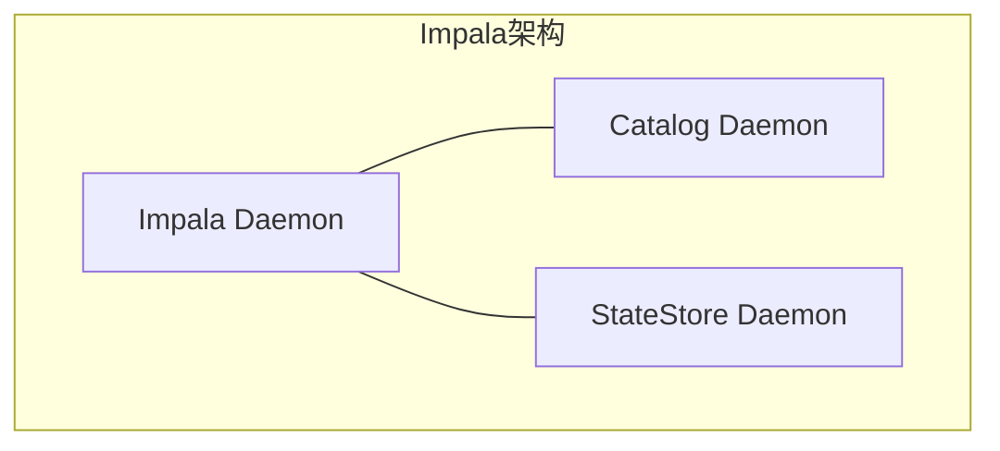
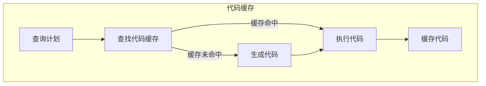

# Impala原理与代码实例讲解

## 1.背景介绍

Apache Impala是一种开源的大规模并行处理(MPP)SQL查询引擎,旨在提供低延迟和高吞吐量的分析查询。它是Cloudera公司于2012年推出的,用于在Apache Hadoop生态系统中查询存储在HDFS或Amazon S3等分布式文件系统中的海量数据。

Impala的设计目标是弥合Hadoop生态系统中的鸿沟,即传统数据仓库工具无法高效处理大数据,而MapReduce虽然可以处理大数据,但缺乏交互式SQL查询能力。Impala通过将SQL查询直接映射到分布式执行计划,从而实现了低延迟的大数据分析。

### 1.1 Impala的主要特点

- **低延迟查询**:通过并行执行和代码优化,Impala可以在数秒内完成TB级数据的查询。
- **高吞吐量**:Impala可以利用集群中所有节点的CPU和内存资源,实现高吞吐量并行查询。
- **SQL语言支持**:Impala支持ANSI SQL语法的大部分子集,包括常用的DML和DDL语句。
- **元数据一致性**:Impala与Hive共享元数据,可以直接查询Hive表。
- **多存储格式支持**:支持Parquet、ORC、RCFile等列存储格式,提高I/O效率。
- **安全性**:支持Kerberos认证、SQL标准化授权等安全特性。

### 1.2 Impala的应用场景

Impala非常适合于以下应用场景:

- **交互式数据探索**:通过SQL查询快速探索大数据集,支持业务人员的自助式分析。
- **运营商业智能**:支持复杂的分析查询,满足企业决策所需的商业智能需求。
- **ETL工作流**:与MapReduce作业配合,构建高效的ETL数据管道。

## 2.核心概念与联系

为了理解Impala的工作原理,我们需要先了解一些核心概念及其相互关系。

### 2.1 Impala架构概览

Impala采用无共享架构,由以下三个主要组件组成:



- **Impala Daemon (impalad)**:负责接收和执行查询请求,管理查询执行过程。
- **StateStore Daemon (statestored)**:监控集群中impalad的健康状态和资源使用情况。
- **Catalog Daemon (catalogd)**:管理Impala的元数据,与Hive的Metastore服务保持一致。

### 2.2 查询执行流程

当用户提交一个SQL查询时,Impala会经历以下几个主要阶段:


1. **查询提交**:客户端通过impalad提交SQL查询。
2. **查询解析**:impalad解析SQL语句,构建查询计划树。
3. **查询优化**:对查询计划树进行优化,例如谓词下推、列裁剪等。
4. **执行计划生成**:根据优化后的查询计划树生成分布式执行计划。
5. **查询执行**:将执行计划分发到各个impalad节点并行执行。
6. **查询返回**:将查询结果返回给客户端。

### 2.3 查询执行模型

Impala采用无共享架构,查询执行是完全分布式和并行的。查询执行过程中涉及以下几个重要概念:

- **查询计划树**:描述查询执行的逻辑计划。
- **执行计划**:将查询计划树映射到物理执行计划。
- **执行单元(Fragment)**:执行计划被划分为多个执行单元,每个单元在一个impalad节点上执行。
- **执行线程(Thread)**:每个执行单元由多个执行线程并行执行。

## 3.核心算法原理具体操作步骤  

为了实现高效的分布式查询,Impala采用了多种核心算法和优化技术,下面我们详细介绍其中的一些关键算法。

### 3.1 代码生成

Impala使用LLVM(Low Level Virtual Machine)技术,在运行时动态生成高度优化的机器码,以提高查询执行效率。这种代码生成技术主要包括以下步骤:


1. **解析查询计划**:将查询计划树解析为Impala内部表示。
2. **生成LLVM IR**:根据内部表示生成LLVM中间表示(IR)。
3. **优化LLVM IR**:对LLVM IR进行一系列优化,如常量折叠、循环向量化等。
4. **编译目标码**:将优化后的LLVM IR编译为目标机器码。
5. **执行查询**:在运行时执行生成的机器码,完成查询处理。

通过代码生成技术,Impala可以根据查询特征生成高度优化的执行代码,从而大幅提高查询性能。

### 3.2 向量化执行

Impala采用向量化执行引擎,通过批量处理数据,充分利用现代CPU的SIMD(单指令多数据)指令集,提高CPU利用率。

向量化执行的核心思想是将数据打包成向量(batch),然后对整个向量执行相同的操作,而不是逐个元素进行处理。这种方式可以极大地减少CPU指令数和内存访问次数,从而提高整体性能。


向量化执行引擎支持多种常见操作的向量化,如扫描、过滤、投影、聚合等。同时,Impala还针对不同的CPU架构进行了优化,以充分利用硬件的SIMD指令集。

### 3.3 代码缓存

为了避免重复的代码生成和编译开销,Impala引入了代码缓存机制。当执行相同或类似的查询时,Impala会尝试从缓存中加载已生成的代码,而不是重新生成。

代码缓存的工作流程如下:



1. **查询计划**:根据SQL查询生成查询计划树。
2. **查找代码缓存**:在代码缓存中查找是否有匹配的已生成代码。
3. **生成代码**:如果未命中缓存,则生成新的执行代码。
4. **执行代码**:执行已缓存或新生成的代码。
5. **缓存代码**:将新生成的代码缓存起来,供后续查询复用。

代码缓存可以显著降低查询的启动开销,提高查询性能,尤其对于重复执行的查询效果更加明显。

## 4.数学模型和公式详细讲解举例说明

在查询优化和执行过程中,Impala会使用一些数学模型和公式来估算代价、评估执行计划等。下面我们介绍其中几个重要的模型和公式。

### 4.1 选择向量

在向量化执行过程中,Impala需要根据数据特征选择合适的向量长度,以权衡CPU利用率和内存使用量。Impala使用一个基于代价模型的公式来确定最佳向量长度。

选择向量长度的代价模型公式如下:

$$
Cost(VectorSize) = \alpha \times MemoryCost(VectorSize) + \beta \times CPUCost(VectorSize)
$$

其中:

- $VectorSize$表示向量长度
- $MemoryCost(VectorSize)$表示内存使用代价,与向量长度成正比
- $CPUCost(VectorSize)$表示CPU利用率代价,与向量长度成反比
- $\alpha$和$\beta$是权重系数,用于平衡内存和CPU代价

Impala会尝试不同的向量长度,计算总代价,并选择代价最小的向量长度作为最优解。

### 4.2 数据分区

为了提高查询性能,Impala会根据数据分布特征对数据进行分区。分区策略的选择会影响查询的数据局部性和并行度。

Impala使用基于代价的分区模型,估算不同分区策略的代价,并选择代价最小的策略。分区代价模型公式如下:

$$
Cost(PartitionStrategy) = \sum_{i=1}^{n}(w_i \times c_i)
$$

其中:

- $n$表示评估因素的数量
- $w_i$表示第$i$个评估因素的权重
- $c_i$表示第$i$个评估因素的代价值

评估因素可能包括数据倾斜程度、数据局部性、分区数量等,每个因素都会对总代价产生不同的影响。

Impala会计算每种分区策略的总代价,并选择代价最小的策略作为最优解。

### 4.3 Join重排序

在执行多表连接查询时,连接顺序会对查询性能产生重大影响。Impala使用基于代价的Join重排序算法,确定最优的连接顺序。

Join重排序算法的核心思想是将多表连接视为一个树形结构,通过评估不同连接顺序的代价,找到代价最小的顺序作为最优解。

Join重排序的代价模型公式如下:

$$
Cost(JoinOrder) = \sum_{i=1}^{n}(c_i \times \prod_{j=1}^{i}s_j)
$$

其中:

- $n$表示连接表的数量
- $c_i$表示第$i$个连接的代价
- $s_j$表示第$j$个连接输入表的大小

该公式估算了给定连接顺序的总代价,包括每个连接操作的代价和中间结果的大小。

Impala会枚举所有可能的连接顺序,计算每种顺序的代价,并选择代价最小的顺序作为最优解。

通过上述数学模型和公式,Impala可以更准确地评估和优化查询执行计划,从而提高查询性能。

## 5.项目实践:代码实例和详细解释说明

为了更好地理解Impala的原理和使用方法,我们通过一个实际项目案例来进行讲解。该项目旨在分析某电商网站的用户行为数据,包括用户浏览记录、购买记录等,并提供一些有价值的商业洞察。

我们将使用Impala对存储在HDFS上的用户行为数据进行分析查询,并展示一些核心功能和优化技巧。

### 5.1 数据准备

我们首先需要将用户行为数据加载到HDFS中,并在Impala中创建相应的表。假设我们有两个数据文件:

- `user_visits.parquet`包含用户浏览记录
- `user_orders.parquet`包含用户购买记录

我们可以使用以下DDL语句在Impala中创建外部表:

```sql
CREATE EXTERNAL TABLE user_visits (
  visit_id BIGINT,
  user_id BIGINT,
  visit_time TIMESTAMP,
  product_id BIGINT,
  category_id BIGINT
)
STORED AS PARQUET
LOCATION '/user_data/visits';

CREATE EXTERNAL TABLE user_orders (
  order_id BIGINT,
  user_id BIGINT,
  order_time TIMESTAMP,
  product_id BIGINT,
  quantity INT,
  total_price DOUBLE
)
STORED AS PARQUET
LOCATION '/